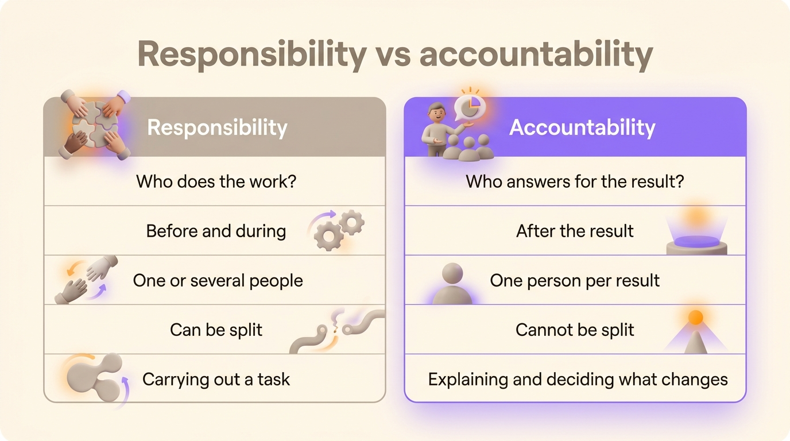
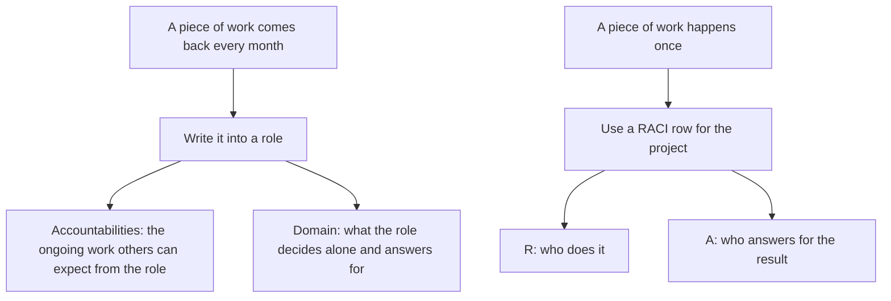

Accountability is the obligation to answer for a result to someone entitled to ask: a manager, a board, a client, a regulator. Responsibility is the duty to carry out the work. Several people can share the responsibility for a task, while one person should be accountable for how it turns out: that person explains what happened and decides what changes next.

People swap the two words all the time. French even uses a single word, *responsabilité*, for both. This article gives each definition, compares them side by side, runs through four examples, and covers a third meaning, the accountabilities of a role in role-based governance.

## What accountability means

Accountability is owed to someone. The accountable person gives an account of a result, good or bad, and bears the consequences. The obligation applies once the work is done, whoever did it.

A person is accountable only when three conditions are met:

- A result they answer for, named in advance, such as the go-live date of a launch or the accuracy of a quarterly report.
- Someone entitled to ask them about it.
- The authority to change how the work is done. Holding someone accountable for a result they had no say in is setting them up to take the blame.

The US Sarbanes-Oxley Act of 2002 gives the textbook case. Section 302 requires the chief executive and the chief financial officer of a listed company to certify each periodic financial report personally. A finance team prepares the figures. The two executives sign, and answer for them.

## What responsibility means

Responsibility is the duty to do a piece of work, or to see that it gets done. It applies before and during the work. A person is responsible for a task the moment it is assigned to them.

You can split responsibility between several people. Five people can each be responsible for part of the same launch: the developer builds, the copywriter writes, the designer draws, the support lead prepares answers, the product manager coordinates. Each of them owns their part.

## Accountability vs responsibility, side by side

| | Responsibility | Accountability |
|---|---|---|
| Question it answers | Who does the work? | Who answers for the result? |
| Timing | Before and during the work | Once the result is known |
| How many people | One or several | One per result |
| Can it be shared out? | Yes, by splitting the work | No, sharing it leaves nobody answering |
| What it involves | Carrying out a task | Explaining the result and deciding what changes |

To tell them apart, ask who would explain a failure to the client. That person is accountable. Everyone who touched the work was responsible for part of it.

{/* IMAGE regen: api.py image, infographic, 1600x900. Scene: "Two-column comparison card. Left column header 'Responsibility' with a small icon of hands working on a task, right column header 'Accountability' with a small icon of one person presenting a result to others. Five rows, each with a left and a right value: row 1 'Who does the work?' / 'Who answers for the result?', row 2 'Before and during' / 'After the result', row 3 'One or several people' / 'One person per result', row 4 'Can be split' / 'Cannot be split', row 5 'Carrying out a task' / 'Explaining and deciding what changes'. The left column tinted soft grey, the right column accented in purple. Clean title at the top: 'Responsibility vs accountability'." Regenerate if the comparison table changes. Last data sync: 2026-09-30. */}

## Four examples

### A pricing page

The developer and the copywriter are responsible for building and writing the new pricing page. The head of marketing is accountable for it. If the page goes live with the wrong prices, she explains it to sales and decides how the release process changes.

### A hospital operation

The surgical team shares the responsibility for the operation: the anaesthetist, the nurses and the surgeon each carry out their part. The surgeon in charge is accountable for the procedure and answers to the patient and to the hospital for how it went.

### A restaurant kitchen

Each cook is responsible for their station. The head chef is accountable for every plate that leaves the kitchen, including the ones they never touched. A complaint goes to the head chef, whoever cooked the plate.

### A software incident

The on-call engineer is responsible for restoring the service at 3 a.m. The person accountable for the service's reliability writes the incident review, explains the outage to customers and decides which fix gets priority.

## Accountable and responsible in a RACI matrix

A [RACI matrix](/en/blog/raci-matrix) turns the difference into two letters. On each row of work, R marks the people who do it, and A marks the one person who answers for the result. A row can carry several R's. It carries exactly one A, because two accountable people on the same row each assume the other one signed off.

The letters name people without saying what they owe. Bob Frisch and Cary Greene, partners at the consultancy Strategic Offsites Group, pointed this out in the *Harvard Business Review* in June 2016: the word "accountable" means different things to different people. Write a sentence next to the A. "Sarah approves the final prices and the go-live date" says what a lone letter cannot.

## Can you delegate accountability?

You can delegate the work and the authority to do it. The person who was accountable still answers for the result.

A manager who hands a client report to a colleague has passed on the responsibility for writing it. If the report is wrong, the client still asks the manager for an explanation. What the manager can do is make the colleague accountable to them for the report, which creates a second link in the chain rather than removing the first one.

When you delegate, accountability stays where it was, so give it from the start to the person closest to the decision. When the accountable person is three levels above the work, every question climbs three levels before anyone can answer it.

## Accountabilities in a role mean something else

Role-based governance, as in Holacracy and sociocracy, uses the word in the plural with a third meaning. The [accountabilities](/en/glossary/redevabilite) of a role are the ongoing activities other roles can expect from it, written with an -ing verb: "Replying to press requests within a day", "Publishing to the quarterly editorial calendar", "Keeping the rollback procedure up to date".

Holacracy's constitution defines an accountability as an ongoing activity the role is expected to perform or manage for the organization. That meaning sits closer to responsibility than to the accountable A of a RACI: it describes work the role does and that anyone can ask the role holder for.

In a role, the decision rights a RACI gives to its A are written in the [domain](/en/glossary/domaine), the asset or process the role decides on alone. So a role carries both halves of the distinction:

A well-written accountability lets another role rely on it without asking. Choose [verbs that keep an accountability precise](/en/blog/define-roles) rather than ones that turn it into a vague intention, and fill in a [roles and responsibilities template](/en/blog/roles-responsibilities-template) for each role.

## Accountability without blame

A team that uses "accountable" to mean "the person we blame" gets the opposite of what it wanted. People stop reporting problems early, because the first person to raise one ends up answering for it.

Answering for a result means explaining what happened, then deciding what changes. Aviation and hospital teams run post-incident reviews that look for the causes before the culprit. The person accountable leads that review instead of sitting in the dock. Ask "what made this mistake easy to make?" during the review. The answer points to a fix, whereas people who hear "who did this?" hide their next mistake.

## Frequently asked questions

<FaqList>

<FaqItem question="What is the difference between accountability and responsibility?">

Responsibility is the duty to do a piece of work. Accountability is the obligation to answer for its result to someone entitled to ask. Several people can be responsible for parts of the same work, while one person should be accountable for the result. Responsibility applies before and during the work. Accountability applies once the result is known.

</FaqItem>

<FaqItem question="What is the definition of accountability?">

Accountability is the obligation to answer for one's actions, decisions and results to someone entitled to ask, such as a manager, a board, a client or a regulator. The accountable person explains what happened and bears the consequences, whether they did the work themselves or someone else did it for them.

</FaqItem>

<FaqItem question="What are accountabilities in a role?">

In role-based governance, the accountabilities of a role are the ongoing activities other roles can expect it to perform, written with an -ing verb. "Replying to press requests within a day" and "Keeping the rollback procedure up to date" are two examples. A role usually carries three to seven of them, alongside its purpose and its domain.

</FaqItem>

<FaqItem question="Can you be responsible without being accountable?">

Yes, and it is the most common case. A developer who builds a feature is responsible for building it. The product manager who decided to ship it is accountable for the result. The developer answers for the quality of their own work to the product manager, who answers for the feature to the rest of the company.

</FaqItem>

<FaqItem question="What is the difference between responsible and accountable in a RACI?">

In a RACI matrix, R marks the people who do the work on a deliverable, and a row can have several of them. A marks the one person who answers for the result and signs it off. Every row needs exactly one A, otherwise the decision has no owner.

</FaqItem>

<FaqItem question="Can accountability be delegated?">

The work and the authority to do it can be delegated. The accountable person still answers for the result. A manager who delegates a report can make a colleague accountable to them for it, but remains accountable to the client for what the report says.

</FaqItem>

</FaqList>

## Write it down where the team works

Pick three pieces of recurring work where people disagree about who owns what. For each one, write the ongoing activities as accountabilities of a role, name the one role that decides, and put a person in that role. The disagreements that come up while you write are the ones that were costing you time.

Rolebase is built for that. Every role carries a purpose, accountabilities and a domain, in an org chart the whole organization can open, with meetings and decisions attached to the roles. You can [see how roles, meetings and decisions fit together](/en/features), and [create a free account](/signup) for up to five active members.
