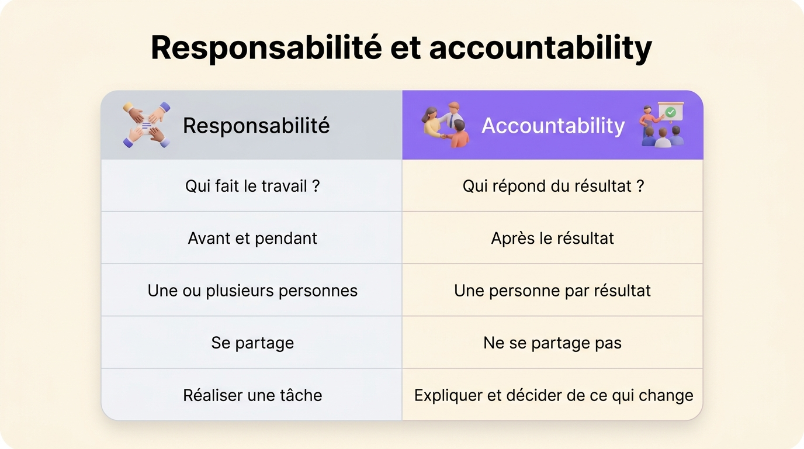
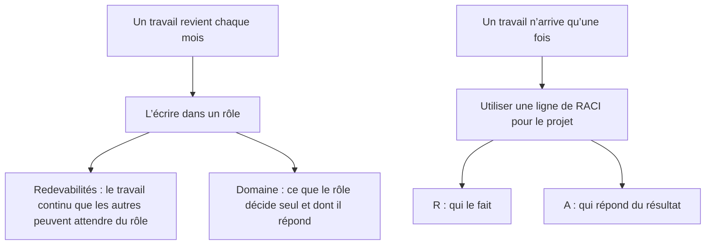

L’accountability est l’obligation de répondre d’un résultat devant quelqu’un qui a le droit de demander des comptes : un manager, un conseil d’administration, un client, un régulateur. La responsabilité est le devoir de faire le travail. Plusieurs personnes peuvent se partager la responsabilité d’une tâche, alors qu’une seule doit répondre de son résultat : elle explique ce qui s’est passé et décide de ce qui change ensuite.

Le français n’a qu’un mot, *responsabilité*, pour les deux idées, d’où la confusion. Cet article donne chaque définition, les compare, les applique à quatre exemples et présente un troisième sens : les redevabilités d’un rôle en gouvernance par rôles.

## Comment traduire accountability

Aucun mot français ne rend exactement *accountability*. Les traducteurs proposent plusieurs équivalents :

- L’obligation de rendre compte ou la reddition de comptes, qui sont les formules les plus claires.
- La redevabilité, utilisée dans l’aide au développement, le secteur public et la gouvernance partagée.
- La responsabilité tout court, que l’Office québécois de la langue française accepte quand le contexte suffit.

Le Bureau de la traduction du Canada et l’Office québécois de la langue française déconseillent *imputabilité* : en français, *imputable* qualifie la faute ou la dépense que l’on attribue à quelqu’un, plutôt que la personne qui en répond. Dans cet article, on garde *accountability* quand on parle du concept, et *redevabilité*, le terme qu’emploie Rolebase, pour la notion propre aux rôles.

## La définition de l’accountability

L’accountability se doit à quelqu’un. La personne qui la doit rend compte d’un résultat, bon ou mauvais, et en assume les conséquences. L’obligation s’applique une fois le travail fait, quelle que soit la personne qui l’a fait.

Une personne ne répond vraiment d’un résultat qu’à trois conditions :

- Un résultat dont on répond, nommé à l’avance, comme la date de mise en ligne d’un lancement ou l’exactitude d’un rapport trimestriel.
- Quelqu’un qui a le droit de demander des comptes.
- Le pouvoir de changer la façon dont le travail se fait. Demander des comptes à quelqu’un sur un résultat qu’il ne maîtrisait pas revient à lui faire porter le chapeau.

La loi américaine Sarbanes-Oxley de 2002 en donne l’exemple type. Sa section 302 oblige le directeur général et le directeur financier d’une société cotée à certifier personnellement chaque rapport financier périodique. L’équipe financière prépare les chiffres. Les deux dirigeants signent et en répondent.

## La définition de la responsabilité

La responsabilité est le devoir de faire un travail, ou de veiller à ce qu’il soit fait. Elle s’applique avant et pendant le travail. Une personne devient responsable d’une tâche dès qu’on la lui confie.

On peut partager la responsabilité entre plusieurs personnes. Cinq personnes peuvent être responsables chacune d’un morceau du même lancement : le développeur construit, la rédactrice écrit, le designer dessine, le responsable support prépare les réponses, la cheffe de produit coordonne. Chacun a sa part.

## Accountability et responsabilité, côte à côte

| | Responsabilité | Accountability |
|---|---|---|
| Question posée | Qui fait le travail ? | Qui répond du résultat ? |
| Moment | Avant et pendant le travail | Une fois le résultat connu |
| Nombre de personnes | Une ou plusieurs | Une par résultat |
| Se partage-t-elle ? | Oui, en découpant le travail | Non, sinon personne ne répond |
| Contenu | Réaliser une tâche | Expliquer le résultat et décider de ce qui change |

Pour les distinguer, demandez qui expliquerait un échec au client. Cette personne répond du résultat. Toutes celles qui ont touché au travail en étaient responsables pour une part.

{/* IMAGE regen: api.py image, infographic, 1600x900. Scene: "Two-column comparison card. Left column header 'Responsabilité' with a small icon of hands working on a task, right column header 'Accountability' with a small icon of one person presenting a result to others. Five rows, each with a left and a right value: row 1 'Qui fait le travail ?' / 'Qui répond du résultat ?', row 2 'Avant et pendant' / 'Après le résultat', row 3 'Une ou plusieurs personnes' / 'Une personne par résultat', row 4 'Se partage' / 'Ne se partage pas', row 5 'Réaliser une tâche' / 'Expliquer et décider de ce qui change'. The left column tinted soft grey, the right column accented in purple. Clean title at the top: 'Responsabilité et accountability'." Regenerate if the comparison table changes. Last data sync: 2026-09-30. */}

## Quatre exemples

### Une page de tarifs

Le développeur et la rédactrice sont responsables de construire et d’écrire la nouvelle page de tarifs. La responsable marketing en répond. Si la page part en ligne avec de mauvais prix, elle l’explique aux commerciaux et décide de ce qui change dans la mise en ligne.

### Une opération à l’hôpital

L’équipe chirurgicale se partage la responsabilité de l’opération : l’anesthésiste, les infirmiers et le chirurgien font chacun leur part. Le chirurgien qui dirige l’intervention en répond, devant le patient et devant l’hôpital.

### Une cuisine de restaurant

Chaque cuisinier est responsable de son poste. Le chef répond de chaque assiette qui sort de la cuisine, y compris celles qu’il n’a pas touchées. Une réclamation remonte au chef, quel que soit le cuisinier qui a préparé l’assiette.

### Un incident informatique

L’ingénieur d’astreinte est responsable de rétablir le service à 3 h du matin. La personne qui répond de la fiabilité du service rédige le retour sur incident, explique la panne aux clients et décide quelle correction passe en premier.

## Responsable et approbateur dans une matrice RACI

La [matrice RACI](/fr/blog/raci-matrix) traduit la différence en deux lettres. Sur chaque ligne de travail, le R désigne les personnes qui le font, et le A (*Accountable*, souvent traduit par approbateur) la seule personne qui répond du résultat. Une ligne peut porter plusieurs R. Elle porte exactement un A, parce que deux approbateurs sur la même ligne supposent chacun que l’autre a validé.

Les lettres désignent des personnes sans préciser ce qu’elles doivent. Bob Frisch et Cary Greene, associés du cabinet de conseil Strategic Offsites Group, l’ont relevé dans la *Harvard Business Review* en juin 2016 : le mot « accountable » ne veut pas dire la même chose pour tout le monde. Écrivez une phrase à côté du A. « Sarah valide les prix définitifs et la date de mise en ligne » dit ce qu’une lettre seule ne dit pas.

## Peut-on déléguer l’accountability ?

On peut déléguer le travail et le pouvoir de le faire. La personne qui répondait du résultat en répond toujours.

Une manager qui confie un rapport client à un collègue lui transmet la responsabilité de le rédiger. Si le rapport contient une erreur, le client demande quand même une explication à la manager. Elle peut en revanche demander au collègue de lui rendre compte du rapport, ce qui ajoute un maillon à la chaîne sans supprimer le premier.

Quand vous déléguez, l’accountability reste là où elle était, alors confiez-la dès le départ à la personne la plus proche de la décision. Quand la personne qui répond du résultat se trouve trois niveaux au-dessus du travail, chaque question monte trois niveaux avant que quelqu’un puisse y répondre.

## Les redevabilités d’un rôle, un troisième sens

La gouvernance par rôles, en holacratie comme en sociocratie, emploie le mot au pluriel avec un troisième sens. Les [redevabilités](/fr/glossary/redevabilite) d’un rôle sont les activités continues que les autres rôles peuvent attendre de lui, écrites avec un verbe d’action : « Répondre aux demandes de la presse sous 24 heures », « Publier selon le calendrier éditorial trimestriel », « Tenir à jour la procédure de retour arrière ».

La constitution holacratique définit une redevabilité comme une activité continue que le rôle est censé accomplir ou piloter pour l’organisation. Ce sens est plus proche de la responsabilité que du A d’une matrice RACI : il décrit un travail que le rôle fait, et que chacun peut demander à la personne qui tient le rôle.

Dans un rôle, le pouvoir de décision que le RACI donne au A est écrit dans le [domaine](/fr/glossary/domaine), l’actif ou le processus sur lequel le rôle décide seul. Un rôle porte donc les deux moitiés de la distinction :

Un autre rôle peut compter sur une redevabilité bien écrite sans demander. Choisissez des [verbes qui gardent une redevabilité précise](/fr/blog/define-roles) plutôt que ceux qui la transforment en vague intention, et remplissez un [modèle de rôles et responsabilités](/fr/blog/roles-responsibilities-template) pour chaque rôle.

## Rendre des comptes sans chercher de coupable

Une équipe qui emploie « tu en réponds » au sens de « c’est ta faute » obtient l’inverse de ce qu’elle voulait. Les gens cessent de signaler les problèmes tôt, parce que la première personne qui en parle finit par en répondre.

Répondre d’un résultat, c’est expliquer ce qui s’est passé, puis décider de ce qui change. Les équipes de l’aviation et des hôpitaux mènent des retours d’expérience qui cherchent les causes avant le coupable. La personne qui répond du résultat anime ce retour au lieu d’être sur le banc des accusés. Pendant ce retour, demandez « qu’est-ce qui a rendu cette erreur facile à commettre ? ». La réponse mène à une correction, alors que les gens à qui l’on demande « qui a fait ça ? » cachent leur prochaine erreur.

## Questions fréquentes

<FaqList>

<FaqItem question="Quelle différence entre accountability et responsabilité ?">

La responsabilité est le devoir de faire un travail. L’accountability est l’obligation de répondre de son résultat devant quelqu’un qui a le droit de demander des comptes. Plusieurs personnes peuvent être responsables de morceaux du même travail, alors qu’une seule doit répondre du résultat. La responsabilité s’applique avant et pendant le travail, l’accountability une fois le résultat connu.

</FaqItem>

<FaqItem question="Comment traduire accountability en français ?">

Aucun mot ne le rend exactement. « Obligation de rendre compte » et « reddition de comptes » sont les traductions les plus claires. « Redevabilité » est courant dans le secteur public et la gouvernance partagée. L’Office québécois de la langue française accepte « responsabilité » quand le contexte suffit, et déconseille « imputabilité ».

</FaqItem>

<FaqItem question="Que sont les redevabilités d’un rôle ?">

En gouvernance par rôles, les redevabilités d’un rôle sont les activités continues que les autres rôles peuvent attendre de lui, écrites avec un verbe d’action. « Répondre aux demandes de la presse sous 24 heures » et « Tenir à jour la procédure de retour arrière » en sont deux exemples. Un rôle en porte en général de trois à sept, à côté de sa raison d’être et de son domaine.

</FaqItem>

<FaqItem question="Peut-on être responsable sans rendre de comptes sur le résultat ?">

Oui, c’est même le cas le plus courant. Un développeur qui construit une fonctionnalité est responsable de la construire. La cheffe de produit qui a décidé de la livrer répond du résultat. Le développeur rend compte de la qualité de son propre travail à la cheffe de produit, qui répond de la fonctionnalité devant le reste de l’entreprise.

</FaqItem>

<FaqItem question="Quelle différence entre R et A dans une matrice RACI ?">

Dans une matrice RACI, le R désigne les personnes qui réalisent un livrable, et une ligne peut en compter plusieurs. Le A désigne la seule personne qui répond du résultat et le valide. Chaque ligne a besoin d’exactement un A, sinon la décision n’a pas de propriétaire.

</FaqItem>

<FaqItem question="Peut-on déléguer l’accountability ?">

On peut déléguer le travail et le pouvoir de le faire. La personne qui répondait du résultat en répond toujours. Une manager qui délègue un rapport peut demander à un collègue de lui en rendre compte, mais elle reste celle qui répond au client de ce que contient le rapport.

</FaqItem>

</FaqList>

## Écrivez-le là où l’équipe travaille

Choisissez trois travaux récurrents où les avis divergent sur qui s’en charge. Pour chacun, écrivez les activités continues comme redevabilités d’un rôle, nommez le rôle qui décide, et mettez une personne dans ce rôle. Les désaccords qui surgissent pendant l’exercice sont ceux qui vous faisaient perdre du temps.

Rolebase est fait pour ça. Chaque rôle porte une raison d’être, des redevabilités et un domaine, dans un organigramme que toute l’organisation peut ouvrir, avec les réunions et les décisions rattachées aux rôles. Vous pouvez [voir comment rôles, réunions et décisions s’articulent](/fr/features), et [créer un compte gratuit](/signup) jusqu’à cinq membres actifs.
