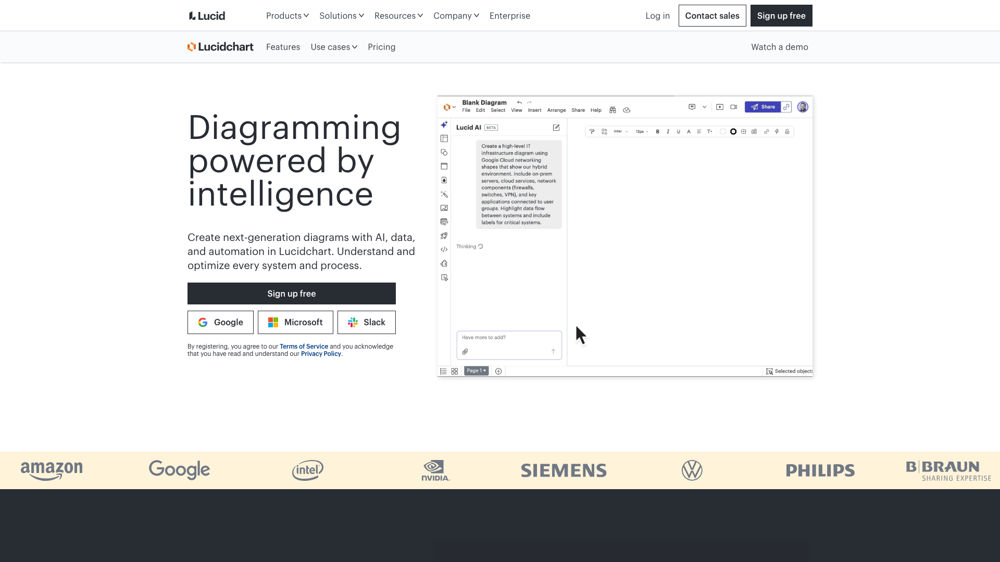

Réglons tout de suite le point évident. Si vous cherchez une alternative à Lucidchart pour dessiner des logigrammes, des schémas de base de données, des architectures réseau ou des parcours utilisateurs, Rolebase est une mauvaise réponse. Il n'a pas de canevas de dessin, et c'est un choix assumé plutôt qu'une case vide dans une roadmap.

Ce que Rolebase remplace est plus étroit et bien plus agaçant : l'organigramme que quelqu'un a dessiné à la main, que tout le monde a trouvé formidable pendant une semaine, et qui a vieilli dès la réorganisation suivante. Si c'est ce document qui vous pousse à chercher ailleurs, la suite est pour vous.

## Ce que Lucidchart fait bien

Lucidchart est l'un des meilleurs éditeurs de schémas du marché, et il a gagné cette place. Le canevas est rapide, les bibliothèques de formes couvrent tout, des architectures AWS au BPMN, et plusieurs personnes éditent le même document en même temps avec leur propre curseur. Lucid revendique 99 % du Fortune 500 parmi ses clients, et les intégrations avec Microsoft 365, Confluence et Jira posent le schéma là où le travail se fait déjà.

Sur l'organigramme précisément, l'outil va plus loin qu'une page blanche. Vous importez vos données RH depuis un fichier CSV, un tableur Excel ou Google Sheets, et Lucidchart construit le graphique. Les formes intelligentes relient chaque collaborateur à son manager et gardent une mise en page propre quand vous déplacez quelqu'un. Sur le plan Enterprise, l'import se branche directement sur BambooHR, et vous affichez des champs RH comme le service, la date d'embauche ou le salaire par-dessus les cases.

Ajoutons une précision, parce que la question revient assez souvent dans les recherches. Il n'est rien arrivé à Lucidchart. Le produit vit toujours et continue de sortir des nouveautés, il est simplement passé sous la marque Lucid, aux côtés de Lucidspark, et `lucidchart.com` redirige vers `lucid.app`. Nous l'avons vérifié le 1er août 2026.

## Pourquoi les équipes cherchent une alternative à Lucidchart

### L'organigramme vieillit dès qu'il est dessiné

Un organigramme Lucidchart est un document. Quelqu'un possède le fichier, et cette personne devient le goulot d'étranglement de chaque arrivée, de chaque départ, de chaque scission d'équipe et de chaque passation de rôle. Le data linking aide si votre tableur source est propre, et il demande quand même un rafraîchissement manuel ou un nouvel import pour refléter ce qui a changé.

La Scop EVEA, cabinet de conseil en environnement, a vécu exactement ça avant de passer sur Rolebase. L'entreprise est passée de 60 personnes en 2020 à 140 en 2023, réparties sur trois sites, et son organisation vivait dans un PowerPoint. Leur responsable communication l'a mieux formulé que nous : représenter l'entreprise, c'était « comme explorer les méandres d'une rivière inconnue avec une carte dessinée à la main ». [Leur retour d'expérience complet est ici](/fr/client-cases/scop-evea).

### Le plan gratuit s'épuise vite

La version gratuite de Lucidchart donne 3 documents modifiables et 75 formes par document. L'organigramme d'une entreprise de 40 personnes consomme à lui seul le budget de formes, et vous avez dépensé un de vos trois documents pour ça. Cette limite est un essai assumé, et elle fait du plan gratuit un mauvais endroit pour héberger un document que toute l'entreprise est censée consulter.

### Les gros schémas deviennent lourds

Les avis publiés sur Capterra mentionnent régulièrement des ralentissements quand un document grossit, et la performance du navigateur est la première à en souffrir. L'organigramme fait partie des schémas qui grossissent le plus vite, puisqu'il gagne une case à chaque recrutement.

### Les formes et fonctionnalités premium sont réparties par palier

Plusieurs bibliothèques de formes, l'import et l'export Visio, l'historique des versions et les intégrations Confluence, Jira et Microsoft 365 se répartissent entre les plans payants. Des utilisateurs pointent aussi le choix limité de couleurs et de modèles sur les paliers bas. Rien de choquant pour un outil de schémas, et cela veut dire que la version testée gratuitement n'est pas celle que vous paierez.

### Une case n'est pas un rôle

C'est la limite structurelle, et aucun palier tarifaire ne la corrige. Un rectangle porte un nom et un intitulé de poste. Il ne dit rien de ce dont la personne répond, des décisions qu'elle peut prendre seule, ni des trois autres équipes auxquelles elle contribue. Toutes les organisations qui distribuent la responsabilité se cognent à ce mur, et la parade habituelle consiste à tenir un second document listant qui fait quoi, qui finit par diverger du premier.

## Là où un dessin s'arrête et où un organigramme commence

L'écart apparaît dans quatre situations du quotidien.

Une personne porte plusieurs rôles dans plusieurs équipes. Sur un canevas, vous dupliquez la case, et le doublon devient une deuxième source de vérité que quelqu'un doit penser à mettre à jour.

Une équipe veut voir la même organisation autrement. Les opérations veulent une liste à plat de qui fait quoi, le comité de direction veut l'imbrication, un nouvel arrivant veut des visages. Sur un canevas, cela fait trois dessins, maintenus trois fois.

Une responsabilité passe d'une personne à une autre. Dans un dessin, vous modifiez une étiquette. Dans la réalité, les redevabilités, les tâches en cours et les réunions attachées à cette responsabilité bougent aussi, et aucune ne vit dans le dessin.

Quelqu'un pose une question à laquelle l'organigramme devrait répondre. Qui peut valider cette dépense ? Qui a repris le rôle recrutement après le départ de Sarah ? Le dessin montre une hiérarchie, et la réponse est ailleurs.

Nous avons développé ce basculement dans [l'organigramme dynamique](/fr/blog/dynamic-org-chart) et dans [comment créer l'organigramme de votre entreprise](/fr/blog/create-org-chart).

## Comment Rolebase aborde l'organigramme

### Ce sont les équipes qui le tiennent à jour

Dans Rolebase, chaque membre met à jour ses propres rôles, et chaque équipe fait évoluer sa propre structure. L'organigramme colle à la réalité parce que ceux qui connaissent la réalité sont ceux qui l'éditent. Les changements apparaissent en temps réel pour tout le monde, ce qui compte surtout pendant un atelier où la structure se remodèle en direct.

La gouvernance protégée existe pour les organisations qui veulent un garde-fou, et elle réserve les modifications de structure aux responsables de cercle.

### Les rôles portent leur contenu

Un rôle dans Rolebase a une raison d'être, un domaine et une liste de redevabilités. Il porte aussi ses propres discussions, tâches, décisions et réunions. Attribuez-le à quelqu'un et cette personne hérite de l'ensemble, ce qui transforme une passation en une simple attribution plutôt qu'en deux semaines de fouilles archéologiques.

Une même personne peut tenir cinq rôles dans quatre équipes différentes sans un seul doublon, parce que le membre et le rôle sont deux objets distincts.

### Quatre vues des mêmes données

La même organisation s'affiche de quatre façons, et changer de vue coûte un clic : Tous les Rôles pour l'imbrication complète, Holarchie pour les rôles d'une équipe à taille égale, Opérationnel pour une vue à plat de tous les rôles mélangés, et Membres uniquement pour les visages. Personne ne maintient un second dessin pour obtenir une seconde vue.

### Vous obtenez quand même une image quand il en faut une

Les slides et les PDF sont un besoin réel, et c'est le seul endroit où un outil de schémas garde un avantage évident. Rolebase exporte l'organigramme en PNG transparent, et vous choisissez la vue, la largeur en pixels et le rendu clair ou sombre avant de télécharger. Cela couvre la présentation au conseil et le livret d'accueil. Vous n'obtenez pas pour autant un canevas à annoter ensuite.

L'export complet des données sort en XLSX ou en JSON, avec le choix de ce qu'on embarque : membres, rôles, décisions, tâches, réunions.

### Open source, et gratuit pour les petites équipes

Rolebase est publié sous licence MIT. Le code est auditable, et vous pouvez l'héberger sur vos propres serveurs, ce qui devient souvent le critère décisif quand l'organigramme contient des données personnelles et que votre DPO demande où elles circulent. Le plan gratuit couvre toutes les fonctionnalités jusqu'à 5 membres actifs, avec un nombre illimité de membres inactifs dans l'organigramme : une entreprise de 40 personnes peut donc cartographier toute sa structure et ouvrir un compte aux cinq personnes qui l'entretiennent.

## Comparatif des fonctionnalités

Nous avons vérifié chaque ligne ci-dessous le 1er août 2026.

| Élément | Lucidchart | Rolebase |
|---|---|---|
| Logigrammes, schémas de bases, réseaux | Oui, des centaines de bibliothèques | Non |
| Organigramme | Oui, sous forme de dessin | Oui, sous forme de données |
| Construction depuis des données importées | CSV, Excel, Google Sheets | Holaspirit, autres formats sur demande |
| Import SIRH | BambooHR, plan Enterprise | Non |
| Qui le met à jour | Celui qui détient le document | Chaque membre, sur ses rôles |
| Rôles avec raison d'être, domaine, redevabilités | Une étiquette dans une case | Des champs structurés |
| Une personne dans plusieurs équipes | Cases dupliquées | Un membre, plusieurs rôles |
| Vues de la même structure | Une mise en page par document | 4 vues intégrées |
| Collaboration en temps réel | Oui | Oui |
| Export image | PNG, PDF, SVG, Visio sur les plans payants | PNG transparent, par vue |
| Export de données structurées | Fichiers de schéma | XLSX, JSON |
| Réunions rattachées aux rôles | Non | Oui, avec ordre du jour et compte rendu automatique |
| Tâches, discussions, décisions par rôle | Non | Oui |
| Intégrations | Microsoft 365, Confluence, Jira, Salesforce sur Enterprise | Synchronisation calendrier (iCal), API GraphQL |
| Open source | Non | Oui, licence MIT |
| Auto-hébergement | Non | Oui |
| Plan gratuit | 3 documents, 75 formes chacun | Toutes les fonctionnalités, 5 membres actifs |

Lucidchart gagne sur tout ce qui relève du dessin, sur l'étendue de ses intégrations et sur l'import SIRH. Rolebase gagne sur tout ce qui consiste à garder l'organisation à jour après le premier jet.

## Comparatif des tarifs

Lucidchart, d'après la page tarifs de Lucid le 1er août 2026, hors taxes :

- Gratuit : 3 documents modifiables, 75 formes par document, 100 modèles
- Individual : 9 $ par mois, documents et objets illimités
- Team : 10 $ par utilisateur et par mois, ajoute l'historique des versions, la publication protégée par mot de passe et les intégrations Microsoft 365, Confluence et Jira
- Enterprise : sur devis, ajoute SAML, les automatisations avancées, Salesforce et l'import d'organigramme BambooHR
- La facturation annuelle ramène le plan Individual autour de 8 $ par mois

Rolebase, d'après [notre page tarifs](/fr/pricing) :

- Small : gratuit à vie, toutes les fonctionnalités, 5 membres actifs, membres inactifs illimités dans l'organigramme
- Startup : 5 € par utilisateur et par mois, membres actifs illimités, 1 h de coaching par mois et support prioritaire
- Enterprise : sur devis, membres invités illimités, conseil et intégrations sur mesure
- Les associations bénéficient d'une remise importante ou d'un accès gratuit selon leur statut
- L'auto-hébergement est gratuit sous licence MIT, vous payez vos serveurs

Les deux prix par siège se tiennent à un euro près, donc ce qui décide de la facture, c'est de savoir qui a besoin d'un siège. Lucidchart facture tous ceux qui éditent un document, et l'organigramme d'une entreprise qui grandit est édité par les RH, par les assistantes et par chaque responsable d'équipe. Rolebase facture les membres actifs, et une personne qui figure dans l'organigramme sans avoir besoin d'un compte ne coûte rien. Pour une entreprise de 40 personnes où 5 personnes entretiennent la structure, cela fait 0 € par mois contre 5 sièges Lucidchart Team à 50 $.

## Les autres options qui méritent un coup d'œil

Ne recommander que nous-mêmes serait pratique et assez peu utile.

**draw.io, aussi appelé diagrams.net**, est la réponse à « quel logiciel gratuit pour faire des schémas ». Il est publié sous licence Apache 2.0, s'ouvre sans compte, fonctionne hors ligne en application de bureau, et importe les fichiers Visio, Gliffy et Lucidchart, ce qui rend la migration presque gratuite. Il construit un schéma depuis un fichier CSV et propose des mises en page automatiques. Il produit un dessin, avec le même problème de vieillissement, et il ne coûte rien. Nous l'avons comparé à cinq autres options dans [notre sélection d'outils d'organigramme open source](/fr/blog/open-source-org-chart-tools).

**Organimi** est un constructeur d'organigrammes dédié, orienté RH. Son tarif suit le nombre de personnes cartographiées plutôt que le nombre de sièges, à 13 $ par mois pour le plan Basic et 25 $ pour Premium à 150 personnes cartographiées, en facturation annuelle. Il importe du CSV et de l'Excel, se connecte à Active Directory, Google et Salesforce sur le plan Premium, et gère les organigrammes matriciels et de redevabilités. C'est un bon choix pour une hiérarchie classique alimentée par un SIRH.

**Microsoft Visio** est l'équivalent Microsoft de Lucidchart, et il se défend pour les organisations déjà équipées chez Microsoft. C'est aussi un éditeur de schémas, donc le problème de vieillissement vous suit.

Si votre organisation pratique la gouvernance partagée et que vous comparez des outils de cette catégorie précise, nos comparatifs avec [Peerdom](/fr/blog/alternative-peerdom) et [GlassFrog](/fr/blog/alternative-glassfrog) vous serviront davantage que celui-ci.

## Qui devrait choisir quoi

**Restez sur Lucidchart si** votre organigramme est un schéma parmi cinquante autres, si votre équipe dessine des architectures et des processus toutes les semaines, s'il vous faut la synchronisation BambooHR, ou si votre organisation est une hiérarchie stable où une personne détient légitimement l'organigramme.

**Essayez Rolebase si** votre organigramme est redessiné après chaque réorganisation, si des personnes portent plusieurs rôles dans plusieurs équipes, si vous voulez que chaque équipe entretienne sa partie, si l'open source ou l'auto-hébergement compte pour vous, ou si vous voulez aussi que les réunions, les tâches et les décisions soient rattachées aux rôles au lieu de flotter dans un outil séparé.

**Utilisez les deux si** vous dessinez dans Lucidchart et vous organisez dans Rolebase. C'est une combinaison courante et parfaitement raisonnable, les deux outils ne se disputent pas le même travail.

## Migrer votre organigramme

Personne ne reconstruit une structure de 140 personnes en une soirée, et personne ne devrait essayer.

1. Exportez ce que vous avez. Si votre organigramme Lucidchart a été construit depuis un import de données, le fichier CSV ou Excel d'origine reste le meilleur point de départ, alors repartez de lui plutôt que du dessin.
2. Créez votre organisation dans Rolebase et commencez par les équipes, avant les personnes. Cinq à dix cercles suffisent en général pour un premier passage.
3. Ajoutez les rôles qui existent déjà en pratique, avec une raison d'être et deux ou trois redevabilités chacun. Résistez à l'envie d'être exhaustif dès le premier jour.
4. Invitez les personnes qui entretiennent la structure. Toutes les autres peuvent figurer en membres inactifs, gratuitement, jusqu'à ce qu'elles aient besoin d'un compte.
5. Animez une réunion dans l'outil. C'est l'étape qui décide si l'organigramme reste vivant, parce qu'une structure dont personne ne se sert en réunion redevient un dessin.

Rolebase importe automatiquement les organisations venant de Holaspirit. Pour toute autre source, déposez votre fichier et notre équipe le récupère comme une demande plutôt que de vous laisser tout ressaisir.

Le plan gratuit n'ayant pas de limite de durée, faire tourner les deux outils en parallèle pendant la transition ne coûte rien.

## Conclusion

Lucidchart est un meilleur éditeur de schémas que Rolebase ne le sera jamais, et ce n'est pas la comparaison que nous faisons. La question est de savoir si l'organigramme de votre entreprise doit être une image qu'une personne redessine, ou des données que les équipes entretiennent elles-mêmes.

Si l'image vous convient, gardez-la. Lucidchart le fait bien, draw.io le fait gratuitement, et aucun des deux ne demande à vos équipes de changer leur façon de travailler.

Si vous avez redessiné trois fois le même organigramme cette année, [commencez gratuitement](/signup) et cartographiez votre première équipe. Cinq membres actifs ne coûtent rien, pour toujours, et le reste de l'entreprise peut apparaître dans l'organigramme dès le premier jour.
