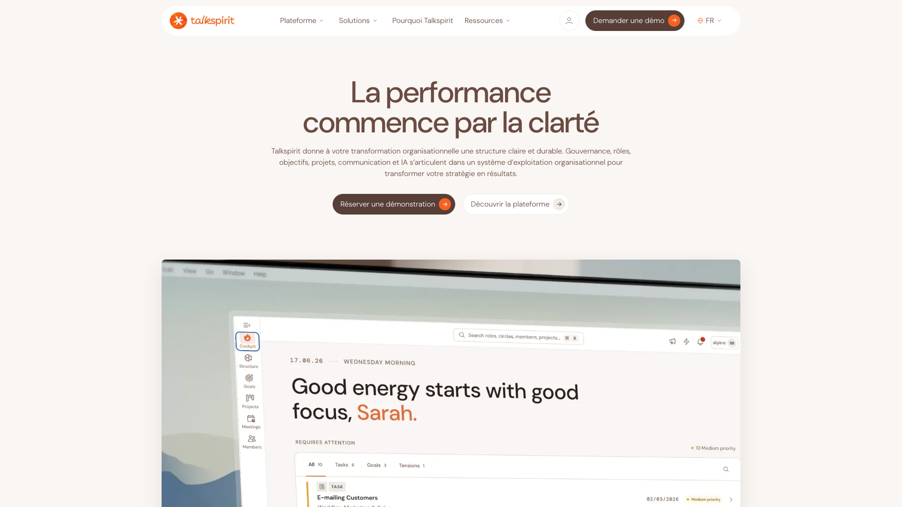
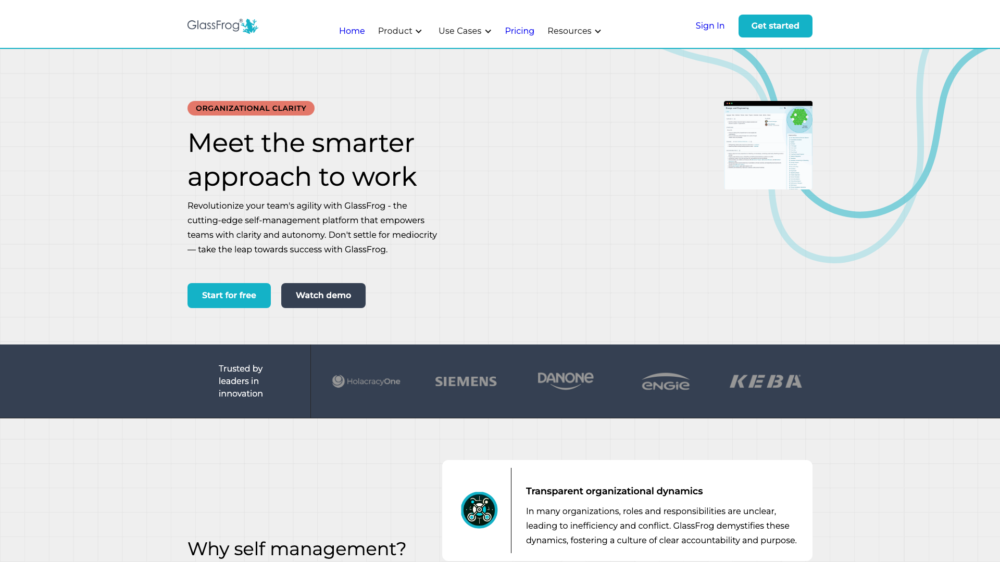
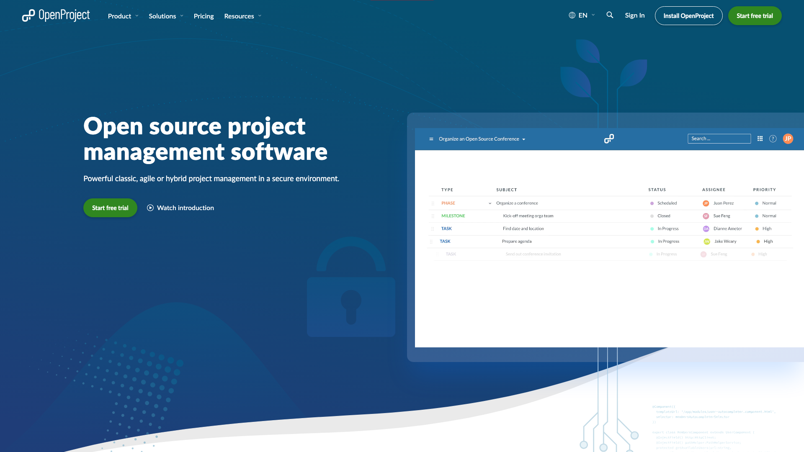
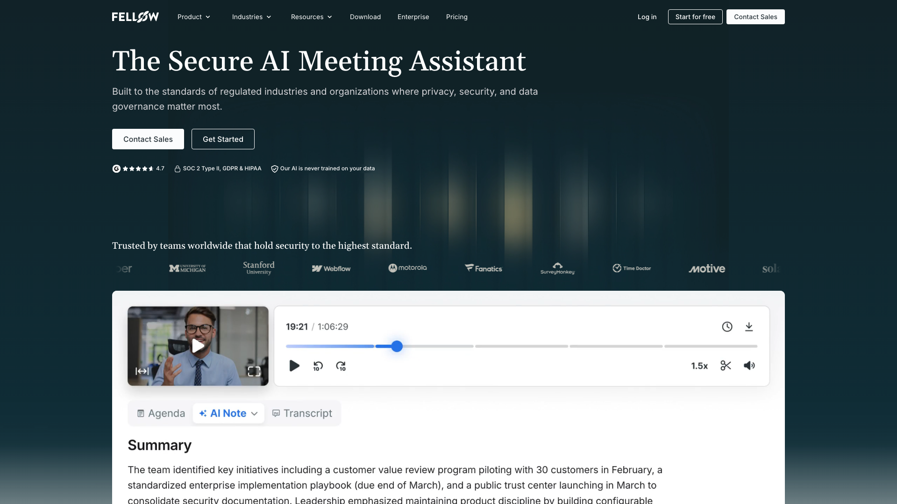
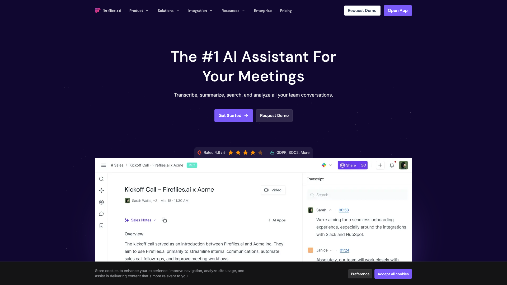
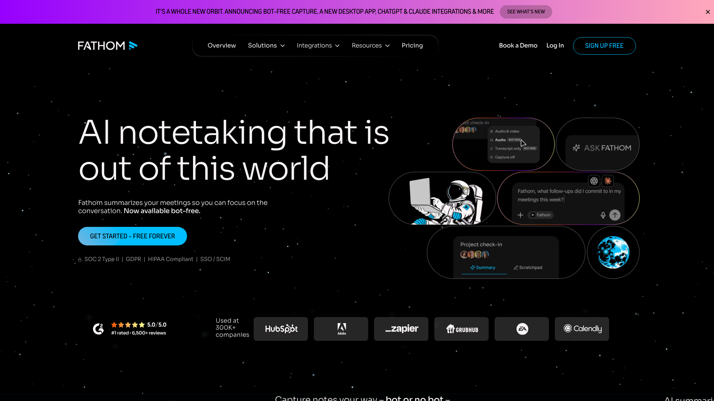
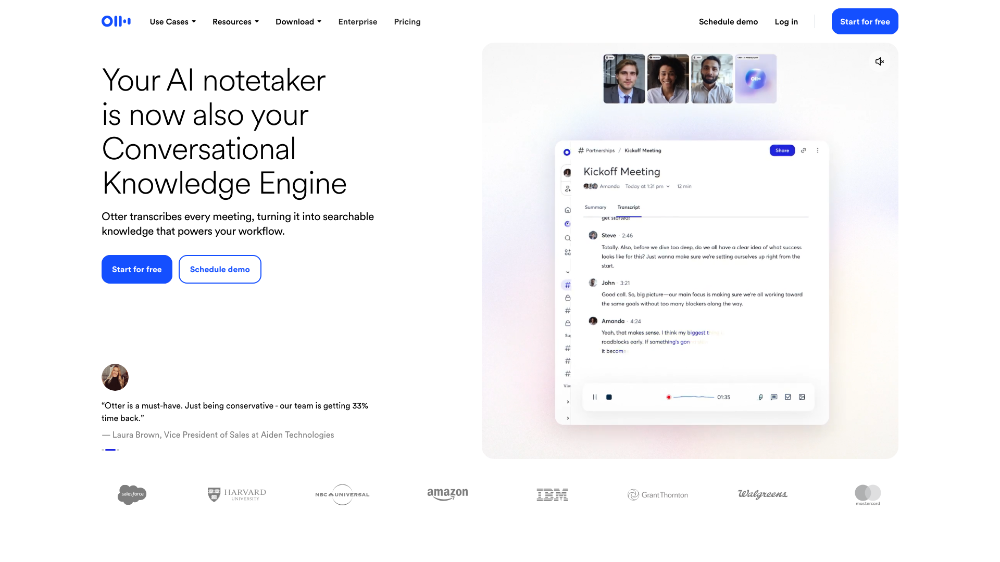
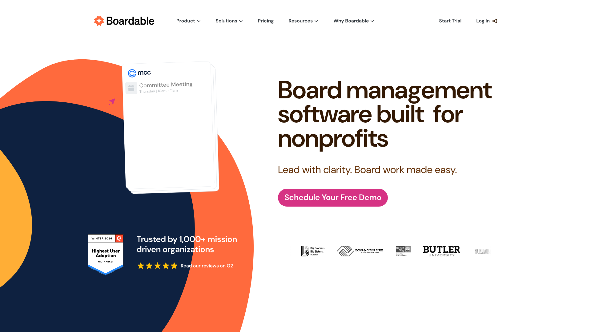
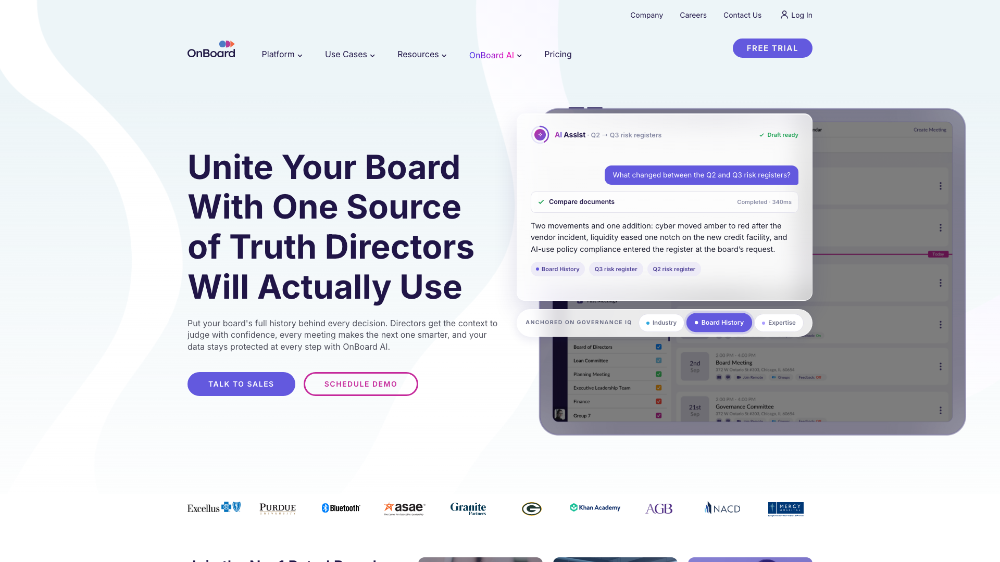

Le terme logiciel de réunion désigne trois types de produits différents. Le premier donne une forme à la séance, un ordre du jour qui se termine en décisions avec un responsable. Le deuxième envoie un robot dans l’appel et vous rend une transcription. Le troisième assemble un dossier de séance et un procès-verbal que vos administrateurs approuvent à la session suivante. Leurs tarifs vont de zéro à 39 $ par siège. La famille compte plus que le prix, puisqu’une équipe qui achète dans la mauvaise famille finit par abandonner l’outil.

Rolebase publie cet article et fait partie des dix. Il arrive en tête du groupe des outils qui transforment une réunion en structure que votre organisation conserve. Six critères décident de cet ordre. Ils sont détaillés sous Comment ce classement est construit. Chaque outil cité renvoie vers son propre site, pour que vous puissiez vérifier chaque affirmation à la source.

S’il vous faut une trace de ce qui a réellement été dit, commencez par les quatre outils qui enregistrent l’appel. Aucun ordre du jour ne remplace une transcription.

Les tarifs viennent des pages de prix de chaque éditeur, relevées le 1er septembre 2026. Quand un éditeur ne publie aucun prix, la fiche le dit plutôt que de reprendre un chiffre trouvé ailleurs, une précaution qui compte plus que d’habitude ici : les montants attribués à talkspirit dans les comparatifs vont de 4 € à 149 € par mois et se contredisent.

## Comment ce classement est construit

Les groupes viennent de la trace laissée par la réunion et de l’endroit où elle est conservée. Une décision rattachée à un rôle, une transcription rattachée à un appel et un procès-verbal signé rattaché à une résolution sont trois objets différents, donc l’outil que vous choisissez décide lequel vous obtenez.

Qui produit cette trace vient ensuite : un participant qui écrit pendant la séance, un robot qui a rejoint l’appel, ou un modèle qui résume ce que les gens ont saisi.

Le coût d’entrée réel pèse plus que le prix d’appel, puisque quatre de ces dix outils facturent un plancher de sièges avant de facturer les personnes que vous avez vraiment.

L’offre gratuite compte pour ce qu’elle autorise plutôt que pour l’étiquette « gratuit ». Celle de Fathom couvre les enregistrements sans limite. Celle de Fellow s’arrête après 5 comptes rendus IA par utilisateur pour la durée de vie du compte. Ces deux-là occupent les extrémités de ce que « gratuit » veut dire sur ce marché.

La portabilité passe par la licence, l’auto-hébergement et l’accès à l’API. Les formats d’export en sont exclus. Peu de ces éditeurs les publient, donc une comparaison mesurerait ce que chaque éditeur publie plutôt que ce que son produit permet vraiment. Rolebase est publié sous licence MIT et OpenProject sous GPLv3, les huit autres sont propriétaires.

Les notes appellent une réserve. Sur Capterra et G2, les deux sites d’avis utilisés ici, les échantillons des dix outils classés vont de 16 à 1 058 avis. Plusieurs de ces éditeurs collectent surtout sur G2, si bien que la note Capterra se compare mal d’une famille à l’autre. Fellow affiche 37 avis Capterra contre 2 437 sur G2. Rolebase en affiche 16, sur une fiche G2 que personne n’a commentée. Lisez le nombre avant la note, la nôtre comprise.

Chaque groupe est ensuite ordonné sur sa propre question, parce que chaque groupe vend un résultat différent. Dans le premier, la question porte sur la part de votre structure qu’une réunion peut mettre à jour sans que vous adoptiez au préalable une méthode de gouvernance particulière ni que vous décrochiez un rendez-vous commercial. Pour le deuxième, ce qui compte est ce que l’outil construit par-dessus la transcription. Pour le troisième, ce qui tranche est de savoir si le tarif est public. Les numéros de 1 à 10 sont un repère, pas un podium, donc Fathom en 7 répond à une autre question que GlassFrog en 3.

Le troisième groupe est le seul à produire des traces conformes aux statuts et recevables par un auditeur.

## Le comparatif

| Outil | La trace laissée par la réunion | Offre gratuite | Prix d’entrée | Open source | Capterra |
| --- | --- | --- | --- | --- | --- |
| Rolebase | Décisions et tâches rattachées aux rôles | Toutes les fonctionnalités, 5 membres actifs | 5 €/utilisateur/mois | MIT | 5,0 (16) |
| talkspirit | Comptes rendus, décisions et élections liés aux rôles | Non publiée | Sur devis | Non | 4,8 (146) |
| GlassFrog | Traces de gouvernance sur les cercles Holacracy | 10 utilisateurs | 7 $/utilisateur/mois | Non | 4,3 (60) |
| OpenProject | Ordre du jour et compte rendu liés aux lots de travaux | Édition communautaire auto-hébergée, sans limite de taille | 5,95 €/utilisateur/mois, 25 minimum | GPLv3 | 4,6 (188) |
| Fellow | Enregistrement, transcription, notes IA, ordre du jour | 5 utilisateurs, 5 comptes rendus IA par utilisateur à vie | 7 $/utilisateur/mois en annuel | Non | 4,9 (37) |
| Fireflies.ai | Transcription, résumé IA, actions à suivre | 400 minutes de stockage par équipe | 10 $/siège/mois en annuel | Non | 4,9 (735) |
| Otter.ai | Transcription et résumé | 300 minutes par mois | 8,33 $/utilisateur/mois en annuel | Non | 4,4 (103) |
| Fathom | Enregistrement, transcription, résumé IA | Enregistrements et transcriptions sans limite | 16 $/utilisateur/mois en annuel, ou 15 $ à partir de 2 sièges | Non | 5,0 (809) |
| Boardable | Dossier de séance et procès-verbal formel | Essai de 14 jours | 20,99 $/utilisateur/mois en annuel | Non | 4,7 (128) |
| OnBoard | Dossier de conseil et procès-verbal formel | Non publiée | Sur devis | Non | 4,7 (1 058) |

## Premier groupe : la réunion met à jour une structure que vous gardez

Ces quatre outils traitent la réunion comme le moment où une organisation se modifie elle-même. L’ordre du jour est une liste de points avec des responsables, le résultat est une décision ou une tâche enregistrée sur un rôle ou un projet, et la trace dure parce qu’elle vit au même endroit que la structure.

Ils se séparent sur la quantité de structure qui existe au départ. Rolebase, talkspirit et GlassFrog portent des rôles avec leurs redevabilités et y rattachent le résultat. OpenProject le rattache plutôt à des lots de travaux, une structure de projet et non de gouvernance.

talkspirit produit le plus de données structurées des quatre, puisqu’il traite les propositions, les objections et les élections dans le produit. L’ordre de ce groupe se joue sur la facilité à savoir si cette structure vous convient, et talkspirit ne répond à cette question qu’en démonstration.

### 1. Rolebase

Une réunion dans [Rolebase](/fr/features) appartient à un rôle, suit une séquence d’étapes typées, et enregistre ses décisions et ses tâches sur les rôles qu’elles concernent plutôt que dans les notes de quelqu’un. Le produit est publié sous licence MIT.

Les étapes distinguent l’outil dans ce groupe. Une séance enchaîne un tour d’inclusion, une liste de contrôle des engagements récurrents, les indicateurs du rôle, ses tâches et ses discussions, dans l’ordre que vous fixez. Chaque type d’étape fait quelque chose de précis : la liste de contrôle demande à chaque membre de confirmer ce qu’il a bouclé depuis la dernière fois, l’étape indicateurs collecte les chiffres, l’étape tâches met à jour responsables et statuts. Des [modèles réutilisables](/fr/docs/meetings) conservent cette séquence, si bien qu’une réunion tactique et une réunion de gouvernance démarrent sur des formes différentes sans que personne reconstruise un ordre du jour. La récurrence suit la norme rrule, la présence s’enregistre en présent, absent ou non confirmé, et le résumé produit à la fin part de ce que les participants ont écrit pendant la séance. Les agendas se synchronisent avec Google et Office 365, ou par un flux iCal. La visioconférence tourne sur une salle Jitsi intégrée ou sur n’importe quel lien externe que vous collez.

Deux cas clients viennent de l’éditeur plutôt que d’un tiers indépendant. [Lonestone](/fr/client-cases/lonestone), un studio produit de 35 personnes, a remplacé ses tableaux Notion par des rôles qu’un nouvel arrivant lit dès sa première semaine. La [Scop EVEA](/fr/client-cases/scop-evea) cartographie 140 personnes sur trois sites. Capterra lui donne 5,0 sur 16 avis, le plus petit échantillon des dix, et lui a décerné Best Value et Best Ease of Use en 2023.

Rolebase capte ce que les gens saisissent, et rien d’autre. Il n’enregistre pas le son et ne rejoint pas les appels, donc son résumé IA travaille sur la trace écrite plutôt que sur ce qui a été dit. Si vous avez besoin de retrouver les mots exacts, associez-le à un outil du deuxième groupe. Le dossier de séance et la signature électronique manquent tous les deux. L’auto-hébergement suppose d’administrer vous-même Nhost, Hasura et PostgreSQL.

Rolebase est gratuit avec toutes les fonctionnalités jusqu’à 5 membres actifs, avec un nombre illimité de personnes dans l’organigramme sans compte à créer, puis 5 € par utilisateur et par mois sur [l’offre Startup](/fr/pricing).

### 2. talkspirit

[talkspirit](https://www.talkspirit.com) est le produit le plus large de ce groupe. L’éditeur existe depuis 2004. Il a absorbé Holaspirit lors d’une fusion en 2023 et vend aujourd’hui une plateforme européenne unique qui combine un fil social d’entreprise, une messagerie, un module d’objectifs et l’outillage de gouvernance apporté par Holaspirit.

Son module de réunions enchaîne inclusion, ordre du jour et clôture, avec des modèles que l’éditeur présente comme inspirés de l’Holacracy et de la Sociocratie 3.0. Comptes rendus, décisions, présence et actions s’enregistrent au fil de la séance, un résumé est produit à la fin, et les points de l’ordre du jour se relient aux rôles, aux projets et aux objectifs. Les propositions, les objections et les élections se traitent dans le produit plutôt que dans un processus parallèle, ce que peu d’outils de cette liste tentent. L’éditeur annonce plus de 900 organisations dans 28 pays, un hébergement en France et en Suisse, et une certification ISO 27001.

Le site marketing d’Holaspirit redirige désormais vers talkspirit.com pendant que l’application reste en ligne sur app.holaspirit.com, et l’éditeur a cessé de publier ses prix : aucune page de tarifs n’existe dans ses trois langues, et obtenir un chiffre passe par une démonstration. Capterra donne 4,8 sur 146 avis à talkspirit et conserve une fiche Holaspirit distincte à 4,6 sur 122.

### 3. GlassFrog

[GlassFrog](https://www.glassfrog.com) vient de HolacracyOne, l’organisation à l’origine de la constitution Holacracy, et il suit cette constitution plus littéralement que tout le reste de cette liste. Les réunions de gouvernance et les réunions tactiques sont intégrées comme deux processus distincts, les cercles et les rôles portent des politiques, et la boîte à tensions alimente l’ordre du jour comme la méthode le prescrit. Capterra lui donne 4,3 sur 60 avis.

Cette fidélité est à double tranchant. Une équipe qui pratique vraiment l’Holacracy trouve un outil qui connaît déjà les règles, et toutes les autres doivent apprendre le vocabulaire avant que l’outil serve à quelque chose.

Son offre gratuite couvre plus de sièges que toute autre offre hébergée de ce groupe : 10 utilisateurs, avec des cercles, rôles, politiques, projets et actions sans limite, réunions de gouvernance et tactiques comprises, authentification Google et accès API bridé à 50 appels par heure. Premium coûte 7 $ par utilisateur et par mois, supprime le plafond d’utilisateurs et ajoute la recherche avancée, les réunions personnalisées, l’export complet des données et les intégrations Slack, Asana et Jira. Deux modules restent hors de ce prix, Goals and Targets à 1,50 $ par utilisateur et par mois et l’assistant FrogBot pour 1,50 $ de plus.

### 4. OpenProject

[OpenProject](https://www.openproject.org) est une plateforme de gestion de projet sous licence GPLv3, et son module de réunions justifie sa place dans ce groupe. Les ordres du jour et les comptes rendus s’écrivent dans l’outil, les réunions ponctuelles comme récurrentes fonctionnent, les participants portent un statut de présence, et chaque réunion est publiée dans un flux iCal auquel Outlook, Apple Calendar ou n’importe quel autre agenda s’abonne.

Sa particularité tient à l’endroit où le résultat est enregistré. Un point d’ordre du jour se relie à un lot de travaux, donc une décision prise en séance devient une modification sur le ticket depuis lequel l’équipe travaille déjà. Pour une organisation d’ingénierie qui vit dans son outil de suivi, le chemin est plus court que celui de n’importe quel outil de gouvernance.

L’édition communautaire reste gratuite quelle que soit la taille, sans plafond de sièges, à condition de l’héberger vous-même. L’hébergement payant démarre à 5,95 € par utilisateur et par mois sur Basic avec un minimum de 25 utilisateurs, ce qui porte le prix d’entrée réel à 148,75 € par mois plutôt qu’à 5,95 €. Professional est à 10,95 € avec le même plancher et Premium à 15,95 € avec un plancher de 100. Capterra lui donne 4,6 sur 188 avis quand G2 lui donne 3,8 sur 25, l’écart le plus large de tout ce comparatif.

Il ne modélise ni rôles ni redevabilités, donc il répond à « qu’est-ce qu’on livre » plutôt qu’à « qui décide ça ».

## Deuxième groupe : la réunion produit un enregistrement et des notes IA

Un robot rejoint l’appel, ou le navigateur le capte directement, et une transcription revient accompagnée d’un résumé. La trace est fidèle d’une manière qu’aucun outil du premier groupe n’atteint, parce qu’elle reprend ce qui a été dit plutôt que ce que quelqu’un a eu le temps de taper.

La contrepartie est qu’une transcription est un document et non une structure. Les actions à suivre sont extraites, puis elles restent dans un compte rendu que personne ne rouvre à moins que l’outil ne les pousse ailleurs. Chaque produit de ce groupe propose des intégrations pour cette raison précise.

Ce qui sépare les quatre est ce qu’ils construisent par-dessus la transcription.

### 5. Fellow

[Fellow](https://fellow.ai) a longtemps été l’outil d’ordre du jour collaboratif de cette catégorie. Sa page d’accueil annonce aujourd’hui « The Secure AI Meeting Assistant », le domaine est passé de fellow.app à fellow.ai, et l’enregistrement occupe le centre du produit. Les fonctions d’ordre du jour subsistent, et c’est pourquoi il ouvre ce groupe plutôt que d’en occuper le milieu.

Vous disposez d’ordres du jour et d’actions à suivre à côté de l’enregistrement, de la transcription en 99 langues, des notes IA et des intégrations Google Meet, Teams et Zoom. Le palier Business ajoute la synchronisation Salesforce et HubSpot ainsi que le suivi de mots-clés, ce qui indique à quel acheteur le produit s’adresse désormais.

Cinq utilisateurs disposent chacun de 5 comptes rendus IA et de 5 enregistrements IA, pour la durée de vie du compte et non par mois, si bien que la gratuité tient de l’essai. Team est à 7 $ par utilisateur et par mois en facturation annuelle, ou 11 $ en mensuel, plafonné à 20 utilisateurs. Business est à 15 $ en annuel, ou 23 $ en mensuel, plafonné à 50. Enterprise est à 25 $ en annuel avec un minimum de 10 utilisateurs.

La fiche Capterra historique porte 4,9 sur 37 avis, une seconde fiche ouverte pour le nouveau produit n’en porte aucun, et G2 affiche 4,7 sur 2 437. Le chiffre Capterra sous-estime largement son adoption réelle.

### 6. Fireflies.ai

[Fireflies.ai](https://fireflies.ai) est celui qui pousse le plus loin au-delà de la transcription. Il comprend un gestionnaire d’actions et de tâches, AskFred pour interroger les réunions passées en langage naturel, un suivi de sujets, une analyse de sentiment et des statistiques de temps de parole, ainsi que des intégrations sans limite à partir du palier Pro.

L’offre gratuite transcrit sans plafonner le nombre de réunions mais ne conserve que 400 minutes de stockage pour toute l’équipe et 20 crédits IA non renouvelés, elle se remplit donc vite sur une vraie équipe. Pro est à 10 $ par siège et par mois en annuel, ou 18 $ en mensuel, avec 8 000 minutes de stockage par siège et l’enregistrement vidéo. Business est à 19 $ en annuel, ou 29 $ en mensuel, et ajoute le stockage sans limite, l’analyse conversationnelle et les statistiques pour les administrateurs. Enterprise est à 39 $, en facturation annuelle uniquement, avec la conformité HIPAA, le SSO et le SCIM. La durée d’enregistrement est plafonnée par palier, à 2 heures jusqu’au palier Pro et à 4 heures sur Enterprise.

Capterra lui donne 4,9 sur 735 avis, l’un des échantillons les plus fournis de ce comparatif.

### 7. Fathom

[Fathom](https://fathom.ai) a l’offre gratuite hébergée la plus généreuse de cet article. Elle donne des enregistrements et des transcriptions sans limite, des résumés IA immédiats, des extraits, des listes de lecture et une recherche sur l’ensemble des appels, sans rien payer, plus un mode de capture sans robot en version bêta pour qui préfère éviter un participant supplémentaire dans l’appel.

Les paliers payants ajoutent de l’analyse plutôt que du volume. Premium à 16 $ par utilisateur et par mois en annuel ajoute les résumés avancés, les actions à suivre générées et un assistant conversationnel. Team est à 15 $ par utilisateur et par mois en annuel avec un minimum de 2 utilisateurs, et ajoute la recherche globale et la collaboration. Business est à 25 $ en annuel avec la synchronisation des champs CRM, la vue Deal et les indicateurs de coaching.

Capterra lui donne 5,0 sur 809 avis et G2 5,0 sur 7 016. Attention à l’homonymie pendant vos recherches : un autre Fathom vend un logiciel d’états financiers.

Fathom excelle à vous restituer le contenu de l’appel. Comme tous les outils de ce groupe, il ne structure rien de la réunion avant qu’elle commence.

### 8. Otter.ai

[Otter.ai](https://otter.ai) est le nom que tout le monde connaît déjà, et le produit le plus sobre de ce groupe. Il transcrit, identifie les locuteurs, résume et cherche, le tout bien exécuté, avec un périmètre plus étroit que celui que Fireflies déploie autour du même travail.

N’importe qui transcrit 300 minutes par mois sans moyen de paiement ni engagement de sièges, ce qui reste la façon la plus simple de tester ce type d’outil seul. Pro est à 8,33 $ par utilisateur et par mois en annuel, ou 16,99 $ en mensuel, avec 1 200 minutes par utilisateur. Business est à 19,99 $ en annuel, ou 30 $ en mensuel, avec les réunions sans limite et un minimum de 5 utilisateurs. Le SSO et le SCIM arrivent sur Enterprise à partir de 100 utilisateurs.

Capterra lui donne 4,4 sur 103 avis et G2 4,4 sur 505, le cas rare où deux sources concordent étroitement.

## Troisième groupe : la réunion produit un procès-verbal formel

Ces deux produits existent pour les conseils, et ils vendent la trace plutôt que la séance. Ils assemblent un dossier de séance à partir de documents, transforment un ordre du jour en procès-verbal approuvé, consignent les votes et les résolutions avec le formalisme qu’exigent les statuts et que vérifient les auditeurs, et construisent les permissions autour des administrateurs, des comités et des observateurs.

Le prix traduit cette exigence. Boardable coûte plusieurs fois le tarif au siège du premier groupe, et davantage que ce que demande n’importe quel preneur de notes IA pour démarrer. OnBoard ne publie rien du tout. Les deux s’adressent à des organisations où un procès-verbal défectueux devient un problème juridique plutôt qu’un désagrément.

### 9. Boardable

[Boardable](https://boardable.com) est celui des deux qui publie ses tarifs, et il vise les conseils d’associations et d’organisations de taille moyenne plutôt que les conseils de grands groupes.

Essentials est à 20,99 $ par utilisateur et par mois en facturation annuelle, avec un éditeur d’ordre du jour, une bibliothèque documentaire, la génération du dossier de séance et une limite de 1 000 fichiers. Professional à 29,99 $ lève le plafond de stockage et ajoute la signature électronique, les formulaires de gouvernance, les sites publics et des enquêtes de base. Professional+ à 35,99 $ ajoute les procès-verbaux générés par IA, les enquêtes sans limite et Boardable Video sans supplément. Chaque palier donne droit à un essai de 14 jours avec les fonctionnalités Professional.

Capterra lui donne 4,7 sur 128 avis. Toute personne ayant accès à la plateforme compte comme utilisateur, membres de comité et observateurs compris, alors que les invités d’une séance n’occupent aucun siège.

### 10. OnBoard

[OnBoard](https://www.onboardmeetings.com) est le plus commenté des deux, avec 1 058 avis Capterra à 4,7 et 687 sur G2 à la même note. Il vend des ordres du jour sécurisés, des dossiers de conseil, des séances et des procès-verbaux répartis sur trois paliers nommés Essentials, Premium et Ultimate.

Aucun de ces paliers ne porte de prix. La page de tarifs décrit ce que chacun contient et renvoie vers une démonstration, et sa FAQ indique que le coût dépend de l’offre et du nombre d’utilisateurs. Traitez tout chiffre trouvé ailleurs comme invérifié, et prévoyez un rendez-vous commercial avant de pouvoir le poser à côté de Boardable dans un tableur.

## Également dans la présélection

[Loomio](https://www.loomio.com) est open source, construit par une coopérative de travailleurs en Aotearoa Nouvelle-Zélande depuis 2011, et il traite les décisions asynchrones plutôt que les réunions. Sa tarification va par groupe et non par siège, à 399 $ par an jusqu’à 30 membres sur Starter, avec un tarif associatif à 299 $. Il propose un essai de 14 jours plutôt qu’une offre gratuite. Capterra lui donne 4,8 sur 26 avis.

[Parabol](https://www.parabol.co) anime les rétrospectives et les rituels de sprint avec plus de soin que n’importe quel outil de réunion généraliste, et il s’arrête aux limites de cet usage. Capterra porte 11 avis à 4,6, un échantillon trop petit pour en tirer grand-chose, quand G2 en porte 89 à la même note.

Notion et Confluence hébergent très bien des comptes rendus et ne structurent rien de la séance elle-même. Ils appartiennent à la liste des endroits où le résultat peut être conservé plutôt qu’à celle des outils qui le produisent.

## Comment choisir

Cinq questions tranchent plus vite qu’un tableau de fonctionnalités.

### Vous faut-il les mots, ou les décisions ?

Si vos réunions se terminent sur un désaccord quant à ce qui a été dit, le deuxième groupe règle ça et rien d’autre ne le fait. Si elles se terminent sur un accord quant à ce qui a été dit et un flou sur qui prend la suite, une transcription n’y change rien et c’est le premier groupe qu’il vous faut. Aucun outil du premier groupe n’enregistre le son, le nôtre compris, donc une équipe qui a besoin de retrouver les mots achètera dans le deuxième groupe quoi qu’elle fasse par ailleurs. Beaucoup d’équipes ont besoin des deux, et les deux familles coûtent assez peu ensemble pour qu’en prendre une dans chacune reste raisonnable.

### Un juriste ou un auditeur lit-il vos procès-verbaux ?

Si oui, le troisième groupe existe pour ça et le prix au siège paie cette garantie. Si non, vous paieriez de 20,99 $ à 35,99 $ par siège un formalisme que personne ne contrôle.

### Combien de personnes savent qui décide quoi ?

Quand une seule répond à toutes les questions du type « qui décide ça », un document partagé suffit et aucun de ces outils ne se rentabilise. Quand six responsables d’équipe connaissent chacun leur partie, le premier groupe est bâti pour exactement ce manque.

### Combien cela coûtera-t-il à votre taille ?

Les planchers comptent plus que les tarifs. OpenProject facture au moins 25 utilisateurs sur Basic, ce qui transforme 5,95 € en 148,75 € par mois. Le palier Business d’Otter en facture au moins 5, le palier Enterprise de Fellow au moins 10, le palier Team de Fathom au moins 2. Pour une entreprise de 12 personnes, plusieurs outils de cette liste ne coûtent rien et plusieurs coûtent quatre chiffres par an.

Surveillez aussi ce que chaque offre plafonne, la nôtre en premier. Rolebase est gratuit jusqu’à 5 membres actifs puis facture ensuite tous les membres actifs, donc une entreprise de 40 personnes paie 200 € par mois plutôt que rien. Le palier Team de Fellow admet 20 utilisateurs au maximum et son palier Business 50, ce qui place cette même entreprise sur Business à 600 $ par mois. GlassFrog revient à 280 $ hors modules pour 40 personnes, et OpenProject à 238 €. Confrontez votre effectif à chaque plancher et à chaque limite avant toute présélection.

### Pouvez-vous repartir avec vos données ?

Rolebase et OpenProject sont les deux que vous pouvez faire tourner sur vos propres serveurs, sous MIT et GPLv3. Partout ailleurs, demandez les formats d’export pendant la démonstration, puisque peu de ces éditeurs les publient.

Si votre présélection s’est resserrée sur un nom, nous avons comparé [talkspirit](/fr/blog/alternative-holaspirit), [GlassFrog](/fr/blog/alternative-glassfrog) et [Loomio](/fr/blog/alternative-loomio) plus en détail.

Si la méthode vous intéresse plus que le logiciel, nous avons décrit [ce qu’exige une réunion d’équipe productive](/fr/blog/productive-meetings), les [modèles d’ordre du jour](/fr/blog/meeting-agenda-template) adaptés à chaque type de séance, ainsi que les processus complets de la [réunion de gouvernance](/fr/blog/governance-meeting) et de la [réunion tactique](/fr/blog/tactical-meeting).

## Questions fréquentes

<FaqList>

<FaqItem question="Quel est le meilleur logiciel de réunion ?">

La réponse dépend du métier que vous achetez, parce que la catégorie en abrite trois.

Pour des réunions d’équipe récurrentes qui doivent se terminer par des décisions et des responsables, regardez Rolebase, talkspirit, GlassFrog ou OpenProject. Pour une trace fidèle de ce qui a été dit pendant un appel, regardez Fellow, Fireflies, Fathom ou Otter. Pour un conseil qui approuve des procès-verbaux formels, regardez Boardable ou OnBoard.

Se tromper de famille reste l’erreur courante. Un conseil ne peut pas approuver une transcription IA, et une équipe d’ingénierie ouvre un portail de conseil une fois et plus jamais.

</FaqItem>

<FaqItem question="Quel logiciel gratuit de compte rendu de réunion choisir ?">

Cinq offres gratuites méritent leur nom en 2026, et elles se distinguent par ce qu’elles plafonnent.

Fathom autorise enregistrements et transcriptions sans limite, la plus généreuse des offres hébergées présentées ici. L’édition communautaire d’OpenProject reste gratuite quel que soit le nombre d’utilisateurs si vous l’hébergez. GlassFrog couvre 10 utilisateurs avec cercles, rôles et réunions sans limite. Otter donne 300 minutes de transcription par mois sans moyen de paiement ni engagement de sièges. Rolebase couvre 5 membres actifs avec toutes les fonctionnalités, et les personnes sans compte apparaissent dans l’organigramme sans rien coûter.

L’offre gratuite de Fellow s’arrête à 5 comptes rendus IA et 5 enregistrements IA par utilisateur pour la durée de vie du compte, traitez-la comme un essai.

</FaqItem>

<FaqItem question="ChatGPT peut-il rédiger un compte rendu de réunion ?">

Il rédige le compte rendu. Capter la séance demande autre chose.

Collez une transcription ou vos notes brutes dans un modèle de langage et vous obtenez un compte rendu propre en quelques secondes, ce qui fait vraiment gagner du temps. Ce qu’il ne sait pas faire, c’est rejoindre l’appel, savoir qui était présent, ou déposer le résultat là où votre équipe le cherchera en mars.

Les outils de cet article comblent précisément cet écart. Le deuxième groupe s’occupe de la captation, le premier de l’endroit où le résultat est conservé, et la rédaction était déjà la partie facile.

</FaqItem>

<FaqItem question="Qu’est-ce que la règle 40/20/40 des réunions ?">

Elle répartit l’effort autour d’une réunion en 40 % de préparation, 20 % pour la séance et 40 % de suivi. L’intérêt de ce rapport est de montrer que l’heure passée dans la salle est la plus petite partie du travail. La plupart des équipes ne consacrent rien à l’avant ni à l’après, et les mêmes sujets reviennent donc semaine après semaine.

Le logiciel aide aux deux extrémités plutôt qu’au milieu. Un ordre du jour partagé écrit à l’avance porte les premiers 40 %, et des résultats enregistrés avec un responsable portent les derniers 40 %.

</FaqItem>

<FaqItem question="Faut-il un logiciel de réunion quand on utilise déjà Notion ou Confluence ?">

Il en faut un quand les comptes rendus cessent d’être lus. Une page de wiki accueille très bien une trace de réunion. Elle accueille mal un engagement, parce que rien n’y rappelle qu’une tâche a été confiée il y a trois semaines. Les équipes s’en aperçoivent en général quand le même point revient à l’ordre du jour pour la troisième fois.

Gardez le wiki pour ce qui doit durer. Ajoutez un outil du premier groupe quand les résultats doivent porter un responsable et une date, ou un du deuxième quand il vous faut l’enregistrement.

</FaqItem>

<FaqItem question="Existe-t-il un logiciel de réunion open source ?">

Deux des dix outils classés publient leur code, et Loomio, qui n’entre pas dans les dix, publie aussi le sien.

Rolebase est sous licence MIT et peut tourner sur votre propre pile Nhost, Hasura et PostgreSQL. OpenProject est sous GPLv3, et son édition communautaire ne coûte rien quel que soit le nombre d’utilisateurs quand vous l’hébergez. Loomio est open source également, construit par une coopérative de travailleurs, même si ses offres hébergées restent la voie pratique pour la plupart des équipes.

Aucun preneur de notes IA de ce comparatif n’est open source. Les deux portails de conseil non plus.

</FaqItem>

<FaqItem question="Combien coûte un logiciel de gestion de réunion ?">

Le prix va de zéro à 39 $ par utilisateur et par mois, et la famille détermine de quel côté vous tombez.

Les outils de réunion structurée occupent le bas, du gratuit à 7 $ le siège pour entrer, avec des paliers supérieurs qui montent jusqu’à 15,95 €. Chaque éditeur facture dans sa propre devise, lisez donc ces chiffres tels qu’ils les publient plutôt que comme une échelle convertie. Les preneurs de notes IA occupent le milieu, de 7 $ à 39 $ le siège en facturation annuelle, avec une facture pilotée par le stockage et les crédits IA plutôt que par les fonctionnalités. Les portails de conseil démarrent le plus haut, à partir de 20,99 $ le siège, et ils forment la seule famille où ce que vous payez est le formalisme lui-même. Deux éditeurs de cet article ne publient aucun prix.

Vérifiez les planchers de sièges avant de comparer les tarifs. Une offre à 5,95 € avec un minimum de 25 utilisateurs facture 148,75 € quelle que soit votre taille, elle reste donc plus chère qu’une offre à 10 € sans plancher jusqu’à 15 personnes.

</FaqItem>

</FaqList>

## Par où commencer

Nommez ce que vos réunions perdent aujourd’hui avant de présélectionner quoi que ce soit. Les équipes qui perdent les mots relèvent du deuxième groupe, celles qui perdent le suivi du premier, celles qui doivent produire une trace opposable du troisième. Très peu ont besoin des trois, et personne n’a besoin de trancher en assistant à dix démonstrations.

Rolebase est [gratuit jusqu’à 5 membres actifs](/fr/pricing) avec toutes les fonctionnalités, et le reste de votre organisation apparaît dans l’organigramme sans rien coûter. C’est assez pour faire tourner vos réunions récurrentes pendant quelques semaines et voir si des décisions rattachées à des rôles changent ce qui se passe entre deux séances.

<OrgListJsonLd
  name="Logiciel de réunion : 10 outils comparés en 2026"
  description="Dix logiciels de réunion comparés en trois groupes : les séances qui mettent à jour une structure que vous gardez, celles qu’une IA enregistre et résume, et celles qui produisent un procès-verbal formel."
  items={[
    { name: 'Rolebase', url: 'https://rolebase.io' },
    { name: 'talkspirit', url: 'https://www.talkspirit.com' },
    { name: 'GlassFrog', url: 'https://www.glassfrog.com' },
    { name: 'OpenProject', url: 'https://www.openproject.org' },
    { name: 'Fellow', url: 'https://fellow.ai' },
    { name: 'Fireflies.ai', url: 'https://fireflies.ai' },
    { name: 'Fathom', url: 'https://fathom.ai' },
    { name: 'Otter.ai', url: 'https://otter.ai' },
    { name: 'Boardable', url: 'https://boardable.com' },
    { name: 'OnBoard', url: 'https://www.onboardmeetings.com' },
  ]}
/>
