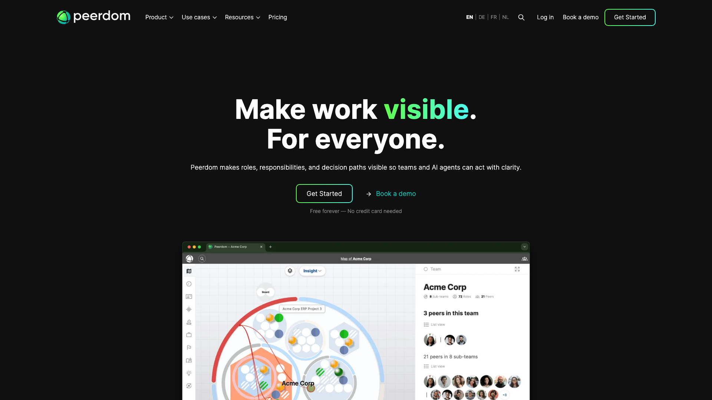
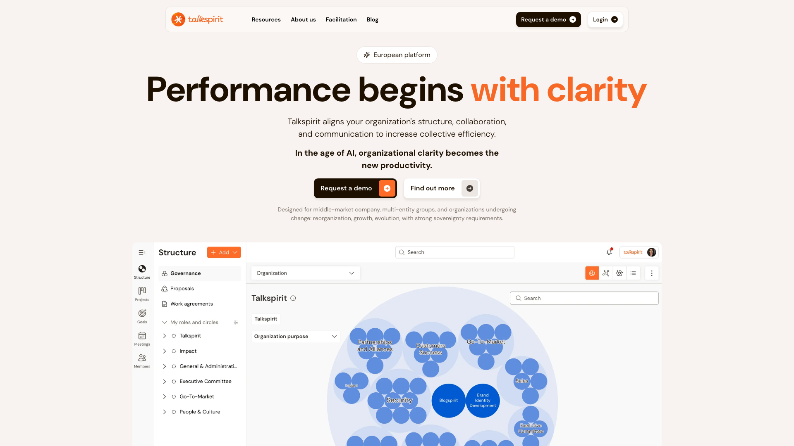
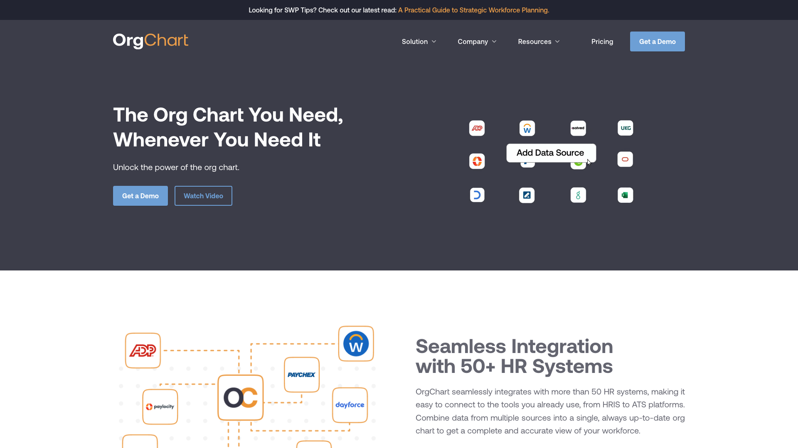
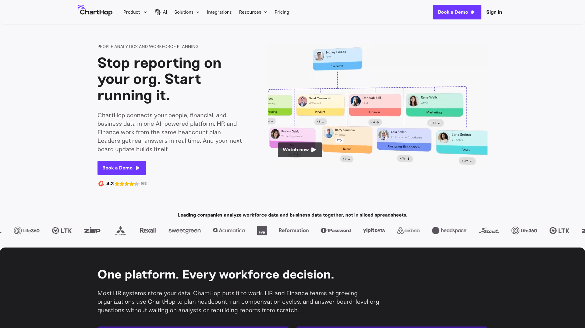
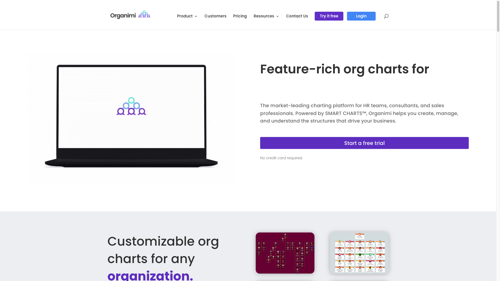
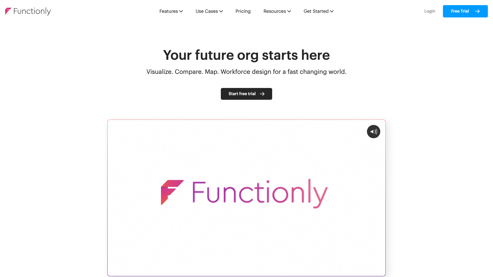
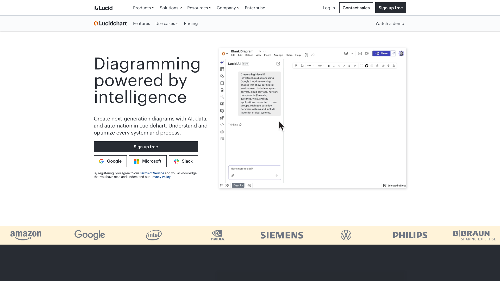
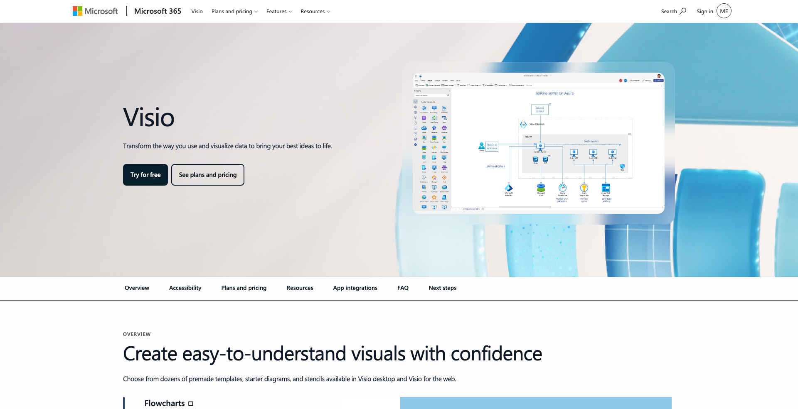
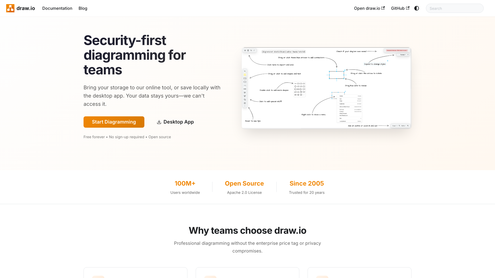

Cherchez un logiciel d'organigramme et trois produits différents répondent au même nom. Le premier dessine une image. Le deuxième régénère cette image depuis votre SIRH. Le troisième transforme l'organigramme en structure dans laquelle les équipes travaillent au quotidien. Les aligner dans une seule colonne en dirait plus sur celui qui écrit que sur les outils, alors cet article en classe onze à l'intérieur de trois groupes.

Rolebase publie cet article, et Rolebase fait partie des onze. Il arrive en tête du groupe des outils par rôles. Les critères qui l'y placent sont dans la section suivante, et chaque outil cité renvoie vers son propre site pour que vous puissiez nous vérifier.

Commencez par le troisième groupe si ce qu'il vous faut, c'est un organigramme propre dans une présentation d'ici vendredi. Lucidchart, Visio et draw.io font ça mieux que tout le reste de cette liste, et aucune fonctionnalité de gouvernance n'y change quoi que ce soit.

Les tarifs viennent des pages de prix de chaque éditeur, relevées le 1er août 2026. Quand un éditeur ne publie aucun prix, la fiche le dit plutôt que de reprendre un chiffre glané ailleurs. Les notes viennent de Capterra, avec le nombre d'avis à côté du score, parce qu'un 5,0 sur 16 avis et un 4,5 sur 3 279 sont deux affirmations très différentes.

## Comment ce classement est construit

Six critères structurent ce comparatif.

Le premier décide de la plupart des présélections à lui seul : ce que l'organigramme modélise. Des intitulés de poste et des liens hiérarchiques, des rôles avec une raison d'être et des redevabilités, ou un plan d'effectifs avec ses postes ouverts et leur coût. Ce sont trois modèles de données différents sous un seul nom.

Le deuxième porte sur qui tient l'organigramme à jour et depuis quelle source, entre l'édition manuelle, un import CSV, une synchronisation SIRH, une synchronisation d'annuaire ou les équipes elles-mêmes.

Vient ensuite le coût d'entrée réel plutôt que le prix d'appel. Les planchers de sièges, les minimums d'effectif facturé et les modules payants déplacent la facture très loin, et OrgChart facture un minimum de 100 salariés que vous en ayez 100 ou 30.

L'offre gratuite compte pour ce qu'elle autorise plutôt que pour le mot. Un essai limité dans le temps est autre chose, et un plan plafonné à trois documents tient plus de l'essai que de la gratuité.

La portabilité arrive en cinquième, à travers les formats d'export, l'accès à l'API, la licence et l'auto-hébergement. La note Capterra et la taille de son échantillon ferment la liste, et le tableau porte les deux.

Une réserve sur le cinquième critère. Les formats d'export et les licences sont publiés de façon inégale sur ce marché, si bien qu'il sépare les outils qui l'affichent de ceux qui restent discrets plutôt que de ceux qui en manquent.

Les trois groupes vont des outils qui modélisent la responsabilité à ceux qui modélisent une ligne hiérarchique, ce qui correspond au premier critère et à rien d'autre. À l'intérieur d'un groupe, le premier critère finit souvent à égalité, alors l'ordre s'y joue sur ce que l'outil fait autour de l'organigramme et sur la facilité à repartir avec ses données.

Soyons clairs sur ce que rien de tout cela ne prétend. Le groupe deux tient son organigramme à jour avec moins d'effort humain que le groupe un, parce qu'une synchronisation nocturne bat un humain à tous les coups, et un studio de 12 personnes qui redessine son organigramme deux fois par an appartient au groupe trois.

## Le comparatif

| Outil | Ce que l'organigramme modélise | Qui le tient à jour | Offre gratuite | Prix d'entrée | Open source | Capterra |
| --- | --- | --- | --- | --- | --- | --- |
| Rolebase | Rôles avec raison d'être, domaine, redevabilités | Chaque membre, sur ses propres rôles | Toutes fonctionnalités, 5 membres actifs | 5 €/utilisateur/mois | MIT | 5,0 (16) |
| Peerdom | Rôles avec raison d'être, redevabilités, domaines | Chaque membre, plus synchro d'annuaire | 10 membres, rôles illimités | 5 CHF/personne/mois, 10 minimum | Non | 4,8 (8) |
| GlassFrog | Cercles, rôles et politiques Holacracy | Les réunions de gouvernance | 10 utilisateurs, lecteurs illimités | 7 $/utilisateur/mois | Non | 4,3 (60) |
| Holaspirit | Cercles, rôles, domaines, politiques | Les réunions de gouvernance | Non publiée | Sur devis | Non | 4,6 (122) |
| OrgChart | Postes et liens hiérarchiques | Rafraîchissement SIRH automatique | Aucune | À partir de 105 $/mois, 100 salariés | Non | 4,6 (25) |
| ChartHop | Liens hiérarchiques, plan d'effectifs, rémunération | Synchro SIRH bidirectionnelle | Aucune | 5 $/salarié/mois | Non | ~4,7, nombre non confirmé |
| Organimi | Liens hiérarchiques, matriciel, redevabilités | CSV, ou synchro d'annuaire | Aucune | 13 $/mois | Non | 4,3 (137) |
| Functionly | Postes, rôles, redevabilités, ETP | Manuel, ou module SIRH payant | Aucune | 48 $/siège/mois, 3 sièges minimum | Non | Aucun avis |
| Lucidchart | Intitulés de poste et liens hiérarchiques | Le propriétaire du document | 3 documents, 75 formes | 9 $/mois | Non | 4,5 (2 246) |
| Microsoft Visio | Intitulés de poste et liens hiérarchiques | Le propriétaire du fichier, ou un lien de données | Aucune | 5 $/utilisateur/mois | Non | 4,5 (3 279) |
| draw.io | Un dessin, sans fiche salarié | Le propriétaire du fichier | L'éditeur, sans plafond | Gratuit | Apache 2.0 | 4,6 (772) |

## Groupe un : l'organigramme est une donnée que les équipes tiennent à jour

Ces quatre outils modélisent des rôles plutôt que des postes. Un rôle porte une raison d'être, un domaine et une liste de redevabilités, une personne en tient plusieurs, et l'organigramme découle de ces données. Personne ne détient le fichier maître, puisqu'il n'y a pas de fichier.

Ils se séparent sur ce qui se passe autour de l'organigramme. Rolebase, GlassFrog et Holaspirit tiennent les réunions et consignent les décisions sur les rôles, tandis que Peerdom cartographie et staffe la structure et laisse la réunion à votre agenda. Seul Rolebase publie son code sous licence ouverte, et seul Peerdom synchronise sa liste de personnes depuis un annuaire d'entreprise.

### 1. Rolebase

[Rolebase](/fr/features) est distribué sous licence MIT et modélise des rôles avec une raison d'être, un domaine de décision, des redevabilités et des indicateurs. Les rôles s'imbriquent en équipes, une personne en tient autant qu'elle veut dans autant d'équipes qu'elle veut, et [l'organigramme](/fr/docs/org-chart) se rend de quatre façons à partir des mêmes données, sans second dessin à entretenir.

Ce qui le distingue dans ce groupe, c'est que les réunions tournent sur l'organigramme. Une réunion a un ordre du jour partagé, des modèles réutilisables et un compte rendu automatique. Les décisions de gouvernance restent consignées avec leur date et leur auteur. Les tâches, les discussions et le fil d'actualité s'accrochent au rôle plutôt qu'à la boîte mail d'une personne, ce qui transforme une passation en simple affectation et pose le travail quotidien là où se trouve la responsabilité. Les agendas se synchronisent en iCal, Google et Outlook, les structures s'importent depuis Holaspirit, et tout s'exporte en PNG, XLSX ou JSON. Vous pouvez faire tourner l'ensemble sur vos propres serveurs.

Deux clients racontent publiquement ce qu'ils en ont fait. La Scop EVEA dit cartographier 140 personnes entre Nantes, Lyon et Troyes, et [Lonestone](/fr/client-cases/lonestone) fait tourner un studio de 35 personnes dessus. Capterra le note 5,0 sur 16 avis, un petit échantillon, et lui a décerné les distinctions Best Value et Best Ease of Use en 2023.

Les manques sont du côté RH plutôt que du côté du travail quotidien. La planification des effectifs, la rémunération, le feedback entre pairs et les élections vivent dans d'autres outils, aucune synchronisation SIRH ne l'alimente, et le dessin libre est hors de portée. L'auto-hébergement suppose de faire tourner Nhost, Hasura et PostgreSQL vous-même.

Gratuit avec toutes les fonctionnalités jusqu'à 5 membres actifs, avec un nombre illimité de personnes dans l'organigramme qui n'ont besoin d'aucun compte, puis 5 € par utilisateur et par mois sur [le plan Startup](/fr/pricing).

### 2. Peerdom

[Peerdom](https://peerdom.com) est un produit suisse de Wabern, près de Berne, né en 2017 au sein de l'agence de design Nothing AG et constitué en société fin 2021. Il revendique plus de 1 200 organisations dans une vingtaine de pays, avec Greenpeace, Médecins sans Frontières, l'armée suisse et la Mobilière parmi les noms qu'il publie.

Sa carte est la plus belle du groupe et la plus souple : cercles, arbres, pyramides et rendu 3D, avec un vocabulaire personnalisable pour les organisations qui ne disent pas « cercle ». Les rôles portent une raison d'être, des redevabilités et des domaines, et une personne en détient un portefeuille.

Deux capacités sortent du lot. Les brouillons permettent de construire des structures parallèles et de les comparer avant de valider une réorganisation. Le module Contribution répartit un pourcentage, un nombre d'heures ou une part d'ETP par rôle, ce qui transforme la carte en modèle de staffing avec des analyses de turnover et de rétention. La synchronisation d'annuaire avec Microsoft Entra ID, Google Workspace et Okta tient la liste des personnes à jour, et un serveur MCP expose la structure aux agents IA. La version de juillet 2026 a ajouté un retour arrière sur un an.

Gratuit jusqu'à 10 membres, avec des rôles et des groupes illimités. Peerdom+ coûte 5 CHF par personne et par mois en facturation annuelle avec un plancher de 10 membres, et chacune des neuf applications ajoute 1 CHF par personne et par mois, si bien que les prendre toutes atteint 14 CHF. Le plan Pro les inclut toutes à 15 CHF, soit un franc au-dessus de les assembler soi-même. Capterra le note 4,8 sur 8 avis, un petit échantillon.

### 3. GlassFrog

[GlassFrog](https://www.glassfrog.com) vient de HolacracyOne, et Brian Robertson, qui a écrit l'Holacracy, en est le CEO. Cette filiation fait tout le produit : il encode la constitution Holacracy plutôt qu'un modèle de rôles générique, avec cercles, rôles, politiques, rôles liés et historique de gouvernance. Il revendique 1 000 organisations et 15 000 utilisateurs actifs, dont Siemens, Danone, Engie et ABN AMRO.

L'offre gratuite est la plus généreuse du groupe et ce n'est pas un essai. Dix utilisateurs, pour toujours, avec cercles, rôles et politiques illimités, réunions de gouvernance et réunions tactiques, projets et actions illimités, une boîte à tensions, le SSO Google et une API. Au-delà, Premium coûte 7 $ par utilisateur et par mois et ajoute les modèles de rôles, les réunions personnalisées, l'export complet des données, Slack, Asana, Jira et SAML. Les personnes qui ne tiennent aucun rôle obtiennent un compte lecteur gratuit, ce qui garde l'effectif facturé proche du nombre de gens qui font réellement de la gouvernance.

Deux modules restent hors de ce prix. Goals and Targets, le module OKR, coûte 1,50 $ par utilisateur et par mois, et l'assistant FrogBot le même tarif. FrogBot transforme une plainte en proposition de gouvernance vérifiée contre vos propres politiques, et c'est une très bonne idée.

La méthodologie arrive avec le produit à travers le Habit Support Program, cinquante micro-leçons par mail et des sessions avec un coach. Capterra le note 4,3 sur 60 avis. L'API est passée en version 5 en bêta publique en mai 2026.

### 4. Holaspirit

Au 1er août 2026, `holaspirit.com` renvoie une redirection permanente vers [talkspirit.com](https://www.talkspirit.com), et la page de tarifs publique a disparu avec elle. [L'application continue de tourner](https://app.holaspirit.com), inscription comprise, et le centre d'aide s'intitule toujours « Holaspirit by Talkspirit ». La marque autonome se replie sur celle de sa maison mère, ce qui mérite d'être su avant de la mettre sur une liste courte.

Philippe Pinault et Olivier Ricard ont créé Holaspirit en 2016, avant sa fusion avec Talkspirit au sein du groupe Mandarina. Talkspirit revendique plus de 900 organisations et 150 000 utilisateurs, avec un hébergement 100 % européen et un argumentaire de souveraineté qui porte auprès des collectivités et des groupes européens.

Le modèle de gouvernance est complet : cercles et rôles avec raison d'être, redevabilités, domaines et politiques, pour des structures hiérarchiques, plates ou hybrides, avec un parcours d'apprentissage de l'Holacracy en douze semaines intégré au produit. Ce qu'aucun autre outil du groupe ne propose, c'est la suite autour. Messagerie, visio, fil d'actualité et gestion documentaire arrivent sur la même plateforme, si bien que la gouvernance et l'intranet se règlent en un seul achat.

Le tarif passe désormais par un échange commercial. La page d'aide sur la facturation nomme toujours les plans Rise et Scale sans indiquer de chiffre, et la page de tarifs publique a disparu. Les anciens montants qui circulent encore sont périmés, demandez un devis plutôt que de vous y fier. Capterra le note 4,6 sur 122 avis, l'échantillon le plus fourni du groupe.

## Groupe deux : l'organigramme est construit depuis vos données RH

Ces quatre outils construisent l'organigramme à partir de données que vous détenez déjà plutôt qu'à partir d'un dessin, qu'elles vivent dans un SIRH, un annuaire ou un tableur. L'organigramme devient une vue par-dessus cette source, souvent avec la planification d'effectifs et les coûts en supplément.

### 5. OrgChart

[OrgChart](https://theorgchart.com) fait ce métier depuis 2013 depuis Novato, en Californie, avec plus de 2 000 clients, et Resurgens Technology Partners en est devenu l'investisseur principal en janvier 2026. Une précision de navigation, puisque les noms y invitent : le produit vit sur `theorgchart.com`.

L'argument, c'est la profondeur des connecteurs. Plus de cinquante sources de données RH l'alimentent, dont Workday, ADP, UKG, isolved, Paychex, BambooHR, Dayforce, Oracle Cloud, SAP SuccessFactors, Active Directory et Azure AD, plus SFTP et ODBC pour les systèmes dont personne n'a écrit le connecteur. Il fusionne plusieurs sources dans un même organigramme, et c'est ainsi qu'il gagne les dossiers de la finance, du secteur public et de l'éducation, où les données RH vivent dans quatre endroits.

Par-dessus l'organigramme rafraîchi, il modélise les effectifs et leur coût, gère des scénarios et superpose des analyses sur les salaires, l'envergure managériale et la diversité. Il est certifié ISO 27001 depuis septembre 2025.

Les tarifs démarrent à 105 $ par mois pour Core, 157 $ pour Plus et 263 $ pour Pro, en facturation annuelle, tous avec un minimum de 100 salariés facturés. À ce plancher, cela revient entre 1,05 $ et 2,63 $ par salarié et par mois. Aucun plan gratuit, et un essai sur demande. Capterra le note 4,6 sur 25 avis.

### 6. ChartHop

[ChartHop](https://www.charthop.com) a ouvert à New York en 2019, levé 74,4 M$ et tourne avec une soixantaine de salariés. C'est le modèle de people analytics le plus complet de ce comparatif, et l'organigramme y est la surface plutôt que le produit.

Sa synchronisation SIRH bidirectionnelle est la vraie fonctionnalité. L'intégration poussée avec ADP Workforce Now, plus Greenhouse, Ashby et une large bibliothèque de connecteurs, permet à un scénario modélisé sur l'organigramme de réécrire dans le système de référence. La planification d'effectifs porte les postes ouverts et leur coût, les données de rémunération se superposent aux cases, et ChartHop AI, lancé en mars 2025, répond en langage naturel aux questions sur les effectifs.

La tarification est modulaire et grimpe vite. Core coûte 5 $ par salarié et par mois en annuel et couvre les analyses, l'organigramme et les profils. Chaque module de workflow ajoute 4 $ par salarié et par mois, et il y en a quatre : SIRH, planification d'effectifs, rémunération et performance. Les modules Engagement et Goals coûtent 3 $ chacun. Aucune offre gratuite ni essai annoncé, si bien que Core plus les modules SIRH et planification d'effectifs atterrit à 13 $ par salarié et par mois, et que tout prendre atteint 27 $.

Capterra le note autour de 4,7, sans nombre d'avis que nous ayons pu confirmer. Gartner Peer Insights affiche 4,6 sur quatre notes, un échantillon trop petit pour signifier quoi que ce soit.

### 7. Organimi

[Organimi](https://www.organimi.com) est l'outil que les gens citent réellement quand la question se pose sur Reddit, dans les fils RH, conseil et sysadmin. Il vient de Toronto et il gagne sur le prix pour ce qu'il fait.

Ses organigrammes dépassent la hiérarchie classique. Les organigrammes matriciels et par équipe projet sont inclus dans l'offre payante, et il dessine des organigrammes de redevabilités, ce qui est rare dans ce groupe. Les photos, les champs personnalisés et l'allure d'annuaire en font une référence consultée au quotidien plutôt qu'un document rangé dans un dossier.

Basic coûte 13 $ par mois en facturation annuelle et couvre trois administrateurs, les champs personnalisés, l'import CSV et Excel et les organigrammes classiques illimités, hébergés sur AWS US-East. Premium à 25 $ par mois ajoute les administrateurs illimités, le SSO, les organigrammes matriciels et de redevabilités illimités, le reporting, un choix d'hébergement américain, européen ou australien, et Organimi Connect, qui puise dans Active Directory, Google, Salesforce et sFTP. Enterprise ajoute l'API sur devis annuel.

Une réserve sur ces montants : le prix suit le nombre de personnes représentées, et ce sont les positions d'entrée du curseur. Les comparatifs publiés citent 18 à 39 $ parce qu'ils ont choisi un point plus haut. Ouvrir un compte ne demande pas de carte bancaire. Capterra le note 4,3 sur 137 avis.

### 8. Functionly

[Functionly](https://www.functionly.com) a démarré en 2018 depuis l'Australie occidentale et vise les organisations de 100 à 10 000 personnes. C'est ce qui ressemble le plus à un modèle de rôles dans ce groupe plutôt qu'à une vue d'effectifs, et son public, ce sont les gens qui conçoivent des organisations.

Les postes accueillent les personnes, les rôles s'attachent aux postes avec un pourcentage de charge, et les redevabilités viennent d'une bibliothèque de fonctions réutilisable que vous affectez dans toute l'organisation. Des vues dédiées montrent la structure par le travail plutôt que par la ligne hiérarchique. Autour, on trouve la modélisation de scénarios, la prévision d'ETP et de coûts, la planification des postes vacants et la délégation des changements, plus OrgPilot, un agent IA qui applique des modifications structurelles en masse à partir d'une consigne en langage naturel. Forbes Advisor l'a désigné meilleur outil sur la prise en main en février 2026.

La tarification demande de l'attention. Le site affiche 29 $ en accroche sur ses trois cartes, et les vrais tarifs sont au siège. Starter coûte 48 $ par siège en facturation mensuelle avec un plancher de trois sièges, donc 144 $ par mois achètent la plus petite configuration mensuelle, et la facturation annuelle est publiée à 240 $ par mois pour dix sièges, soit 24 $ le siège. Advanced coûte 98 $ par siège en mensuel, ou 490 $ par mois en annuel pour dix. Enterprise revient à 79 $ par siège et par mois en facturation annuelle, à partir de vingt sièges. Les connecteurs SIRH sont un module payant indexé sur l'effectif, en plus des sièges. L'essai dure 22 jours et il n'y a pas d'offre gratuite.

Capterra ne porte aucune note exploitable, avec zéro avis sur sa fiche principale.

## Groupe trois : l'organigramme est un dessin que quelqu'un entretient

Ces trois outils produisent une image. C'est une qualité quand l'image est le livrable, et c'est la raison pour laquelle l'organigramme vieillit dès la prochaine arrivée.

### 9. Lucidchart

[Lucidchart](https://www.lucidchart.com) est le meilleur éditeur de schémas généraliste du marché et il a gagné cette place depuis 2010. Le canevas est rapide, les bibliothèques de formes vont des architectures AWS au BPMN, et plusieurs personnes éditent le même document en même temps avec leur propre curseur. Lucid revendique 99 % du Fortune 500 parmi ses clients.

Sur l'organigramme, il va bien au-delà de la page blanche. Importez vos données depuis un CSV, un fichier Excel ou Google Sheets et il génère le graphique, avec des formes intelligentes qui reconnectent les rattachements quand vous déplacez quelqu'un. Le plan Enterprise importe directement depuis BambooHR et affiche des champs RH comme le service, la date d'embauche ou le salaire par-dessus les cases. Les intégrations Microsoft 365, Confluence, Jira et Slack posent le schéma là où le travail se fait déjà.

Le plan gratuit donne 3 documents modifiables, 75 formes chacun et 100 modèles, ce que l'organigramme d'une entreprise de 40 personnes consomme à lui seul. Individual coûte 9 $ par mois en annuel, Team 10 $ par utilisateur et par mois, et Enterprise passe par un devis. L'essai premium de 7 jours réclame un moyen de paiement d'entrée.

Capterra le note 4,5 sur 2 246 avis, le deuxième échantillon de cette liste. À noter que le site vit désormais sous la marque Lucid et que les liens de tarifs redirigent vers `lucid.app`.

### 10. Microsoft Visio

[Visio](https://www.microsoft.com/fr-fr/microsoft-365/visio/flowchart-software) dessine des schémas depuis 1992 et a rejoint Microsoft en 2000. Dans une entreprise déjà standardisée sur Microsoft 365, il répond souvent à la question « qu'est-ce qu'on possède déjà ».

Son assistant Organigramme construit une hiérarchie à partir d'un fichier Excel, d'un CSV, d'Exchange ou d'Active Directory. Le Plan 2 ajoute la connectivité de données bidirectionnelle, qui relie les formes à des lignes dans Excel, dans des listes SharePoint ou dans SQL et les rafraîchit, si bien que l'organigramme suit vraiment une source de vérité. La bibliothèque dépasse les 250 000 formes, et l'intégration Power BI amène le schéma dans le reporting.

Visio dans Microsoft 365 est inclus sans surcoût dans les plans commerciaux, limité aux applications web et Teams avec des schémas basiques. Le Plan 1 coûte 5 $ par utilisateur et par mois en paiement annuel et débloque les organigrammes avancés. Le Plan 2 coûte 15 $ et ajoute l'application Windows, le travail hors ligne et la connectivité de données. Les licences perpétuelles Standard et Professionnel 2024 existent toujours. Les nouveaux utilisateurs disposant d'un compte professionnel ou scolaire ont 30 jours d'essai, et il n'existe pas d'offre gratuite autonome.

Capterra le note 4,5 sur 3 279 avis, le plus gros échantillon de cet article.

### 11. draw.io

[draw.io](https://www.drawio.com), anciennement diagrams.net, est le seul outil de cette liste dont l'éditeur ne coûte rien, ne demande aucun compte et fonctionne entièrement hors ligne. L'éditeur et l'application de bureau sont publiés sous Apache 2.0 dans les dépôts `jgraph/drawio`, et la version 31.1.5 est sortie le 30 juillet 2026, ce qui dit le rythme. L'entreprise derrière, JGraph Ltd depuis 2004, s'est rebaptisée draw.io Ltd en septembre 2025.

Pour un organigramme, il cache un vrai chemin de données que peu de gens connaissent. Collez un bloc CSV avec une configuration `# connect` nommant les colonnes du manager et du nom, ajoutez `# layout: verticalflow`, et il construit et arrange la hiérarchie tout seul. Cela fonctionne dans un seul sens, sans rafraîchissement ni aller-retour, alors traitez-le comme un générateur plutôt que comme une synchronisation.

Les fichiers restent les vôtres. L'application de bureau les garde sur votre disque, la version web écrit dans votre Drive ou votre OneDrive, et le format `.drawio` est du XML lisible sans l'outil. Il importe les fichiers Visio, Gliffy et Lucidchart, ce qui rend la migration depuis un éditeur payant presque gratuite.

L'argent est du côté des applications Atlassian, gratuites jusqu'à 10 utilisateurs Confluence Cloud, puis 975 $ par an à 50 utilisateurs et 1 950 $ à 100. Capterra le note 4,6 sur 772 avis. Le projet n'accepte pas les pull requests, alors lisez la licence comme un droit de forker et d'héberger vous-même plutôt que comme une invitation à contribuer.

## Également en lice

Sept outils sont passés près et ont perdu sur le périmètre plutôt que sur la qualité. [SmartDraw](https://www.smartdraw.com) automatise très bien la mise en page et Forbes l'a désigné meilleur outil pour les plans de succession, à 9,95 $ par mois pour une personne et 8,95 $ par utilisateur avec un plancher de trois sièges. [Creately](https://creately.com) porte la couche de données la plus ambitieuse des outils de dessin, avec 201 champs RH et une synchronisation bidirectionnelle avec le tableur, gratuit jusqu'à 45 éléments par canevas puis 5 $ par mois. [Miro](https://miro.com) embarque un vrai composant organigramme avec un modèle de données et un import CSV, gratuit pour trois tableaux modifiables puis 8 $ par membre et par mois. [Sift](https://www.justsift.com) facture les connexions plutôt que les personnes représentées, à partir de 150 $ par mois pour un minimum de 20 utilisateurs, avec un connecteur Workday natif. [Workleap Pingboard](https://pingboard.com) existe toujours, et son prix vit maintenant à l'intérieur de la plateforme Workleap plutôt qu'à part, alors demandez un devis. [Nestr](https://nestr.io) laisse un agent IA tenir un rôle dans l'organigramme dès son plan Starter à 6 par utilisateur et par mois, en euros ou en dollars selon votre région, et importe depuis Holaspirit, GlassFrog et Peerdom. [Maptio](https://maptio.com) cartographie les initiatives en cercles imbriqués pour un prix libre à partir de 10 $ par mois couvrant 300 personnes.

## Comment choisir entre eux

Cinq questions tranchent plus vite qu'une matrice de fonctionnalités.

**Où vivent déjà vos données RH ?** Dans un vrai SIRH aux fiches propres, le groupe deux se rembourse, et OrgChart ou ChartHop transforment ce système en organigramme que personne n'entretient à la main. Le groupe un est le mauvais rayon pour ce travail, et Rolebase en particulier ne lit aucun système RH, donc son organigramme n'est jamais plus à jour que les équipes qui l'éditent. Dans un tableur que quelqu'un met à jour tous les mois, un import fonctionne avec n'importe lequel de ces outils et aucun ne vous sauvera.

**Une seule personne détient-elle légitimement l'organigramme ?** Si oui, un dessin est la bonne réponse et Lucidchart ou draw.io vous serviront des années. Si six responsables d'équipe connaissent chacun leur partie mieux qu'un détenteur central, un dessin transforme cette personne en goulot d'étranglement, et le groupe un existe exactement pour ça.

**Vous faut-il des intitulés de poste ou des responsabilités ?** Une case qui porte un nom et un titre ne dit pas de quoi la personne répond ni quelles décisions elle prend seule. Quand les gens tiennent plusieurs rôles dans plusieurs équipes, le groupe un, Functionly et les organigrammes matriciels d'Organimi sont les options qui le gèrent sans dupliquer une personne.

**Quelle est la facture réelle à votre taille ?** Surveillez les planchers plutôt que les tarifs. Functionly facture au moins trois sièges à 48 $, OrgChart un minimum de 100 salariés, Peerdom exige 10 membres, Sift en exige 20. Pour une entreprise de 40 personnes où cinq gèrent la structure, plusieurs de ces outils coûtent zéro et plusieurs coûtent quatre chiffres par an.

**À quel point tenez-vous à pouvoir partir ?** draw.io et Rolebase sont les deux que vous pouvez faire tourner vous-même, sous Apache 2.0 et MIT. Partout ailleurs, vérifiez les formats d'export avant la démo plutôt qu'après.

Si votre présélection s'est resserrée sur un nom, nous avons écrit une comparaison plus poussée pour [Lucidchart](/fr/blog/alternative-lucidchart), [Peerdom](/fr/blog/alternative-peerdom), [GlassFrog](/fr/blog/alternative-glassfrog) et [Holaspirit](/fr/blog/alternative-holaspirit). Si ce sont les licences que vous vérifiez, nous avons ouvert le fichier de licence de six outils dans [notre comparatif open source](/fr/blog/open-source-org-chart-tools).

## Questions fréquentes

<FaqList>

<FaqItem question="Quel est le meilleur logiciel pour faire un organigramme ?">

Tout dépend de ce qui se passe après l'avoir créé. Pour sortir un organigramme propre aujourd'hui, Lucidchart est l'éditeur généraliste le plus solide et draw.io fait le même travail gratuitement, sans compte.

Pour garder l'organigramme juste sans que personne le redessine, la réponse change. Si vos données RH vivent dans un SIRH, OrgChart se rafraîchit depuis plus de cinquante sources RH et ChartHop se synchronise dans les deux sens. Si vos équipes tiennent des rôles plutôt que des postes, Rolebase, Peerdom, GlassFrog et Holaspirit le modélisent directement et chaque équipe entretient sa propre partie.

</FaqItem>

<FaqItem question="Visio est-il bon pour les organigrammes ?">

Oui, et il vaut mieux que sa réputation. L'assistant Organigramme construit une hiérarchie depuis Excel, un CSV, Exchange ou Active Directory au lieu de vous laisser dessiner des cases, et le Plan 2 relie les formes à une source de données qui se rafraîchit.

Deux limites comptent. Le Plan 1 coûte 5 $ par utilisateur et par mois et le Plan 2 en coûte 15, donc la version qui porte la connectivité de données est la version chère. Et Visio modélise des intitulés de poste et des liens hiérarchiques, sans moyen d'exprimer que quelqu'un répond de trois sujets dans deux équipes.

</FaqItem>

<FaqItem question="Microsoft propose-t-il un outil d'organigramme gratuit ?">

Pas vraiment. Visio est inclus sans surcoût dans les plans commerciaux Microsoft 365, limité aux applications web et Teams avec des schémas basiques, donc gratuit uniquement si votre entreprise paie déjà Microsoft 365. SmartArt dans PowerPoint dessine une hiérarchie gratuitement et devient inutilisable autour de la trentaine de cases.

Pour quelque chose de réellement gratuit sans abonnement Microsoft, l'éditeur draw.io s'ouvre dans un navigateur sous licence Apache 2.0, sans compte et sans plafond sur ce que vous dessinez.

</FaqItem>

<FaqItem question="Quel est le meilleur logiciel d'organigramme gratuit ?">

Quatre offres gratuites méritent ce nom en 2026, et elles diffèrent par ce qu'elles plafonnent.

L'éditeur draw.io est gratuit et sans plafond, et seules ses applications Atlassian sont payantes. GlassFrog couvre 10 utilisateurs avec cercles, rôles et réunions illimités, plus des comptes lecteurs gratuits. Peerdom couvre 10 membres avec des rôles illimités. Rolebase couvre 5 membres actifs avec toutes les fonctionnalités, et les personnes qui n'ont besoin d'aucun compte apparaissent gratuitement dans l'organigramme, si bien qu'une entreprise de n'importe quelle taille peut cartographier toute sa structure tant que cinq personnes détiennent les comptes.

Le plan gratuit de Lucidchart plafonne à 3 documents de 75 formes, ce qu'un organigramme de taille moyenne épuise à lui seul.

</FaqItem>

<FaqItem question="Peut-on faire un organigramme sur Excel ?">

Oui, et pour une équipe stable de moins de trente personnes c'est une réponse raisonnable. SmartArt dans Excel dessine une hiérarchie, et une feuille propre avec les colonnes nom, intitulé et manager est l'entrée que tous les outils de cet article acceptent.

Gardez cette feuille même après avoir choisi un outil. Lucidchart, SmartDraw, Organimi, Miro et draw.io génèrent tous leur organigramme à partir de ces colonnes exactes, si bien qu'un tableur bien tenu est l'assurance migration la moins chère du marché.

</FaqItem>

<FaqItem question="ChatGPT peut-il faire un organigramme ?">

Il écrit la structure, et c'est autre chose qui la dessine. Un modèle de langage produit une hiérarchie propre en texte, en syntaxe Mermaid ou dans le format CSV qu'importe draw.io, ce qui fait gagner du temps sur un premier jet.

Ce qu'il ne peut pas faire, c'est connaître votre organisation. Il ignore qui est arrivé le mois dernier et qui a repris le rôle recrutement, donc sa sortie est un point de départ qui vieillit aussitôt, sauf si elle atterrit dans un outil branché sur vos données.

</FaqItem>

<FaqItem question="Quel type d'organigramme est le plus efficace ?">

Celui que quelqu'un corrige le jour où une responsabilité change. L'efficacité tient ici à la maintenance plutôt qu'à la mise en page, et les outils qui gagnent sont ceux où la mise à jour ne coûte presque rien.

Sur la forme, faites correspondre le rendu à votre façon de travailler. La pyramide convient à une ligne hiérarchique stable. Les cercles imbriqués conviennent à une organisation où des équipes contiennent des équipes. Une vue opérationnelle à plat convient à une entreprise où les gens tiennent plusieurs rôles à la fois, et un outil qui ne propose qu'un seul de ces rendus vous oblige à entretenir un second document pour les autres.

</FaqItem>

</FaqList>

## Par où commencer

Choisissez votre groupe avant de choisir votre outil. Si l'organigramme est une image que vous publiez quelques fois par an, le groupe trois coûte le moins cher et fait le travail, et draw.io le fait pour rien. Si votre SIRH est la source de vérité et que vous voulez que l'organigramme la suive, le groupe deux vaut son prix. Si l'organigramme est censé répondre à « qui décide de ça », les groupes un et deux sont les seuls à modéliser la responsabilité.

Rolebase est [gratuit pour 5 membres actifs](/fr/pricing) avec toutes les fonctionnalités, et les personnes qui n'ont besoin d'aucun compte apparaissent gratuitement dans l'organigramme. De quoi cartographier toute votre organisation et voir si les rôles décrivent mieux votre travail que les intitulés de poste, avant que quiconque paie quoi que ce soit.

<OrgListJsonLd
  name="Logiciel organigramme : 11 outils comparés en 2026"
  description="Onze logiciels d'organigramme classés en trois groupes : les rôles tenus à jour par les équipes, les organigrammes rafraîchis depuis les données RH, et les éditeurs de schémas."
  items={[
    { name: 'Rolebase', url: 'https://rolebase.io' },
    { name: 'Peerdom', url: 'https://peerdom.com' },
    { name: 'GlassFrog', url: 'https://www.glassfrog.com' },
    { name: 'Holaspirit (Talkspirit)', url: 'https://www.talkspirit.com' },
    { name: 'OrgChart', url: 'https://theorgchart.com' },
    { name: 'ChartHop', url: 'https://www.charthop.com' },
    { name: 'Organimi', url: 'https://www.organimi.com' },
    { name: 'Functionly', url: 'https://www.functionly.com' },
    { name: 'Lucidchart', url: 'https://www.lucidchart.com' },
    { name: 'Microsoft Visio', url: 'https://www.microsoft.com/fr-fr/microsoft-365/visio/flowchart-software' },
    { name: 'draw.io', url: 'https://www.drawio.com' },
  ]}
/>
