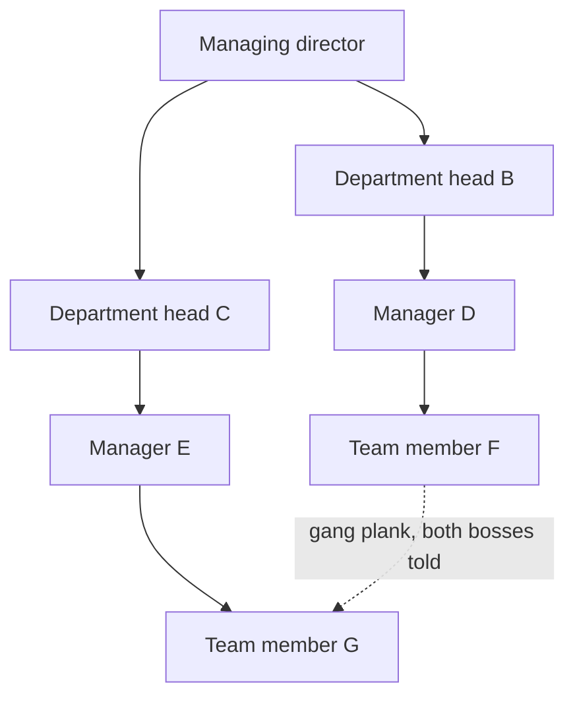

On 28 December 1978, a United Airlines DC-8 circled Portland for close to an hour with a landing gear problem and 189 people on board. The first officer and the flight engineer both watched the fuel quantity drop. Both said something. Neither said it in a way the captain acted on, and the aircraft ran out of fuel six miles short of the runway. Ten people died.

The National Transportation Safety Board, the federal agency that investigates transport accidents in the United States, put the cause on the captain, who failed to monitor the fuel state and to respond to his crew's advisories. Then it wrote the recommendation that changed the industry, asking inspectors at the Federal Aviation Administration to press operators on "the merits of participative management for captains and assertiveness training for other cockpit crewmembers". United ran the first Cockpit Resource Management course in 1981, and the rest of the industry followed. Captains kept their final authority. What changed was what the chain of command was allowed to silence.

## What a chain of command is

A chain of command is the unbroken line of authority connecting every person in an organization to the person above them, up to the top. It sets who reports to whom, who may give an instruction to whom, and the path a request follows to reach someone with the authority to approve it.

The US Department of Defense keeps the shortest version, calling it the succession of commanding officers from a superior to a subordinate through which command is exercised. Henri Fayol, a French mining engineer who ran the Commentry-Fourchambault mining group for thirty years, wrote the civilian version in *Administration industrielle et générale* in 1916, and split it in two. The scalar chain is "the chain of superiors ranging from the ultimate authority to the lowest". Unity of command says each person takes orders from one superior only, and Fayol treated every breach of that rule as a standing source of conflict in the companies he had run. The [five classic structures](/en/blog/organizational-structures) all inherit that argument.

One line settles three separate things. The reporting line names who evaluates your work. The decision path sets how far a request travels before someone can say yes. The span of control counts how many people answer to one supervisor, and that number fixes how many levels the chain needs to cover a given headcount.

Fayol wrote the bypass himself. Two people at the same level in different departments talk directly when speed matters, then each tells their own boss what they settled. He called it the gang plank and considered the chain unusable without it, because a request that climbs to the shared boss and comes back down costs days for a question two people could close in a minute. Most companies inherited the chain and left the plank behind.

## Why a chain slows decisions down

Luis Garicano, an economist then at the University of Chicago, gave the chain its cleanest justification in the *Journal of Political Economy* in 2000. In his model, workers learn to handle the problems they meet most often, and pass the rarer ones to specialists who learn those. A hierarchy is the cheapest way to match a problem with someone who knows the answer, and each layer earns its keep by absorbing the exceptions the layer below cannot.

Garicano's model also shows the breaking point. The chain pays off while exceptions stay rare. In knowledge work, every brief is a little new, and the exception rate climbs until the people at the top spend their week arbitrating cases they learn about from a summary. The queue is the symptom everyone recognises.

Amazon answered that problem with a ratio. In a memo dated 16 September 2024, its chief executive Andy Jassy asked every organization to raise its ratio of individual contributors to managers by at least 15% by the end of Q1 2025, so that fewer managers would mean fewer layers. He described the symptoms he wanted gone as "pre-meetings for the pre-meetings for the decision meetings", along with "owners of initiatives feeling less like they should make recommendations because the decision will be made elsewhere". The company also opened a bureaucracy mailbox, which took 1,500 messages and led to changes in 455 processes.

The queue is one cost. The second one killed Flight 173. A chain moves instructions down well and information up badly, since each level decides what is worth passing on. Five structural versions of that problem are laid out in [why hierarchy is a poor operating system for knowledge work](/en/blog/hierarchy-problems).

Removing levels on its own fixes neither. The economists Raghuram Rajan and Julie Wulf tracked more than 300 large US firms between 1986 and 1999 and found that decisions moved up toward the CEO as the layers came out, which is the trap covered in [flat versus hierarchical](/en/blog/flat-vs-hierarchical). A chain that loses a link still ends at the same desk.

## What replaces the chain in a flat organization

A chain of command answers three questions without anybody writing them down: who decides this, how far their authority runs, and what happens when two people disagree. Take the chain out and those three answers have to exist somewhere else, in writing.

A role with a scope answers the first question. A role carries a purpose, a list of accountabilities, and a domain it decides on alone, meaning an asset or a process nobody else touches without asking. "Head of marketing" says nothing about who signs a 4,000 euro spend. "Owns the paid acquisition budget up to 5,000 euros a month" settles it, and the difference is developed in [roles versus job descriptions](/en/blog/roles-vs-job-descriptions).

A decision rule covers whatever exceeds a role. [Consent decision making](/en/blog/consent-decision) asks whether anyone sees a reasoned objection, rather than whether everyone agrees, which lets a group of eight close a governance question in ten minutes. An objection has to name a harm to the purpose, so seniority stops being an argument.

A [governance meeting](/en/blog/governance-meeting) is where the structure gets amended. It takes the tensions people actually felt and turns them into changes to roles, which keeps the written structure close to the real one.

| Question | Chain of command | Written roles |
|---|---|---|
| Who makes a routine call | The person's supervisor, by default | The role holder, inside their domain |
| Where an exception goes | Up one level, then up again | To the decision rule, in a governance meeting |
| Two people disagree | The nearest shared boss arbitrates | Whoever holds the domain decides, others may object |
| How the structure changes | A reorg, decided at the top | An amendment, at the next governance meeting |
| Where it is written | The org chart, plus habit | The role, its domain and its accountabilities |
| What a newcomer reads | Who their manager is | What they decide alone, from day one |

Companies have run this way for decades. W. L. Gore has worked through a network of sponsors rather than a chain of command since 1958. Morning Star replaced job descriptions with written agreements between colleagues. Buurtzorg supports its nursing teams with regional coaches who hold no decision power. Bayer is doing the same across 100,000 people, bringing management layers down from thirteen to six or seven since July 2023 and running work in 90-day cycles, and the [transition guide](/en/blog/horizontal-transition) covers what that costs.

<OrgChartView demo="demo" height="440px" showAllNodes={false} />

## When a chain still makes sense

Tom Burns, a sociologist at the University of Edinburgh, and the psychologist George Stalker settled the general case in 1961, after years spent inside Scottish electronics firms. The mechanistic system, with its chain of command and its written procedures, fits stable environments and routine work, while the organic system fits markets that keep moving. [Horizontal versus vertical](/en/blog/horizontal-vs-vertical) works through the three situations that favour the vertical answer.

Three cases keep a chain in place.

At the moment of action, a cockpit, an operating theatre and a fire ground need one person who calls it in ten seconds. Those same organizations write roles and domains for the rest of the work, which takes up most of the hours.

Where the law names a person, a chain is the accountability record. Safety, payroll, signature authority and employer duties sit on someone in particular, and that stays true whatever the org chart looks like.

Where expertise is very unevenly spread, a newcomer benefits from a line that routes their questions to whoever knows. That case fades as the team learns, which makes it a reason to keep a chain for a while rather than forever.

Even armies decentralised. The US Army's ADP 6-0, updated in July 2019, builds command and control on mission command, which hands decisions down and accepts decentralised execution. Its seven principles are competence, mutual trust, shared understanding, commander's intent, mission orders, disciplined initiative and risk acceptance. A commander states the intent and the constraints, then subordinates decide how. The chain still exists, and it now carries intent rather than instructions.

## How to flatten your own chain

1. **Pull last quarter's approvals from the trail.** Go through the tickets, the threads and the emails, and list every decision that climbed more than one level. Twenty of them is enough.
2. **Name who had the information.** For each one, write down which person could have decided on the spot with what they already knew. That person's scope is the first role to write.
3. **Write the role with a limit in it.** Purpose, two or three accountabilities, and one domain it decides alone, with the number attached: an amount, a perimeter, a list of clients.
4. **Name the rule for what exceeds the role.** A consent round in a governance meeting handles the rest, and a decision that reaches nobody's domain is a signal that a role is missing.
5. **Write the bypass down.** Fayol's plank works better as a rule than as a favour. Say who may go direct, on which subjects, and who gets told afterwards.
6. **Measure decision lag on the same ten decisions.** Count the days between the question being asked and the answer being given, before and after. Compare the two figures to see whether the chain moved or only changed shape.
7. **Amend on a cycle.** A role written in one meeting is a hypothesis. Hold it for a quarter, look at what moved, then correct it.

{/* TODO ANECDOTE: a real decision-lag figure from a Rolebase customer would land here (days before / days after writing the roles). Nothing in the repo carries one. */}

The order matters. Teams that remove the layer first and write the roles afterwards spend six months with nobody deciding anything, and the old chain quietly comes back because someone has to.

## Frequently asked questions

<FaqList>

<FaqItem question="What is the chain of command?">

The chain of command is the unbroken line of authority that connects every person in an organization to the person above them, up to the top. It sets who reports to whom, who may give an instruction to whom, and the path a request follows to reach someone with the authority to approve it. The US Department of Defense defines it as the succession of commanding officers from a superior to a subordinate through which command is exercised.

</FaqItem>

<FaqItem question="What is an example of a chain of command?">

A support agent gets a refund request for 800 euros, above their 200 euro limit. They ask their team leader, who asks the support manager, who asks the finance director, who approves. Four people and three days for one decision that one of them could have made alone. The military version runs the same way, from a squad leader up through the platoon and company commanders.

</FaqItem>

<FaqItem question="What is the difference between chain of command and span of control?">

The chain of command runs vertically and says who answers to whom, from top to bottom. Span of control is horizontal and counts how many people report to one supervisor. Arithmetic links the two. A wide span produces a short chain with few levels, a narrow span produces a tall one. A company of 1,000 people needs about four levels at a span of six, and about three at a span of ten.

</FaqItem>

<FaqItem question="Can you skip the chain of command?">

Henri Fayol, the French mining engineer who codified the chain in 1916, allowed for it with his gang plank, letting two people at the same level in different departments settle a question directly, then tell their own bosses. Going over your manager's head, called a skip level, is a different move and most companies keep it for cases where the manager is part of the problem. A team that has to bypass its chain often has a chain drawn in the wrong place.

</FaqItem>

<FaqItem question="What are the disadvantages of a chain of command?">

Decisions queue at the level that has the authority, information gets filtered on the way up because each level chooses what to pass on, and the people closest to a problem wait for permission from someone who learned about it in a summary. Junior members also hold back concerns in front of a superior, a silence that cost ten lives on United Airlines Flight 173 in 1978 and that crew resource management was built to correct.

</FaqItem>

<FaqItem question="Do flat organizations have a chain of command?">

Most of them keep one for legal and safety matters, and replace it everywhere else with written roles and an explicit decision rule. Bayer went from thirteen management levels to six or seven rather than to zero. A flat organization with nothing written in place of the chain gets an informal hierarchy instead, which is harder to argue with because it appears nowhere.

</FaqItem>

</FaqList>

## Where to start

Take the last decision that annoyed everyone by taking three weeks. Write down who had the information on day one, what they would have needed the authority to do, and what limit would have made that authority safe. That is one role, and it took ten minutes.

[Create a free account on Rolebase](/signup) to map those roles into an org chart your whole team can open, with the decisions and meetings attached to them. The free plan covers five active members, with no card required. The [features page](/en/features) shows what the platform does.
