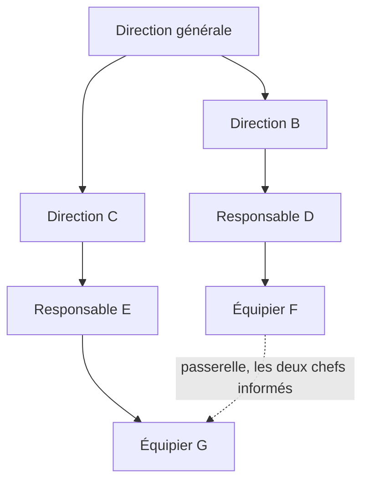

Le 28 décembre 1978, un DC-8 d’United Airlines tourne près d’une heure au-dessus de Portland avec un train d’atterrissage récalcitrant et 189 personnes à bord. Le copilote et le mécanicien navigant voient tous les deux la quantité de carburant baisser. Tous les deux le disent. Aucun ne le dit d’une façon qui fasse réagir le commandant de bord, et l’avion tombe en panne sèche à six milles du seuil de piste. Dix personnes meurent.

Le NTSB, l’agence fédérale américaine qui enquête sur les accidents de transport, attribue la cause au commandant, qui n’a ni surveillé son carburant ni tenu compte des alertes de son équipage. Puis il rédige la recommandation qui a changé le métier, en demandant aux inspecteurs de la FAA, le régulateur aérien américain, d’insister auprès des compagnies sur « les mérites d’un management participatif pour les commandants de bord et d’une formation à l’affirmation de soi pour les autres membres d’équipage ». United lance le premier cours de Cockpit Resource Management en 1981, et le reste du secteur suit. Les commandants ont gardé leur autorité finale. La chaîne de commandement, elle, a perdu le droit de faire taire un équipage.

## Définition de la chaîne de commandement

Une chaîne de commandement est la ligne d’autorité ininterrompue qui relie chaque personne d’une organisation à celle qui se trouve au-dessus d’elle, jusqu’au sommet. Elle fixe qui rend des comptes à qui, qui peut donner une instruction à qui, et le trajet qu’une demande parcourt pour atteindre quelqu’un qui a le pouvoir de l’approuver.

Le département de la Défense américain en donne la version la plus courte, la succession de commandants, du supérieur au subordonné, par laquelle le commandement s’exerce. Henri Fayol, ingénieur des mines qui a dirigé pendant trente ans le groupe minier Commentry-Fourchambault, en écrit la version civile dans *Administration industrielle et générale*, paru en 1916, et la coupe en deux. La hiérarchie est « la série des chefs qui va de l’autorité supérieure aux agents inférieurs ». L’unité de commandement veut qu’un agent reçoive des ordres d’un seul chef, et Fayol voit dans toute entorse à cette règle une source permanente de conflit dans les entreprises qu’il a dirigées. Les [cinq structures classiques](/fr/blog/organizational-structures) héritent toutes de ce débat.

Une même ligne règle trois choses distinctes. Le lien de rattachement nomme qui évalue votre travail. Le circuit de décision fixe combien de niveaux une demande traverse avant que quelqu’un puisse dire oui. L’éventail de subordination compte combien de personnes dépendent d’un même responsable, et ce chiffre commande le nombre de niveaux nécessaires pour couvrir un effectif donné.

Fayol a écrit le contournement lui-même. Deux personnes de même niveau, dans deux services différents, se parlent directement quand la vitesse compte, puis chacune raconte à son chef ce qu’elles ont réglé. Il appelle ça la passerelle et juge la hiérarchie inutilisable sans elle, parce qu’une demande qui monte jusqu’au chef commun puis redescend coûte des jours pour une question que deux personnes ferment en une minute. Beaucoup d’entreprises ont hérité de la chaîne et laissé la passerelle derrière elles.

## Pourquoi une chaîne ralentit les décisions

Luis Garicano, économiste alors à l’université de Chicago, a donné à la chaîne sa justification la plus nette dans le *Journal of Political Economy* en 2000. Dans son modèle, les opérateurs apprennent à traiter les problèmes qu’ils rencontrent le plus souvent et transmettent les plus rares à des spécialistes qui apprennent ceux-là. Une hiérarchie est la façon la moins chère de mettre un problème en face de quelqu’un qui connaît la réponse, et chaque niveau justifie son existence en absorbant les exceptions que le niveau du dessous ne sait pas traiter.

Le modèle de Garicano montre aussi le point de rupture. La chaîne est rentable tant que les exceptions restent rares. Dans le travail intellectuel, chaque dossier est un peu nouveau, et le taux d’exception grimpe jusqu’à ce que les gens du haut passent leur semaine à arbitrer des cas qu’ils découvrent dans une note de synthèse. La file d’attente est le symptôme que tout le monde reconnaît.

Amazon a répondu à ce problème par un ratio. Dans une note datée du 16 septembre 2024, son PDG Andy Jassy demande à chaque organisation d’augmenter d’au moins 15 % son ratio de contributeurs individuels par manager avant la fin du premier trimestre 2025, pour que moins de managers signifie moins de niveaux. Il décrit les symptômes qu’il veut voir disparaître comme « les préréunions des préréunions des réunions de décision », et « des porteurs d’initiatives qui se sentent moins légitimes à faire des recommandations parce que la décision se prendra ailleurs ». L’entreprise a aussi ouvert une boîte mail dédiée à la bureaucratie, qui a reçu 1 500 messages et abouti à la modification de 455 processus.

La file d’attente est un premier coût. Le second a tué le vol 173. Une chaîne fait bien descendre les instructions et mal remonter l’information, parce que chaque niveau choisit ce qui mérite d’être transmis. Cinq versions structurelles de ce problème sont détaillées dans [les cinq problèmes de la hiérarchie](/fr/blog/hierarchy-problems).

Enlever des niveaux ne règle ni l’un ni l’autre. Les économistes Raghuram Rajan et Julie Wulf ont suivi plus de 300 grandes entreprises américaines entre 1986 et 1999 et constaté que les décisions remontaient vers le PDG à mesure que les couches disparaissaient, le piège décrit dans [structure plate ou hiérarchique](/fr/blog/flat-vs-hierarchical). Une chaîne amputée d’un maillon aboutit toujours au même bureau.

## Des rôles écrits à la place de la chaîne

Une chaîne de commandement répond à trois questions sans que personne les écrive : qui décide de ce sujet, jusqu’où va son autorité, et que faire quand deux personnes ne sont pas d’accord. Retirez la chaîne et ces trois réponses doivent exister ailleurs, par écrit.

Un rôle avec un périmètre répond à la première question. Un rôle porte une raison d’être, des redevabilités, et un [domaine](/fr/glossary/domaine) sur lequel il décide seul, autrement dit une ressource ou un processus que personne d’autre ne touche sans demander. « Responsable marketing » ne dit rien de qui engage 4 000 euros. « Décide du budget d’acquisition payante jusqu’à 5 000 euros par mois » tranche la question, et la différence est développée dans [rôles et fiches de poste](/fr/blog/roles-vs-job-descriptions).

Une règle de décision couvre ce qui dépasse un rôle. La [décision par consentement](/fr/blog/consent-decision) demande si quelqu’un voit une objection argumentée, plutôt que si tout le monde est d’accord, ce qui permet à un groupe de huit de fermer une question de gouvernance en dix minutes. Une objection doit nommer un risque pour la raison d’être, donc l’ancienneté cesse d’être un argument.

Une [réunion de gouvernance](/fr/blog/governance-meeting) est l’endroit où la structure se modifie. Elle prend les tensions que les gens ont réellement vécues et les transforme en changements de rôles, ce qui garde la structure écrite proche de la structure réelle.

| Question | Chaîne de commandement | Rôles écrits |
|---|---|---|
| Qui tranche un cas courant | Le supérieur, par défaut | Le titulaire du rôle, dans son domaine |
| Où part une exception | Un niveau plus haut, puis encore un | Vers la règle de décision, en réunion de gouvernance |
| Deux personnes en désaccord | Le premier chef commun arbitre | Le titulaire du domaine décide, les autres peuvent objecter |
| Comment la structure change | Une réorganisation décidée en haut | Un amendement, à la prochaine réunion de gouvernance |
| Où la réponse est écrite | L’organigramme, plus l’habitude | Le rôle, son domaine et ses redevabilités |
| Le repère d’un nouvel arrivant | Qui est son manager | Son périmètre de décision, dès le premier jour |

Des entreprises fonctionnent ainsi depuis des décennies. W. L. Gore s’appuie sur un réseau de parrains plutôt que sur une chaîne de commandement depuis 1958. Morning Star a remplacé les fiches de poste par des accords écrits entre collègues. Buurtzorg soutient ses équipes d’infirmières avec des coachs régionaux qui n’ont aucun pouvoir de décision. Bayer fait la même chose à l’échelle de 100 000 personnes, en ramenant ses niveaux de management de treize à six ou sept depuis juillet 2023 et en organisant le travail par cycles de 90 jours, et le [guide de transition](/fr/blog/horizontal-transition) raconte ce que ça coûte.

<OrgChartView demo="demo" height="440px" showAllNodes={false} />

## Quand une chaîne reste le bon choix

Tom Burns, sociologue à l’université d’Édimbourg, et le psychologue George Stalker ont réglé le cas général en 1961, après des années passées dans des entreprises d’électronique écossaises. Le système mécaniste, avec sa chaîne de commandement et ses procédures écrites, convient aux environnements stables et au travail routinier, quand le système organique convient aux marchés qui bougent. [Management horizontal ou vertical](/fr/blog/horizontal-vs-vertical) détaille les trois situations qui favorisent la réponse verticale.

Trois cas maintiennent une chaîne en place.

Au moment de l’action, un cockpit, un bloc opératoire et une intervention de secours ont besoin d’une personne qui tranche en dix secondes. Ces mêmes organisations écrivent des rôles et des domaines pour le reste du travail, qui occupe la majorité des heures.

Là où la loi désigne une personne, la chaîne sert de trace de responsabilité. La sécurité, la paie, la délégation de signature et les obligations d’employeur reposent sur quelqu’un en particulier, quelle que soit la forme de l’organigramme.

Là où l’expertise est très inégalement répartie, un nouvel arrivant gagne à disposer d’une ligne qui envoie ses questions vers celui qui sait. Ce cas s’estompe à mesure que l’équipe apprend, ce qui en fait une raison de garder une chaîne un moment plutôt que toujours.

Même les armées ont décentralisé. L’ADP 6-0 de l’armée américaine, révisé en juillet 2019, fonde le commandement sur le *mission command*, qui confie les décisions aux subordonnés et accepte une exécution décentralisée. Ses sept principes sont la compétence, la confiance mutuelle, la compréhension partagée, l’intention du commandant, les ordres par mission, l’initiative disciplinée et l’acceptation du risque. Un commandant énonce son intention et ses contraintes, puis les subordonnés décident du comment. La chaîne existe toujours, et elle transporte une intention plutôt que des instructions.

## Comment aplatir votre chaîne, étape par étape

1. **Sortez les validations du trimestre écoulé.** Reprenez les tickets, les fils de discussion et les mails, et listez toute décision qui a monté plus d’un niveau. Vingt suffisent.
2. **Nommez qui avait l’information.** Pour chacune, écrivez quelle personne aurait pu décider sur-le-champ avec ce qu’elle savait déjà. Le périmètre de cette personne est le premier rôle à écrire.
3. **Écrivez le rôle avec une limite dedans.** Une raison d’être, deux ou trois redevabilités, et un domaine sur lequel il décide seul, avec le chiffre qui va avec : un montant, un périmètre, une liste de clients.
4. **Nommez la règle pour ce qui dépasse le rôle.** Un tour de consentement en réunion de gouvernance traite le reste, et une décision qui ne relève du domaine de personne signale un rôle manquant.
5. **Écrivez le contournement.** La passerelle de Fayol marche mieux comme règle que comme faveur. Dites qui peut aller en direct, sur quels sujets, et qui est informé après coup.
6. **Mesurez le délai de décision sur les dix mêmes cas.** Comptez les jours entre la question posée et la réponse rendue, avant et après. Comparez les deux chiffres pour voir si la chaîne a bougé ou seulement changé de forme.
7. **Amendez à intervalle régulier.** Un rôle écrit en une réunion est une hypothèse. Gardez-le un trimestre, regardez ce qui a bougé, puis corrigez.

{/* TODO ANECDOTE: un vrai délai de décision mesuré chez un client Rolebase irait ici (jours avant / jours après l’écriture des rôles). Rien dans le dépôt n’en porte. */}

L’ordre compte. Les équipes qui suppriment la couche d’abord et écrivent les rôles ensuite passent six mois sans que personne décide quoi que ce soit, et l’ancienne chaîne revient discrètement parce qu’il faut bien que quelqu’un tranche.

## Questions fréquentes

<FaqList>

<FaqItem question="Qu’est-ce que la chaîne de commandement ?">

La chaîne de commandement est la ligne d’autorité ininterrompue qui relie chaque personne d’une organisation à celle qui se trouve au-dessus d’elle, jusqu’au sommet. Elle fixe qui rend des comptes à qui, qui peut donner une instruction à qui, et le trajet qu’une demande parcourt pour atteindre quelqu’un qui a le pouvoir de l’approuver. Le département de la Défense américain la définit comme la succession de commandants, du supérieur au subordonné, par laquelle le commandement s’exerce.

</FaqItem>

<FaqItem question="Quel est un exemple de chaîne de commandement ?">

Un conseiller support reçoit une demande de remboursement de 800 euros, au-dessus de sa limite de 200 euros. Il demande à son chef d’équipe, qui demande au responsable du support, qui demande au directeur financier, qui approuve. Quatre personnes et trois jours pour une décision que l’une d’elles aurait pu prendre seule. La version militaire fonctionne pareil, du chef de groupe au chef de section puis au commandant d’unité.

</FaqItem>

<FaqItem question="Quelle différence entre chaîne de commandement et éventail de subordination ?">

La chaîne de commandement est verticale et dit qui dépend de qui, du haut vers le bas. L’éventail de subordination est horizontal et compte combien de personnes dépendent d’un même responsable. L’arithmétique lie les deux. Un éventail large produit une chaîne courte, un éventail étroit une chaîne haute. Une entreprise de 1 000 personnes tient en quatre niveaux avec un éventail de six, et en trois avec un éventail de dix.

</FaqItem>

<FaqItem question="Peut-on court-circuiter la chaîne de commandement ?">

Henri Fayol, l’ingénieur des mines qui a codifié la chaîne en 1916, l’a prévu avec sa passerelle, qui laisse deux personnes de même niveau dans des services différents régler une question directement, puis en informer leurs chefs. Passer par-dessus son manager relève d’un autre geste, que la plupart des entreprises réservent aux cas où le manager fait partie du problème. Une équipe qui contourne souvent sa chaîne a une chaîne dessinée au mauvais endroit.

</FaqItem>

<FaqItem question="Quels sont les inconvénients d’une chaîne de commandement ?">

Les décisions s’accumulent au niveau qui détient l’autorité, l’information se filtre en montant puisque chaque niveau choisit ce qu’il transmet, et les gens les plus proches d’un problème attendent l’accord de quelqu’un qui l’a découvert dans une synthèse. Les plus juniors gardent aussi leurs alertes pour eux devant un supérieur, un silence qui a coûté dix vies sur le vol United Airlines 173 en 1978 et que le Cockpit Resource Management a été construit pour corriger.

</FaqItem>

<FaqItem question="Une organisation plate a-t-elle une chaîne de commandement ?">

La plupart en gardent une pour les sujets légaux et la sécurité, et la remplacent partout ailleurs par des rôles écrits et une règle de décision explicite. Bayer est passé de treize niveaux de management à six ou sept plutôt qu’à zéro. Une organisation plate qui n’écrit rien à la place de la chaîne se retrouve avec une hiérarchie informelle, plus difficile à contester puisqu’elle ne figure nulle part.

</FaqItem>

</FaqList>

## Par où commencer

Prenez la dernière décision qui a agacé tout le monde en prenant trois semaines. Écrivez qui détenait l’information dès le premier jour, ce qu’il aurait fallu lui donner comme autorité, et quelle limite aurait rendu cette autorité sans danger. Voilà un rôle, et il a demandé dix minutes.

[Créez un compte gratuit sur Rolebase](/signup) pour cartographier ces rôles dans un organigramme que toute l’équipe peut ouvrir, avec les décisions et les réunions rattachées à eux. Le plan gratuit couvre cinq membres actifs, sans carte bancaire. La [page fonctionnalités](/fr/features) montre ce que fait la plateforme.
