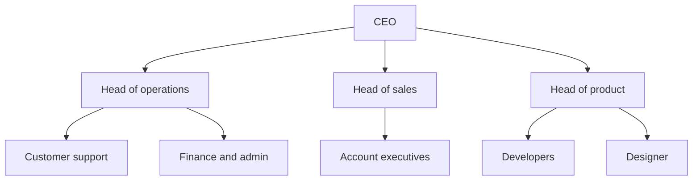
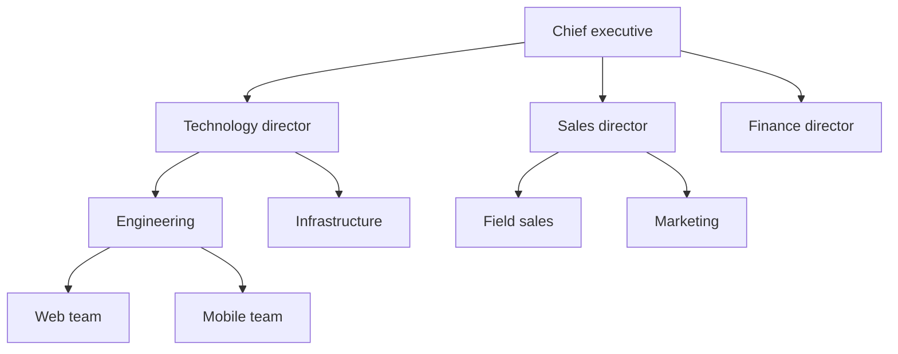

An organizational tree, also called a hierarchy chart or hierarchical org chart, is a diagram that places each position or role under the one it reports to, with leadership at the top and the teams at the bottom. It is the org chart most people picture. It shows clearly who reports to whom, but leaves out who decides what and gives a person who works in two teams a single box. To keep it accurate after the next reorganization, build it from roles before names, in a tool where the chart is built from those roles. Below you will find three examples to copy and the steps to build one.

Here is a simple hierarchy chart for a company of about fifteen people.

## What an organizational tree is

A hierarchy chart shows the reporting lines of an organization as a tree. Each box is a position or a role, each line connects a box to the one it reports to, and every box except the top one has exactly one parent. That single-parent rule separates the tree from a [matrix org chart](/en/blog/matrix-organizational-structure), where one person reports along two lines.

The tree image is older than the word org chart. In 1855, Daniel McCallum, general superintendent of the New York and Erie Railroad, had the civil engineer George Holt Henshaw draw the structure of a company that employed more than 5,000 people. Henshaw drew an actual tree, with the president and the board as the roots at the bottom and the departments and crews as the branches. McCallum wanted each employee's duties, and the person they reported to, written down so that he could receive a detailed report on operations every day. Later charts turned the tree upside down and put the roots at the top, which is the layout most charts use today.

The same drawing goes by several names: hierarchical org chart, company hierarchy chart or hierarchy diagram.

## What a hierarchy chart shows well

The tree does three things well, which is why nearly every company has one.

- It shows everyone their reporting line, which they can follow upward to find their manager, their manager's manager, and the person who arbitrates between two teams.
- It shows, row by row, how many levels a decision crosses before someone can approve it. A company with six levels between a support agent and the CEO works differently from one with three.
- It shows the span of control, the number of people who report to each manager. The polling firm Gallup counted 12.1 direct reports per manager on average in 2025, up from 10.9 a year earlier. On a tree, an overloaded manager is the box with the most lines under it.

The tree is also the quickest map of the company for a newcomer. They can check it from their first week, before they know anyone, to find which department to ask about each question.

## The limits of the tree

The tree is easy to read because each box holds only a title and one line up to its manager. That is also where its three limits come from.

A person who works in two teams gets one box. A developer who spends half the week on the data platform and half on the mobile app appears under one manager, and the other team looks one person short. Project teams that pull people from several departments have the same problem, since the tree has no line to draw for them.

Each box carries a title, which says little about the work. "Head of marketing" does not tell you who approves a 4,000 euro campaign, who owns the brand guidelines or who decides on the pricing page. Those questions get answered by habit, which is how a company with a clear chart still loses weeks finding out who decides. [Roles with written accountabilities](/en/blog/roles-vs-job-descriptions) answer them where a title cannot.

The lines on the tree also show authority, so people tend to treat them as the path every question must follow. A question between two teams that climbs to their common manager and back down takes days. That delay is the main cost of a [chain of command](/en/blog/chain-of-command) in knowledge work.

A hierarchy chart is most useful as one view of the organization among others, next to a written description of the work behind each box.

## Hierarchy chart examples

### A small company

A company of fifteen to thirty people usually has two or three levels. The founder sits at the top, three or four heads of function report to them, and teams sit under each head. Draw one box per role rather than one per person when several people do the same job: "Account executives (4)" reads better than four identical boxes.

### A company organized by departments

Past a hundred people, a department layer appears between leadership and the teams, and support functions like finance often report straight to the top.

Most companies grow into this [hierarchical structure](/en/blog/organizational-structures). Its chart stays readable as long as each department fits on one screen.

### An organization built from roles

In a role-based organization, the tree keeps its shape, but each box is a role with its purpose, its accountabilities and the people who fill it.

The example below is interactive. Click a role to open it, drag to move around, and zoom with Ctrl or ⌘ and the scroll wheel.

<OrgChartView demo="classic" view="Tree" height="560px" />

Each department shows its director in a card stacked under the department card, like the Chief Technology Officer under Technology or the Sales Director under Commerce. The director is a role of its own, which keeps "who leads this department" separate from "who works in it".

## How to make a hierarchy chart, step by step

1. List the roles before the people. Write down every distinct job the organization needs done, including the ones nobody officially holds.
2. Group them into teams. Put roles that work toward the same result in the same team, then group teams that share a result into departments.
3. Give each team one parent. When a team seems to report to two teams, pick the one that sets its priorities and mention the other link in the team's description.
4. Name who leads each team. Add a lead role to every team, separate from its members, so the chart shows who represents the team to the level above.
5. Put people in the roles. Add names and photos only now. A person can appear in several roles. Keep vacant roles on the chart, whether nobody holds them yet or their holder has left the company, so everyone sees which work is left uncovered.
6. Decide how much to show. A company of two hundred people does not fit on one screen. Show the whole tree to leadership, and give each team a view of its own branch with the parents above it.
7. Share it where people already look. Publish the chart on the intranet or the internal wiki, as a link or embedded in a page, rather than as a PDF attached to an email.

## Word, Excel or a dedicated tool

You can draw a hierarchy chart in Word, PowerPoint or Excel with SmartArt. Building [an org chart in Word](/en/blog/org-chart-word) takes a few clicks through the SmartArt gallery, or less from a template you download. That covers a company of twenty people who rarely change roles.

The trouble starts with the first reorganization. The file lives on one person's drive, the copy on the intranet is three versions old, and nobody knows which one is right. The chart describes the company on the day it was drawn.

| | Word, PowerPoint, Excel | Diagram tool | Role-based org chart tool |
|---|---|---|---|
| Who can update it | Whoever has the file | Anyone with edit access to the drawing | The people with rights on each role |
| A person in two teams | Duplicate boxes by hand | Duplicate boxes by hand | One person, several roles |
| What a box contains | A title | A title and free text | Purpose, accountabilities, members |
| After a reorganization | Redraw everything | Redraw the affected part | Move the role, the chart updates |
| Other views of the same data | None | None | Circles, tree, photo directory |

A diagram tool is easier to draw with than Word. It still stores a drawing, which falls behind the organization each time someone forgets to redraw it. You can compare [dedicated org chart software](/en/blog/best-org-chart-software), or host the chart yourself with [open source org chart tools](/en/blog/open-source-org-chart-tools).

In Rolebase, the [hierarchical tree](/en/docs/org-chart) is one of three views of the same roles, next to nested circles and a photo directory. You can switch views without redrawing anything, fold the tree around one role when the organization is large, and move a role or a member by dragging it with ⌘ or Ctrl held. Any role and everything under it exports as a PNG image. You can also share a public page of the chart, with or without members, as a link or embedded in your own site.

## Keeping the organizational tree accurate

A hierarchy chart goes out of date in small steps: a hire nobody added, two teams merged after a hallway conversation, a role one person quietly took over. After six months the chart no longer matches the company, so people stop opening it.

To keep it accurate, record each change to the organization, when it happens, in the tool where you keep the chart. In Rolebase, the roles are the only source of the tree, so nothing else needs updating. When your organization decides to split a role in two or to move a team under another department, whoever records the decision edits the role or submits the change as a proposal. The tree updates as soon as the role changes. The history panel keeps each change and lets you undo it.

{/* TODO ANECDOTE: a Rolebase customer who moved from a PowerPoint org chart to the tree view, with how often their chart used to go stale. Nothing in the repo carries one. */}

A quarterly review still helps. Open the tree with each team lead, look for vacant roles and for people holding more roles than they can carry, and fix what nobody recorded along the way. Hold that review in a [governance meeting](/en/blog/governance-meeting) so it has a fixed slot.

## Frequently asked questions

<FaqList>

<FaqItem question="What is an organizational tree?">

An organizational tree is a hierarchy chart: a diagram that places each position or role under the one it reports to, from leadership at the top to the teams at the bottom. Each box has a single parent, which makes reporting lines easy to follow. The New York and Erie Railroad chart of 1855, generally recognized as the first formal organizational chart, took the form of an actual tree, with the leadership as its roots.

</FaqItem>

<FaqItem question="What is the 5 level hierarchy for a company?">

A common convention splits a company into five levels: the board and executive leadership, senior management such as vice presidents and directors, middle management, first-line managers and supervisors, and individual contributors. It is a convention rather than a standard. Small companies often have three levels, and large groups can have ten or more, so count the levels on your own chart instead of forcing it into five.

</FaqItem>

<FaqItem question="What are the types of organizational charts?">

The most common types are the hierarchical chart, the functional chart that groups positions by discipline, the divisional chart that groups them by product or market, the matrix chart with two reporting lines, the flat or horizontal chart with few levels, and the circle chart that nests teams inside one another. A photo directory is sometimes counted as a seventh. Pick the [type of org chart](/en/blog/org-chart-types) from the question your teams ask most often, such as "who reports to whom?" or "who is who?".

</FaqItem>

<FaqItem question="What is the difference between a hierarchical and a functional org chart?">

A hierarchical chart is organized by reporting line, each box sitting under its manager. A functional chart is organized by discipline, with finance, sales, production and engineering each forming a group. The two often overlap, since most functional charts are drawn as a hierarchy with one head per function. They differ in what the chart groups first, authority or expertise.

</FaqItem>

<FaqItem question="Is there an organizational chart template in Word?">

Yes. Open the Insert tab, choose SmartArt, then the Hierarchy category, and pick the Organization Chart layout. Type the names in the text pane and use Add Shape to create subordinates or assistants. Drawing [the whole chart in Word](/en/blog/org-chart-word) takes about ten minutes, less if you start from a downloadable template. PowerPoint and Excel offer the same SmartArt layouts. The chart stays a drawing you edit by hand each time the organization changes.

</FaqItem>

<FaqItem question="How do I make a hierarchy chart for free?">

SmartArt in Word or PowerPoint works for a small, stable team. For a chart the whole team can open and keep up to date, use an org chart tool with a free plan. Rolebase is free with every feature for up to five active members, with no card required, and displays the same roles as a hierarchical tree, nested circles or a photo directory.

</FaqItem>

</FaqList>

## Start from the roles

Take the chart you already have, even a slide from last year, and list the roles behind each box. Mark the people who actually hold two roles, and the boxes whose title says nothing about what the role decides. That list is already your organizational tree. The drawing can wait.

[Create a free Rolebase account](/signup) to turn those roles into a hierarchy chart your whole team can open, and switch it to circles when the tree gets too tall. Rolebase also handles [meetings and decisions](/en/features) in the same tool.
