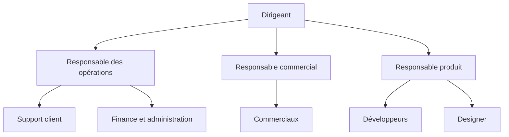
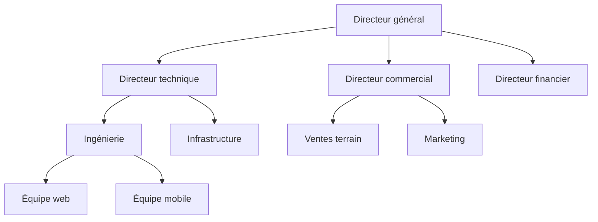

Un organigramme hiérarchique, qu’on appelle aussi organigramme en arbre ou organigramme pyramidal, est un schéma qui place chaque poste ou rôle sous celui dont il dépend, avec la direction en haut et les équipes en bas. Quand on dit « organigramme », la plupart des gens pensent à celui-là. Il montre clairement qui dépend de qui, mais laisse de côté qui décide quoi et ne donne qu’une case à une personne qui travaille dans deux équipes. Pour qu’il reste juste après la prochaine réorganisation, construisez-le à partir des rôles avant les noms, dans un outil où l’organigramme se construit à partir de ces rôles. Vous trouverez plus bas trois exemples à reprendre et les étapes pour en construire un.

Voici un organigramme hiérarchique simple, pour une entreprise d’une quinzaine de personnes.

## Définition de l’organigramme hiérarchique

Un organigramme hiérarchique représente les liens de rattachement d’une organisation sous forme d’arbre. Chaque case est un poste ou un rôle, chaque trait relie une case à celle dont elle dépend, et toutes les cases sauf celle du sommet ont exactement un parent. Cette règle du parent unique le distingue de l’[organigramme matriciel](/fr/blog/matrix-organizational-structure), où une même personne dépend de deux lignes.

L’image de l’arbre est plus ancienne que le mot organigramme. En 1855, Daniel McCallum, directeur général de l’exploitation du New York and Erie Railroad, fait dessiner par l’ingénieur George Holt Henshaw la structure d’une compagnie qui emploie plus de 5 000 personnes. Henshaw dessine un arbre, un vrai, avec le président et le conseil d’administration comme racines en bas, et les services et les équipes comme branches. McCallum voulait que les attributions de chaque employé et le nom de son responsable soient mis par écrit, pour recevoir chaque jour un compte rendu détaillé de l’exploitation. Les organigrammes suivants ont retourné l’arbre et mis les racines en haut, comme la plupart des organigrammes d’aujourd’hui.

Le même dessin porte plusieurs noms : organigramme hiérarchique, arbre hiérarchique, schéma hiérarchique ou organigramme pyramidal.

## Les points forts de l’organigramme hiérarchique

L’arbre fait bien trois choses, ce qui explique que presque toutes les entreprises en aient un.

- Il montre à chacun sa ligne de rattachement, qu’il peut remonter pour retrouver son responsable, le responsable de son responsable et la personne qui tranche entre deux équipes.
- Il montre, rangée par rangée, combien de niveaux une décision traverse avant que quelqu’un puisse l’approuver. Une entreprise qui compte six niveaux entre un agent du support et le dirigeant fonctionne autrement qu’une entreprise qui en compte trois.
- Il montre l’éventail de subordination, c’est-à-dire le nombre de personnes qui dépendent de chaque responsable. L’institut de sondage américain Gallup a mesuré en moyenne 12,1 collaborateurs directs par manager en 2025, contre 10,9 un an plus tôt. Sur l’arbre, un responsable débordé est la case qui a le plus de traits en dessous.

L’arbre est aussi la carte la plus rapide de l’entreprise pour un nouvel arrivant. Il peut le consulter dès sa première semaine, alors qu’il ne connaît encore personne, pour savoir à quel service poser chaque question.

## Les limites de l’arbre

L’arbre est facile à lire parce que chaque case ne porte qu’un intitulé et un seul trait vers son responsable. Ses trois limites viennent aussi de là.

Une personne qui travaille dans deux équipes n’a qu’une case. Une développeuse qui passe la moitié de la semaine sur la plateforme de données et l’autre moitié sur l’application mobile apparaît sous un seul responsable, et l’autre équipe semble avoir une personne de moins. Les équipes projet qui réunissent des gens de plusieurs services ont le même problème, puisque l’arbre n’a aucun trait à tracer pour elles.

Chaque case porte un intitulé, qui dit peu de choses du travail. « Responsable marketing » ne dit pas qui valide une campagne à 4 000 euros, qui tient la charte graphique ni qui décide de la page tarifs. Ces questions se règlent par habitude, ce qui explique qu’une entreprise à l’organigramme clair perde quand même des semaines à chercher qui décide. Des [rôles aux redevabilités écrites](/fr/blog/roles-vs-job-descriptions) y répondent, là où un intitulé en est incapable.

Les traits de l’arbre montrent aussi l’autorité, si bien qu’on a tendance à y voir le chemin que chaque question doit suivre. Une question entre deux équipes qui monte jusqu’à leur responsable commun puis redescend prend des jours. Ce délai est le principal coût d’une [chaîne de commandement](/fr/blog/chain-of-command) dans le travail intellectuel.

Un organigramme hiérarchique est surtout utile à côté d’autres vues de l’organisation et d’une description écrite du travail derrière chaque case.

## Exemples d’organigramme hiérarchique

### Une petite entreprise

Une entreprise de quinze à trente personnes compte en général deux ou trois niveaux. Le fondateur est en haut, trois ou quatre responsables de fonction dépendent de lui, et les équipes se rangent sous chaque responsable. Quand plusieurs personnes font le même travail, dessinez une case par rôle plutôt qu’une case par personne : « Commerciaux (4) » se lit mieux que quatre cases identiques.

### Une PME organisée en directions

Au-delà d’une centaine de personnes, un niveau de directions apparaît entre le dirigeant et les équipes, et les fonctions support comme la finance dépendent souvent directement du sommet.

La plupart des entreprises finissent par adopter cette [structure hiérarchique](/fr/blog/organizational-structures). Son organigramme reste lisible tant que chaque direction tient sur un écran.

### Une organisation par rôles

Dans une organisation par rôles, l’arbre garde sa forme, mais chaque case est un rôle, avec sa raison d’être, ses redevabilités et les personnes qui le tiennent.

L’exemple ci-dessous est interactif. Cliquez sur un rôle pour l’ouvrir, faites glisser pour vous déplacer et zoomez avec Ctrl ou ⌘ et la molette.

<OrgChartView demo="classic" view="Tree" height="560px" />

Chaque direction affiche son directeur dans une carte empilée sous la sienne, comme le directeur technique sous Direction technique ou le directeur commercial sous Commerce. Le directeur est un rôle à part entière, ce qui sépare « qui dirige cette direction » de « qui y travaille ».

## Créer un organigramme hiérarchique étape par étape

1. Listez les rôles avant les personnes. Notez chaque travail distinct dont l’organisation a besoin, y compris ceux que personne ne tient officiellement.
2. Regroupez-les en équipes. Mettez dans la même équipe les rôles qui visent le même résultat, puis regroupez en directions les équipes qui partagent un résultat.
3. Donnez un seul parent à chaque équipe. Quand une équipe semble dépendre de deux équipes, choisissez celle qui fixe ses priorités et mentionnez l’autre lien dans la description de l’équipe.
4. Nommez qui pilote chaque équipe. Ajoutez à chaque équipe un rôle de pilote, distinct de ses membres, pour que l’organigramme montre qui représente l’équipe auprès du niveau supérieur.
5. Placez les personnes dans les rôles. Ajoutez les noms et les photos seulement maintenant. Une personne peut apparaître dans plusieurs rôles. Gardez les rôles vacants sur l’organigramme, que personne ne les tienne encore ou que leur titulaire ait quitté l’entreprise, pour que chacun voie quel travail reste à couvrir.
6. Choisissez ce que vous montrez. Une entreprise de deux cents personnes ne tient pas sur un écran. Montrez l’arbre entier à la direction, et donnez à chaque équipe une vue de sa propre branche avec ses parents au-dessus.
7. Partagez-le là où les gens regardent déjà. Publiez l’organigramme sur l’intranet ou le wiki interne, en lien ou intégré dans une page, plutôt qu’en PDF joint à un e-mail.

## Word, Excel ou un outil dédié

On peut dessiner un organigramme hiérarchique avec Word, PowerPoint ou Excel, grâce à SmartArt (Insertion, puis SmartArt, puis Hiérarchie). La mise en page est prête en quelques minutes, ce qui suffit pour une entreprise de vingt personnes qui changent rarement de rôle.

Les ennuis commencent à la première réorganisation. Le fichier est sur le disque d’une seule personne, la copie de l’intranet a trois versions de retard et personne ne sait laquelle est juste. L’organigramme décrit l’entreprise telle qu’elle était le jour du dessin.

| | Word, PowerPoint, Excel | Outil de diagramme | Outil d’organigramme par rôles |
|---|---|---|---|
| Qui peut le modifier | Celui qui a le fichier | Toute personne qui a les droits sur le dessin | Les personnes qui ont les droits sur chaque rôle |
| Une personne dans deux équipes | Cases dupliquées à la main | Cases dupliquées à la main | Une personne, plusieurs rôles |
| Contenu d’une case | Un intitulé | Un intitulé et du texte libre | Raison d’être, redevabilités, membres |
| Après une réorganisation | Tout redessiner | Redessiner la partie concernée | Déplacer le rôle, l’organigramme se met à jour |
| Autres vues des mêmes données | Aucune | Aucune | Cercles, arbre, trombinoscope |

Un outil de diagramme est plus pratique que Word pour dessiner. Il stocke pourtant toujours un dessin, qui prend du retard sur l’organisation chaque fois que quelqu’un oublie de le redessiner. Vous pouvez comparer les [logiciels d’organigramme dédiés](/fr/blog/best-org-chart-software), ou héberger vous-même votre organigramme avec des [outils d’organigramme open source](/fr/blog/open-source-org-chart-tools).

Dans Rolebase, l’[arbre hiérarchique](/fr/docs/org-chart) est l’une des trois vues des mêmes rôles, à côté des cercles imbriqués et du trombinoscope. Vous passez d’une vue à l’autre sans rien redessiner, vous repliez l’arbre autour d’un rôle quand l’organisation est grande, et vous déplacez un rôle ou un membre en le faisant glisser avec ⌘ ou Ctrl enfoncé. Chaque rôle s’exporte en image PNG avec tout ce qu’il contient. Vous pouvez aussi partager une page publique de l’organigramme, avec ou sans les membres, en lien ou intégrée dans votre propre site.

## Garder l’organigramme hiérarchique à jour

Un organigramme hiérarchique se périme petit à petit : une embauche que personne n’a ajoutée, deux équipes fusionnées après une discussion de couloir, un rôle qu’une personne a repris sans le dire. Au bout de six mois, l’organigramme ne correspond plus à l’entreprise, alors plus personne ne l’ouvre.

Pour le garder à jour, notez chaque changement d’organisation, au moment où il a lieu, dans l’outil où vous tenez l’organigramme. Dans Rolebase, les rôles sont la seule source de l’arbre, donc il n’y a rien d’autre à mettre à jour. Quand votre organisation décide de scinder un rôle en deux ou de rattacher une équipe à une autre direction, la personne qui note la décision modifie le rôle ou soumet le changement sous forme de proposition. L’arbre se met à jour dès que le rôle change. Le panneau d’historique garde chaque modification et permet de l’annuler.

{/* TODO ANECDOTE: un client Rolebase passé d’un organigramme PowerPoint à la vue arbre, avec la fréquence à laquelle son ancien organigramme devenait faux. Rien dans le dépôt ne le fournit. */}

Une revue trimestrielle reste utile. Ouvrez l’arbre avec chaque pilote d’équipe, cherchez les rôles vacants et les personnes qui tiennent plus de rôles qu’elles ne peuvent en porter, et corrigez ce que personne n’a noté en cours de route. Inscrivez cette revue dans une [réunion de gouvernance](/fr/blog/governance-meeting) pour lui donner un créneau fixe.

## Questions fréquentes

<FaqList>

<FaqItem question="Qu’est-ce qu’un organigramme hiérarchique ?">

Un organigramme hiérarchique est un schéma qui place chaque poste ou rôle sous celui dont il dépend, de la direction en haut jusqu’aux équipes en bas. Chaque case a un seul parent, ce qui rend les liens de rattachement faciles à suivre. L’organigramme du New York and Erie Railroad, dessiné en 1855 et généralement reconnu comme le premier organigramme formel, avait la forme d’un arbre dont la direction formait les racines.

</FaqItem>

<FaqItem question="Quels sont les niveaux hiérarchiques d’une entreprise ?">

Une convention courante découpe l’entreprise en cinq niveaux : le conseil d’administration et la direction générale, les directeurs, le management intermédiaire, les managers de proximité et chefs d’équipe, puis les collaborateurs. C’est une convention plutôt qu’une norme. Une petite entreprise compte souvent trois niveaux et un grand groupe peut en compter dix ou plus, alors comptez les niveaux de votre propre organigramme au lieu de le forcer à en avoir cinq.

</FaqItem>

<FaqItem question="Quels sont les types d’organigramme ?">

Les types les plus courants sont l’organigramme hiérarchique, l’organigramme fonctionnel qui regroupe les postes par métier, l’organigramme divisionnel qui les regroupe par produit ou par marché, l’organigramme matriciel à deux lignes de rattachement, l’organigramme plat ou horizontal à peu de niveaux, et l’organigramme circulaire qui imbrique les équipes les unes dans les autres. Le trombinoscope est parfois compté comme un septième type. Vous trouverez une [définition de chaque type d’organigramme](/fr/glossary/organigramme) dans notre glossaire.

</FaqItem>

<FaqItem question="Quelle est la différence entre un organigramme hiérarchique et un organigramme fonctionnel ?">

L’organigramme hiérarchique s’organise par lien de rattachement, chaque case sous son responsable. L’organigramme fonctionnel s’organise par métier, la finance, les ventes, la production et l’ingénierie formant chacune un groupe. Les deux se recoupent souvent, puisque la plupart des organigrammes fonctionnels se dessinent comme une hiérarchie avec un responsable par fonction. Ils diffèrent par ce qu’ils regroupent d’abord, l’autorité ou le métier.

</FaqItem>

<FaqItem question="Comment faire un organigramme hiérarchique sur Word ?">

Dans Word, ouvrez l’onglet Insertion, choisissez SmartArt, puis la catégorie Hiérarchie, et sélectionnez la disposition Organigramme. Saisissez les noms dans le volet de texte et utilisez Ajouter une forme pour créer des subordonnés ou un assistant. PowerPoint et Excel proposent les mêmes dispositions SmartArt. L’organigramme reste un dessin, que vous modifiez à la main à chaque changement dans l’organisation.

</FaqItem>

<FaqItem question="Comment créer un organigramme hiérarchique gratuitement ?">

SmartArt dans Word ou PowerPoint suffit pour une petite équipe stable. Pour un organigramme que toute l’équipe peut ouvrir et tenir à jour, prenez un outil d’organigramme avec une offre gratuite. Rolebase est gratuit avec toutes ses fonctionnalités jusqu’à cinq membres actifs, sans carte bancaire, et affiche les mêmes rôles en arbre hiérarchique, en cercles imbriqués ou en trombinoscope.

</FaqItem>

</FaqList>

## Partir des rôles

Reprenez l’organigramme que vous avez déjà, même une diapositive de l’an dernier, et listez les rôles derrière chaque case. Repérez les personnes qui tiennent réellement deux rôles, et les cases dont l’intitulé ne dit rien de ce que le rôle décide. Cette liste est déjà votre organigramme hiérarchique. Le dessin peut attendre.

[Créez un compte Rolebase gratuit](/signup) pour transformer ces rôles en un organigramme hiérarchique que toute votre équipe peut ouvrir, et passez-le en cercles quand l’arbre devient trop haut. Rolebase gère aussi [les réunions et les décisions](/fr/features) dans le même outil.
