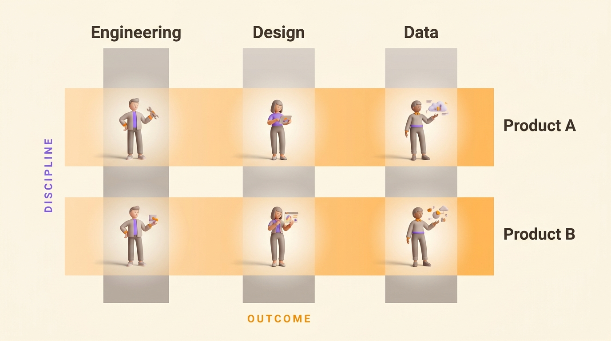

In the summer of 1964, John Mee, then Mead Johnson Professor of Management at Indiana University, gave three pages of *Business Horizons* to a form he had watched take shape inside the American aerospace programs. He called it the matrix organization. A space program needed propulsion engineers, avionics specialists and materials people at the same moment, and building a private copy of each discipline for every program was out of the question. So the engineers kept their department and picked up a program alongside it.

Sixty years later the form is ordinary. Gallup's analytics put 84% of US employees in a matrix to some extent in September 2018: 49% work across several teams on some days, 18% do it every day with different people under the same manager, and 17% do it every day with different people and different managers. The same research found those employees more engaged than their non-matrixed colleagues, and less clear about what was expected of them at work. The second line does both at once: it brings more variety and more people into the week, and a second set of expectations to satisfy.

## What a matrix organizational structure is

A matrix organizational structure gives each person two reporting lines at once: one to the discipline they belong to, one to the product, project or region they work for. Neither line owns the person outright, and both hold a claim on the same week.

A dotted line drawn on an org chart is not enough to make one. What makes it a matrix is that both lines can set priorities, and that at least one of them controls something the person needs: their time, their budget or their next review.

## The two axes, discipline and outcome

The vertical axis is the discipline. It hires, sets the standard for the craft, reviews the work and owns the career path. The horizontal axis is the outcome. It owns a product, a program, a region or a customer segment, carries the deadline and answers for the result.

{/* IMAGE regen: api.py image, infographic, 1600x900. Scene: "a flat, front-facing 2D diagram of a
    matrix grid, drawn straight on (no perspective, no isometric tilt). Three vertical columns crossed
    by two horizontal rows, forming six cells. The three vertical columns are tinted warm grey and run
    from top to bottom. Their headers sit above the grid, in bold modern sans-serif, left to right,
    reading exactly: "Engineering", "Design", "Data". A slim vertical label runs down the far left of
    the grid, rotated 90 degrees, reading exactly "DISCIPLINE" in small bold letterspaced capitals, in
    purple. The two horizontal rows are tinted warm orange and run left to right across all three
    columns. Their labels sit to the right of the grid, in bold modern sans-serif, top to bottom,
    reading exactly: "Product A", "Product B". A slim horizontal label runs along the bottom of the
    grid reading exactly "OUTCOME" in small bold letterspaced capitals, in orange. At each of the six
    intersections where a column crosses a row, place one small rounded 3D human figure, a casually
    dressed modern professional, standing on the crossing. The six figures are identical in style and
    evenly spaced. The crossings themselves are slightly brighter than the rest of the grid, so the eye
    lands on the people. Generous warm cream margins around the whole grid. Soft directional light from
    the upper left, gentle drop shadow under the grid bands, no hard outlines." */}

Companies rarely stop at two. Paul Rogers and Jenny Davis-Peccoud, writing for Bain in December 2011 from a survey of more than 760 companies, found executives routinely managing five or six dimensions at once: function, region, process, product, customer and channel. Each dimension added is one more manager with a legitimate claim on the same hours.

## Weak, balanced and strong matrix

The Project Management Institute's vocabulary is the clearest way to say which matrix you actually run, and it turns on one question: who holds the budget and the assignments.

| Type | Who holds the budget and the assignments | What the product or project lead does | How you spot it |
| --- | --- | --- | --- |
| Weak matrix | The department head | Coordinates, plans, chases, often part time and alongside another job | The lead asks for people and gets told what is available |
| Balanced matrix | Shared between the department head and the product lead | Runs the outcome full time, negotiates every assignment | Staffing takes a meeting, and a disagreement takes several |
| Strong matrix | The product lead | Runs the outcome full time and staffs it directly | The department becomes a talent pool and a standard, not a schedule |

The authority scale starts at functional, where no second line exists, runs through weak, balanced and strong, and ends at a fully project-based company where the departments dissolve. Most companies never say where they sit on it. The two lines then argue about that missing answer, each convinced they work in a different structure.

## What a matrix looks like in a fifty-person company

Take a software company of fifty people. Engineering has eighteen, design five, data four, customer success eight, and the rest sit in sales, marketing and finance. Three product squads carry the outcomes: onboarding, payments and reporting.

| Discipline | Onboarding squad | Payments squad | Reporting squad |
| --- | --- | --- | --- |
| Engineering | 4 | 5 | 4 |
| Design | 1 | 1 | 1 |
| Data | 1 | 1 | 1 |
| Customer success | 2 | 2 | 1 |

The designer on the payments squad has two managers. The squad lead wants the new checkout live before the quarter closes, because the conversion number is the squad's to answer for. The design lead wants the new component to enter the design system first, which adds a week now and makes the next three screens cheaper.

Both are right inside their own axis. Neither of them can decide, because the company never wrote down which claim wins when they collide. So it gets settled by whoever pushes harder that week, or it climbs to a founder who has less information about the checkout than either of them.

## What a matrix buys you

Scarce skills serve every product. Four data people cover three products, where splitting them into three teams of one would leave each product with someone who has nobody to review their work.

Someone owns the outcome from end to end. In a purely functional structure, every call that crosses two departments goes up a floor, and up another if the two heads disagree, which is the escalation problem covered in [the guide to organizational structure types](/en/blog/organizational-structures). A matrix pushes those arguments down to the people holding the facts.

The discipline outlasts the project. A designer keeps colleagues who review their work and a place to get better, while the products they work on change every year.

Jay Galbraith, who spent his career on organization design and wrote *Designing Matrix Organizations That Actually Work* in 2009, set the condition plainly. A matrix is a chart plus the planning process that aligns the two sets of goals, plus a reward system that pays for both axes, plus people picked and trained to work across them. Companies copy the chart and skip the other three.

## Where a matrix breaks down

Stanley Davis and Paul Lawrence, who had published the reference book on the form in 1977, followed it in the *Harvard Business Review* of May 1978 with nine ways a matrix fails. The names have outlived the article:

- anarchy, when nobody can say who rules on what
- power struggles between the two lines
- severe groupitis, when managers mistake the matrix for group decision making
- collapse during economic crunch, when the first bad quarter sends authority back up the vertical line
- excessive overhead, in coordinators, liaison roles and arbitration bodies
- decision strangulation, when every call needs two signatures
- sinking, when the matrix drops quietly from the top of the company down to the division level
- layering, matrices nested inside matrices
- navel gazing, when the organization spends its energy on its own internal balance

Three of them do most of the damage in ordinary companies.

### Two managers split the evaluation

The person at the crossing is judged by two people who watched different halves of their year. Each one saw the work done for their own axis and heard about the rest. Colleagues see each other the same partial way, and they trust each other a little less for it: 24% of highly matrixed employees told Gallup they trusted their coworkers to get their work done on time, against 29% of the non-matrixed.

### Every call needs two signatures

A decision one department head could make alone now needs both lines to agree, and either of them can stall it by doing nothing. Davis and Lawrence called it decision strangulation. A structure meant to speed up delivery turns into a queue. A [chain of command](/en/blog/chain-of-command) at least sends a stuck question up to someone with the authority to answer it. A matrix without a tie-break rule leaves it between the two lines.

### The coordination turns into meetings

Gallup counted 33% of highly matrixed employees spending their days in internal meetings, against 2% of the non-matrixed, and 45% spending those days on colleagues' requests, against 23%. A second axis carried by conversation instead of by written rules gets paid for in hours, and those hours build up into [the meeting load](/en/blog/meeting-overload) that leaves no time for the work people were hired to do.

## Matrix, functional, divisional and flat side by side

| Structure | Who claims a person's week | Who settles a cross-cutting call | What it costs |
| --- | --- | --- | --- |
| Functional | One department head | The level above both departments | Every cross-department subject climbs a floor |
| Divisional | One division, which carries its own functions | The division head | Duplicated functions, and ideas that stay inside one division |
| Matrix | Two lines at once, discipline and outcome | Both lines together, or nobody | Doubled meetings, and calls that stall when the two disagree |
| Flat and role-based | Several written roles held by the same person | The role whose domain covers the subject | Writing the roles down, and revising them as the work changes |

The five forms, their history and the size at which each one stops working are laid out in [the guide to organizational structure types](/en/blog/organizational-structures). The narrower question of how many management levels to keep is in [flat versus hierarchical](/en/blog/flat-vs-hierarchical).

## From two managers to two written roles

A matrix is an admission, and a fair one. It says out loud that a person answers to more than one thing at a time, which is true of nearly everyone doing knowledge work. Then it names the two axes, hands each one a manager, and leaves every decision between them unassigned. Unity of command, which the French mining engineer Henri Fayol set out in 1916 and which the [chain of command](/en/blog/chain-of-command) still rests on, at least said who ruled.

Take the admission seriously and a second move opens up. Keep both claims on the person, drop the second manager, and write the decisions down.

A role carries a purpose, a [domain](/en/glossary/domaine) it decides on alone, and [accountabilities](/en/glossary/redevabilite) others can ask it for. One person holds several roles. The designer on the payments squad holds two roles rather than answering to two bosses: payments design, accountable for the checkout flow and its ship date, and design system steward, which decides what enters the component library and what waits. Two roles, two domains, one person, and the checkout question now has one owner rather than two claimants.

<OrgChartView demo="demo" height="440px" showAllNodes={false} />

A [RACI matrix](/en/blog/raci-matrix) does a project-sized version of the same move. It works until the project closes and takes its answers with it. A role outlives both the project and the person holding it, which is [the difference between a role and a job description](/en/blog/roles-vs-job-descriptions). The format of a usable role, purpose then domain then accountabilities, is in [how to write a role](/en/blog/define-roles).

This is not free. Writing a role takes a real conversation, and roles go stale unless something revises them. A recurring [governance meeting](/en/blog/governance-meeting), fed by the frictions people actually hit, is what keeps the written structure close to the real one. Skip it and [the org chart freezes](/en/blog/dynamic-org-chart), which puts you back where the matrix left you.

{/* TODO ANECDOTE: a customer figure on how many roles a team writes in its first month, or a before/after on how long a cross-team decision took, would ground this section. */}

Rolebase is where you write those roles down and share them. Each one carries its purpose, its domain and its accountabilities, decisions and tasks attach to the role rather than to a project file, and a [governance mode](/en/docs/governance-modes) sets who can change what: Free, where every member edits the whole org chart, Agile, where each role is editable by its leaders, or Strict, where a structural change goes through a proposal. [See the features](/en/features), or create your organization free for up to five active members.

<FaqList>

<FaqItem question="What is a matrix organizational structure?">
  A matrix organizational structure gives each person two reporting lines at once: one to the discipline they belong to, and one to the product, project or region they work for. Neither line owns the person outright, and both hold a claim on the same week. It came out of the American aerospace programs of the 1950s and 1960s, and John Mee named it in *Business Horizons* in the summer of 1964.
</FaqItem>

<FaqItem question="What is the difference between a weak, a balanced and a strong matrix?">
  The difference is who holds the budget and the assignments. In a weak matrix the department head holds both and the product lead coordinates, often part time. In a balanced matrix the two share them, so every staffing question is a negotiation. In a strong matrix the product lead holds the budget and staffs directly, and the department becomes a talent pool and a standard rather than a schedule.
</FaqItem>

<FaqItem question="Who does an employee report to in a matrix organization?">
  Two people. One is the head of their discipline, who hires them, reviews their craft and owns their career path. The other runs the product, project or region they are assigned to, and carries the deadline. Which one wins a conflict depends on whether the company runs a weak, balanced or strong matrix, and most companies have never said which.
</FaqItem>

<FaqItem question="What are the main disadvantages of a matrix structure?">
  Decisions stall when both lines have to sign and either can stall by doing nothing. Evaluation splits between two managers who each saw half the year. Coordination moves into meetings, and Gallup measured highly matrixed employees spending far more of their days in internal meetings and on colleagues' requests than non-matrixed ones. Davis and Lawrence listed nine failure modes in 1978, and those three cover most of what companies actually hit.
</FaqItem>

<FaqItem question="Which companies use a matrix structure?">
  The form came out of American aerospace in the 1950s and 1960s and spread through large industrial and engineering firms in the 1970s. Consulting firms run one by default, with consultants answering to a practice lead for their craft and to an engagement lead for the client. The best-known modern version is the Spotify model, published in 2012 by Henrik Kniberg, then an agile coach at the company, with squads owning a product area and chapters holding a discipline. Jeremiah Lee, a former Spotify product manager, wrote in 2020 that the split between the two lines had produced the priority conflicts Davis and Lawrence documented in 1978.
</FaqItem>

<FaqItem question="Is a matrix structure right for a small company?">
  Below about thirty people, a second reporting line usually costs more in meetings than it returns in coordination. The pressure appears when one team ships several products and the specialists are too few to split, which tends to happen between fifty and a hundred and fifty people. At that point, writing down who decides what is cheaper than adding a second manager, and it answers the same question.
</FaqItem>

</FaqList>
