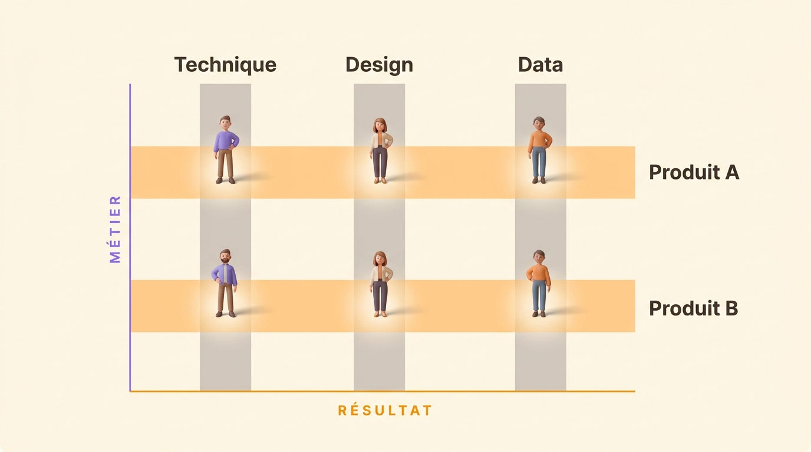

À l’été 1964, John Mee, alors titulaire de la chaire Mead Johnson de management à l’université d’Indiana, consacre trois pages de *Business Horizons* à une forme qu’il a vue naître dans les programmes aérospatiaux américains. Il l’appelle l’organisation matricielle. Un programme spatial réclame en même temps des ingénieurs propulsion, des spécialistes avionique et des gens des matériaux, et monter une copie privée de chaque métier pour chaque programme coûte beaucoup trop cher. Les ingénieurs gardent donc leur direction et prennent un programme à côté.

Soixante ans plus tard, la forme est banale. Les analyses de Gallup situaient en septembre 2018 84 % des salariés américains en situation matricielle à un degré ou à un autre : 49 % travaillent avec plusieurs équipes certains jours, 18 % le font tous les jours avec des personnes différentes sous le même manager, et 17 % tous les jours avec des personnes différentes et des managers différents. La même étude les trouve plus engagés que leurs collègues non matricés, et moins au clair sur ce qu’on attend d’eux. La seconde ligne produit les deux à la fois : elle amène plus de variété et plus de monde dans la semaine, et un second jeu d’attentes à satisfaire.

## Qu’est-ce qu’une structure matricielle ?

Une structure matricielle donne à chaque personne deux lignes de rattachement en même temps : une vers le métier auquel elle appartient, une vers le produit, le projet ou la région pour lesquels elle travaille. Aucune des deux ne la détient entièrement, et toutes les deux ont une revendication sur la même semaine.

Un trait pointillé tracé sur un organigramme ne suffit pas à en faire une. Ce qui fait la matrice, c’est que les deux lignes fixent des priorités, et qu’au moins l’une d’elles tient quelque chose dont la personne a besoin : son temps, son budget ou sa prochaine évaluation.

## Les deux axes, le métier et le résultat

L’axe vertical est le métier. Il recrute, fixe le niveau d’exigence du travail, relit ce qui est produit et tient le parcours de carrière. L’axe horizontal est le résultat. Il porte un produit, un programme, une région ou un segment de clientèle, tient l’échéance et répond du résultat.

{/* IMAGE regen: api.py image, infographic, 1600x900. Scene: "a flat, front-facing 2D diagram of a
    matrix grid, drawn straight on (no perspective, no isometric tilt). Three vertical columns crossed
    by two horizontal rows, forming six cells. The three vertical columns are tinted warm grey and run
    from top to bottom. Their headers sit above the grid, in bold modern sans-serif, left to right,
    reading exactly: "Technique", "Design", "Data". A slim vertical label runs down the far left of the
    grid, rotated 90 degrees, reading exactly "MÉTIER" in small bold letterspaced capitals, in purple,
    with its accent on the E. The two horizontal rows are tinted warm orange and run left to right
    across all three columns. Their labels sit to the right of the grid, in bold modern sans-serif, top
    to bottom, reading exactly: "Produit A", "Produit B". A slim horizontal label runs along the bottom
    of the grid reading exactly "RÉSULTAT" in small bold letterspaced capitals, in orange, with its
    accent on the first E. At each of the six intersections where a column crosses a row, place one
    small rounded 3D human figure, a casually dressed modern professional, standing on the crossing.
    The six figures are identical in style and evenly spaced. The crossings themselves are slightly
    brighter than the rest of the grid, so the eye lands on the people. Generous warm cream margins
    around the whole grid. Soft directional light from the upper left, gentle drop shadow under the
    grid bands, no hard outlines." */}

Les entreprises s’arrêtent rarement à deux axes. Paul Rogers et Jenny Davis-Peccoud, dans une note publiée par Bain en décembre 2011 à partir d’une enquête menée auprès de plus de 760 entreprises, décrivent des dirigeants qui gèrent couramment cinq ou six dimensions à la fois : la fonction, la région, le processus, le produit, le client et le canal. Chaque dimension ajoutée est un manager de plus qui a une raison légitime de réclamer les mêmes heures.

## Matrice faible, équilibrée et forte

Le vocabulaire du Project Management Institute reste le plus clair pour dire quelle matrice on fait réellement tourner, et il tient à une seule question : qui détient le budget et l’affectation des personnes.

| Type | Qui détient le budget et les affectations | Ce que fait le responsable de produit ou de projet | Le signe qui ne trompe pas |
| --- | --- | --- | --- |
| Matrice faible | Le responsable de métier | Il coordonne, planifie, relance, souvent à temps partiel en plus d’un autre poste | Il demande des personnes et on lui répond ce qui est disponible |
| Matrice équilibrée | Partagé entre le responsable de métier et le responsable de produit | Il tient le résultat à temps plein et négocie chaque affectation | Constituer l’équipe prend une réunion, et un désaccord en prend plusieurs |
| Matrice forte | Le responsable de produit | Il tient le résultat à temps plein et constitue son équipe directement | Le métier devient un vivier et un niveau d’exigence, plus un planning |

L’échelle d’autorité part de la structure fonctionnelle, où la seconde ligne n’existe pas, passe par la matrice faible, puis équilibrée, puis forte, et finit sur l’entreprise entièrement organisée par projets, où les directions métier disparaissent. La plupart des entreprises ne disent jamais où elles se situent. Les deux lignes se disputent alors sur cette réponse manquante, chacune convaincue de travailler dans une structure différente.

## À quoi ressemble une matrice dans une entreprise de cinquante personnes

Prenons un éditeur de logiciel de cinquante personnes. La technique en compte dix-huit, le design cinq, la data quatre, le service client huit, le reste se répartit entre les ventes, le marketing et la finance. Trois squads produit portent les résultats : l’onboarding, les paiements et le reporting.

| Métier | Squad onboarding | Squad paiements | Squad reporting |
| --- | --- | --- | --- |
| Technique | 4 | 5 | 4 |
| Design | 1 | 1 | 1 |
| Data | 1 | 1 | 1 |
| Service client | 2 | 2 | 1 |

Le designer de la squad paiements a deux managers. Le responsable de la squad veut le nouveau tunnel de paiement en ligne avant la fin du trimestre, parce que le taux de conversion est le chiffre dont sa squad répond. Le responsable design veut d’abord faire entrer le nouveau composant dans le design system, ce qui coûte une semaine tout de suite et rend les trois écrans suivants moins chers.

Les deux ont raison à l’intérieur de leur axe. Aucun des deux ne peut trancher, parce que l’entreprise n’a jamais écrit laquelle des deux revendications l’emporte quand elles se croisent. La question se règle donc au profit de qui insiste le plus cette semaine-là, ou elle remonte à un fondateur qui en sait moins sur le tunnel de paiement que les deux réunis.

## Ce qu’une matrice apporte

Les compétences rares servent tous les produits. Quatre personnes en data couvrent trois produits, quand les répartir en trois équipes d’une seule personne laisserait chaque produit avec quelqu’un que personne ne relit.

Quelqu’un porte le résultat de bout en bout. Dans une structure purement fonctionnelle, tout arbitrage qui traverse deux directions monte d’un étage, puis d’un autre si les deux responsables ne sont pas d’accord. C’est le problème d’escalade décrit dans [le guide des types de structure](/fr/blog/organizational-structures). La matrice fait redescendre ces arbitrages vers les gens qui ont les faits en main.

Le métier dure plus longtemps que le projet. Un designer garde des collègues qui relisent son travail et un endroit où progresser, pendant que les produits sur lesquels il travaille changent chaque année.

Jay Galbraith, qui a consacré sa carrière au design organisationnel et publié *Designing Matrix Organizations That Actually Work* en 2009, pose la condition sans détour. Une matrice, c’est un organigramme, plus le processus de planification qui aligne les deux jeux d’objectifs, plus un système de reconnaissance qui récompense les deux axes, plus des gens choisis et formés pour travailler à leur croisement. Les entreprises copient l’organigramme et laissent les trois autres.

## Là où une matrice casse

Stanley Davis et Paul Lawrence, auteurs du livre de référence sur la forme en 1977, publient dans la *Harvard Business Review* de mai 1978 neuf façons dont une matrice déraille. Les noms qu’ils leur donnent servent encore :

- l’anarchie, quand personne ne sait dire qui tranche quoi
- les luttes de pouvoir entre les deux lignes
- la fièvre du collectif, quand les managers confondent matrice et décision de groupe
- l’effondrement en période de crise, quand le premier mauvais trimestre renvoie l’autorité en haut de la ligne verticale
- les frais de structure, en coordinateurs, en postes de liaison et en instances d’arbitrage
- l’étranglement décisionnel, quand chaque arbitrage réclame deux signatures
- l’affaissement, quand la matrice glisse discrètement du sommet de l’entreprise au niveau des divisions
- l’empilement, des matrices imbriquées dans des matrices
- le nombrilisme, quand l’organisation consacre son énergie à son propre équilibre interne

Trois d’entre elles font l’essentiel des dégâts dans les entreprises ordinaires.

### Deux managers coupent l’évaluation en deux

La personne assise au croisement est évaluée par deux personnes qui ont vu chacune une moitié de son année. Chacune a vu le travail fait pour son axe et entendu parler du reste. Les collègues se voient entre eux de la même façon partielle, et se font un peu moins confiance : 24 % des salariés très matricés disent à Gallup faire confiance à leurs collègues pour rendre leur travail dans les temps, contre 29 % chez les non matricés.

### Chaque arbitrage réclame deux signatures

Une décision qu’un responsable de métier prenait seul demande maintenant l’accord des deux lignes, et chacune peut la bloquer en ne faisant rien. Davis et Lawrence appellent cela l’étranglement décisionnel. Une structure censée accélérer la livraison devient une file d’attente. Une [chaîne de commandement](/fr/blog/chain-of-command) envoie au moins la question bloquée vers quelqu’un qui a le pouvoir d’y répondre. Une matrice sans règle d’arbitrage la laisse entre les deux lignes.

### La coordination se transforme en réunions

Gallup compte 33 % des salariés très matricés qui passent leurs journées en réunions internes, contre 2 % des non matricés, et 45 % qui les passent à répondre aux demandes des collègues, contre 23 %. Un second axe porté par la conversation plutôt que par des règles écrites se paie en heures, et ces heures s’accumulent en [charge de réunions](/fr/blog/meeting-overload) qui ne laisse plus le temps de faire le travail pour lequel les gens ont été recrutés.

## Matricielle, fonctionnelle, divisionnelle et plate côte à côte

| Structure | Qui revendique la semaine d’une personne | Qui tranche un sujet transversal | Ce que ça coûte |
| --- | --- | --- | --- |
| Fonctionnelle | Un responsable de métier | L’étage au-dessus des deux directions | Tout sujet transversal monte d’un étage |
| Divisionnelle | Une division, qui porte ses propres fonctions | Le responsable de division | Des fonctions dupliquées, et des idées qui restent dans une seule division |
| Matricielle | Deux lignes à la fois, le métier et le résultat | Les deux lignes ensemble, ou personne | Des réunions doublées, et des arbitrages à l’arrêt dès que les deux divergent |
| Plate et par rôles | Plusieurs rôles écrits tenus par la même personne | Le rôle dont le domaine couvre le sujet | Écrire les rôles, et les réviser quand le travail change |

Les cinq formes, leur histoire et la taille à laquelle chacune cesse de tenir sont détaillées dans [le guide des types de structure](/fr/blog/organizational-structures). La question plus étroite du nombre de niveaux hiérarchiques à garder est traitée dans [structure plate ou hiérarchique](/fr/blog/flat-vs-hierarchical).

## De deux managers à deux rôles écrits

Une matrice est un aveu, et un aveu juste. Elle dit tout haut qu’une personne répond à plusieurs choses à la fois, ce qui est vrai de presque tout le monde dans le travail intellectuel. Ensuite, elle nomme les deux axes, donne un manager à chacun, et laisse sans propriétaire toutes les décisions qui se trouvent entre les deux. L’unité de commandement, la règle posée en 1916 par l’ingénieur des mines Henri Fayol et sur laquelle repose la [chaîne de commandement](/fr/blog/chain-of-command), disait au moins qui tranchait.

Prenez l’aveu au sérieux et un autre mouvement devient possible. Gardez les deux revendications sur la personne, retirez le second manager, et écrivez les décisions.

Un rôle porte une raison d’être, un [domaine](/fr/glossary/domaine) sur lequel il décide seul, et des [redevabilités](/fr/glossary/redevabilite) que les autres peuvent lui demander. Une personne en tient plusieurs. Le designer de la squad paiements en tient deux au lieu d’avoir deux chefs : design paiements, redevable du tunnel de paiement et de sa date de mise en ligne, et gardien du design system, qui décide de ce qui entre dans la bibliothèque de composants et de ce qui attend. Deux rôles, deux domaines, une personne, et la question du tunnel a maintenant un propriétaire plutôt que deux prétendants.

<OrgChartView demo="demo" height="440px" showAllNodes={false} />

Une [matrice RACI](/fr/blog/raci-matrix) fait la version projet du même mouvement. Elle marche jusqu’au jour où le projet se termine et emporte ses réponses. Un rôle reste en place quand le projet s’arrête et quand la personne change, c’est [la différence entre un rôle et une fiche de poste](/fr/blog/roles-vs-job-descriptions). Le format d’un rôle utilisable, raison d’être puis domaine puis redevabilités, est dans [comment écrire un rôle](/fr/blog/define-roles).

Rien de tout cela n’est gratuit. Écrire un rôle demande une vraie conversation, et les rôles vieillissent si rien ne les révise. Une [réunion de gouvernance](/fr/blog/governance-meeting) récurrente, nourrie par les frictions que les gens rencontrent vraiment, garde la structure écrite proche de la structure réelle. Sautez ce rendez-vous et [l’organigramme se fige](/fr/blog/dynamic-org-chart), ce qui vous ramène là où la matrice vous avait laissé.

{/* TODO ANECDOTE: un chiffre client sur le nombre de rôles qu’une équipe écrit son premier mois, ou un avant/après sur la durée d’une décision transverse, ancrerait cette section. */}

Rolebase est l’endroit idéal pour consigner et partager ces rôles. Chacun porte sa raison d’être, son domaine et ses redevabilités, les décisions et les tâches s’accrochent au rôle plutôt qu’à un fichier de projet, et un [mode de gouvernance](/fr/docs/governance-modes) fixe qui peut changer quoi : Libre, où chaque membre modifie tout l’organigramme, Agile, où chaque rôle est modifiable par ses responsables, ou Strict, où un changement de structure passe par une proposition. [Voir les fonctionnalités](/fr/features), ou créez votre organisation gratuitement jusqu’à cinq membres actifs.

<FaqList>

<FaqItem question="C’est quoi une structure matricielle ?">
  Une structure matricielle donne à chaque personne deux lignes de rattachement en même temps : une vers le métier auquel elle appartient, une vers le produit, le projet ou la région pour lesquels elle travaille. Aucune des deux ne la détient entièrement, et toutes les deux ont une revendication sur la même semaine. La forme est née des programmes aérospatiaux américains des années 1950 et 1960, et John Mee lui a donné son nom dans *Business Horizons* à l’été 1964.
</FaqItem>

<FaqItem question="Quelle différence entre matrice faible, équilibrée et forte ?">
  Tout tient à qui détient le budget et l’affectation des personnes. Dans une matrice faible, le responsable de métier détient les deux et le responsable de produit coordonne, souvent à temps partiel. Dans une matrice équilibrée, les deux se les partagent, donc chaque question d’affectation devient une négociation. Dans une matrice forte, le responsable de produit détient le budget et constitue son équipe directement, et le métier devient un vivier et un niveau d’exigence plutôt qu’un planning.
</FaqItem>

<FaqItem question="À qui un salarié rend-il des comptes dans une organisation matricielle ?">
  À deux personnes. La première dirige son métier, la recrute, relit son travail et tient son parcours de carrière. La seconde porte le produit, le projet ou la région sur lesquels elle est affectée, et tient l’échéance. Laquelle l’emporte en cas de conflit dépend du type de matrice, faible, équilibrée ou forte, et la plupart des entreprises n’ont jamais dit lequel elles font tourner.
</FaqItem>

<FaqItem question="Quels sont les inconvénients d’une structure matricielle ?">
  Les décisions s’arrêtent dès qu’il faut deux signatures, chaque ligne pouvant bloquer en ne faisant rien. L’évaluation se coupe entre deux managers qui ont vu chacun une moitié de l’année. La coordination part en réunions, et Gallup mesure chez les salariés très matricés une part de journées passées en réunions internes et à répondre aux collègues bien supérieure à celle des non matricés. Davis et Lawrence listaient neuf modes de défaillance en 1978, et ces trois-là couvrent l’essentiel de ce que les entreprises rencontrent.
</FaqItem>

<FaqItem question="Quelles entreprises utilisent une structure matricielle ?">
  La forme sort de l’aérospatiale américaine des années 1950 et 1960 et se diffuse dans les grands groupes industriels et d’ingénierie des années 1970. Les cabinets de conseil en font tourner une par défaut, avec des consultants qui répondent à un responsable de practice pour leur métier et à un responsable de mission pour le client. La version moderne la plus connue est le modèle Spotify, publié en 2012 par Henrik Kniberg, alors coach agile dans l’entreprise, avec des squads qui portent un domaine produit et des chapters qui tiennent un métier. Jeremiah Lee, ancien product manager de Spotify, a raconté en 2020 comment le partage entre les deux lignes avait produit les conflits de priorité que Davis et Lawrence documentaient en 1978.
</FaqItem>

<FaqItem question="Une structure matricielle convient-elle à une petite entreprise ?">
  En dessous d’une trentaine de personnes, une seconde ligne de rattachement coûte en général plus cher en réunions qu’elle ne rapporte en coordination. La pression apparaît quand une même équipe livre plusieurs produits et que les spécialistes sont trop peu nombreux pour être répartis, ce qui arrive entre cinquante et cent cinquante personnes. À ce moment-là, écrire qui décide quoi coûte moins cher qu’ajouter un second manager, et répond à la même question.
</FaqItem>

</FaqList>
