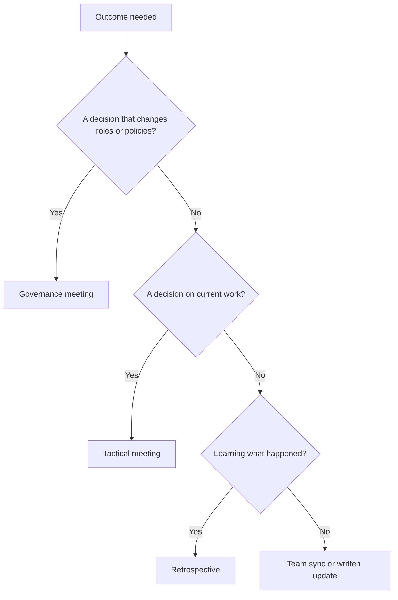

A meeting without an agenda drifts. Someone raises whatever is on their mind, the loudest voice steers the conversation, and the hour ends with a vague feeling that something was decided. A written agenda fixes most of that in five minutes of preparation. This page gives you a ready-to-copy agenda template for each common meeting type, plus the method that keeps them useful.

## An Agenda Works When Every Item Names Its Outcome

Steven Rogelberg, who has studied thousands of meetings, found that an agenda on its own does almost nothing. What separates useful meetings from painful ones is how each item is written. An item that says "pricing" invites twenty minutes of talk. An item that says "decide between the two pricing page variants" gets done in eight.

So every item on your agenda carries three pieces of information:

- **The topic**, in a few words
- **Who brings it**
- **The outcome needed**: a decision, an answer to a question, or a shared view

The outcome is the piece teams skip, and it is the one doing the work. It tells attendees whether to come prepared with data or with an opinion. It tells the facilitator when an item is finished. And it tells you which items belong in this meeting at all: an item needing deep debate goes to a longer session, an item needing only awareness can travel as a written update.

## The Four Ps That Build an Agenda

Before listing items, answer four questions about the meeting itself. Teams using Rolebase meetings fill these in once, and the agenda follows from them.

| P | Question | Example |
| --- | --- | --- |
| Purpose | Why does this meeting exist? | Keep the sprint on track |
| Product | What exists after the meeting that did not exist before? | Owned actions, made decisions |
| People | Who needs to be there for those outcomes? | The people who can decide or commit |
| Process | In what order do we work through the items? | Check-in, topics, actions, closing |

If you cannot write the product, the meeting probably has none, and cancelling it costs less than holding it. That test alone removes a good share of recurring meetings from calendars.

## Meeting Agenda Templates to Copy

Each meeting type needs its own template. A daily sync runs on three lines, while a board agenda carries legal requirements. The five templates below copy as plain text into a doc, a wiki or a meeting tool.

### Team sync

For a weekly team meeting of 30 minutes or so. The check-in grounds the room, two or three topics get real time, and the action round closes the loop.

```
Team sync — <team name>
Date:        Attendees:

PURPOSE: keep everyone aligned on the week

1. Check-in (5 min) — facilitator — everyone present and focused
2. Question to answer (10 min) — name — a decision or an answer
3. Question to answer (10 min) — name — a shared view
4. Actions and blockers (5 min) — all — an owner and a date per action
```

Write each topic as a question the session answers, the habit meeting researchers keep repeating. A question tells attendees what to bring and tells the facilitator when the item is done.

### Tactical meeting (role-based teams)

Teams running Holacracy or sociocracy separate the tactical round from governance. The tactical meeting keeps the operational work moving, and its agenda follows a fixed structure. Our [tactical meeting guide](/en/blog/tactical-meeting) details each step.

```
Tactical meeting — <circle name>
Date:        Facilitator:        Secretary:

1. Check-in round (2 min each)
2. Checklist review (5 min) — all — recurring actions verified
3. Metrics review (5 min) — all — shared view of the numbers
4. Progress updates (5 min) — all — one sentence per project
5. Agenda building (2 min) — all — list of items, one line each
6. Triage items — all — a request or a next action per item
7. Closing round (2 min) — all
```

### Governance meeting

A governance meeting changes the structure itself: roles, accountabilities, policies. Items arrive as tensions, and each one ends in an adopted change or an explicit dismissal. The full process lives in our [governance meeting guide](/en/blog/governance-meeting).

```
Governance meeting — <circle name>
Date:        Facilitator:        Secretary:

1. Check-in round — opening comments, no responses
2. Agenda building — short labels, no explanation
3. Triage of items — elections first on request, then facilitator's order
4. Processing each item, six steps: present proposal, clarifying questions,
   reactions, amendments, objection round, integration
5. Recording adopted changes
6. Closing round
```

The six processing steps come straight from article 5.4.5 of the Holacracy Constitution, and our [governance meeting guide](/en/blog/governance-meeting) walks through each one with the facilitator's role at every step.

### Retrospective

A retrospective looks backwards so the next cycle improves. Timeboxes matter here more than anywhere else, because debriefing a whole sprint can eat an afternoon.

```
Retrospective — <team name>
Date:        Facilitator:

PURPOSE: improve how we work, one concrete change per session

1. Set the stage (5 min) — facilitator
2. Gather observations (15 min) — all — what worked, what did not
3. Pick the theme (5 min) — all — one theme by vote
4. Find root causes and actions (20 min) — all — one owned action
5. Close (5 min) — all
```

### Board meeting

Board agendas carry expectations beyond the room: directors, sometimes regulators, want a predictable structure. Send it with the papers a week ahead, and put approvals early while attention is high.

```
Board meeting — <organisation>
Date:        Chair:        Secretary:

1. Call to order and attendance
2. Approval of previous minutes
3. Financial report — treasurer — accepted report
4. Executive report — director — shared view of progress
5. Decisions — chair — recorded votes
6. Any other business
7. Date of next meeting
```

{/* DOWNLOAD regen: python3 src/content/blog/meeting-minutes/generate-meeting-templates.py */}
<Button label="Download the Word agenda template" href="/downloads/meeting-agenda-template.docx" variant="primary" />

The Word file adds a header with the meeting, the date, the purpose, the attendees and the duration, and pairs with the [meeting minutes template](/en/blog/meeting-minutes): minutes are far easier to write when the agenda already has the shape the record will take.



## Running the Meeting From Its Agenda

The template does its work during the meeting. Show it on screen so everyone sees where the meeting stands and what remains. When a side topic appears, the facilitator points at the agenda and offers to park the topic or swap it for a planned one.

Capture actions as they emerge. Each item ends with either a decision or an owned action. Name one person per action, add a date, and turn down actions owned by a whole team. If you take minutes afterwards, the agenda gives them their structure for free.

Stop at the scheduled time. An unfinished item rolls to the next agenda, which sounds harsh and works well. Meetings that systematically overrun train attendees to dread them.

Rolebase structures every meeting around a collaborative agenda, where each topic holds its own discussion, decisions and tasks. The agenda, the record and the actions stay attached to the same place, so nothing gets retyped after the meeting.


## Four Mistakes That Empty an Agenda of Its Value

**Items without outcomes.** This is the most common mistake. Read through your last agenda and count the items carrying a stated outcome. Most teams find zero.

**Agendas sent during the meeting.** Nobody can prepare from a document they discover at the first minute. Send it at least a day ahead so people can add items and bring data.

**A full page of items.** Ten items in thirty minutes means thirty seconds each. Two or three topics with real time work better than ten rushed ones. Move the rest to the next meeting or to writing.

**Reusing last week's agenda untouched.** Recurring agendas collect zombie items that outlasted their purpose. Start each edition from the template, then add only what still needs an outcome.

## Build Your Next Agenda in Five Minutes

Pick the template matching your next meeting, replace the placeholders, and send it with the outcomes visible. The first session run this way usually feels tighter than months of free-form discussion, and the actions leave the room with names and dates attached.

To go further, Rolebase lets you create meeting templates per circle, attach discussions and tasks directly to agenda items, and keep every decision linked to the role it concerns. Try it free with up to five active members, or explore the full [feature set](/en/features).
