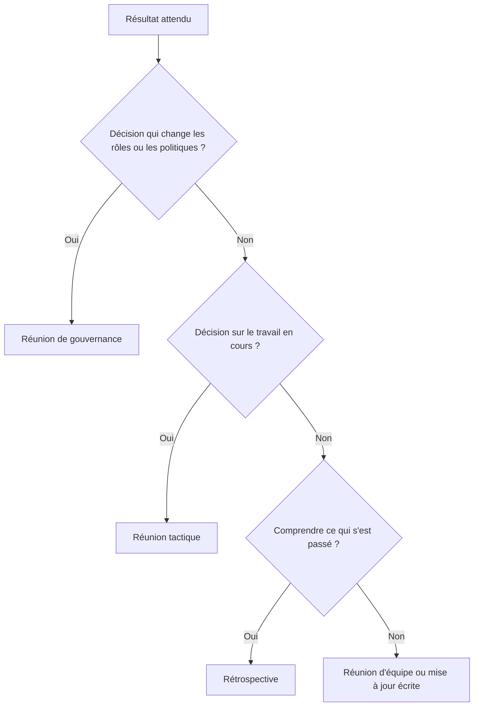

Une réunion sans ordre du jour part dans tous les sens. Chacun aborde ce qu’il a en tête, la voix la plus forte mène la conversation, et l’heure qui passe laisse une impression floue de décision prise. Un ordre du jour écrit règle l’essentiel de ce problème en cinq minutes de préparation. Cette page vous donne un modèle prêt à copier pour chaque type de réunion courant, plus la méthode qui les rend utiles.

## Un point fonctionne quand il annonce son résultat

Steven Rogelberg, qui a étudié des milliers de réunions, constate qu’un ordre du jour ne fait presque rien par lui-même. La façon dont chaque point est écrit distingue une réunion utile d’une réunion pénible. Un point « tarifs » invite à vingt minutes de discussion. Un point « trancher entre les deux versions de la page tarifs » se règle en huit.

Chaque point porte donc trois informations :

- **Le sujet**, en quelques mots
- **Qui l’amène**
- **Le résultat attendu** : une décision, une réponse à une question ou une vision partagée

Les équipes oublient le résultat, pourtant il indique aux participants s’ils viennent avec des données ou avec une opinion. Il dit à la personne qui anime quand un point est terminé. Et il trie les points eux-mêmes : un sujet qui demande un vrai débat part vers une séance plus longue, un sujet qui demande seulement d’être connu voyage sous forme d’écrit.

## Les quatre P qui construisent un ordre du jour

Avant de lister les points, répondez à quatre questions sur la réunion elle-même. Les équipes qui tiennent leurs réunions dans Rolebase les remplissent une fois, et l’ordre du jour suit.

| P | Question | Exemple |
| --- | --- | --- |
| Purpose (l’objet) | Pourquoi cette réunion existe-t-elle ? | Garder le sprint sur les rails |
| Product (le produit) | Qu’existe-t-il après la réunion qui n’existait pas avant ? | Des actions attribuées, des décisions prises |
| People (les personnes) | Qui doit être là pour ces résultats ? | Celles et ceux qui décident ou s’engagent |
| Process (le déroulé) | Dans quel ordre traite-t-on les points ? | Tour de check-in, sujets, actions, clôture |

Si vous ne pouvez pas écrire le produit, la réunion n’en a probablement aucun, et l’annuler coûte moins cher que de la tenir. Ce test retire à lui seul une belle part des réunions récurrentes des agendas.

## Des modèles d’ordre du jour à copier

Chaque type de réunion demande son propre modèle. Un point quotidien tient sur trois lignes, alors qu’un ordre du jour de conseil porte des exigences précises. Les cinq modèles ci-dessous se copient en texte brut dans un document, un wiki ou un outil de réunion.

### Réunion d’équipe

Pour un point hebdomadaire d’une trentaine de minutes. Le check-in pose la salle, deux ou trois sujets reçoivent du vrai temps, et le tour des actions referme la boucle.

```
Réunion d’équipe — <équipe>
Date :        Participants :

OBJET : garder tout le monde aligné sur la semaine

1. Check-in (5 min) — facilitateur — tous présents et concentrés
2. Question à laquelle répondre (10 min) — nom — une décision ou une réponse
3. Question à laquelle répondre (10 min) — nom — une vision partagée
4. Actions et blocages (5 min) — tous — un responsable et une date par action
```

Écrivez chaque sujet sous forme de question à laquelle la séance répond, l’habitude que les chercheurs sur les réunions répètent à l’envi. Une question dit aux participants quoi préparer et dit à la personne qui anime quand le point est terminé.

### Réunion tactique (équipes par rôles)

Les équipes qui pratiquent l’holacratie ou la sociocratie séparent le tactique de la gouvernance. La réunion tactique fait avancer le travail opérationnel, et son ordre du jour suit une structure fixe. Notre [guide de la réunion tactique](/fr/blog/tactical-meeting) détaille chaque étape.

```
Réunion tactique — <cercle>
Date :        Facilitateur :        Secrétaire :

1. Tour de check-in (2 min chacun)
2. Revue des checklists (5 min) — tous — actions récurrentes vérifiées
3. Revue des indicateurs (5 min) — tous — vision partagée des chiffres
4. Points d’avancement (5 min) — tous — une phrase par projet
5. Construction de l’ordre du jour (2 min) — tous — liste des points, une ligne chacun
6. Traitement des points — tous — une demande ou une prochaine action par point
7. Tour de clôture (2 min) — tous
```

### Réunion de gouvernance

Une réunion de gouvernance change la structure elle-même : rôles, responsabilités, politiques. Les points arrivent sous forme de tensions, et chacun se termine par un changement adopté ou un écart explicite. Le processus complet vit dans notre [guide de la réunion de gouvernance](/fr/blog/governance-meeting).

```
Réunion de gouvernance — <cercle>
Date :        Facilitateur :        Secrétaire :

1. Tour de check-in — commentaires d’ouverture, sans réponse
2. Construction de l’ordre du jour — libellés courts, sans explication
3. Tri des points — élections d’abord sur demande, puis ordre du facilitateur
4. Traitement de chaque point, six étapes : présentation de la proposition,
   questions de clarification, réactions, amendements, tour d’objections, intégration
5. Enregistrement des changements adoptés
6. Tour de clôture
```

Les six étapes de traitement viennent de l’article 5.4.5 de la Constitution Holacracy, et notre [guide de la réunion de gouvernance](/fr/blog/governance-meeting) détaille chacune avec le rôle du facilitateur à chaque étape.

### Rétrospective

Une rétrospective regarde en arrière pour que le prochain cycle progresse. Les temps limites comptent ici plus qu’ailleurs, car débriefer un sprint entier peut manger un après-midi.

```
Rétrospective — <équipe>
Date :        Facilitateur :

OBJET : progresser sur notre façon de travailler, un changement concret par séance

1. Poser le cadre (5 min) — facilitateur
2. Recueillir les observations (15 min) — tous — ce qui a marché, ce qui a coincé
3. Choisir le thème (5 min) — tous — un thème par vote
4. Chercher les causes et les actions (20 min) — tous — une action attribuée
5. Clôture (5 min) — tous
```

### Conseil d’administration

L’ordre du jour d’un conseil porte des attentes qui dépassent la salle : les administrateurs, parfois les autorités, attendent une structure stable. Envoyez-le avec les documents une semaine avant, et placez les approbations tôt pendant que l’attention est haute.

```
Conseil d'administration — <organisation>
Date :        Président :        Secrétaire :

1. Ouverture et présents
2. Approbation du compte rendu précédent
3. Rapport financier — trésorier — rapport accepté
4. Rapport de direction — directeur — vision partagée de l'avancement
5. Décisions — président — votes enregistrés
6. Questions diverses
7. Date de la prochaine séance
```

{/* DOWNLOAD regen : python3 src/content/blog/meeting-minutes/generate-meeting-templates.py */}
<Button label="Télécharger l’ordre du jour Word" href="/downloads/ordre-du-jour-reunion-modele.docx" variant="primary" />

Le fichier Word ajoute un en-tête avec la réunion, la date, l’objet, les participants et la durée, et s’utilise avec le [modèle de compte rendu](/fr/blog/meeting-minutes) : un compte rendu se rédige bien plus vite quand l’ordre du jour a déjà la forme que le document prendra.



## Dérouler la réunion depuis son ordre du jour

Le modèle sert pendant la réunion. Montrez-le à l’écran pour que tout le monde voie où la réunion en est et ce qui reste. Quand un sujet annexe apparaît, la personne qui anime le pointe et propose de mettre le sujet de côté ou de l’échanger contre un point prévu.

Capturez les actions au fil de l’eau. Chaque point se termine par une décision ou une action attribuée. Nommez une personne par action, ajoutez une date, et refusez les actions portées par une équipe. Si vous rédigez ensuite un compte rendu, l’ordre du jour lui offre sa structure gratuitement.

Arrêtez-vous à l’heure prévue. Un point inachevé passe à l’ordre du jour suivant, ce qui paraît strict et fonctionne très bien. Les réunions qui dépassent systématiquement forment les participants à les redouter.

Rolebase structure chaque réunion autour d’un ordre du jour collaboratif, où chaque sujet porte sa discussion, ses décisions et ses tâches. L’ordre du jour, le compte rendu et les actions restent attachés au même endroit, donc rien ne se retape après la réunion.


## Quatre erreurs qui vident un ordre du jour de sa valeur

**Des points sans résultat attendu.** C’est l’erreur la plus fréquente. Relisez votre dernier ordre du jour et comptez les points qui annoncent un résultat. La plupart des équipes trouvent zéro.

**Un ordre du jour envoyé pendant la réunion.** Personne ne peut se préparer sur un document découvert à la première minute. Envoyez-le au moins la veille pour que chacun ajoute ses points et apporte ses données.

**Une page entière de points.** Dix points en trente minutes, cela fait trente secondes chacun. Deux ou trois sujets avec du vrai temps battent dix sujets expédiés. Le reste passe à la prochaine séance ou à l’écrit.

**Reprendre l’ordre du jour de la semaine dernière sans y toucher.** Les ordres du jour récurrents accumulent des points zombies qui n’ont plus rien à produire. Repartez du modèle à chaque édition, puis n’ajoutez que ce qui demande encore un résultat.

## Construire votre prochain ordre du jour en cinq minutes

Choisissez le modèle qui correspond à votre prochaine réunion, remplacez les espaces réservés et envoyez-le avec les résultats attendus visibles. La première séance menée ainsi paraît généralement plus serrée que des mois de discussion libre, et les actions sortent de la salle avec des noms et des dates.

Pour aller plus loin, Rolebase vous permet de créer des modèles de réunion par cercle, d’attacher discussions et tâches directement aux points de l’ordre du jour, et de garder chaque décision liée au rôle qu’elle concerne. Essayez gratuitement avec jusqu’à cinq membres actifs, ou explorez [toutes les fonctionnalités](/fr/features).
