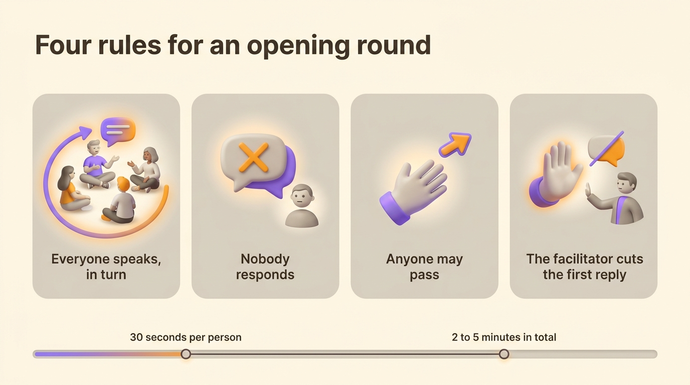
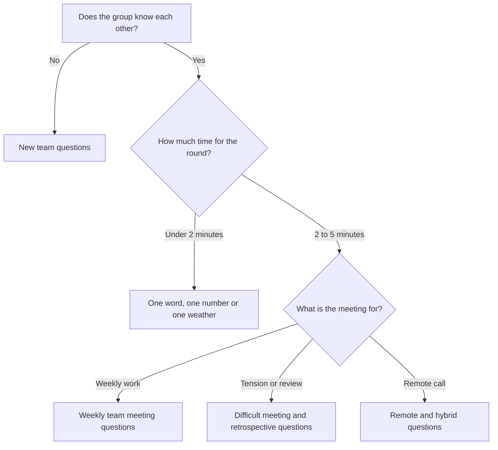

A meeting icebreaker is a short opening round where each person answers one question before the agenda starts. It takes 2 to 5 minutes, about 30 seconds per person. Everyone speaks once and says what is on their mind, so the group knows what state people arrive in before the first topic. This article gives 40 questions sorted by meeting type, the rules that keep the round short, and the questions to leave out at work.

Most icebreaker lists are full of party games. Two truths and a lie is fun once at an offsite and wears thin by the second Monday at 9:30. A check-in you run every week is a ritual. Holacracy already gives that ritual its rules: the [tactical meeting](/en/blog/tactical-meeting) opens with a round with no replies.

## What an icebreaker does for a meeting

The opening round gets everyone to speak once before they have to give an opinion. Someone who has not spoken for the first twenty minutes finds it harder to disagree in minute twenty-one. Someone who answered a simple question at the start speaks up more easily later.

Joseph A. Allen, a professor of industrial and organizational psychology at the University of Nebraska Omaha, measured the effect of the talk that comes before a meeting. With Nale Lehmann-Willenbrock and Nicole Landowski, he surveyed 252 working adults for a study published in the _Journal of Managerial Psychology_ in 2014. Small talk before the meeting predicted how effective people found the meeting, even after accounting for good meeting procedures. The link was stronger for the less extraverted participants.

A check-in makes that small talk part of the meeting, so the person who arrives exactly on time benefits from it as much as the person who came five minutes early.

If you facilitate, the answers also tell you what to change in the agenda. When three people out of six say they are stuck on the same release, add that release to the agenda. When someone says they have to leave at 10:15, move their item up.

## Icebreaker, check-in, mood of the day: one practice, several names

Teams give the opening round different names depending on their culture. In every case, each person answers one question in turn, before the first topic.

- An **icebreaker** usually refers to a lighter question, aimed at people who know each other a little or not at all.
- A **check-in** asks about the person's current state and what occupies their mind. Holacracy calls it the Check-in Round.
- The **mood of the day** asks for an answer in one word, a number, a color or a weather report such as sunny or stormy.
- A **round table** is the generic name for any turn-taking where each person speaks once.

A team can use a light question on the first day and a check-in question every week after. In both cases the round needs a clear question and a time limit.

## Four rules that keep the opening round short

The Holacracy Constitution asks each participant, during the check-in round, to share their current state or another opening comment. It disallows responses. Facilitators usually add three more rules.

1. Everyone speaks, in turn. Go around the table or follow the video grid. A popcorn order, where whoever wants to speak goes next, leaves the quietest person for last and sometimes skips them.
2. Nobody responds. A "me too" or a question about someone's weekend turns the round into a conversation. Replies belong to the agenda, where the topic gets proper time.
3. Anyone may pass. "Pass" is a valid answer that nobody has to justify. When someone finds the question too personal, move to the next person without insisting.
4. The facilitator cuts the first reply. The first session sets the norm. If you kindly stop the first comment, few others follow.

The person who answers first sets the length for everyone else. If you facilitate, answer first in a single sentence so the round stays within budget.

{/* IMAGE regen: api.py image, infographic, 1600x900. Scene: "A horizontal infographic titled 'Four rules for an opening round' in a modern clean bold sans-serif at the top. Below, four rounded cards in a row, each with a simple icon and a short label. Card 1: icon of people seated in a circle with an arrow going around, label 'Everyone speaks, in turn'. Card 2: icon of a speech bubble crossed out, label 'Nobody responds'. Card 3: icon of a hand raised with a small forward arrow, label 'Anyone may pass'. Card 4: icon of a hand gently raised in a stop gesture next to a small speech bubble, label 'The facilitator cuts the first reply'. At the bottom, a thin timeline bar labelled '30 seconds per person, 2 to 5 minutes in total'. Generous white space, cards in warm grey with purple and orange icons." */}

## Check-in questions for the weekly team meeting

These questions work for a recurring team meeting, where people already know each other and time counts. They are about work and focus.

1. What is taking up most of your head this week?
2. What do you need from this meeting to leave satisfied?
3. What went well for you since our last meeting?
4. On a scale of 1 to 5, how much energy do you have for this meeting?
5. What is one thing you are waiting on from someone in this room?
6. What would make this week a good week for you?
7. What did you finish since last time that you are proud of?
8. Is there anything that could distract you in the next hour?
9. What is one word for your week so far?
10. What topic do you hope we get to today?

Answers about what people need from the meeting, what they are waiting on and which topic they hope to reach are already agenda items. In a [meeting agenda template](/en/blog/meeting-agenda-template), place the check-in before the topics so people can add what came up during the round.

## Icebreakers for remote and hybrid meetings

On a video call, nobody sees who is waiting to speak, so people talk over each other. Read out a speaking order at the start, call on people in that order, and let them answer in the chat when their connection is poor.

11. What does the view from your desk look like today?
12. What is the last thing that made you laugh this week?
13. What is on your desk right now that should not be there?
14. How is your connection today, technically and personally?
15. What time is it where you are, and how does your day look so far?
16. Show us one object within reach and tell us why it is there.
17. What is one thing you did this week away from a screen?
18. How are you, in one emoji? Post it in the chat, then say it out loud.

For a hybrid meeting, start with the people on the call. They struggle most to get a word in. When they speak first, they start on equal footing with the room. This order is one of several ways to [keep a remote meeting effective](/en/blog/remote-meetings).

## Icebreakers for a new team or a new team member

A new team first needs to know how each person works. Their hobbies can wait. These questions give information the team uses the next day.

19. What did you work on before joining this team?
20. How do you prefer to be contacted when something is urgent?
21. What time of day do you do your best work?
22. What is one thing people often misunderstand about your job?
23. What do you need from a teammate to trust them?
24. What is one skill you have that the team might not know about?
25. What made you say yes to this project?
26. What is one habit from your last team you would like to keep?

When a newcomer joins an existing team, ask everyone the same question, including the newcomer. A round where only the new person talks feels like an interview.

{/* TODO ANECDOTE: a Rolebase team or client that runs a weekly check-in, the question they use and what it changed (for example, a blocker surfaced during the round). */}

## Mood of the day in one word, one number or one weather report

Quick formats fit a daily stand-up or a large group. Each answer takes five seconds, so a team of twelve finishes in a minute.

27. Describe how you arrive in one word.
28. Rate your energy right now from 1 to 10.
29. What is your inner weather: sunny, cloudy, stormy or foggy?
30. Pick a color for your week so far.
31. Name a song that sums up your morning.
32. Green, orange or red: how busy are you this week?

A number or a color lets someone signal a bad day without having to explain it. If someone says "stormy" or "2", wait until after the meeting and check in with them one to one.

## Check-in questions for a difficult meeting or a retrospective

Before a tense decision or a retrospective, the round shows how people arrive. Ask a question that lets people name a worry without opening the debate.

33. What worries you about today's topic?
34. What would a good outcome look like for you?
35. What do you need from the others to speak freely?
36. What is one thing you appreciated from someone here since the last retrospective?
37. What are you ready to let go of today?
38. What part of the last month would you rather not repeat?
39. What do you already know about this topic that the others might not?
40. How confident are you, from 1 to 5, that we will reach a decision today?

Note the worries people name during the round and come back to them at the end of the meeting, so everyone sees they were heard.

## Which question to pick for your meeting

The choice depends on how well people know each other, how much time you have, and what the meeting is for.

## Icebreakers to avoid at work

Some questions work at a party and fall flat in a meeting room. Leave these out:

- Questions about private life that some people cannot answer comfortably, such as family plans, religion, health or weekend spending.
- Games with a winner or a loser, such as quizzes or guessing games. The person who loses feels singled out before the meeting even starts.
- Physical activities that exclude people with a disability or anyone on a call.
- Questions that ask people to confess a weakness or an embarrassing memory in front of their manager.
- Anything that lasts longer than the topics. A 15-minute icebreaker in a 30-minute meeting makes the agenda look optional.

Before asking, picture the least comfortable person in the room: would they answer without hesitating? If in doubt, change the question.

## Add the opening round to your meeting template in Rolebase

In Rolebase, a meeting belongs to a role and is made of ordered steps. The "Free note" step fits the opening round. It is meant for a round table or a free discussion, with notes you can take as people speak. When you create an organization, Rolebase sets up meeting templates such as a weekly team meeting, a retrospective or a Holacracy [tactical meeting](/en/glossary/reunion-tactique). Every one of them starts with this step.

- In the template, rename the step to "Check-in". In each meeting, write the week's question in the step's notes.
- Add a second "Free note" step at the end for a closing round.
- The steps for the work itself, such as tasks and discussions, come after the opening round in the template, so the meeting moves from the round to the work without a break.
- The notes taken during the round stay attached to that meeting, next to the tasks and decisions.

Rolebase puts no timer on the steps, so if you are the [facilitator](/en/glossary/facilitateur), keep the round to 30 seconds per person yourself. You can also [schedule recurring meetings from a template](/en/docs/meetings). Rolebase keeps meetings in the same tool as [roles, tasks and decisions](/en/features).

## Frequently asked questions

<FaqList>

<FaqItem question="What are 5 great icebreaker questions for a meeting?">

What is taking up most of your head this week? What do you need from this meeting to leave satisfied? What went well for you since our last meeting? What is one word for your week so far? What topic do you hope we get to today? These five fit a recurring team meeting and take under 30 seconds each to answer.

</FaqItem>

<FaqItem question="What are good 5-minute icebreakers for meetings?">

A single question answered in turn fits in 5 minutes for a team of up to ten people. Pick one from the weekly team meeting list, ask people to answer in one or two sentences, and forbid replies. For a larger group, switch to a one-word or one-number answer.

</FaqItem>

<FaqItem question="What is a good funny icebreaker?">

Ask what is on the desk right now that should not be there, or for a song that sums up the morning. Both get a laugh without putting anyone on the spot. Humour works as long as everyone can answer and nobody becomes the joke.

</FaqItem>

<FaqItem question="What are the 4 C's icebreakers?">

Several exercises go by that name. A frequent version asks each person to share something about four topics: commonalities, challenges, choices and changes. It takes longer than a check-in, so it fits a workshop or the first meeting of a team better than a weekly slot.

</FaqItem>

<FaqItem question="How long should a meeting check-in take?">

Plan 30 seconds per person, so 2 to 5 minutes for most teams. If you facilitate, answer first and briefly to set the length. If the round regularly goes over, switch to a one-word format or split the team.

</FaqItem>

<FaqItem question="What is the difference between a check-in and an icebreaker?">

A check-in, usually repeated at every meeting, asks about the person's current state and what occupies their mind. An icebreaker is often lighter and aimed at people who do not know each other yet. In both cases each person answers once, in turn, while the others listen without replying.

</FaqItem>

</FaqList>

## Start the next meeting with one question

Pick a question that matches your next meeting, answer it first in one sentence, and stop the first reply. To give every recurring meeting the same opening, [create a free Rolebase account](/signup) and rename the "Free note" step at the top of each template to "Check-in".
