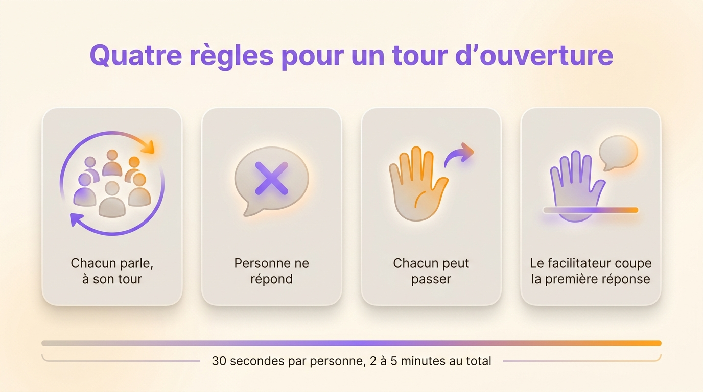
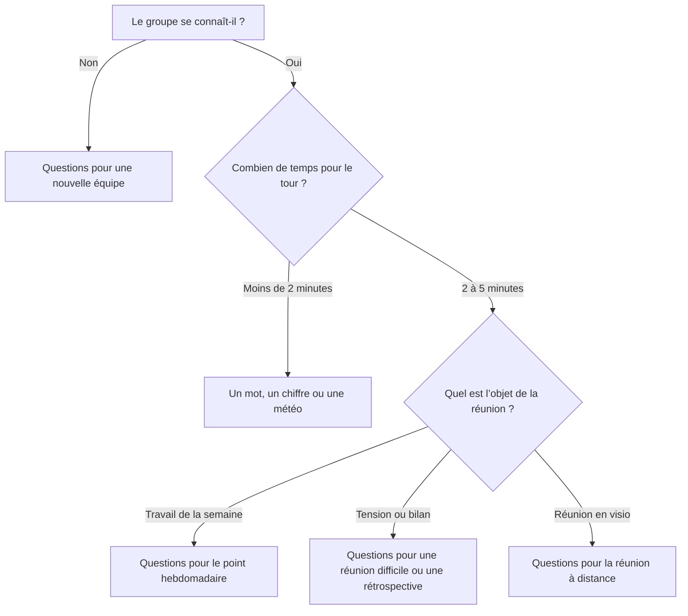

Un ice breaker de réunion est un tour de table court où chacun répond à une question avant l’ordre du jour. Il dure 2 à 5 minutes, environ 30 secondes par personne. Chacun prend la parole une fois et dit ce qui l’occupe, si bien que le groupe sait dans quel état arrivent les participants avant le premier sujet. Vous trouverez ici 40 questions classées par type de réunion, les règles qui gardent le tour court et les questions à éviter au travail.

La plupart des listes d’ice breakers proposent des jeux de soirée. « Deux vérités et un mensonge » amuse une fois en séminaire, puis lasse dès le deuxième lundi à 9 h 30. Un tour que vous refaites chaque semaine devient un rituel. L’holacratie donne déjà ses règles à ce rituel : la [réunion tactique](/fr/blog/tactical-meeting) s’ouvre sur un tour où personne ne répond aux autres.

## À quoi sert un ice breaker en réunion

Le tour d’ouverture fait parler chacun une fois avant qu’on lui demande son avis. Quelqu’un qui n’a rien dit pendant vingt minutes a plus de mal à exprimer un désaccord à la vingt et unième. Quelqu’un qui a répondu à une question simple au début prend ensuite la parole plus facilement.

Joseph A. Allen, professeur de psychologie du travail et des organisations à l’université du Nebraska à Omaha, a mesuré l’effet des échanges qui précèdent une réunion. Avec Nale Lehmann-Willenbrock et Nicole Landowski, il a interrogé 252 salariés pour une étude publiée dans le _Journal of Managerial Psychology_ en 2014. Les bavardages d’avant réunion prédisaient l’efficacité perçue de la réunion, même à pratiques de réunion égales. Le lien était plus fort chez les participants les moins extravertis.

Un tour d’ouverture intègre ces échanges à la réunion : la personne arrivée pile à l’heure en profite autant que celle arrivée cinq minutes en avance.

Si vous animez la réunion, les réponses vous disent aussi quoi changer à l’ordre du jour. Si trois personnes sur six disent bloquer sur la même livraison, ajoutez cette livraison à l’ordre du jour. Si quelqu’un annonce qu’il part à 10 h 15, avancez son sujet.

## Ice breaker, check-in, humeur du jour, météo : une même pratique

Les équipes donnent au tour d’ouverture des noms différents selon leur culture. Dans tous les cas, chacun répond à une question, à son tour, avant le premier sujet.

- L’**ice breaker**, ou brise-glace, désigne en général une question plus légère, pour des personnes qui se connaissent peu ou pas.
- Le **check-in** porte sur l’état de la personne et ce qui l’occupe. L’holacratie l’appelle tour d’ouverture.
- L’**humeur du jour** demande une réponse en un mot, un chiffre ou une couleur.
- Avec la **météo**, ou météo intérieure, chacun décrit son état comme un bulletin : soleil, nuages, orage.
- Le **tour de table** est le nom générique de toute prise de parole où chacun parle une fois.

Une équipe peut prendre une question légère le premier jour, puis une question de check-in chaque semaine. Le tour a surtout besoin d’une question claire et d’une durée fixée.

## Les quatre règles d’un tour d’ouverture qui reste court

La constitution Holacracy demande à chacun, pendant le tour d’ouverture, de partager son état du moment ou un autre commentaire. Elle interdit les réponses. Les facilitateurs y ajoutent en général trois règles.

1. Chacun parle, à son tour. Faites le tour de la table ou suivez la grille de la visio. Quand chacun parle dès qu’il le souhaite, la personne la plus discrète passe en dernier, et parfois pas du tout.
2. Personne ne répond. Un « moi aussi » ou une question sur le week-end de quelqu’un transforme le tour en conversation. Les réponses ont leur place dans l’ordre du jour, où le sujet a le temps d’être traité.
3. Chacun peut passer. « Je passe » est une réponse valable, que personne n’a à justifier. Quand quelqu’un trouve la question trop personnelle, passez à la personne suivante sans insister.
4. Le facilitateur coupe la première réponse. La première séance fixe la règle. Si vous arrêtez gentiment le premier commentaire, les suivants se font rares.

La première personne à répondre donne la longueur aux autres. Si vous animez, répondez en premier en une seule phrase pour que le tour tienne dans le temps prévu.

{/* IMAGE regen: api.py image, infographic, 1600x900. Scene: "Une infographie horizontale titrée « Quatre règles pour un tour d’ouverture » en sans-serif moderne, gras et net, en haut. En dessous, quatre cartes arrondies alignées, chacune avec une icône simple et un libellé court. Carte 1 : icône de personnes assises en cercle avec une flèche qui fait le tour, libellé « Chacun parle, à son tour ». Carte 2 : icône de bulle de dialogue barrée, libellé « Personne ne répond ». Carte 3 : icône de main levée avec une petite flèche vers l’avant, libellé « Chacun peut passer ». Carte 4 : icône de main levée dans un geste d’arrêt doux à côté d’une petite bulle de dialogue, libellé « Le facilitateur coupe la première réponse ». En bas, une fine barre de temps légendée « 30 secondes par personne, 2 à 5 minutes au total ». Beaucoup d’espace, cartes en gris chaud avec icônes violettes et orange." */}

## Questions de check-in pour la réunion d’équipe hebdomadaire

Ces questions conviennent à un point d’équipe récurrent, où tout le monde se connaît et où le temps compte. Elles portent sur le travail et les priorités.

1. Qu’est-ce qui vous occupe le plus l’esprit cette semaine ?
2. De quoi avez-vous besoin pour sortir satisfait de cette réunion ?
3. Qu’est-ce qui s’est bien passé pour vous depuis la dernière réunion ?
4. De 1 à 5, quelle énergie avez-vous pour cette réunion ?
5. Qu’attendez-vous de quelqu’un autour de cette table ?
6. Qu’est-ce qui ferait de cette semaine une bonne semaine ?
7. Qu’avez-vous terminé depuis la dernière fois dont vous êtes fier ?
8. Qu’est-ce qui pourrait vous distraire dans l’heure qui vient ?
9. Quel mot résume votre semaine jusqu’ici ?
10. Quel sujet aimeriez-vous voir traité aujourd’hui ?

Les réponses sur ce dont chacun a besoin, ce qu’il attend des autres et le sujet qu’il veut voir traité sont déjà des points pour l’ordre du jour. Dans un [modèle d’ordre du jour de réunion](/fr/blog/meeting-agenda-template), placez le tour avant les sujets pour que chacun puisse ajouter ce qui est ressorti du tour.

## Ice breakers pour une réunion à distance ou hybride

En visio, personne ne voit qui attend pour parler, alors les participants se coupent la parole. Annoncez un ordre de passage au début, donnez la parole dans cet ordre, et laissez répondre dans le chat quand la connexion est mauvaise.

11. À quoi ressemble la vue depuis votre bureau aujourd’hui ?
12. Qu’est-ce qui vous a fait rire cette semaine ?
13. Qu’est-ce qui traîne sur votre bureau et ne devrait pas y être ?
14. Comment va votre connexion aujourd’hui, technique et personnelle ?
15. Quelle heure est-il chez vous, et comment se passe votre journée ?
16. Montrez un objet à portée de main et dites pourquoi il est là.
17. Qu’avez-vous fait cette semaine loin d’un écran ?
18. Comment allez-vous, en un emoji ? Postez-le dans le chat, puis dites-le à voix haute.

En réunion hybride, commencez par les personnes à distance. Elles ont le plus de mal à prendre la parole. En parlant les premières, elles se retrouvent à égalité avec la salle. Cet ordre de passage est l’un des moyens de [rendre une réunion à distance efficace](/fr/blog/remote-meetings).

## Ice breakers pour une nouvelle équipe ou un nouvel arrivant

Une équipe qui se forme a d’abord besoin de savoir comment chacun travaille. Les loisirs peuvent attendre. Ces questions donnent des informations que l’équipe utilise dès le lendemain.

19. Sur quoi travailliez-vous avant de rejoindre l’équipe ?
20. Comment préférez-vous être contacté en cas d’urgence ?
21. À quel moment de la journée travaillez-vous le mieux ?
22. Qu’est-ce que les gens comprennent souvent mal de votre métier ?
23. De quoi avez-vous besoin pour faire confiance à un collègue ?
24. Quelle compétence avez-vous que l’équipe ne connaît peut-être pas ?
25. Qu’est-ce qui vous a fait dire oui à ce projet ?
26. Quelle habitude de votre ancienne équipe aimeriez-vous garder ?

Quand un nouvel arrivant rejoint une équipe existante, posez la même question à tout le monde, lui compris. Un tour où seul le nouveau parle ressemble à un entretien d’embauche.

{/* TODO ANECDOTE: une équipe Rolebase ou un client qui pratique un check-in hebdomadaire, la question utilisée et ce que ça a changé (par exemple un blocage révélé pendant le tour). */}

## L’humeur du jour en un mot, un chiffre ou une météo

Les formats rapides conviennent à un point quotidien ou à un grand groupe. Chaque réponse prend cinq secondes, donc une équipe de douze termine en une minute.

27. Dites en un mot comment vous arrivez.
28. Donnez un chiffre de 1 à 10 pour votre énergie en ce moment.
29. Quelle est votre météo intérieure : soleil, nuages, orage ou brouillard ?
30. Choisissez une couleur pour votre semaine jusqu’ici.
31. Citez une chanson qui résume votre matinée.
32. Vert, orange ou rouge : quelle est votre charge cette semaine ?

Avec un chiffre ou une couleur, chacun peut signaler une mauvaise journée sans la raconter. Si quelqu’un répond « orage » ou « 2 », attendez la fin de la réunion pour prendre de ses nouvelles en tête à tête.

## Questions de check-in pour une réunion difficile ou une rétrospective

Avant une décision tendue ou une rétrospective, le tour montre dans quel état arrive chacun. Posez une question qui permet de nommer une inquiétude sans ouvrir le débat.

33. Qu’est-ce qui vous inquiète dans le sujet du jour ?
34. À quoi ressemblerait une bonne issue pour vous ?
35. De quoi avez-vous besoin de la part des autres pour parler librement ?
36. Qu’avez-vous apprécié chez quelqu’un ici depuis la dernière rétrospective ?
37. À quoi êtes-vous prêt à renoncer aujourd’hui ?
38. Quel moment du dernier mois préféreriez-vous ne pas revivre ?
39. Que savez-vous déjà de ce sujet que les autres ignorent peut-être ?
40. De 1 à 5, à quel point pensez-vous qu’on décidera aujourd’hui ?

Notez les inquiétudes nommées pendant le tour et revenez-y en fin de réunion, pour que chacun voie qu’il a été entendu.

## Quelle question choisir pour votre réunion

Le choix dépend de ce que les participants savent les uns des autres, du temps disponible et de l’objet de la réunion.

## Les ice breakers à éviter en contexte professionnel

Certaines questions marchent en soirée et tombent à plat en salle de réunion. Écartez ces cinq familles :

- Les questions sur la vie privée auxquelles tout le monde ne peut pas répondre sereinement, comme les projets de famille, la religion, la santé ou les dépenses du week-end.
- Les jeux avec un gagnant et un perdant, comme les quiz ou les devinettes. Celui qui perd se sent pointé du doigt avant même le début.
- Les activités physiques qui excluent les personnes en situation de handicap ou celles qui suivent en visio.
- Les questions qui demandent d’avouer un défaut ou un souvenir gênant devant son manager.
- Tout ce qui dure plus longtemps que les sujets. Un ice breaker de 15 minutes dans une réunion de 30 donne l’impression que l’ordre du jour est facultatif.

Avant de poser la question, pensez à la personne la moins à l’aise de la salle : répondrait-elle sans hésiter ? Au moindre doute, changez de question.

## Intégrer le tour à vos modèles de réunion dans Rolebase

Dans Rolebase, une réunion appartient à un rôle et se compose d’étapes ordonnées. L’étape « Note libre » convient au tour d’ouverture. Elle sert à faire un tour de table ou une discussion libre, en prenant des notes au fil des prises de parole. Quand vous créez une organisation, Rolebase installe des modèles de réunion comme la réunion d’équipe hebdomadaire, la rétrospective ou la réunion de triage de l’holacratie, aussi appelée [réunion tactique](/fr/glossary/reunion-tactique). Tous commencent par cette étape.

- Dans le modèle, renommez l’étape en « Check-in ». À chaque réunion, écrivez la question de la semaine dans les notes de l’étape.
- Ajoutez une seconde étape « Note libre » à la fin pour un tour de clôture.
- Les étapes de travail, comme les tâches et les discussions, suivent le tour dans le modèle : la réunion passe du tour au travail sans rupture.
- Les notes prises pendant le tour restent attachées à cette réunion, à côté des tâches et des décisions.

Rolebase ne met pas de minuteur sur les étapes, alors si vous êtes [facilitateur](/fr/glossary/facilitateur), tenez vous-même le tour à 30 secondes par personne. Vous pouvez aussi [planifier des réunions récurrentes à partir d’un modèle](/fr/docs/meetings). Rolebase réunit dans un même outil les réunions, [les rôles, les tâches et les décisions](/fr/features).

## Questions fréquentes

<FaqList>

<FaqItem question="Quel est un ice breaker amusant pour une réunion ?">

Demandez ce qui traîne sur le bureau et ne devrait pas y être, ou une chanson qui résume la matinée. Les deux font rire sans mettre personne en difficulté. L’humour marche tant que tout le monde peut répondre et que personne ne devient la cible de la blague.

</FaqItem>

<FaqItem question="Qu’est-ce qu’un exercice « humeur du jour » ?">

Chaque participant donne son état du moment en un mot, un chiffre de 1 à 10, une couleur ou une météo, à tour de rôle et sans commentaire des autres. L’exercice prend moins d’une minute pour une équipe de dix, ce qui convient au point quotidien.

</FaqItem>

<FaqItem question="Quelles sont 10 questions pour briser la glace en réunion ?">

Les dix questions pour le point d’équipe hebdomadaire fonctionnent dans la plupart des équipes : ce qui vous occupe l’esprit, ce dont vous avez besoin pour sortir satisfait, ce qui s’est bien passé, votre énergie de 1 à 5, ce que vous attendez de quelqu’un, ce qui ferait une bonne semaine, ce que vous avez terminé, ce qui pourrait vous distraire, un mot pour la semaine et le sujet à traiter.

</FaqItem>

<FaqItem question="Quel est le meilleur ice breaker pour mieux se connaître ?">

Pour une équipe qui se forme, préférez les questions sur les façons de travailler : comment chacun préfère être contacté, à quel moment il travaille le mieux, ce dont il a besoin pour faire confiance. Elles donnent au groupe des informations qu’il utilise dès le lendemain, contrairement aux questions sur les loisirs.

</FaqItem>

<FaqItem question="Combien de temps doit durer un tour de check-in ?">

Comptez 30 secondes par personne, soit 2 à 5 minutes pour la plupart des équipes. Si vous animez, répondez en premier et brièvement pour donner la longueur. Si le tour déborde souvent, passez à un format en un mot ou divisez l’équipe.

</FaqItem>

<FaqItem question="Quelle différence entre un check-in et un ice breaker ?">

Le check-in, qui revient en général à chaque réunion, porte sur l’état de la personne et ce qui l’occupe. L’ice breaker est souvent plus léger et s’adresse à des personnes qui ne se connaissent pas encore. Dans les deux cas, chacun répond une fois, à son tour, sans que les autres commentent.

</FaqItem>

</FaqList>

## Ouvrez la prochaine réunion avec une question

Choisissez une question adaptée à votre prochaine réunion, répondez-y en premier en une phrase, et coupez la première réponse. Pour donner la même ouverture à toutes vos réunions récurrentes, [créez un compte Rolebase gratuit](/signup) et renommez en « Check-in » l’étape « Note libre » qui ouvre chaque modèle.
