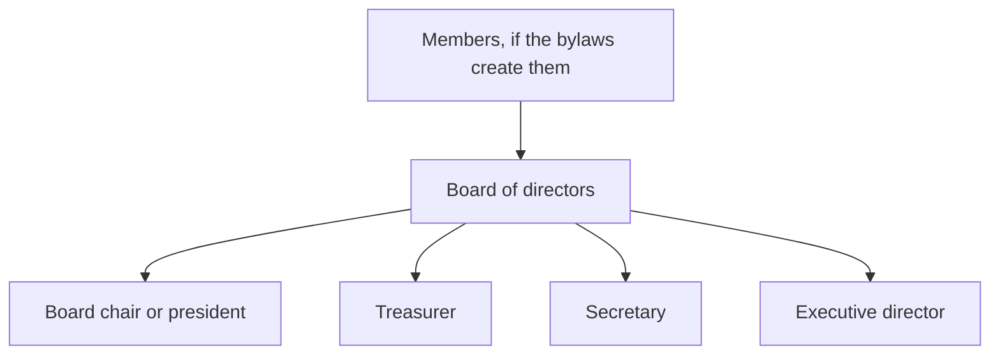
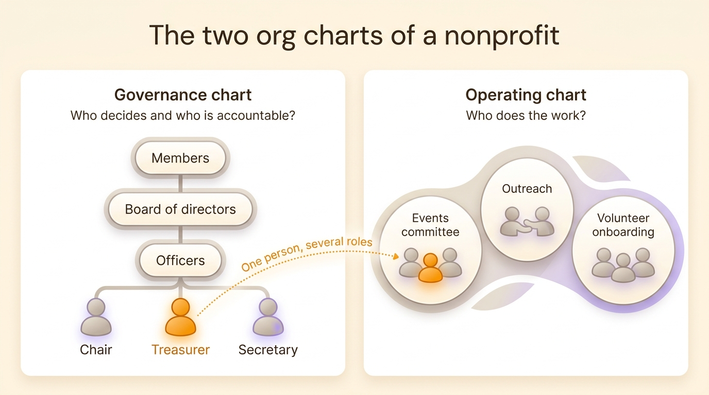
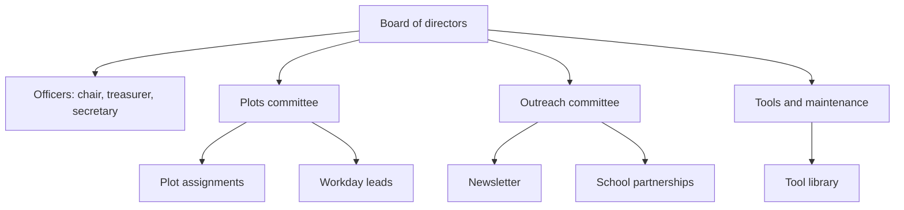
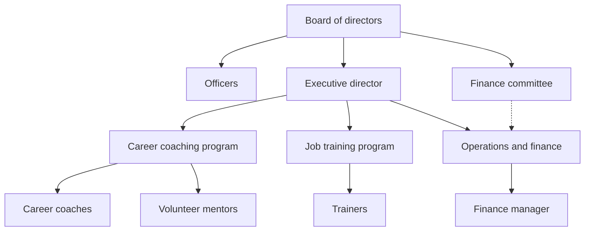
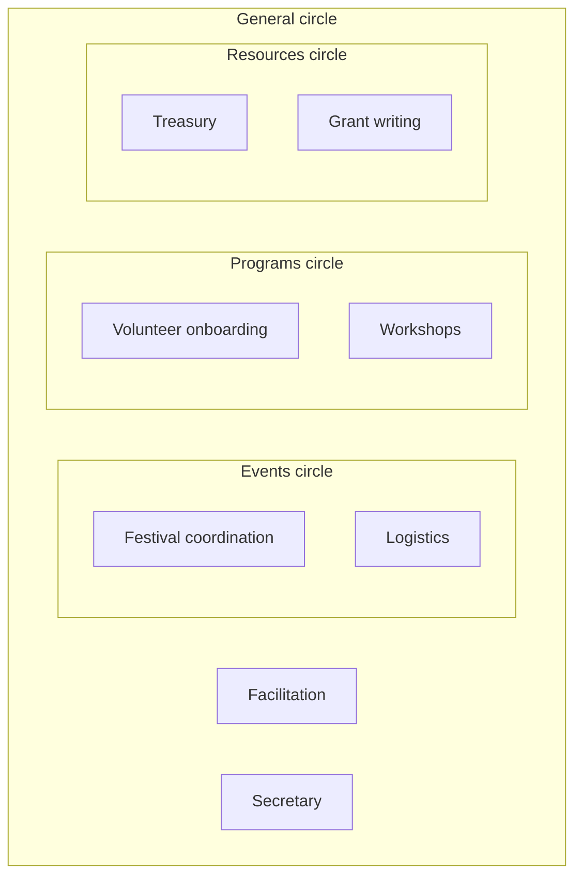
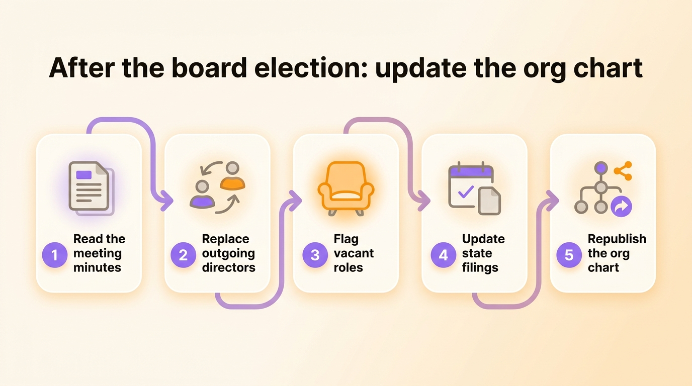

A nonprofit org chart has two layers. The top layer is governance: the board of directors, elected by the members or self-perpetuating depending on the bylaws, with officers such as a chair, a treasurer and a secretary. The bottom layer is operations: the executive director, the staff, the volunteers and the committees that run the programs day to day. Most templates show only one of the two. Below you will find what each layer looks like, what the law actually requires, three examples by size of organization, and a template to fill in.

## The governance chart: members, board and officers

In a typical US nonprofit corporation, the board of directors holds authority. If the bylaws create voting members, they elect the board at an annual meeting. If not, the board elects its own successors. The board then elects officers from among its directors and hires an executive director to run the organization.

The chair runs board meetings and speaks for the board. The treasurer oversees the finances and presents the financial reports. The secretary keeps the minutes and the corporate records. Many boards add a vice chair, plus standing committees such as finance, governance and fundraising.

## State law sets the minimum board, the IRS asks about independence

Nonprofit corporations are created under state law, so the state sets the minimum number of directors and the officers you must name. Most states require at least three directors, while a few, California among them, allow a single one. Many states require a president, a secretary and a treasurer, or let the bylaws name the officers. The bylaws fill in the rest: term lengths, how directors are elected, which committees exist.

The IRS sets no minimum board size for 501(c)(3) status. Form 990, the annual return larger tax-exempt organizations file, asks how many voting board members are independent and lists every officer, director and key employee by name. A board made of the founder and two relatives is legal in many states, yet donors and grantmakers read it as a red flag.

Check your bylaws and your state’s nonprofit corporation act before you draw anything. The governance chart follows from them, box by box.

## The two org charts of a nonprofit

The governance chart answers "who decides and who is accountable?". It does not show who runs the spring gala, who answers families on the helpline or who updates the website. For that you need an operating chart, which shows the programs, the committees and the people who run them.

The two charts overlap because the same people appear in both. The board treasurer may also lead the gala committee and coordinate the event volunteers. In a nonprofit, a board member often holds three or four roles, only one of them a board seat. A chart that stops at the board suggests that five people do everything. Leave the board off, and a new volunteer cannot tell who approves a purchase.

{/* IMAGE regen: api.py image, infographic, 1600x900. Scene: "Two-panel side-by-side comparison infographic titled 'The two org charts of a nonprofit'. Left panel titled 'Governance chart' with subtitle 'Who decides and who is accountable?': a small top-down tree of three stacked rounded boxes labelled 'Members', 'Board of directors', 'Officers', and under the officers three small person icons labelled 'Chair', 'Treasurer', 'Secretary'. Right panel titled 'Operating chart' with subtitle 'Who does the work?': three soft rounded circles labelled 'Events committee', 'Outreach', 'Volunteer onboarding', each holding two or three small person icons. One single person icon highlighted in orange appears in the left panel under 'Treasurer', and the same orange person appears again in the right panel inside 'Events committee'. One dotted curved line starts directly from the orange treasurer icon (not from any other person) and ends on the orange person in the right panel, labelled 'One person, several roles'. Clean balanced layout on a warm cream background, generous white space. Every label in single quotes above is the exact text to render, without the quote marks themselves: draw no quotation marks or guillemets anywhere." */}

## Example 1: a small volunteer-run nonprofit

Take a community garden with about 80 members and no paid staff. It has a five-person board that meets monthly and around a dozen active volunteers split into three committees.

Each committee has a chair who reports to the board. In practice the treasurer also leads workdays and the secretary writes the newsletter, so each of them appears twice on the chart. Place them only once, on the board, and members no longer know whom to ask about a workday.

## Example 2: a staffed nonprofit

A workforce development nonprofit with 25 employees and about 40 volunteers works differently. The board sets strategy, approves the budget and hires the executive director. The executive director manages the staff. Volunteers work inside the programs alongside the staff.

The executive director is the board’s only employee and manages everyone else. Conflicts in a staffed nonprofit often start when board members give instructions directly to staff and skip the executive director. Write down next to the chart what the board delegates to the executive director: hiring, spending up to a set amount, relations with funders. The dotted line from the finance committee to operations shows oversight without reporting, such as the committee reviewing monthly statements with the finance manager.

## Example 3: a nonprofit with shared governance

Some nonprofits, and many cooperatives, replace the top-down structure with circles. Each circle has a purpose and makes decisions within its domain. Roles are filled by election for a fixed term, often [without declared candidates](/en/blog/election-without-candidate). A general circle, with an elected representative from each circle, coordinates the whole. That is how [sociocracy](/en/blog/sociocracy-intro) works. A sociocratic structure is easier to draw as nested circles than as a tree.

The legal board stays. State law still requires directors, so some organizations seat the general circle as the board, or have the board delegate operating decisions to the circles in writing. EVEA, a French environmental consultancy run as a 140-person worker cooperative, [mapped its business, support and governance units](/en/client-cases/scop-evea) in one org chart. A consultant there can appear in her practice area, on the employee council and in a working group at the same time. To go further, read how [shared governance works inside a company or a nonprofit](/en/blog/collaborative-governance).

## How to build your nonprofit org chart

1. Start from the bylaws. Write down the bodies they create, the number of seats and the term lengths.
2. List roles before names: board chair, treasurer, program lead, volunteer coordinator, event chair. For each role, write in one line what it is responsible for. A simple way to [define roles and responsibilities](/en/blog/define-roles) avoids overlaps and gaps.
3. Place each role under the body or the program it reports to.
4. Then add people. A volunteer who holds three roles appears three times, once in each role.
5. Keep vacant roles visible. An open board seat shown on the chart finds a taker faster than a gap nobody mentions.
6. Share the chart where people look for it: on your website, in the volunteer handbook, in the board orientation packet.

For a nonprofit where each committee has a single chair, a [hierarchy chart](/en/blog/hierarchy-chart) is enough. When volunteers hold several roles and committees overlap, circles show those overlaps better. Each of the [six types of org chart](/en/blog/org-chart-types) has its uses.

## Keeping the chart current after board elections

A nonprofit org chart changes on a schedule, after the annual meeting or the board election, when directors and officers rotate. Many states ask for a periodic report that lists the current officers and directors. Form 990 names them every year for the organizations that file it. Update the chart the same day you update those filings, with the list of newly elected people in front of you.

Between elections, changes come from the programs: a volunteer leaves, another takes over the workshops. Name one person in charge of the chart, often the secretary or the volunteer coordinator, and make chart updates a standing item at board meetings.

{/* IMAGE regen: api.py image, infographic, 1600x900. Scene: "Horizontal five-step process infographic titled 'After the board election: update the org chart'. Five rounded cards connected left to right by a soft curved arrow, each card with a number in a purple circle, a small simple icon and a short label. 1 'Read the meeting minutes' (document icon). 2 'Replace outgoing directors' (two people swapping icon). 3 'Flag vacant roles' (empty chair icon, highlighted in orange). 4 'Update state filings' (calendar icon). 5 'Republish the org chart' (share icon). Clean flat layout on a warm cream background, generous spacing, modern clean bold sans-serif typography. Every label in single quotes above is the exact text to render, without the quote marks themselves: draw no quotation marks or guillemets anywhere." */}

A chart drawn in PowerPoint has to be redrawn after every election. In Rolebase, the org chart is built from roles: when you remove a member from a role and add another, the chart updates. The same roles display [as circles, as a hierarchy tree or as a photo directory](/en/docs/org-chart). You can publish the chart on a public page, as a link or embedded in your website, and export it as a PNG image for the annual report.

## Nonprofit org chart template

Copy this table, fill in one row per role, then draw the chart from the "Reports to" column.

| Role | Reports to | Responsibility in one line | Holder | Term ends |
|---|---|---|---|---|
| Board chair | Board of directors | Run board meetings, speak for the board | | |
| Treasurer | Board of directors | Oversee finances, present financial reports | | |
| Secretary | Board of directors | Minutes, notices, corporate records | | |
| Executive director (if staffed) | Board of directors | Manage staff, carry out the budget | | |
| Events committee chair | Board of directors | Plan the year’s events | | |
| Volunteer coordinator | Executive director | Recruit, onboard and schedule volunteers | | |
| Program lead | Executive director | Run one program and report on it | | |

A row with no holder is a vacant role. Keep it in the table.

## Frequently asked questions

<FaqList>

<FaqItem question="What does a nonprofit organizational chart look like?">

It usually looks like a tree. The board of directors sits at the top, with the officers next to it, then the executive director, then the programs or departments with their staff and volunteers. A volunteer-run nonprofit replaces the executive director with committees that report straight to the board.

</FaqItem>

<FaqItem question="What is the typical hierarchy in a nonprofit organization?">

The board of directors holds final authority and is accountable for the mission and the finances. It hires and oversees the executive director, who manages the staff. Volunteers work within programs under a staff member or a committee chair. If the bylaws create voting members, they elect the board.

</FaqItem>

<FaqItem question="What is the best organizational structure for a nonprofit?">

It depends on size and staffing. A small volunteer-run nonprofit works well with a board and a few committees. A staffed nonprofit needs a clear line between the board, which governs, and the executive director, who manages. Nonprofits where volunteers hold several roles often do better with a role-based structure in circles.

</FaqItem>

<FaqItem question="How many board members does a nonprofit need?">

State law sets the minimum. Most states require at least three directors, while a few allow one. The IRS sets no minimum for 501(c)(3) status, but Form 990 asks how many voting board members are independent. Funders tend to expect a board of at least three unrelated people.

</FaqItem>

<FaqItem question="Do volunteers go on the org chart?">

Yes. Show volunteers in the roles they actually hold, such as committee chair, mentor or event lead. Leaving them off hides most of the work in a small nonprofit and leaves new volunteers unable to see where they fit.

</FaqItem>

</FaqList>

## One org chart for both layers of your nonprofit

Draw the governance chart from your bylaws first, then the operating chart from the roles people actually hold, showing each volunteer everywhere they contribute. Update both after every board election.

[Create a free Rolebase account](/signup) to describe your nonprofit’s roles and display the chart as circles or as a tree. The free plan covers 5 active members, meaning people who have an account or a pending invitation. A volunteer you add to the chart without inviting them does not count toward those 5. Nonprofits can also [get a significant discount or free access](/en/pricing), depending on their status.
