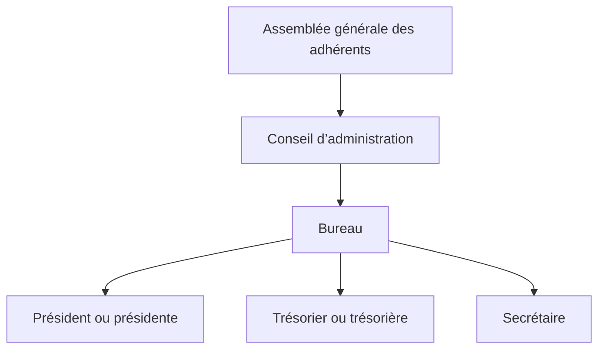
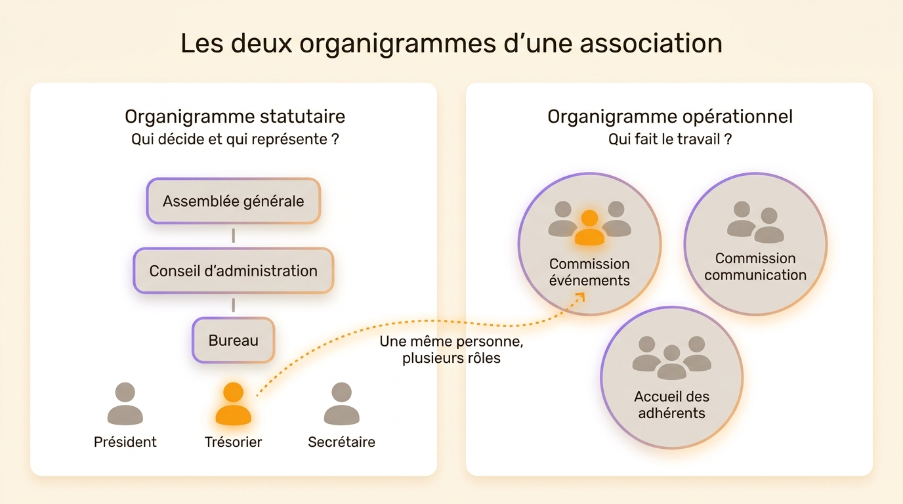
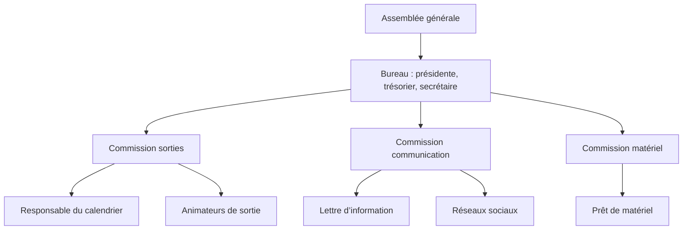
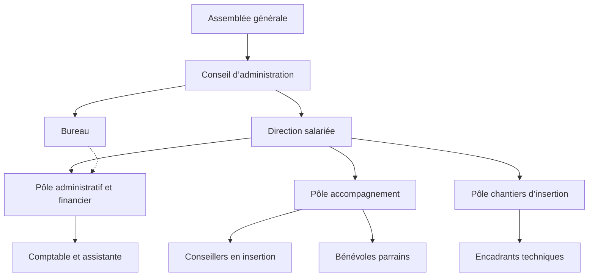
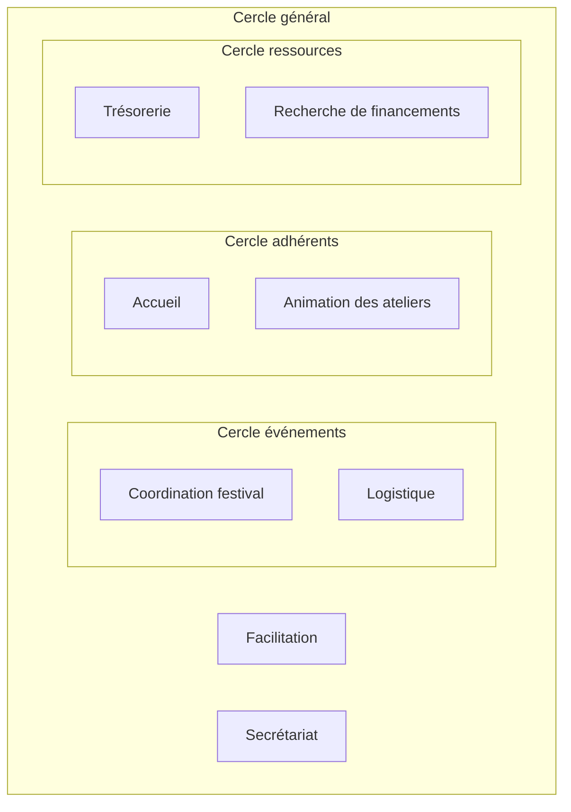
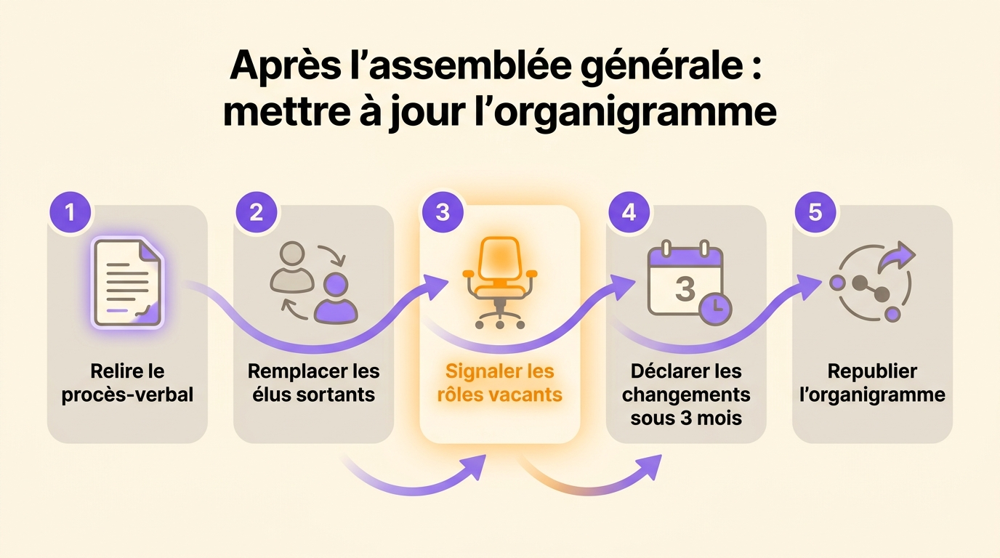

L’organigramme d’une association se lit à deux niveaux. En haut, on trouve les instances fixées par les statuts, le plus souvent l’assemblée générale des adhérents, qui élit un conseil d’administration, qui désigne à son tour un bureau avec un président, un trésorier et un secrétaire. En dessous, on trouve l’équipe qui fait tourner l’association au quotidien : les salariés s’il y en a, les bénévoles et les commissions. La plupart des modèles en ligne montrent un seul des deux niveaux. Vous trouverez ci-dessous à quoi ressemble chaque niveau, ce que la loi 1901 impose vraiment, trois exemples selon la taille de l’association et un modèle à remplir.

## L’organigramme statutaire : AG, conseil d’administration et bureau

Dans une association loi 1901 classique, le pouvoir part des adhérents. L’assemblée générale les réunit au moins une fois par an. Elle approuve les comptes, vote les grandes orientations et élit le conseil d’administration. Le conseil choisit ensuite parmi ses membres un bureau, qui gère les affaires courantes entre deux réunions.

Le président représente l’association en justice et signe en son nom. Le trésorier tient les comptes et prépare le bilan financier présenté en AG. Le secrétaire rédige les convocations et les procès-verbaux, et tient le registre des délibérations. Beaucoup d’associations ajoutent un vice-président, un trésorier adjoint ou un secrétaire adjoint pour assurer les remplacements.

## La loi 1901 laisse les statuts fixer les instances

La loi du 1er juillet 1901 ne prévoit ni conseil d’administration ni bureau. Elle laisse les statuts décider des instances, de leur composition et de la façon dont on y entre. Elle pose deux obligations : désigner au moins une personne qui agit au nom de l’association, et déclarer en préfecture les personnes chargées de son administration.

En pratique, les associations choisissent souvent l’un de ces trois montages :

- le schéma classique, avec AG, conseil d’administration et bureau
- un bureau seul, sans conseil, courant dans les petites associations
- une direction collégiale, où plusieurs coprésidents ou un collège solidaire partagent la représentation

Des règles plus strictes s’appliquent dans certains cas, par exemple pour une association reconnue d’utilité publique ou une fédération sportive agréée. Relisez vos statuts avant de dessiner quoi que ce soit : l’organigramme statutaire en découle, case par case.

## Les deux organigrammes d’une association

L’organigramme statutaire répond à la question « qui décide et qui représente ? ». Il ne montre pas qui organise le prochain tournoi, qui répond aux familles ou qui met à jour le site. Pour ça, il faut un organigramme opérationnel, qui montre les commissions, les pôles et les personnes qui les animent.

Les deux schémas se recoupent, car les mêmes personnes apparaissent dans les deux. La trésorière peut aussi tenir la buvette et coordonner les bénévoles du festival. Dans une association, un membre du bureau tient souvent trois ou quatre rôles, dont un seul est statutaire. Si l’organigramme s’arrête au bureau, on croit que trois personnes font tout. À l’inverse, sur un organigramme sans le bureau, un nouveau bénévole ne trouve pas qui valide une dépense.

{/* IMAGE regen: api.py image, infographic, 1600x900. Scene: "Two-panel side-by-side comparison infographic titled 'Les deux organigrammes d’une association'. Left panel titled 'Organigramme statutaire' with subtitle 'Qui décide et qui représente ?': a small top-down tree of three stacked rounded boxes labelled 'Assemblée générale', 'Conseil d’administration', 'Bureau', and under the bureau three small person icons labelled 'Président', 'Trésorier', 'Secrétaire'. Right panel titled 'Organigramme opérationnel' with subtitle 'Qui fait le travail ?': exactly three soft rounded circles, each label written only once, inside or just above its own circle: 'Commission événements', 'Commission communication', 'Accueil des adhérents'. Each circle holds two or three small person icons. One single person icon highlighted in orange appears in the left panel under 'Trésorier', and the same orange person appears again in the right panel inside 'Commission événements'. One dotted curved line starts directly from the orange treasurer icon (not from any other person) and ends on the orange person in the right panel, labelled 'Une même personne, plusieurs rôles'. Clean balanced layout on a warm cream background, generous white space. Every label in single quotes above is the exact text to render, without the quote marks themselves: draw no quotation marks or guillemets anywhere." */}

## Exemple 1 : une petite association de bénévoles

Prenons un club de randonnée d’environ 80 adhérents, sans salarié. Il a un bureau de trois personnes et une douzaine de bénévoles actifs répartis en trois commissions.

Les statuts de ce club confient la gestion à un bureau élu chaque année par l’AG, sans conseil d’administration. Chaque commission a un responsable qui rend compte au bureau. Dans les faits, le trésorier anime aussi des sorties et la secrétaire écrit la lettre d’information. Sur l’organigramme, ils apparaissent donc deux fois chacun. Si vous les placez une seule fois, dans le bureau, les adhérents ne savent pas à qui écrire pour une question sur une sortie.

## Exemple 2 : une association employeuse

Une association d’insertion de 25 salariés et d’une quarantaine de bénévoles fonctionne autrement. Le conseil d’administration fixe la stratégie et le budget. Il recrute une directrice salariée, qui encadre l’équipe. Les bénévoles interviennent dans les pôles, aux côtés des salariés.

Le point délicat de ce schéma se trouve entre le bureau et la direction. L’employeur légal est l’association, représentée par son président, mais la directrice dirige l’équipe au quotidien. Écrivez à côté de l’organigramme ce que le conseil a délégué à la direction : recrutements, signature des dépenses jusqu’à un certain montant, relations avec les financeurs. La ligne en pointillés entre le bureau et le pôle administratif montre un lien de suivi sans hiérarchie, celui du trésorier qui relit les comptes avec la comptable.

## Exemple 3 : une association en gouvernance partagée

Certaines associations, et beaucoup de coopératives, remplacent le bureau par des cercles. Chaque cercle a sa raison d’être et décide dans son périmètre. Les rôles s’y attribuent par élection, souvent [sans candidat déclaré](/fr/blog/election-without-candidate), pour une durée fixe. Un cercle général, où siège un représentant élu de chaque cercle, coordonne l’ensemble. C’est le fonctionnement de la [sociocratie](/fr/blog/sociocracy-intro), qui se dessine mieux en cercles imbriqués qu’en arbre.

L’organigramme statutaire reste nécessaire. La loi demande toujours un représentant, par exemple une coprésidence que les statuts rattachent au cercle général. La Scop EVEA, cabinet de conseil en environnement de 140 personnes, a [cartographié ses entités business, support et de gouvernance](/fr/client-cases/scop-evea) dans un seul organigramme. Une consultante peut y apparaître à la fois dans son pôle métier, au CSE et dans un groupe de travail. Pour aller plus loin sur ce mode de fonctionnement, lisez comment [la gouvernance partagée fonctionne dans une entreprise ou une association](/fr/blog/collaborative-governance).

## Construire l’organigramme de votre association, étape par étape

1. Partez des statuts. Notez les instances qu’ils prévoient, leur nombre de membres et la durée des mandats.
2. Listez les rôles avant les noms : présidence, trésorerie, responsable d’une commission, référent d’un local, coordinateur d’un événement. Pour chaque rôle, écrivez en une ligne de quoi il est chargé. Une méthode simple pour [définir les rôles et les responsabilités](/fr/blog/define-roles) évite les doublons et les trous.
3. Rangez chaque rôle dans l’instance ou la commission dont il dépend.
4. Placez ensuite les personnes. Une bénévole qui tient trois rôles apparaît trois fois, une fois dans chaque rôle.
5. Laissez visibles les rôles vacants. Un poste de trésorier adjoint vide depuis un an, montré sur l’organigramme, trouve plus vite preneur qu’un manque dont personne ne parle.
6. Partagez le schéma là où les adhérents le cherchent : sur le site de l’association, dans le livret d’accueil des bénévoles, au tableau du local.

Pour une association où chaque commission a un seul responsable, un [organigramme hiérarchique en arbre](/fr/blog/hierarchy-chart) suffit. Quand les bénévoles cumulent les rôles et que les commissions se chevauchent, choisissez plutôt les cercles. Les [six types d’organigramme](/fr/blog/org-chart-types) ont chacun leurs usages.

## Tenir l’organigramme à jour après chaque assemblée générale

L’organigramme d’une association change surtout à date fixe, après l’AG, quand le conseil et le bureau sont renouvelés. L’article 5 de la loi 1901 oblige l’association à déclarer en préfecture, dans les trois mois, les changements dans son administration. Mettez l’organigramme à jour le jour même où vous préparez cette déclaration, avec la liste des élus sous les yeux.

Entre deux AG, les changements viennent des commissions : un bénévole part, un autre reprend l’animation des ateliers. Désignez une personne chargée de l’organigramme, souvent le secrétaire, et inscrivez la mise à jour à l’ordre du jour de chaque réunion de bureau.

{/* IMAGE regen: api.py image, infographic, 1600x900. Scene: "Horizontal five-step process infographic titled 'Après l’assemblée générale : mettre à jour l’organigramme'. Five rounded cards connected left to right by a soft curved arrow, each card with a number in a purple circle, a small simple icon and a short label. 1 'Relire le procès-verbal' (document icon). 2 'Remplacer les élus sortants' (two people swapping icon). 3 'Signaler les rôles vacants' (empty chair icon, highlighted in orange). 4 'Déclarer les changements sous 3 mois' (calendar icon). 5 'Republier l’organigramme' (share icon). Clean flat layout on a warm cream background, generous spacing, modern clean bold sans-serif typography. Every label in single quotes above is the exact text to render, without the quote marks themselves: draw no quotation marks or guillemets anywhere." */}

Un organigramme dessiné dans PowerPoint doit être redessiné à chaque élection. Dans Rolebase, l’organigramme se construit à partir des rôles : quand vous retirez un membre d’un rôle et en ajoutez un autre, le schéma se met à jour. Les mêmes rôles s’affichent [en cercles, en arbre hiérarchique ou en trombinoscope](/fr/docs/org-chart). Vous pouvez publier l’organigramme sur une page publique, en lien ou intégrée au site de l’association, et l’exporter en image PNG pour le rapport d’activité présenté en AG.

## Modèle d’organigramme d’association à remplir

Recopiez ce tableau, remplissez une ligne par rôle, puis dessinez le schéma à partir de la colonne « Rattaché à ».

| Rôle | Rattaché à | Mission en une ligne | Titulaire | Fin du mandat |
|---|---|---|---|---|
| Présidence | Conseil d’administration | Représenter l’association, signer les contrats | | |
| Trésorerie | Bureau | Tenir les comptes, présenter le bilan en AG | | |
| Secrétariat | Bureau | Convocations, procès-verbaux, registre | | |
| Responsable commission événements | Bureau | Organiser les événements de l’année | | |
| Responsable commission communication | Bureau | Site, lettre d’information, réseaux sociaux | | |
| Accueil des nouveaux bénévoles | Commission vie associative | Présenter l’association, orienter vers une commission | | |
| Direction salariée (si employeuse) | Conseil d’administration | Encadrer l’équipe, exécuter le budget | | |

Une ligne sans titulaire est un rôle vacant. Gardez-la dans le tableau.

## Questions fréquentes

<FaqList>

<FaqItem question="Comment se présente l’organigramme d’une association ?">

Il prend en général la forme d’un arbre. L’assemblée générale des adhérents figure en haut, puis le conseil d’administration, puis le bureau avec le président, le trésorier et le secrétaire. Sous le bureau ou sous la direction salariée, on ajoute les commissions, les pôles et les bénévoles qui les animent.

</FaqItem>

<FaqItem question="Quelle est la hiérarchie dans une association ?">

Les adhérents réunis en assemblée générale détiennent le pouvoir. Ils élisent le conseil d’administration, qui désigne le bureau. Dans une association employeuse, le conseil recrute un directeur, qui encadre les salariés. Les statuts peuvent prévoir un autre montage, comme un bureau seul ou une direction collégiale.

</FaqItem>

<FaqItem question="Quels sont les différents postes d’une association ?">

Les postes les plus courants sont président, vice-président, trésorier, trésorier adjoint, secrétaire et secrétaire adjoint, auxquels s’ajoutent les membres du conseil d’administration. Côté opérationnel, on trouve les responsables de commission, les référents de projet, les animateurs bénévoles et, dans une association employeuse, la direction et les salariés.

</FaqItem>

<FaqItem question="Le bureau est-il obligatoire dans une association loi 1901 ?">

Non. La loi 1901 n’impose ni bureau ni conseil d’administration. Les statuts fixent librement les instances. L’association doit seulement désigner qui la représente et déclarer les personnes chargées de son administration.

</FaqItem>

<FaqItem question="Quels sont les 4 types d’organigramme ?">

Les quatre types les plus cités sont l’organigramme hiérarchique, l’organigramme fonctionnel, l’organigramme matriciel et l’organigramme plat. Pour une association, l’arbre hiérarchique convient au schéma statutaire, et l’organigramme en cercles convient aux commissions où les bénévoles cumulent les rôles.

</FaqItem>

</FaqList>

## Un organigramme pour les deux niveaux de l’association

Dessinez d’abord le schéma statutaire à partir de vos statuts, puis l’organigramme opérationnel à partir des rôles réels, en montrant chaque bénévole partout où il agit. Mettez les deux à jour après chaque AG.

[Créez un compte Rolebase gratuit](/signup) pour décrire les rôles de votre association et afficher l’organigramme en cercles ou en arbre. Le plan gratuit inclut 5 membres actifs, c’est-à-dire les personnes qui ont un compte ou une invitation en attente. Un bénévole que vous ajoutez à l’organigramme sans l’inviter ne compte pas dans ces 5. Une association peut aussi [obtenir une réduction importante, voire la gratuité](/fr/pricing), selon son statut.
