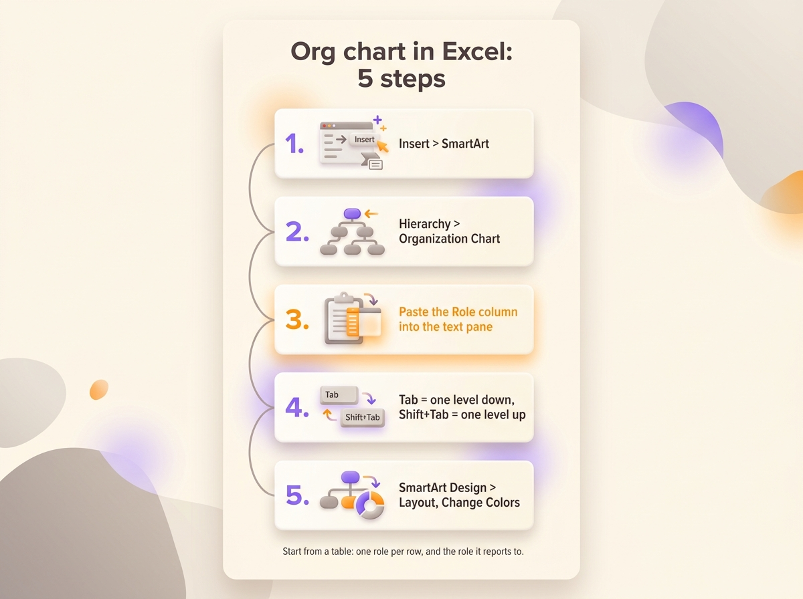
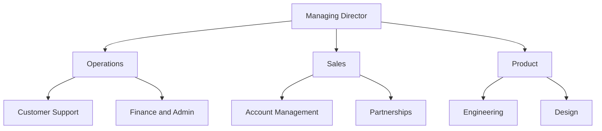
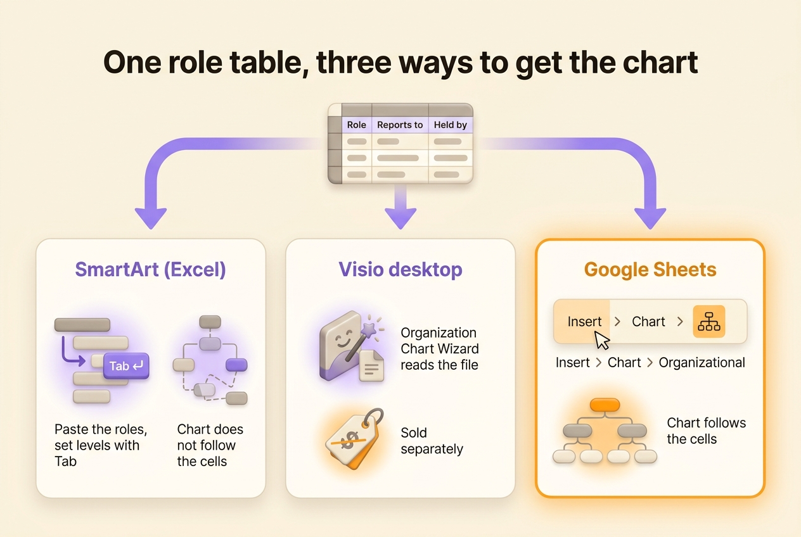

You make an org chart in Excel with SmartArt: open the **Insert** tab, click **SmartArt**, pick the **Hierarchy** category, then the **Organization Chart** layout. You paste your list of roles into the text pane and set the levels with Tab. Every method starts from a table of roles, even SmartArt, which reads nothing from your cells. This page starts with that table, then covers SmartArt, the tools that build the chart from the table, Google Sheets, and the limits of an org chart kept in a spreadsheet.

1. Open the **Insert** tab, then click **SmartArt** in the Illustrations group.
2. Select **Hierarchy** on the left, then **Organization Chart**, and click OK.
3. Copy the Role column of your table and paste it into the text pane beside the graphic.
4. Press Tab to push a line one level down, Shift+Tab to pull it back up.
5. Adjust the look from the **SmartArt Design** tab with **Layout**, **Change Colors** and the style gallery.

SmartArt needs the Excel desktop app on Windows or Mac. Excel for the web has no SmartArt button, so open the workbook in the app to draw the chart.

{/* IMAGE regen: api.py image, infographic, 1600x1200. Scene: "a vertical five-step infographic titled "Org chart in Excel: 5 steps" in a modern clean bold sans-serif. Five numbered cards stacked top to bottom, linked by a thin line, each with a small flat icon and one label: 1. "Insert > SmartArt" 2. "Hierarchy > Organization Chart" 3. "Paste the Role column into the text pane" 4. "Tab = one level down, Shift+Tab = one level up" 5. "SmartArt Design > Layout, Change Colors". Under the cards, a small note in grey: "Start from a table: one role per row, and the role it reports to." Purple numbers, orange accent on step 3. Portrait-friendly layout at 1600x1200, lots of cream space." */}

## Build the role table first

Excel is good at tables, so start there. Before any drawing, fill in one row per role with five columns.

| Column | What goes in it | Example |
|---|---|---|
| Role | The name of the role, unique in the table | Customer Support |
| Reports to | The role above it, empty for the top role only | Operations |
| Held by | The people who hold the role today | Ana |
| Purpose | Why the role exists, in one sentence | Clients get an answer within one working day |
| Accountabilities | What the role does or decides | Answer tickets. Refund orders under 200 euros |

Three habits keep the table usable.

- Write the role in the first column rather than the person. When Malik holds Operations as well as Finance and Admin, he appears on two rows. The day he leaves, both roles stay in the table and you change the Held by cell on each row.
- Give every role exactly one parent in the Reports to column. A team that seems to answer to two others goes under the one that sets its priorities. A tree shows one parent per box, so [a matrix structure](/en/blog/matrix-organizational-structure) needs another kind of chart.
- Keep role names unique. Two rows called "Sales" make every tool attach the roles below them to the wrong box.

The Purpose and Accountabilities columns do not appear in the chart. They turn the table into a list of [roles and responsibilities](/en/blog/roles-responsibilities-template) that people can check. Compare them from row to row to spot two roles doing the same job.

Ten roles filled in this way give this structure.

## Method 1: draw the chart with SmartArt

### Insert the graphic and paste the roles

After **Insert**, then **SmartArt**, then **Hierarchy**, the gallery shows several org chart layouts. **Organization Chart** is the plain one, while **Picture Organization Chart** adds a photo slot to each box. Click OK and Excel puts a starter chart over the sheet: one box at the top, an assistant box and three boxes on the next row.

Open the text pane with the small arrow on the left edge of the graphic. Select all the placeholder lines and delete them, then copy the Role column of your table and paste it into the pane. Each cell becomes a box, all on the same level.

### Set the levels with Tab

Go down the list in the text pane. On each line, press Tab until the role sits one level under the role it reports to. Follow the Reports to column of your table to know where each line belongs. Sort the table in tree order first (the top role, then Operations, then the roles under Operations, and so on), so that Tab always places a role under the right parent.

To add a box later, select a box, open the **SmartArt Design** tab and click the arrow next to **Add Shape**. **Add Shape Below** creates a role reporting to the selected one, **Add Shape After** a role at the same level.

### Fit the chart on the sheet

The **Layout** button on the SmartArt Design tab applies to the selected box and everything under it. **Standard** lines the boxes up in a row, **Both** stacks them two by two, and **Left Hanging** or **Right Hanging** puts them in a column beside their parent. A department of six roles needs half as much width with a hanging layout as with Standard.

A SmartArt graphic floats over the grid, so the cells behind it stay usable. Put the chart on its own tab, next to the table, and set the print area around it with **Page Layout**, then **Print Area**.

The same SmartArt graphic exists in Word and PowerPoint. If the chart ends up in a document, [draw it in Word](/en/blog/org-chart-word). If it goes on a slide, [build it in PowerPoint](/en/blog/org-chart-powerpoint), where you can split a large chart across several slides.

## Method 2: generate the chart from the table

With SmartArt, you paste your list once. When a role changes, you fix the cell and then the box. Other tools read the table instead and draw the chart from it.

Excel had one of those tools until this year. Microsoft retired the Visio Data Visualizer add-in, which drew an org chart inside the workbook from a table of employees. Its diagrams stopped loading on 2 March 2026. The data in the tables stays intact, but the charts are gone.

Microsoft still offers the **Organization Chart Wizard** in the Visio desktop app, sold separately from Microsoft 365. Microsoft points former Data Visualizer users to Visio Plan 2. In Visio, open **File**, then **New**, pick the **Organization Chart** category and click **Create**. The wizard asks for the file and three columns: a name, a unique identifier, and a Reports to column left empty for the top of the chart. The role table works as it is, with the role name as both name and identifier.

Most dedicated [org chart tools](/en/blog/best-org-chart-software) import a file laid out the same way, one row per box with the box it reports to. The role table follows that layout.

## Make an org chart in Google Sheets

Google Sheets draws an org chart from the table without any add-on and updates it when you edit a cell.

1. Put the role in column A, the role it reports to in column B, and optionally the holder in column C.
2. Select the cells, from the header row down to the last role.
3. Open **Insert**, then **Chart**.
4. In the chart editor, under **Setup**, set the **Chart type** to **Organizational**.

Each row becomes a box, linked to the box named in column B. The holder from column C appears in a tooltip when you hover over the box. Under **Customize**, then **Org**, you change the size and the colour of the boxes.

The rules of the role table apply here too. Sheets links the boxes by their exact text, so a typo in column B or two rows with the same name in column A put roles in the wrong place. Before you insert the chart, add a column with `=COUNTIF(A:A,B2)` on each row. A 0 means the role in column B matches no role in column A.

{/* IMAGE regen: api.py image, infographic, 1600x1000. Scene: "a three-column comparison infographic titled "One role table, three ways to get the chart" in a modern clean bold sans-serif. At the top center, a small spreadsheet icon labelled "Role | Reports to | Held by". Three arrows go down from it to three rounded cards side by side. Card 1 "SmartArt (Excel)": "Paste the roles, set levels with Tab" and "Chart does not follow the cells". Card 2 "Visio desktop": "Organization Chart Wizard reads the file" and "Sold separately". Card 3 "Google Sheets": "Insert > Chart > Organizational" and "Chart follows the cells". Card 3 has an orange accent, the arrows and card titles are purple. Lots of cream space." */}

## The limits of an org chart built in a spreadsheet

A spreadsheet is a good place to keep the roles. A table of sixty roles lists who reports to whom, but nobody can see the structure in sixty rows. So the chart ends up drawn in SmartArt or pasted as an image into a slide, and each method has its limits.

- A SmartArt chart keeps no link with the cells. Every change is made twice, once in the table and once in the chart, and the chart goes out of date first.
- The Google Sheets chart puts only the role name in the box. The holders appear on hover, the purposes nowhere, and the styling stops at the size and the colour of the boxes.
- Visio costs a subscription on top of Microsoft 365, and its desktop app runs only on Windows.
- Whatever the method, the file lives on one person's drive. Copies go out by email, and after a reorganization nobody knows which version is right.

Lonestone, a product studio of 35 people, first kept its roles in tables in Notion, spread across several databases. "We couldn't find our way around anymore, we couldn't see who does what," says its co-founder Godefroy de Compreignac, who then built Rolebase to fix that. The studio now [sees every role on one screen](/en/client-cases/lonestone). Candidates also use the chart during recruitment to see where they would fit.

| | Org chart in a spreadsheet | Org chart built from roles in a tool |
|---|---|---|
| Where the roles live | In a file someone owns | In a shared space, each team edits its own |
| The chart | Drawn with SmartArt, or a Sheets chart | Built from the roles, in several views |
| After a reorganization | Edit the table, then redraw | Move the role |
| A person with two roles | Two rows, two boxes | One person, shown in each role |
| Purpose and accountabilities | In columns nobody sees in the chart | Open the role in the chart |

For a stable team of fifteen people, the spreadsheet does the job. The limits show up once roles change every quarter or several teams edit the same file.

## From the spreadsheet to a role-based tool

In Rolebase the [org chart](/en/docs/org-chart) is built from the roles themselves. Each role has a purpose, accountabilities, members and a parent role, like the columns of your table. The same roles display as nested circles, as a [hierarchical tree](/en/blog/hierarchy-chart) like the one SmartArt draws, or as a photo directory of the members.

Rolebase imports only from Holaspirit today, so moving an Excel or CSV table into Rolebase means creating the roles by hand. Go through your table row by row, create each role under its parent and add its members.

Rolebase does export to Excel. The organization owner [exports the data as an XLSX file](/en/docs/export), with one sheet per kind of data: the roles, the members, where each role sits in the chart and who holds it. You can analyse the file in Excel or keep it as a backup. You also export any role as a PNG image with everything under it, to paste into a document or a slide. You can share the org chart as a public page, by link or embedded with an iframe.

## Frequently asked questions

<FaqList>

<FaqItem question="How do I create an organization chart in Excel?">

Open the **Insert** tab, click **SmartArt**, choose the **Hierarchy** category and the **Organization Chart** layout, then click OK. Paste your list of roles into the text pane and press Tab to set the level of each line. SmartArt requires the Excel desktop app on Windows or Mac.

</FaqItem>

<FaqItem question="How do I convert an Excel list into an organizational chart?">

Your list needs one row per role or person and a column naming who they report to. Excel itself only offers SmartArt, where you paste the list and set the levels by hand. To have the chart drawn from the list, open the file in Google Sheets and insert an Organizational chart, or use the Organization Chart Wizard in the Visio desktop app.

</FaqItem>

<FaqItem question="Can Excel create an org chart automatically from data?">

Not anymore. The Visio Data Visualizer add-in did that inside Excel until Microsoft retired it. Its diagrams stopped loading on 2 March 2026. Google Sheets builds an org chart from two columns at no cost. Visio, sold separately, also builds one from an Excel file with its wizard.

</FaqItem>

<FaqItem question="Does Microsoft have an org chart tool?">

Microsoft has three. With SmartArt in Excel, Word and PowerPoint, you draw a chart by hand. Visio builds one from a file and handles large structures, on a separate subscription. Microsoft 365 also shows an organization chart in the profile card of a colleague, built from the manager field your IT administrator fills in.

</FaqItem>

<FaqItem question="What is the easiest way to build an org chart?">

For a small team, list the roles in a table and paste them into SmartArt, which takes a few minutes. For a chart that changes often, keep the roles in a tool where the chart is built from them, so a reorganization means moving a role rather than redrawing boxes.

</FaqItem>

</FaqList>

## Keep the table, and let the chart follow the roles

Fill in the role table before you draw anything. The table shows who holds two roles, which roles have nobody, and which ones nobody can describe in a sentence. Those three findings are worth more than the chart.

[Create a free Rolebase account](/signup) once several teams edit the table, so the org chart is built from the roles they keep up to date. Rolebase is free for up to five active members, with no credit card. Your [meetings and decisions](/en/features) are also linked to the same roles.
