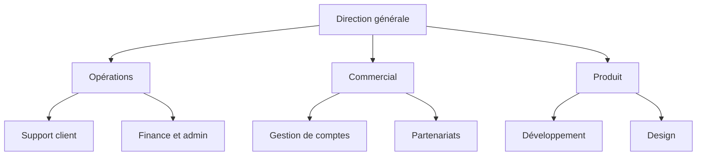

Vous faites un organigramme sur Excel avec SmartArt : ouvrez l’onglet **Insertion**, cliquez sur **SmartArt**, choisissez la catégorie **Hiérarchie**, puis la disposition **Organigramme**. Vous collez ensuite votre liste de rôles dans le volet Texte et vous réglez les niveaux avec Tab. Toutes les méthodes partent d’un tableau des rôles, même SmartArt, qui ne lit pourtant rien dans vos cellules. Cette page commence donc par ce tableau, puis passe par SmartArt, les outils qui construisent l’organigramme à partir du tableau, Google Sheets, et les limites d’un organigramme tenu dans un tableur.

1. Ouvrez l’onglet **Insertion**, puis cliquez sur **SmartArt** dans le groupe Illustrations.
2. Sélectionnez **Hiérarchie** à gauche, puis **Organigramme**, et validez.
3. Copiez la colonne Rôle de votre tableau et collez-la dans le volet Texte, à côté du graphique.
4. Appuyez sur Tab pour descendre une ligne d’un niveau, Maj+Tab pour la remonter.
5. Réglez l’apparence depuis l’onglet **Création SmartArt** avec **Disposition**, **Modifier les couleurs** et la galerie de styles.

SmartArt demande l’application Excel sur Windows ou Mac. Excel pour le web n’a pas de bouton SmartArt, donc ouvrez le classeur dans l’application pour dessiner l’organigramme.

{/* IMAGE regen: api.py image, infographic, 1600x1200. Scene: "a vertical five-step infographic titled "Organigramme sur Excel : 5 étapes" in a modern clean bold sans-serif. Five numbered cards stacked top to bottom, linked by a thin line, each with a small flat icon and one label: 1. "Insertion > SmartArt" 2. "Hiérarchie > Organigramme" 3. "Collez la colonne Rôle dans le volet Texte" 4. "Tab = un niveau plus bas, Maj+Tab = un niveau plus haut" 5. "Création SmartArt > Disposition, Modifier les couleurs". The icons are simple flat pictograms with no text or letters inside them. Under the cards, a small note in grey: "Partez d’un tableau : un rôle par ligne, avec le rôle auquel il est rattaché." Purple numbers, orange accent on step 3. Portrait-friendly layout at 1600x1200, lots of cream space." */}

## Commencez par le tableau des rôles

Excel est fait pour les tableaux, alors commencez par là. Avant de dessiner quoi que ce soit, remplissez une ligne par rôle, sur cinq colonnes.

| Colonne | Contenu | Exemple |
|---|---|---|
| Rôle | Le nom du rôle, unique dans le tableau | Support client |
| Rattaché à | Le rôle du dessus, vide seulement pour le rôle du haut | Opérations |
| Tenu par | Les personnes qui tiennent le rôle aujourd’hui | Ana |
| Raison d’être | Pourquoi le rôle existe, en une phrase | Chaque client reçoit une réponse sous un jour ouvré |
| Redevabilités | Les tâches et décisions du rôle | Répondre aux demandes. Rembourser les commandes sous 200 euros |

Trois habitudes gardent le tableau utilisable.

- Écrivez le rôle dans la première colonne plutôt que la personne. Quand Malik tient Opérations ainsi que Finance et admin, il apparaît sur deux lignes. Le jour où il part, les deux rôles restent dans le tableau et vous changez la cellule Tenu par de chaque ligne.
- Donnez à chaque rôle un seul parent dans la colonne Rattaché à. Une équipe qui semble dépendre de deux autres va sous celle qui fixe ses priorités. Un arbre montre un seul parent par case, donc [une structure matricielle](/fr/blog/matrix-organizational-structure) demande un autre type d’organigramme.
- Gardez des noms de rôle uniques. Avec deux lignes « Commercial », n’importe quel outil rattache les rôles du dessous à la mauvaise case.

Les colonnes Raison d’être et Redevabilités n’apparaissent pas dans l’organigramme. Elles font du tableau une liste de [rôles et responsabilités](/fr/blog/roles-responsibilities-template) que chacun peut vérifier. Comparez-les d’une ligne à l’autre pour repérer deux rôles qui font le même travail.

Dix rôles remplis ainsi donnent cette structure.

## Méthode 1 : dessinez l’organigramme avec SmartArt

### Insérez le graphique et collez les rôles

Après **Insertion**, puis **SmartArt**, puis **Hiérarchie**, la galerie propose plusieurs dispositions d’organigramme. **Organigramme** est la plus simple, tandis que **Organigramme avec images** ajoute un emplacement photo dans chaque case. Validez et Excel pose un organigramme de départ par-dessus la feuille : une case en haut, une case assistant et trois cases sur la rangée suivante.

Ouvrez le volet Texte avec la petite flèche sur le bord gauche du graphique. Sélectionnez toutes les lignes d’exemple et supprimez-les, puis copiez la colonne Rôle de votre tableau et collez-la dans le volet. Chaque cellule devient une case, toutes au même niveau.

### Réglez les niveaux avec Tab

Descendez la liste dans le volet Texte. Sur chaque ligne, appuyez sur Tab jusqu’à ce que le rôle soit un niveau sous le rôle auquel il est rattaché. Suivez la colonne Rattaché à de votre tableau pour savoir où va chaque ligne. Rangez d’abord le tableau dans l’ordre de l’arbre (le rôle du haut, puis Opérations, puis les rôles sous Opérations, et ainsi de suite), pour que Tab place toujours le rôle sous le bon parent.

Pour ajouter une case plus tard, sélectionnez une case, ouvrez l’onglet **Création SmartArt** et cliquez sur la flèche à côté de **Ajouter une forme**. **Ajouter la forme en dessous** crée un rôle rattaché à la case sélectionnée, **Ajouter la forme après** un rôle au même niveau.

### Faites tenir l’organigramme sur la feuille

Le bouton **Disposition** de l’onglet Création SmartArt s’applique à la case sélectionnée et à toutes les cases en dessous. **Standard** aligne les cases sur une rangée, **Les deux** les empile deux par deux, et **Retrait à gauche** ou **Retrait à droite** les range en colonne à côté de leur parent. Un service de six rôles prend deux fois moins de largeur en retrait qu’en Standard.

Un graphique SmartArt flotte au-dessus de la grille, donc les cellules en dessous restent utilisables. Mettez l’organigramme sur son propre onglet, à côté du tableau, et définissez la zone d’impression autour de lui avec **Mise en page**, puis **Zone d’impression**.

Word et PowerPoint ont le même graphique SmartArt. Si l’organigramme finit dans un document, [faites-le sur Word](/fr/blog/org-chart-word). S’il va sur une diapositive, [faites-le sur PowerPoint](/fr/blog/org-chart-powerpoint), où vous pouvez répartir un grand organigramme sur plusieurs diapositives.

## Méthode 2 : générez l’organigramme à partir du tableau

Avec SmartArt, vous collez votre liste une seule fois. Quand un rôle change, vous corrigez la cellule, puis la case. D’autres outils, eux, lisent le tableau et en tirent l’organigramme.

Excel avait un outil de ce type jusqu’à cette année. Microsoft a retiré le complément Visio Data Visualizer, qui dessinait un organigramme dans le classeur à partir d’un tableau de salariés. Ses diagrammes ne s’affichent plus depuis le 2 mars 2026. Les données des tableaux restent intactes, mais les organigrammes ont disparu.

Microsoft propose encore l’**Assistant Organigramme** de l’application Visio, vendue séparément de Microsoft 365. Microsoft oriente les anciens utilisateurs de Data Visualizer vers Visio Plan 2. Dans Visio, ouvrez **Fichier**, puis **Nouveau**, choisissez la catégorie **Organigramme** et cliquez sur **Créer**. L’assistant demande le fichier et trois colonnes : un nom, un identifiant unique et une colonne de rattachement, vide pour le haut de l’organigramme. Le tableau des rôles convient tel quel, avec le nom du rôle comme nom et comme identifiant.

La plupart des [logiciels d’organigramme](/fr/blog/best-org-chart-software) importent un fichier organisé de la même façon, une ligne par case avec la case à laquelle elle est rattachée. Le tableau des rôles suit cette organisation.

## Faites un organigramme sur Google Sheets

Google Sheets dessine un organigramme à partir du tableau sans module complémentaire et le met à jour quand vous modifiez une cellule.

1. Mettez le rôle en colonne A, son rattachement en colonne B et, si vous voulez, le titulaire en colonne C.
2. Sélectionnez les cellules, de la ligne d’en-tête jusqu’au dernier rôle.
3. Ouvrez **Insertion**, puis **Graphique**.
4. Dans l’éditeur de graphique, sous **Configurer**, choisissez **Organigramme** comme type de graphique.

Chaque ligne devient une case, reliée à la case nommée en colonne B. Le titulaire de la colonne C s’affiche dans une infobulle quand vous survolez la case. Sous **Personnaliser**, puis **Organigramme**, vous changez la taille et la couleur des cases.

Les règles du tableau des rôles valent aussi ici. Sheets relie les cases par leur texte exact, donc une faute de frappe en colonne B ou deux lignes du même nom en colonne A placent des rôles au mauvais endroit. Avant d’insérer l’organigramme, ajoutez sur chaque ligne une colonne avec `=NB.SI(A:A;B2)`. Un 0 signale un rattachement en colonne B qui ne correspond à aucun rôle de la colonne A.

{/* IMAGE regen: api.py image, infographic, 1600x1000. Scene: "a three-column comparison infographic titled "Un tableau de rôles, trois façons d’obtenir l’organigramme" in a modern clean bold sans-serif. At the top center, a small spreadsheet icon labelled "Rôle | Rattaché à | Tenu par". Three arrows go down from it to three rounded cards side by side. Card 1 "SmartArt (Excel)": "Collez les rôles, réglez les niveaux avec Tab" and "L’organigramme ne suit pas les cellules". Card 2 "Visio (application)": "L’Assistant Organigramme lit le fichier" and "Vendu à part". Card 3 "Google Sheets": "Insertion > Graphique > Organigramme" and "L’organigramme suit les cellules". Card 3 has an orange accent, the arrows and card titles are purple. Lots of cream space." */}

## Les limites d’un organigramme fait sur un tableur

Un tableur est un bon endroit pour ranger les rôles. Un tableau de soixante rôles indique qui dépend de qui, mais personne ne voit la structure dans soixante lignes. L’organigramme finit donc dessiné en SmartArt ou collé en image dans une présentation, et chaque méthode a ses limites.

- Un organigramme SmartArt ne garde aucun lien avec les cellules. Chaque changement se fait deux fois, dans le tableau puis dans l’organigramme, et l’organigramme prend du retard le premier.
- L’organigramme de Google Sheets met seulement le nom du rôle dans la case. Les titulaires s’affichent au survol, les raisons d’être nulle part, et la mise en forme se limite à la taille et à la couleur des cases.
- Visio coûte un abonnement en plus de Microsoft 365, et son application ne tourne que sur Windows.
- Quelle que soit la méthode, le fichier vit sur le poste d’une personne. Des copies partent par e-mail, et après une réorganisation, personne ne sait quelle version fait foi.

Lonestone, un studio produit de 35 personnes, rangeait d’abord ses rôles dans des tables Notion, réparties sur plusieurs bases. « On ne s’y retrouvait plus, on ne voyait pas qui fait quoi », raconte Godefroy de Compreignac, son cofondateur, qui a ensuite créé Rolebase pour régler ce problème. Le studio [voit aujourd’hui tous ses rôles sur un seul écran](/fr/client-cases/lonestone). Les candidats se servent aussi de l’organigramme pendant le recrutement pour voir où ils trouveraient leur place.

| | Organigramme sur un tableur | Organigramme construit sur les rôles dans un outil |
|---|---|---|
| Emplacement des rôles | Un fichier qui appartient à quelqu’un | Un espace partagé, où chaque équipe modifie les siens |
| L’organigramme | Dessiné en SmartArt, ou graphique Sheets | Construit à partir des rôles, en plusieurs vues |
| Après une réorganisation | Modifier le tableau, puis redessiner | Déplacer le rôle |
| Une personne avec deux rôles | Deux lignes, deux cases | Une personne, affichée dans chaque rôle |
| Raison d’être et redevabilités | Dans des colonnes absentes de l’organigramme | Visibles en ouvrant le rôle dans l’organigramme |

Pour une équipe stable de quinze personnes, le tableur suffit. Ses limites apparaissent quand les rôles changent chaque trimestre ou que plusieurs équipes modifient le même fichier.

## Du tableur à un outil fondé sur les rôles

Dans Rolebase, l’[organigramme](/fr/docs/org-chart) se construit à partir des rôles eux-mêmes. Chaque rôle a une raison d’être, des redevabilités, des membres et un rôle parent, comme les colonnes de votre tableau. Les mêmes rôles s’affichent en cercles imbriqués, en [arbre hiérarchique](/fr/blog/hierarchy-chart) comme celui que dessine SmartArt, ou en trombinoscope des membres.

Rolebase importe aujourd’hui uniquement depuis Holaspirit. Pour passer un tableau Excel ou CSV dans Rolebase, vous créez donc les rôles à la main. Parcourez votre tableau ligne par ligne, créez chaque rôle sous son parent et ajoutez ses membres.

Rolebase exporte en revanche vers Excel. Le propriétaire de l’organisation [exporte les données en fichier XLSX](/fr/docs/export), avec une feuille par type de données : les rôles, les membres, la place de chaque rôle dans l’organigramme et ses titulaires. Vous pouvez analyser ce fichier dans Excel ou le garder en sauvegarde. Vous exportez aussi n’importe quel rôle en image PNG avec tout ce qu’il contient, pour la coller dans un document ou une diapositive. Vous pouvez partager l’organigramme en page publique, par lien ou intégré avec une iframe.

## Questions fréquentes

<FaqList>

<FaqItem question="Comment faire un organigramme sur Excel ?">

Ouvrez l’onglet **Insertion**, cliquez sur **SmartArt**, choisissez la catégorie **Hiérarchie** et la disposition **Organigramme**, puis validez. Collez votre liste de rôles dans le volet Texte et appuyez sur Tab pour régler le niveau de chaque ligne. SmartArt demande l’application Excel sur Windows ou Mac.

</FaqItem>

<FaqItem question="Comment transformer une liste Excel en organigramme ?">

Votre liste a besoin d’une ligne par rôle ou par personne et d’une colonne qui nomme le rattachement. Excel seul propose SmartArt, où vous collez la liste et réglez les niveaux à la main. Pour que l’organigramme se dessine à partir de la liste, ouvrez le fichier dans Google Sheets et insérez un graphique Organigramme, ou utilisez l’Assistant Organigramme de l’application Visio.

</FaqItem>

<FaqItem question="Excel peut-il créer un organigramme automatiquement à partir de données ?">

Plus maintenant. Le complément Visio Data Visualizer le faisait dans Excel jusqu’à ce que Microsoft le retire. Ses diagrammes ne s’affichent plus depuis le 2 mars 2026. Google Sheets construit gratuitement un organigramme à partir de deux colonnes. Visio, vendu séparément, en construit aussi un à partir d’un fichier Excel avec son assistant.

</FaqItem>

<FaqItem question="Comment créer une arborescence dans Excel ?">

Une arborescence est une structure où chaque élément a un seul parent, comme dans un organigramme. Listez les éléments dans une colonne et leur parent dans la suivante, puis dessinez-la avec **Insertion**, **SmartArt**, **Hiérarchie**. Si vous ouvrez le même tableau dans Google Sheets, le graphique Organigramme la dessine à partir des deux colonnes.

</FaqItem>

<FaqItem question="Comment créer un organigramme facilement ?">

Pour une petite équipe, listez les rôles dans un tableau et collez-les dans SmartArt, en quelques minutes. Pour un organigramme qui change souvent, tenez les rôles dans un outil où l’organigramme se construit à partir d’eux. Après une réorganisation, vous déplacez alors un rôle au lieu de redessiner des cases.

</FaqItem>

</FaqList>

## Gardez le tableau, et laissez l’organigramme suivre les rôles

Remplissez le tableau des rôles avant de dessiner quoi que ce soit. Le tableau montre qui tient deux rôles, quels rôles n’ont personne et lesquels personne ne sait décrire en une phrase. Ces trois constats valent plus que l’organigramme.

[Créez un compte Rolebase gratuit](/signup) dès que plusieurs équipes modifient le tableau, pour que l’organigramme se construise à partir des rôles qu’elles tiennent à jour. Rolebase est gratuit jusqu’à cinq membres actifs, sans carte bancaire. Vos [réunions et décisions](/fr/features) sont aussi rattachées aux mêmes rôles.
