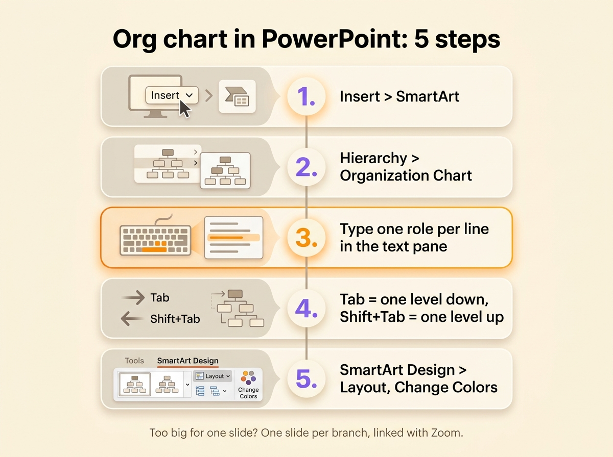
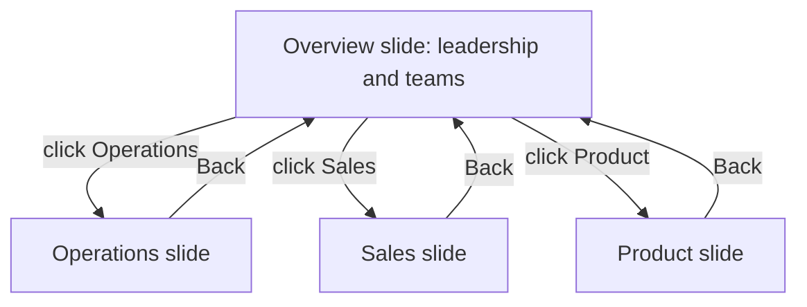

You make an org chart in PowerPoint with SmartArt: open the **Insert** tab, click **SmartArt**, pick the **Hierarchy** category, then the **Organization Chart** layout. You type one role per line in the text pane and set the levels with Tab. That works for about fifteen boxes on a single slide. Past that, the text gets too small to read from the back of a room, so this page also covers splitting a chart across slides, a free .pptx template built that way, and what to show when the chart has to stay current.

1. Open the **Insert** tab, then click **SmartArt** in the Illustrations group.
2. Select **Hierarchy** on the left, then **Organization Chart**, and click OK.
3. Type each role in the text pane beside the graphic, one per line.
4. Press Tab to push a line one level down, Shift+Tab to pull it back up, and Enter to add a box.
5. Adjust the look from the **SmartArt Design** tab with **Layout**, **Change Colors** and the style gallery.

PowerPoint has no dedicated org chart tab. Older versions had their own organization chart diagram, which SmartArt replaced. The **SmartArt Design** tab only shows up once the graphic is selected. PowerPoint for the web has the SmartArt button too, which Word for the web lacks.

{/* IMAGE regen: api.py image, infographic, 1600x1200. Scene: "a vertical five-step infographic titled "Org chart in PowerPoint: 5 steps" in a modern clean bold sans-serif. Five numbered cards stacked top to bottom, linked by a thin line, each with a small flat icon and one label: 1. "Insert > SmartArt" 2. "Hierarchy > Organization Chart" 3. "Type one role per line in the text pane" 4. "Tab = one level down, Shift+Tab = one level up" 5. "SmartArt Design > Layout, Change Colors". Under the cards, a small note in grey: "Too big for one slide? One slide per branch, linked with Zoom." Purple numbers, orange accent on step 3. Portrait-friendly layout at 1600x1200, lots of cream space." */}

## List the roles before you open PowerPoint

A slide gives you less room than a Word page, so decide what goes on it before you draw. Write one line per role with what it reports to, who holds it today and what it decides alone. Put the role in the box rather than the person: "Customer Support", held by Ana. The same list works if you [draw the org chart in Word](/en/blog/org-chart-word). If you keep that list in a spreadsheet, you can turn it into [an org chart in Excel or Google Sheets](/en/blog/org-chart-excel).

That list also saves typing. Paste it into a text placeholder on a slide, indent the lines with Tab to show who reports to whom, then click **Convert to SmartArt** on the **Home** tab and pick **Organization Chart**. PowerPoint turns each indented line into a box one level down.

## Build the chart with SmartArt, step by step

### Insert the graphic and fill in the text pane

After **Insert**, then **SmartArt**, then **Hierarchy**, the gallery offers several org chart layouts. **Organization Chart** is the plain one. **Name and Title Organization Chart** adds a second, smaller line under each role for the person who holds it. **Picture Organization Chart** adds a photo slot to each box.

Click OK and PowerPoint puts a starter chart on the slide: one box at the top, an assistant box, and three boxes on the next row. Type in the text pane rather than in the boxes. The pane shows the whole structure as an indented list, the only place where you see every level at once.

### Add, move and remove boxes

Select a box, then use **Add Shape** on the SmartArt Design tab.

| Command | Effect |
|---|---|
| Add Shape After / Before | A box at the same level, to the right or to the left |
| Add Shape Below | A box one level down, reporting to the selected one |
| Add Shape Above | A box one level up. The selected branch drops one level |
| Add Assistant | A box off the main line, for an assistant or a chief of staff |

To move a whole branch, drag its line in the text pane or use **Promote** and **Demote**. To delete a box, select its border and press Delete.

### Fit a wide branch on the slide

The **Layout** button on the SmartArt Design tab applies to the selected box and everything under it. **Standard** lines the boxes up in a row, **Both** stacks them two by two, and **Left Hanging** or **Right Hanging** puts them in a column beside their parent. In a hanging layout, a branch of six roles takes half the width it needs with Standard.

### Convert to shapes for the final layout

SmartArt decides where every box goes. To place boxes by hand, select the graphic and click **Convert**, then **Convert to Shapes**, then ungroup with Ctrl+Shift+G. Do this last, because the conversion removes the text pane and turns the lines into plain shapes that stay put when you move a box. Keep a copy of the SmartArt version on a hidden slide for the next edit.

## When the org chart is too big for one slide

A projected slide stays readable with around fifteen boxes at 14 points. A company of sixty people rarely fits. If you shrink the chart until it fits, nobody can read it. Split it instead.

- The **overview slide** shows the top two levels: leadership and the teams.
- Each **branch slide** shows one team with its roles and the people who hold them.
- In PowerPoint for Microsoft 365, 2019 or later, **Insert**, then **Zoom**, then **Slide Zoom** puts a thumbnail of each branch slide on the overview. In slide show, click a thumbnail to zoom into that team, then click again to return to the overview.
- On other versions, including PowerPoint for the web where Zoom is unavailable, select a box on the overview, then **Insert**, then **Link**, and pick the branch slide from this presentation. Add a "Back" link on each branch slide.

The audience first sees the whole company and then one team at a time, at a size they can read.

## Start from a template

The template is a 16:9 deck of six slides.

- Slide 1 is the role list to fill in before drawing, with four columns: role, reports to, held by, decides alone on.
- Slide 2 holds a filled three-level chart with ten roles and eight people. Each team box links to its own slide.
- Slides 3 to 5 show one team each, with a button back to the overview.
- Slide 6 repeats the chart blank, ready to type over.

Its boxes are shapes joined by connectors rather than SmartArt, so you can move a box and its lines follow. To add a role, duplicate a box with Ctrl+D and drag the ends of a connector onto it.

{/* DOWNLOAD regen: python3 ./generate-org-chart-template.py */}
<Button label="Download the PowerPoint template" href="/downloads/org-chart-template.pptx" variant="primary" />

PowerPoint comes with its own templates too. In **File**, then **New**, search for "organization chart". The results are SmartArt charts on a designed background, which you edit through the text pane.

In Google Slides, **Insert**, then **Diagram**, then **Hierarchy** gives a few ready-made charts where you choose the number of levels and a color. Once the diagram is on the slide, you add a box by copying an existing one and drawing its line by hand. Google Slides opens .pptx files, so you can use the template there too.

## Update the chart after a reorganization

To edit a SmartArt chart, click the graphic, open the text pane and change the lines: retype a role, press Tab to move it under another team, delete the line of a role that is gone. On a converted chart, you move the boxes and redraw every line by hand.

A PowerPoint org chart usually goes out of date after a reorganization, because whoever updates it changes only the copy on their own computer. The next presentation starts from a copy of the last one, so after two reorganizations three versions circulate. Nothing in the file says which one is right.

Scop EVEA, an environmental consulting cooperative, tracked its organization in a PowerPoint while it grew from 60 people in 2020 to 140 in 2023, across Nantes, Lyon and Troyes. Its communication and brand manager, Damien Delmotte, said that representing the company "was like exploring the meanders of an unknown river with a hand-drawn map". Since the cooperative moved its roles into Rolebase, [its org chart](/en/client-cases/scop-evea) shows the 140 people and every role they hold.

| | Org chart drawn in PowerPoint | Org chart built from roles |
|---|---|---|
| What you edit | Boxes and lines on a slide | Roles, their parent and their holders |
| Who updates it | Whoever has the latest deck | Each team, on its own roles |
| After a reorganization | Retype boxes, redraw lines | Move the role |
| A chart too big for one slide | Split by hand across slides | Export any role with everything under it |
| In the next presentation | A copy of the last deck | A fresh export |

If you compare [org chart tools](/en/blog/best-org-chart-software), check the free plan and the image export, which vary a lot from one tool to the next.

## Show the current org chart in each presentation

Keep the roles in a shared tool and export a new image of the chart before each presentation. In Rolebase the [org chart](/en/docs/org-chart) is built from the roles themselves, so when you move a role under another team, the chart changes for everyone. The same roles display as nested circles or as a [hierarchical tree](/en/blog/hierarchy-chart), the view found in most decks.

You [export a role as a PNG image](/en/docs/export) with everything under it, and choose the view, the width in pixels and whether members appear. The background is transparent, so the image works on any slide design. Export the whole organization for the overview slide, then each team for its own slide, without drawing a single box.

To show the org chart live, turn on sharing in Rolebase and open the public link in a browser during the meeting. The page shows the roles as they are that day. In the link settings, you choose whether visitors can zoom into a team. Put the same link on the last slide so people can open it afterwards.

At Scop EVEA, Delmotte uses Rolebase for "presenting EVEA from every angle, whether to partners, clients, or during the recruitment process".

## Frequently asked questions

<FaqList>

<FaqItem question="Where is the org chart tab in PowerPoint?">

There is none. Open the **Insert** tab, click **SmartArt** and choose the **Hierarchy** category, where the organization chart layouts are. Once the chart is on the slide, select it and the **SmartArt Design** and **Format** tabs appear. The Design tab holds Add Shape, Layout and Change Colors.

</FaqItem>

<FaqItem question="Does Microsoft have an org chart template?">

Yes. In PowerPoint, open **File**, then **New**, and search for "organization chart" to get ready-made decks built on SmartArt. The SmartArt gallery itself offers several org chart layouts, with photos, with names and titles, or in a half circle. Visio, sold separately, also has org chart templates and builds a chart from an Excel list.

</FaqItem>

<FaqItem question="What is the best template for an org chart in PowerPoint?">

For a team that fits on one slide, the Organization Chart layout in SmartArt is enough. For a larger company, pick a template that splits the chart across slides, with an overview and one slide per team. The template on this page does that, with links between the slides, and uses connectors so the lines follow the boxes when you move them.

</FaqItem>

<FaqItem question="How do I modify an org chart in PowerPoint?">

Click the chart, then open the text pane with the arrow on its left edge. Retype a line to rename a role, press Tab or Shift+Tab to change its level, and delete a line to remove its box. Add Shape on the SmartArt Design tab adds boxes. On a chart converted to shapes, move and resize the boxes yourself and redraw the lines.

</FaqItem>

<FaqItem question="Can I make an org chart in PowerPoint for the web?">

Yes. PowerPoint for the web has **Insert**, then **SmartArt**, with the Hierarchy layouts and the text pane. It lacks Zoom, so link the slides of a large chart with **Insert**, then **Link** instead.

</FaqItem>

</FaqList>

## Keep the roles in one place and export an image for each presentation

Fill in the role list on the first slide of the template before anything else. The list shows who holds two roles and which roles nobody can describe. That list is worth more than the drawing.

[Create a free Rolebase account](/signup) to keep those roles in one place, where each team updates its own and the org chart changes with them. Rolebase is free for up to five active members, with no credit card. Your [meetings and decisions](/en/features) are linked to the same roles.
