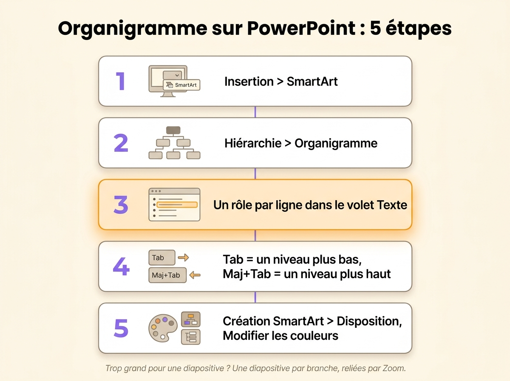
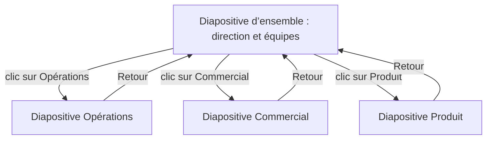

Vous faites un organigramme sur PowerPoint avec SmartArt : ouvrez l’onglet **Insertion**, cliquez sur **SmartArt**, choisissez la catégorie **Hiérarchie**, puis la disposition **Organigramme**. Vous tapez ensuite un rôle par ligne dans le volet Texte et vous réglez les niveaux avec Tab. Ça marche jusqu’à une quinzaine de cases sur une seule diapositive. Au-delà, le texte devient trop petit pour être lu du fond de la salle. Cette page explique donc aussi comment répartir un organigramme sur plusieurs diapositives, propose un modèle .pptx gratuit construit ainsi, et dit quoi montrer quand l’organigramme doit rester à jour.

1. Ouvrez l’onglet **Insertion**, puis cliquez sur **SmartArt** dans le groupe Illustrations.
2. Sélectionnez **Hiérarchie** à gauche, puis **Organigramme**, et validez.
3. Tapez chaque rôle dans le volet Texte à côté du graphique, un par ligne.
4. Appuyez sur Tab pour descendre une ligne d’un niveau, Maj+Tab pour la remonter et Entrée pour ajouter une case.
5. Réglez l’apparence depuis l’onglet **Création SmartArt** avec **Disposition**, **Modifier les couleurs** et la galerie de styles.

PowerPoint n’a pas d’onglet dédié à l’organigramme. Les anciennes versions avaient leur propre diagramme d’organigramme, que SmartArt a remplacé. L’onglet **Création SmartArt** apparaît seulement quand le graphique est sélectionné. PowerPoint pour le web a lui aussi le bouton SmartArt, contrairement à Word pour le web.

{/* IMAGE regen: api.py image, infographic, 1600x1200. Scene: "a vertical five-step infographic titled "Organigramme sur PowerPoint : 5 étapes" in a modern clean bold sans-serif. Five numbered cards stacked top to bottom, linked by a thin line, each with a small flat icon and one label: 1. "Insertion > SmartArt" 2. "Hiérarchie > Organigramme" 3. "Un rôle par ligne dans le volet Texte" 4. "Tab = un niveau plus bas, Maj+Tab = un niveau plus haut" 5. "Création SmartArt > Disposition, Modifier les couleurs". Under the cards, a small note in grey: "Trop grand pour une diapositive ? Une diapositive par branche, reliées par Zoom." Purple numbers, orange accent on step 3. Portrait-friendly layout at 1600x1200, lots of cream space." */}

## Listez les rôles avant d’ouvrir PowerPoint

Une diapositive offre moins de place qu’une page Word, donc décidez de ce qui y figure avant de dessiner. Écrivez une ligne par rôle, avec son rattachement, la personne qui le tient aujourd’hui et ce qu’il décide seul. Mettez le rôle dans la case plutôt que la personne : « Support client », tenu par Ana. La même liste sert si vous [faites l’organigramme sur Word](/fr/blog/org-chart-word).

Cette liste vous évite aussi de tout retaper. Collez-la dans une zone de texte d’une diapositive, décalez les lignes avec Tab pour montrer qui dépend de qui, puis cliquez sur **Convertir en graphique SmartArt** dans l’onglet **Accueil** et choisissez **Organigramme**. PowerPoint transforme chaque ligne décalée en case un niveau plus bas.

## Créez l’organigramme avec SmartArt, étape par étape

### Insérez le graphique et remplissez le volet Texte

Après **Insertion**, puis **SmartArt**, puis **Hiérarchie**, la galerie propose plusieurs dispositions d’organigramme. **Organigramme** est la plus simple. **Organigramme avec nom et titre** ajoute sous chaque rôle une seconde ligne, plus petite, pour la personne qui le tient. **Organigramme avec images** ajoute un emplacement photo dans chaque case.

Validez et PowerPoint pose un organigramme de départ sur la diapositive : une case en haut, une case assistant et trois cases sur la rangée suivante. Tapez dans le volet Texte plutôt que dans les cases. Le volet affiche toute la structure sous forme de liste en retrait, le seul endroit où vous voyez tous les niveaux d’un coup.

### Ajoutez, déplacez et supprimez des cases

Sélectionnez une case, puis utilisez **Ajouter une forme** dans l’onglet Création SmartArt.

| Commande | Effet |
|---|---|
| Ajouter la forme après / avant | Une case au même niveau, à droite ou à gauche |
| Ajouter la forme en dessous | Une case un niveau plus bas, rattachée à la case sélectionnée |
| Ajouter la forme au-dessus | Une case un niveau plus haut. La branche sélectionnée descend d’un niveau |
| Ajouter un assistant | Une case hors de la ligne principale, pour un assistant ou un directeur de cabinet |

Pour déplacer une branche entière, faites glisser sa ligne dans le volet Texte ou utilisez **Promouvoir** et **Abaisser**. Pour supprimer une case, sélectionnez sa bordure et appuyez sur Suppr.

### Faites tenir une branche large sur la diapositive

Le bouton **Disposition** de l’onglet Création SmartArt s’applique à la case sélectionnée et à toutes les cases en dessous. **Standard** aligne les cases sur une rangée, **Les deux** les empile deux par deux, et **Retrait à gauche** ou **Retrait à droite** les range en colonne à côté de leur parent. En retrait, une branche de six rôles prend deux fois moins de largeur qu’en Standard.

### Convertissez en formes pour la mise en page finale

SmartArt décide de la place de chaque case. Pour placer les cases à la main, sélectionnez le graphique et cliquez sur **Convertir**, puis **Convertir en formes**, et dissociez avec Ctrl+Maj+G. Gardez cette étape pour la fin, car la conversion supprime le volet Texte et transforme les traits en formes simples qui restent en place quand vous déplacez une case. Conservez une copie de la version SmartArt sur une diapositive masquée pour la prochaine modification.

## Quand l’organigramme ne tient pas sur une diapositive

Une diapositive projetée reste lisible avec une quinzaine de cases en taille 14. Une entreprise de soixante personnes y tient rarement. Si vous rétrécissez l’organigramme jusqu’à ce qu’il rentre, plus personne ne peut le lire. Découpez-le plutôt.

- La **diapositive d’ensemble** montre les deux premiers niveaux : la direction et les équipes.
- Chaque **diapositive de branche** montre une équipe avec ses rôles et les personnes qui les tiennent.
- Dans PowerPoint pour Microsoft 365, 2019 ou plus récent, **Insertion**, puis **Zoom**, puis **Zoom de diapositive** pose sur la vue d’ensemble une miniature de chaque diapositive de branche. En diaporama, cliquez sur une miniature pour zoomer sur l’équipe, puis cliquez de nouveau pour revenir à la vue d’ensemble.
- Sur les autres versions, y compris PowerPoint pour le web où le zoom n’existe pas, sélectionnez une case de la vue d’ensemble, puis **Insertion**, puis **Lien**, et choisissez la diapositive de branche dans cette présentation. Ajoutez un lien « Retour » sur chaque diapositive de branche.

Le public voit d’abord toute l’entreprise, puis une équipe à la fois, à une taille qu’il peut lire.

## Partez d’un modèle

Le modèle est une présentation 16:9 de six diapositives.

- La diapositive 1 contient la liste des rôles à remplir avant de dessiner, en quatre colonnes : rôle, rattachement, titulaire, ce qu’il décide seul.
- La diapositive 2 contient un organigramme rempli sur trois niveaux, avec dix rôles et huit personnes. Chaque case d’équipe renvoie vers sa propre diapositive.
- Les diapositives 3 à 5 montrent chacune une équipe, avec un bouton de retour vers la vue d’ensemble.
- La diapositive 6 reprend l’organigramme vierge, prêt à remplir.

Ses cases sont des formes reliées par des connecteurs plutôt que du SmartArt, donc quand vous déplacez une case, ses traits suivent. Pour ajouter un rôle, dupliquez une case avec Ctrl+D et faites glisser les extrémités d’un connecteur dessus.

{/* DOWNLOAD regen: python3 ./generate-org-chart-template.py */}
<Button label="Télécharger le modèle PowerPoint" href="/downloads/modele-organigramme.pptx" variant="primary" />

PowerPoint propose aussi ses propres modèles. Dans **Fichier**, puis **Nouveau**, cherchez « organigramme ». Vous obtenez des organigrammes SmartArt sur un fond travaillé, que vous modifiez par le volet Texte.

Dans Google Slides, **Insertion**, puis **Diagramme**, puis **Hiérarchie** donne quelques organigrammes prêts à l’emploi, dont vous choisissez le nombre de niveaux et la couleur. Une fois le diagramme posé, vous ajoutez une case en copiant une case existante et en traçant son trait à la main. Google Slides ouvre les fichiers .pptx, donc vous pouvez aussi y utiliser le modèle.

## Modifiez l’organigramme après une réorganisation

Pour modifier un organigramme SmartArt, cliquez sur le graphique, ouvrez le volet Texte et changez les lignes : retapez un rôle, appuyez sur Tab pour le passer sous une autre équipe, supprimez la ligne d’un rôle qui n’existe plus. Sur un organigramme converti en formes, vous déplacez les cases et vous retracez chaque trait à la main.

Un organigramme PowerPoint devient généralement faux après une réorganisation, parce que celui qui le met à jour modifie seulement la copie enregistrée sur son poste. La présentation suivante part d’une copie de la dernière, donc après deux réorganisations, trois versions circulent. Rien dans le fichier ne dit laquelle fait foi.

La Scop EVEA, un cabinet de conseil en environnement, suivait son organisation dans un PowerPoint pendant qu’elle passait de 60 personnes en 2020 à 140 en 2023, entre Nantes, Lyon et Troyes. Damien Delmotte, son responsable communication et marque, résume la situation d’alors : représenter EVEA « revenait à explorer les méandres d’une rivière inconnue avec une carte dessinée à la main ». Depuis que la coopérative a transféré ses rôles dans Rolebase, [son organigramme](/fr/client-cases/scop-evea) montre les 140 personnes et tous les rôles qu’elles tiennent.

| | Organigramme dessiné sur PowerPoint | Organigramme construit sur les rôles |
|---|---|---|
| Vous modifiez | Des cases et des traits sur une diapositive | Des rôles, leur rattachement et leurs titulaires |
| Qui le met à jour | Celui qui a la dernière présentation | Chaque équipe, sur ses propres rôles |
| Après une réorganisation | Retaper les cases, retracer les traits | Déplacer le rôle |
| Un organigramme trop grand pour une diapositive | Découpé à la main sur plusieurs diapositives | Export de n’importe quel rôle avec tout ce qu’il contient |
| À la présentation suivante | Une copie de la dernière | Un nouvel export |

Si vous comparez des [logiciels d’organigramme](/fr/blog/best-org-chart-software), regardez l’offre gratuite et l’export en image, qui varient beaucoup d’un logiciel à l’autre.

## Montrez l’organigramme à jour à chaque présentation

Gardez les rôles dans un outil partagé et exportez une nouvelle image de l’organigramme avant chaque présentation. Dans Rolebase, l’[organigramme](/fr/docs/org-chart) se construit à partir des rôles eux-mêmes, donc quand vous déplacez un rôle sous une autre équipe, l’organigramme change pour tout le monde. Les mêmes rôles s’affichent en cercles imbriqués ou en [arbre hiérarchique](/fr/blog/hierarchy-chart), la vue qu’on retrouve dans la plupart des présentations.

Vous [exportez un rôle en image PNG](/fr/docs/export) avec tout ce qu’il contient, en choisissant la vue, la largeur en pixels et l’affichage des membres. Le fond est transparent, donc l’image va sur n’importe quel thème de diapositive. Exportez toute l’organisation pour la diapositive d’ensemble, puis chaque équipe pour la sienne, sans dessiner une seule case.

Pour montrer l’organigramme en direct, activez le partage dans Rolebase et ouvrez le lien public dans un navigateur pendant la réunion. La page montre les rôles tels qu’ils sont ce jour-là. Dans les réglages du lien, vous choisissez si les visiteurs peuvent zoomer sur une équipe. Mettez le même lien sur la dernière diapositive pour que chacun puisse l’ouvrir ensuite.

Chez EVEA, Delmotte se sert de Rolebase pour « présenter EVEA sous tous ses angles, même devant des partenaires, des clients, ou au cours du processus de recrutement ».

## Questions fréquentes

<FaqList>

<FaqItem question="Où se trouve l’onglet organigramme dans PowerPoint ?">

Il n’existe pas. Ouvrez l’onglet **Insertion**, cliquez sur **SmartArt** et choisissez la catégorie **Hiérarchie**, où se trouvent les dispositions d’organigramme. Une fois l’organigramme posé, sélectionnez-le pour faire apparaître les onglets **Création SmartArt** et **Mise en forme**. L’onglet Création contient Ajouter une forme, Disposition et Modifier les couleurs.

</FaqItem>

<FaqItem question="Microsoft propose-t-il un modèle d’organigramme ?">

Oui. Dans PowerPoint, ouvrez **Fichier**, puis **Nouveau**, et cherchez « organigramme » pour obtenir des présentations prêtes à l’emploi, construites sur SmartArt. La galerie SmartArt propose elle-même plusieurs dispositions d’organigramme, avec photos, avec nom et titre, ou en demi-cercle. Visio, vendu à part, a aussi des modèles d’organigramme et construit un organigramme à partir d’une liste Excel.

</FaqItem>

<FaqItem question="Quel est le meilleur modèle d’organigramme sur PowerPoint ?">

Pour une équipe qui tient sur une diapositive, la disposition Organigramme de SmartArt suffit. Pour une entreprise plus grande, prenez un modèle qui répartit l’organigramme sur plusieurs diapositives, avec une vue d’ensemble et une diapositive par équipe. Le modèle de cette page fonctionne ainsi, avec des liens entre les diapositives, et utilise des connecteurs pour que les traits suivent les cases quand vous les déplacez.

</FaqItem>

<FaqItem question="Comment modifier un organigramme sur PowerPoint ?">

Cliquez sur l’organigramme, puis ouvrez le volet Texte avec la flèche sur son bord gauche. Retapez une ligne pour renommer un rôle, appuyez sur Tab ou Maj+Tab pour changer son niveau, et supprimez une ligne pour retirer sa case. Ajouter une forme, dans l’onglet Création SmartArt, ajoute des cases. Sur un organigramme converti en formes, déplacez et redimensionnez les cases vous-même, puis retracez les traits.

</FaqItem>

<FaqItem question="Peut-on faire un organigramme sur PowerPoint en ligne ?">

Oui. PowerPoint pour le web a **Insertion**, puis **SmartArt**, avec les dispositions Hiérarchie et le volet Texte. Le zoom n’y existe pas, donc reliez les diapositives d’un grand organigramme par **Insertion**, puis **Lien**.

</FaqItem>

</FaqList>

## Tenez les rôles au même endroit et exportez une image pour chaque présentation

Remplissez la liste des rôles de la première diapositive du modèle avant tout le reste. Elle montre qui tient deux rôles et quels rôles personne ne sait décrire. Cette liste vaut plus que le dessin.

[Créez un compte Rolebase gratuit](/signup) pour tenir ces rôles au même endroit, où chaque équipe met à jour les siens et où l’organigramme change avec eux. Rolebase est gratuit jusqu’à cinq membres actifs, sans carte bancaire. Vos [réunions et décisions](/fr/features) sont rattachées aux mêmes rôles.
