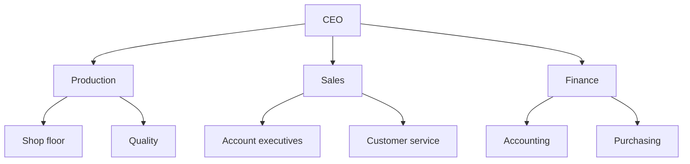
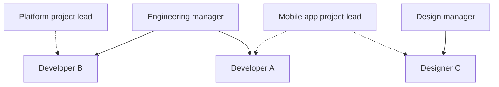
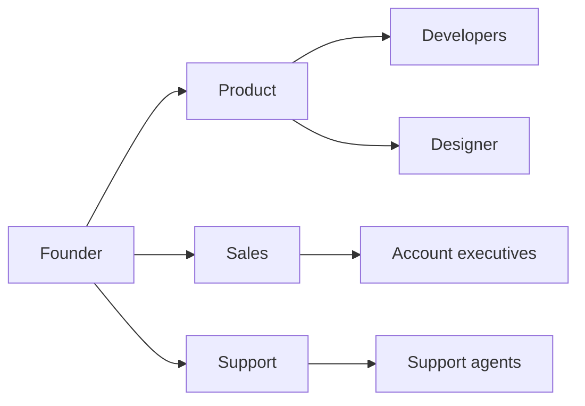

There are six common types of org charts: hierarchical, functional, matrix, horizontal, circle, and the photo directory, which shows names and faces. They all show the same organization, but each one answers a different question: who reports to whom, which department does what, who works for two managers, who is on which team, which team sits inside which, who is who. Pick the type that answers the question your teams ask most often, then check that it matches how the company works today rather than how you would like it to work.

An org chart type is a way of drawing the organization. The structure is how the work is grouped and how decisions get made. It can be [functional, divisional, matrix, hierarchical or flat](/en/blog/organizational-structures). The same company with a functional structure can show its org chart as a tree, as circles or as a photo directory.

## The six types of org charts at a glance

| Type | Layout | Question it answers | Best for |
|---|---|---|---|
| Hierarchical | A top-down tree, from leadership down to the teams | Who reports to whom? | Most companies, especially beyond two levels |
| Functional | A tree whose branches are disciplines: finance, sales, production | Which department does which work? | A company organized by discipline, a public body |
| Matrix | A grid crossing disciplines with projects or markets | Who works for two managers? | A project-based organization drawing on several departments |
| Horizontal | A tree turned on its side, read left to right, or a chart with one or two levels | Who is on which team? | A small company, a flat organization |
| Circle | Nested or concentric circles | Which team sits inside which team? | An organization run on holacracy, sociocracy or roles |
| Photo directory | Names and photos in every box, or a grid of faces | Who is who? | Onboarding, a team that grows fast |

## Hierarchical org chart

A hierarchical org chart, also called a vertical org chart or pyramid chart, places each position under the one it reports to, with leadership at the top and the teams at the bottom. Every box has a single parent, so anyone can follow their reporting line up to the CEO. It is the chart most people picture when they hear "org chart".

With a single parent per box, a person who works in two teams appears in only one of them. The title in the box gives the position, without showing who decides what. To keep the tree accurate after a reorganization, [build the organizational tree from roles](/en/blog/hierarchy-chart) before you add names.

## Functional org chart

A functional org chart groups positions by discipline. Accounting and purchasing sit together under finance, the shop floor and quality under production. It is usually drawn as a tree, with one head per function under leadership. It differs from the hierarchical chart in how it groups boxes: discipline comes before level.

Here is the functional org chart of a manufacturing company of about forty people.

An employee quickly finds the department that handles their question. Each head of function also sees the whole of their discipline. A topic that spans several functions, though, has no box on this chart. Launching a new product involves production, sales and finance, so it goes up to the CEO, the only point the three branches share.

Like the functional org chart, a divisional org chart is a tree, but it groups first by product, market or region. Each division then has its own functions: a company selling medical equipment and lab equipment draws two branches, each with its own sales and production.

## Matrix org chart

A matrix org chart crosses two reporting lines. Each person reports to a discipline manager, who looks after their skills and their review, and to a project or market lead, who sets their priorities for the week. A tree gives each box one parent, so a matrix is drawn either with a second set of links or as a grid, with disciplines in columns and projects in rows.

In the example below, solid lines connect each person to their discipline manager, and dotted lines to their project lead.

This chart shows the project teams that cut across departments. A tree leaves those teams out. The chart still does not show which of the two managers has the final word when they ask the same person for opposite things. It depends on whether the matrix is [weak, balanced or strong](/en/blog/matrix-organizational-structure). Write down next to the chart which of the two has the final word in your organization.

## Horizontal org chart

The term "horizontal org chart" has two meanings.

As a layout, a horizontal org chart is a tree turned on its side and read left to right, with leadership on the left and the teams on the right. It helps when one manager has many direct reports. A vertical tree then spreads sideways off the page, while a sideways tree stacks the direct reports one under the other.

As a structure, a horizontal org chart is a flat one, with one or two levels between the person doing the work and the person who settles things in the end. Almost everyone sits on the same row. The chart stays readable up to a few dozen people. Beyond that, you have to choose [between a flat and a hierarchical structure](/en/blog/flat-vs-hierarchical): add levels, or keep few of them and decide who makes the final call in place of managers.

## Circle org chart

A circle org chart also comes in two forms.

In the concentric form, leadership sits in the center and the levels form rings around it, with managers on the first ring and teams on the next ones. This form shows the same hierarchy as a tree. Companies that pick it mostly want to move away from the pyramid image.

In the nested form, each team is a circle holding its roles and sub-teams. Organizations running [holacracy](/en/glossary/holacratie) and [sociocracy](/en/glossary/sociocratie) draw their org chart this way, because a [circle](/en/glossary/cercle) there is a team with its own purpose and its own scope of decisions. This form shows two things a tree shows poorly: a person holding roles in three circles appears in all three, and the size of a circle gives a sense of what it contains.

The example below is interactive. Click a circle to zoom in on its contents, and drag to move around.

<OrgChartView demo="demo" height="480px" showAllNodes={false} />

Circles show belonging rather than reporting lines. Someone looking for who approves their time off finds the answer faster on a tree.

## Org chart with photos and photo directory

An org chart with photos puts each person's photo and name in their box, whatever the type of org chart. It shows who to talk to, but it needs an update every time someone joins or leaves. A chart limited to positions and departments stays accurate longer.

In the interactive tree below, each role card shows the photo and name of the people who hold that role.

<OrgChartView demo="classic" view="Tree" height="480px" />

A photo directory shows each member with their photo and name, without the structure. New hires use it to put a face to the names they hear in meetings. It shows who is who. To find out who does what, go back to the tree or the circles.

## How to choose a type of org chart

Start from the question your teams ask most often.

- If it's "Who signs this off?", draw a hierarchical org chart.
- If it's "Which department handles this?", draw a functional org chart, or a divisional one if your businesses are different enough to each have their own functions.
- If it's "Who am I working for on this project?" and a large share of the team works on cross-functional projects, draw a matrix org chart.
- If it's "Who is on my team?" and the company has one or two levels, draw a horizontal org chart.
- If it's "Which bigger team is my team part of?", draw a circle org chart. It suits organizations where teams contain other teams and people often hold several roles.
- If it's "Who is this person?", add a photo directory to the org chart you picked.

Then draw the organization as it works today. A nested circle org chart laid over a company where every decision goes up to the CEO gives new hires the wrong picture. They then find out the real hierarchy the first time they ask for a budget. The reverse holds too: a team already organized around roles loses information when you force it into a tree of positions.

## One set of roles for several views

Most organizations need several types at once. Leadership reads the tree, new hires open the photo directory, and teams that work in circles prepare their governance meetings on the circles. When each view is a separate PowerPoint file, the three disagree as soon as someone forgets to add a new hire to one of the files.

In Rolebase, [circles, the hierarchical tree and the photo directory](/en/docs/org-chart) are three views of the same roles. When you edit a role or add a member to it, all three views update. You choose your organization's default view. A shared link opens the org chart in the view and on the role you had on screen. A person who works in two teams holds a role in each and appears in both, with no box to copy by hand. You get a [dynamic org chart](/en/blog/dynamic-org-chart) that stays up to date after every change.

## Frequently asked questions

<FaqList>

<FaqItem question="What are the 4 types of org charts?">

Lists vary from one source to another. The four types that come up most often are the hierarchical, functional, matrix and flat org charts, the last one also called horizontal. The divisional org chart, the circle org chart and the photo directory often complete the list.

</FaqItem>

<FaqItem question="What is a functional org chart?">

A functional org chart groups positions by discipline, such as production, sales, finance and human resources, with one head per function reporting to leadership. It shows which department handles which work. Projects that cut across functions have no box of their own.

</FaqItem>

<FaqItem question="What is a circle org chart?">

A circle org chart shows the organization as circles rather than a tree. In the concentric form, leadership sits in the center and levels form rings around it. In the nested form, used in holacracy and sociocracy, each team is a circle that holds its roles and sub-teams.

</FaqItem>

<FaqItem question="What is the difference between a vertical and a horizontal org chart?">

A vertical org chart is the classic tree read from top to bottom. The term "horizontal org chart" has two meanings. As a layout, it is the same tree turned on its side and read from left to right, which helps when one manager has many direct reports. As a structure, it is the chart of a flat organization with only one or two levels.

</FaqItem>

<FaqItem question="Which type of org chart suits a small business?">

A company of fewer than twenty people does fine with a horizontal org chart or a two-level tree, plus a photo directory for new hires. When several people hold several roles, which happens a lot in a small team, a role-based circle org chart shows who does what more clearly.

</FaqItem>

<FaqItem question="How do I make a functional org chart?">

List the main functions of the company, for example production, sales, finance and human resources. Put each position or role under its function, name one head per function, then connect the functions to leadership. Word and PowerPoint have a ready-made layout in SmartArt, under Hierarchy. An org chart tool saves you from redrawing the chart after every change.

</FaqItem>

</FaqList>

## Start from your teams' questions

Write down the three questions you hear most often about the organization, in meetings, in team chat or during onboarding. Use them to pick the type of org chart to draw first, and often a second type to add.

[Create a free Rolebase account](/signup) to describe your roles once and show them as circles, a hierarchical tree or a photo directory. Rolebase also handles [the meetings and decisions](/en/features) tied to those roles, in the same tool.
