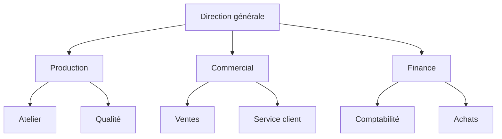
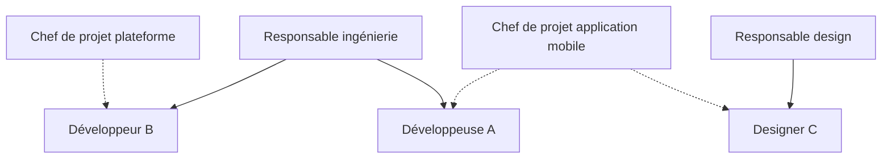
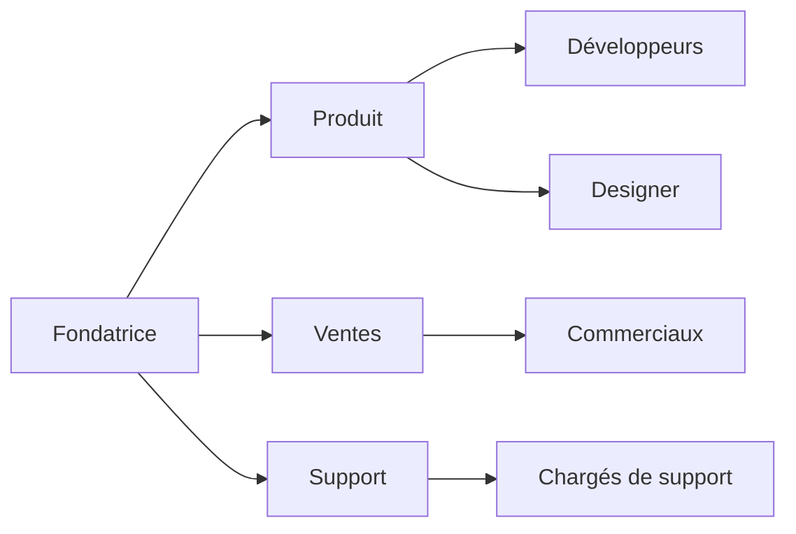

Il existe six types d’organigramme courants : hiérarchique, fonctionnel, matriciel, horizontal, circulaire et nominatif. Le nominatif prend souvent la forme d’un trombinoscope. Tous montrent la même organisation, mais chacun répond à une question différente : qui dépend de qui, quel service fait quel travail, qui travaille pour deux responsables, qui fait partie de quelle équipe, quelle équipe en contient une autre, qui est qui. Choisissez le type qui répond à la question que vos équipes posent le plus souvent, puis vérifiez qu’il ressemble à votre fonctionnement réel plutôt qu’à celui que vous visez.

Un type d’organigramme est une façon de dessiner l’organisation. La structure, c’est la façon dont le travail est regroupé et dont les décisions sont prises. Elle peut être [fonctionnelle, divisionnelle, matricielle, hiérarchique ou plate](/fr/blog/organizational-structures). Une même entreprise à structure fonctionnelle peut afficher son organigramme en arbre, en cercles ou en trombinoscope.

## Les six types d’organigramme en un tableau

| Type | Forme du schéma | Question à laquelle il répond | Convient à |
|---|---|---|---|
| Hiérarchique | Arbre descendant, de la direction jusqu’aux équipes | Qui dépend de qui ? | La plupart des entreprises, surtout au-delà de deux niveaux |
| Fonctionnel | Arbre dont chaque branche est un métier : finance, ventes, production | Quel service fait quel travail ? | Une entreprise organisée par métier, une administration |
| Matriciel | Grille qui croise les métiers et les projets ou les marchés | Qui travaille pour deux responsables ? | Une organisation par projets qui puise dans plusieurs services |
| Horizontal | Arbre couché, lu de gauche à droite, ou schéma à un ou deux niveaux | Qui fait partie de quelle équipe ? | Une petite entreprise, une organisation plate |
| Circulaire | Cercles imbriqués ou concentriques | Quelle équipe contient quelle autre équipe ? | Une organisation en holacratie, en sociocratie ou par rôles |
| Nominatif | Noms et photos dans chaque case, ou trombinoscope | Qui est qui ? | L’accueil des nouveaux arrivants, une équipe qui grandit vite |

## L’organigramme hiérarchique

L’organigramme hiérarchique, qu’on appelle aussi organigramme vertical ou pyramidal, place chaque poste sous celui dont il dépend, avec la direction en haut et les équipes en bas. Chaque case a un seul parent, donc chacun peut remonter sa ligne de rattachement jusqu’au dirigeant. Quand on dit « organigramme », la plupart des gens pensent à celui-là.

Avec un seul parent par case, une personne qui travaille dans deux équipes n’apparaît que dans l’une des deux. L’intitulé de la case donne le poste, sans indiquer qui décide quoi. Pour que l’arbre reste juste après une réorganisation, [construisez l’organigramme hiérarchique à partir des rôles](/fr/blog/hierarchy-chart) avant d’y placer des noms.

## L’organigramme fonctionnel

L’organigramme fonctionnel regroupe les postes par métier. La comptabilité et les achats vont ensemble sous la finance, l’atelier et la qualité sous la production. On le dessine le plus souvent en arbre, avec un responsable par fonction sous la direction. Il se distingue de l’organigramme hiérarchique par son critère de regroupement : le métier passe avant le niveau.

Voici l’organigramme fonctionnel d’une PME industrielle d’une quarantaine de personnes.

Un salarié y trouve vite le service qui traite sa question. Chaque responsable de fonction y voit aussi l’ensemble de son métier. En revanche, un sujet qui touche plusieurs fonctions n’a aucune case sur ce schéma. Le lancement d’un nouveau produit mobilise la production, les ventes et la finance, donc il remonte à la direction générale, seul point commun des trois branches.

Dans les collectivités et les établissements publics, « organigramme fonctionnel » désigne souvent l’organigramme fonctionnel nominatif, ou OFN. C’est un tableau qui liste les tâches d’un service ou d’un processus avec, pour chacune, l’agent titulaire, son suppléant et le niveau de validation. Le contrôle interne s’en sert pour vérifier que chaque tâche sensible a un suppléant.

Comme l’organigramme fonctionnel, l’organigramme divisionnel a la forme d’un arbre, mais il regroupe d’abord par produit, par marché ou par zone géographique. Chaque division a alors ses propres fonctions : une entreprise qui vend du matériel médical et du matériel de laboratoire dessine deux branches, chacune avec ses ventes et sa production.

## L’organigramme matriciel

L’organigramme matriciel croise deux lignes de rattachement. Chaque personne dépend d’un responsable de métier, qui gère ses compétences et son évaluation, et d’un chef de projet ou de marché, qui fixe ses priorités de la semaine. Un arbre ne donne qu’un parent à chaque case, alors on dessine la matrice en ajoutant une seconde série de liens, ou en grille avec les métiers en colonnes et les projets en lignes.

Dans l’exemple ci-dessous, les traits pleins relient chaque personne à son responsable de métier, et les pointillés à son chef de projet.

Ce schéma montre les équipes projet qui traversent les services. Un arbre laisse ces équipes de côté. Le schéma n’indique pas pour autant lequel des deux responsables tranche quand ils demandent des choses opposées à la même personne. Cela dépend du type de matrice, [faible, équilibrée ou forte](/fr/blog/matrix-organizational-structure). Notez à côté de l’organigramme lequel des deux tranche dans votre organisation.

## L’organigramme horizontal

L’expression « organigramme horizontal » a deux sens.

Au sens graphique, l’organigramme horizontal est un arbre couché, qui se lit de gauche à droite : la direction à gauche, les équipes à droite. Cette disposition sert quand un responsable a beaucoup de personnes sous lui. Un arbre vertical s’étale alors en largeur et déborde de la page. L’arbre couché, lui, empile les cases de ces personnes les unes sous les autres.

Au sens de la structure, un organigramme horizontal est un organigramme plat, avec un ou deux niveaux entre la personne qui fait le travail et celle qui arbitre en dernier. Presque tout le monde y apparaît au même étage. Ce schéma reste lisible jusqu’à quelques dizaines de personnes. Au-delà, il faut choisir [entre une structure plate et une structure hiérarchique](/fr/blog/flat-vs-hierarchical) : ajouter des niveaux, ou en garder peu et décider qui arbitre à la place des responsables.

## L’organigramme circulaire

L’organigramme circulaire existe aussi sous deux formes.

Dans la forme concentrique, la direction est au centre et les niveaux forment des anneaux autour d’elle : les responsables sur le premier anneau, les équipes sur les suivants. Cette forme montre la même hiérarchie qu’un arbre. Les entreprises qui la choisissent veulent surtout éviter l’image de la pyramide.

Dans la forme imbriquée, chaque équipe est un cercle qui contient ses rôles et ses sous-équipes. Les organisations en [holacratie](/fr/glossary/holacratie) et en [sociocratie](/fr/glossary/sociocratie) dessinent leur organigramme ainsi, parce qu’un [cercle](/fr/glossary/cercle) y est une équipe avec sa propre raison d’être et son propre périmètre de décision. Cette forme montre deux choses qu’un arbre montre mal : une personne qui tient des rôles dans trois cercles apparaît dans les trois, et la taille d’un cercle donne une idée de ce qu’il contient.

L’exemple ci-dessous est interactif. Cliquez sur un cercle pour zoomer sur son contenu, et faites glisser pour vous déplacer.

<OrgChartView demo="demo" height="480px" showAllNodes={false} />

Les cercles montrent l’appartenance plutôt que le rattachement. Une personne qui cherche qui valide sa demande de congés le trouve plus vite sur un arbre.

## L’organigramme nominatif et le trombinoscope

L’organigramme nominatif ajoute dans chaque case le nom de la personne qui l’occupe, souvent avec sa photo, quel que soit le type d’organigramme. Il montre à qui s’adresser, mais il faut le corriger à chaque arrivée et à chaque départ. Un organigramme limité aux postes et aux services reste juste plus longtemps.

Dans l’arbre interactif ci-dessous, chaque carte de rôle affiche la photo et le nom des personnes qui tiennent ce rôle.

<OrgChartView demo="classic" view="Tree" height="480px" />

Le trombinoscope affiche chaque membre avec sa photo et son nom, sans la structure. Les nouveaux arrivants s’en servent pour mettre un visage sur les noms entendus en réunion. Il montre qui est qui. Pour savoir qui fait quoi, revenez à l’arbre ou aux cercles.

## Choisir le type d’organigramme

Partez de la question que vos équipes posent le plus souvent.

- Si c’est « À qui je demande la validation ? », dessinez un organigramme hiérarchique.
- Si c’est « Quel service s’occupe de ce sujet ? », dessinez un organigramme fonctionnel, ou divisionnel si vos activités sont assez différentes pour avoir chacune leurs fonctions.
- Si c’est « Pour qui je travaille sur ce projet ? » et qu’une bonne part de l’équipe travaille sur des projets transverses, dessinez un organigramme matriciel.
- Si c’est « Qui fait partie de mon équipe ? » et que l’entreprise a un ou deux niveaux, dessinez un organigramme horizontal.
- Si c’est « Mon équipe fait partie de quelle équipe plus large ? », dessinez un organigramme circulaire. Il convient aux organisations où des équipes en contiennent d’autres et où une personne tient souvent plusieurs rôles.
- Si c’est « Qui est cette personne ? », ajoutez un trombinoscope à l’organigramme que vous avez choisi.

Dessinez ensuite l’organisation telle qu’elle fonctionne aujourd’hui. Un organigramme en cercles imbriqués posé sur une entreprise où chaque décision remonte au dirigeant donne une image fausse aux nouveaux arrivants, qui découvrent la vraie hiérarchie à leur première demande de budget. L’inverse est vrai aussi : une équipe qui s’organise déjà par rôles perd de l’information quand on la range dans un arbre de postes.

## Un seul jeu de rôles pour plusieurs vues

La plupart des organisations ont besoin de plusieurs types à la fois. La direction lit l’arbre, les nouveaux arrivants ouvrent le trombinoscope, et les équipes qui fonctionnent en cercles préparent leurs réunions de gouvernance sur les cercles. Quand chaque vue est un fichier PowerPoint distinct, les trois se contredisent dès que quelqu’un oublie de reporter une embauche dans l’un des fichiers.

Dans Rolebase, les [cercles, l’arbre hiérarchique et le trombinoscope](/fr/docs/org-chart) sont trois vues des mêmes rôles. Quand vous modifiez un rôle ou y ajoutez un membre, les trois vues se mettent à jour. Vous choisissez la vue par défaut de votre organisation. Un lien partagé ouvre l’organigramme dans la vue et sur le rôle que vous aviez à l’écran. Une personne qui travaille dans deux équipes tient un rôle dans chacune et apparaît dans les deux, sans case à dupliquer à la main. Vous obtenez ainsi un [organigramme dynamique](/fr/blog/dynamic-org-chart), à jour après chaque changement.

## Questions fréquentes

<FaqList>

<FaqItem question="Quels sont les 4 types d’organigramme ?">

Les listes varient d’une source à l’autre. Les quatre types qui reviennent le plus souvent sont l’organigramme hiérarchique, l’organigramme fonctionnel, l’organigramme matriciel et l’organigramme plat, aussi appelé horizontal. L’organigramme divisionnel, l’organigramme circulaire et l’organigramme nominatif complètent souvent la liste.

</FaqItem>

<FaqItem question="Quelle est la différence entre un organigramme fonctionnel et un organigramme nominatif ?">

L’organigramme fonctionnel montre les fonctions et les services, regroupés par métier, sans forcément indiquer qui les occupe. L’organigramme nominatif ajoute le nom de chaque personne, et souvent sa photo. Dans le secteur public, l’organigramme fonctionnel nominatif combine les deux sous forme de tableau : chaque tâche d’un service y figure avec son titulaire et son suppléant.

</FaqItem>

<FaqItem question="Qu’est-ce qu’un organigramme circulaire ?">

Un organigramme circulaire représente l’organisation en cercles plutôt qu’en arbre. Dans sa forme concentrique, la direction est au centre et les niveaux forment des anneaux autour d’elle. Dans sa forme imbriquée, utilisée en holacratie et en sociocratie, chaque équipe est un cercle qui contient ses rôles et ses sous-équipes.

</FaqItem>

<FaqItem question="Qu’est-ce qu’un organigramme horizontal ?">

L’expression a deux sens. Au sens graphique, un organigramme horizontal est un arbre couché qui se lit de gauche à droite, pratique quand un responsable encadre beaucoup de personnes. Au sens de la structure, c’est l’organigramme d’une organisation plate, avec un ou deux niveaux seulement.

</FaqItem>

<FaqItem question="Quel type d’organigramme choisir pour une petite entreprise ?">

Une entreprise de moins de vingt personnes s’en sort très bien avec un organigramme horizontal ou un arbre à deux niveaux, complété par un trombinoscope pour les nouveaux arrivants. Si plusieurs personnes tiennent plusieurs rôles, ce qui arrive souvent dans une petite équipe, un organigramme par rôles en cercles montre mieux qui fait quoi.

</FaqItem>

<FaqItem question="Comment faire un organigramme fonctionnel ?">

Listez les grandes fonctions de l’entreprise, par exemple la production, le commercial, la finance et les ressources humaines. Rangez chaque poste ou chaque rôle sous sa fonction, nommez un responsable par fonction, puis reliez les fonctions à la direction. Word et PowerPoint proposent une disposition prête dans SmartArt, catégorie Hiérarchie. Un outil d’organigramme vous évite de redessiner le schéma à chaque changement.

</FaqItem>

</FaqList>

## Partir de la question de vos équipes

Notez les trois questions que vous entendez le plus souvent sur l’organisation, en réunion, sur la messagerie interne ou pendant les entretiens d’arrivée. Servez-vous-en pour choisir le type d’organigramme à dessiner en premier, et souvent un deuxième type à ajouter.

[Créez un compte Rolebase gratuit](/signup) pour décrire vos rôles une fois et les afficher en cercles, en arbre hiérarchique ou en trombinoscope. Rolebase gère aussi [les réunions et les décisions](/fr/features) liées à ces rôles, dans le même outil.
