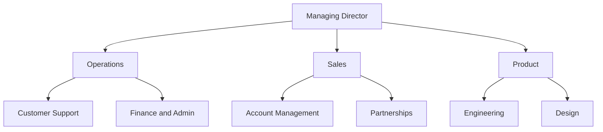

You draw an org chart in Word with SmartArt, a feature built into the app: open the **Insert** tab, click **SmartArt**, pick the **Hierarchy** category, then the **Organization Chart** layout. You then type the roles in the text pane and add boxes with **Add Shape**. Allow about ten minutes for a company of twenty people. This page gives those steps in detail, a Word template to download, and the part most tutorials leave out: what happens to the file after the next reorganization.

The short version is five steps.

1. Open the **Insert** tab, then **SmartArt** in the Illustrations group.
2. Select **Hierarchy** on the left, then **Organization Chart**, and click OK.
3. Type each role in the text pane that opens beside the graphic, on the line matching its level.
4. Press Tab to push a line one level down, Shift+Tab to pull it one level up, and Enter to add a box.
5. Adjust the look from the **SmartArt Design** tab with **Layout**, **Change Colors** and the style gallery.

Word for the web has no SmartArt button. Microsoft reserves SmartArt for the desktop app, so a chart made on Windows or Mac is read-only in the browser. Open the document in the Word app to draw one.

## List the roles before you open Word

The ten minutes of drawing are the easy part. What makes a chart useful, or useless, is the list you type into it.

Write that list first, one line per role, with four columns: the role, what it reports to, who holds it today, and what it decides alone. Two habits keep that list usable.

- Write "Customer Support" in the box rather than "Ana", then record that Ana holds it. Someone who holds two roles then appears twice without the chart contradicting itself. The day Ana leaves, the Customer Support box stays and you write "vacant" in place of her name.
- Hang every box off exactly one box above it. When a team seems to answer to two others, pick the one that sets its priorities and write the second link in the description rather than in the chart. A tree diagram shows one parent per box, while [a matrix org chart](/en/blog/matrix-organizational-structure) shows two.

The same list fits any [type of org chart](/en/blog/org-chart-types), so it still holds the day the tree stops suiting your company.

A list of ten roles gives a structure like this one.

## Draw the chart with SmartArt, step by step

### Insert the graphic

Open the **Insert** tab, find the Illustrations group, and click **SmartArt**. In the dialog, choose **Hierarchy** in the left column. The gallery then shows a dozen layouts. Several of them are organization chart layouts, the only ones where Add Assistant works. Take **Organization Chart**. Click OK and Word puts a starter chart in the document: one box at the top, an assistant box under it, and three boxes on the next row.

### Fill in the text pane

The text pane to the left of the graphic shows the `[Text]` placeholders. Click one, type the role, and press the down arrow to move to the next. You build the structure with three keys: Enter creates a box at the same level, Tab demotes the current line, and Shift+Tab promotes it.

You can also paste. Copy your list of roles from a document or a spreadsheet, click into the text pane and paste the whole block, then set the levels with Tab. That is faster than clicking each box. The chart then matches the list you wrote.

### Add and move boxes

Select a box, open the **SmartArt Design** tab, and click the arrow next to **Add Shape**.

| Command | Effect |
|---|---|
| Add Shape After | A box at the same level, to the right of the selected one |
| Add Shape Before | A box at the same level, to the left of the selected one |
| Add Shape Below | A box one level down, reporting to the selected one |
| Add Shape Above | A box one level up. The selected box and everything under it drop one level |
| Add Assistant | A box attached to the selected one outside the main line, for an executive assistant or a chief of staff |

Add Assistant works only on the organization chart layouts. The command greys out on a plain Hierarchy layout.

To delete a box, select its border and press Delete. To move a branch, drag its line in the text pane. Everything under that branch follows.

### Narrow a wide branch

Use the **Layout** button on the SmartArt Design tab to change where Word puts the boxes of a branch. That button applies to the selected box and everything under it rather than to the whole chart.

- The **Standard** layout centres the boxes in a row under their parent.
- The **Both** layout stacks them two per row, which halves the width of a wide branch.
- The **Left Hanging** and **Right Hanging** layouts line them up vertically beside their parent, which keeps a whole department on one page.

### Colours, style and photos

**Change Colors** applies a colour combination taken from the document theme, so the chart follows your corporate colours once the theme is set. The style gallery next to it adds line and 3-D effects, though the flat styles print more clearly.

For a chart with photos, pick **Picture Organization Chart** in the Hierarchy gallery instead. Each box then has a picture icon: click it and choose the file. Word crops the photo into the box.

## Start from a template

The template has three pages. The first one is the role list to fill in before drawing, with a column for the role, what it reports to, who holds it and what it decides alone. The next two hold a three-level chart in landscape, one filled as an example and one blank.

Its chart is laid out as a Word table rather than as SmartArt, so you type over the boxes and the layout stays put. To add a branch, copy a column. The chart prints on one page.

{/* DOWNLOAD regen: python3 ./generate-org-chart-template.py */}
<Button label="Download the Word template" href="/downloads/org-chart-template.docx" variant="primary" />

Word also comes with its own templates. In **File**, then **New**, search for "organization chart" and you get a handful of ready-made documents. They are all built on the same SmartArt graphic, which you edit through the text pane and the Add Shape button.

<Callout type="tip" title="Check the list with the people who hold the roles">
A chart drawn alone at a desk gets corrected in the first meeting where someone reads it. Spend twenty minutes per team going through the list of roles with the people who hold them, so the boxes stop being guesses.
</Callout>

## Format the chart for printing or PDF

A Word org chart that runs wider than the page rarely gets printed or shared.

1. Switch the page to landscape from the **Layout** tab, then **Orientation**.
2. Narrow the margins on the same tab to gain a couple of centimetres on each side.
3. Drag the corner handle of the SmartArt frame out to the margins. Word rescales the boxes and the text with it.
4. Cut the deepest level when the chart still overflows, or give each department its own page with a copy of the graphic.
5. Export with **File**, then **Save as**, choosing PDF as the format, so the layout holds on every machine that opens it.

## Where a Word org chart stops working

SmartArt is fine for a company of twenty people whose structure barely moves. Three limits show up as soon as the company grows or reorganizes.

The chart is a drawing rather than data. Word stores boxes and lines, so nothing in the file records that Ana holds Customer Support. When two teams merge, you retype the boxes, which takes an afternoon in a company of eighty people.

The file lives on one drive. Whoever drew it becomes the person everyone emails for a change, the version on the intranet falls behind, and after two reorganizations nobody can say which copy is right.

A box holds a title and nothing else. "Head of Marketing" leaves open who approves a 4,000 euro campaign and who owns the pricing page. People open the chart for exactly those questions. The answers belong in [roles with written accountabilities](/en/blog/roles-vs-job-descriptions) rather than in a title.

| | An org chart in Word | An org chart built from roles |
|---|---|---|
| What the file holds | Boxes and lines | Roles, their parent and their holders |
| Who can change it | Whoever has the file open | Each team, on its own roles |
| A person in two teams | Two boxes typed by hand | One person, two roles |
| After a reorganization | Retype the boxes | Move the role |
| What a box says | A title | A purpose, accountabilities and members |
| Other views | None | Circles, hierarchical tree, photo directory |

Free plans and prices vary a lot from one [org chart tool](/en/blog/best-org-chart-software) to the next.

## Keep the chart accurate after the first month

An org chart goes stale in small steps. Nobody added the new hire, two teams merged in a hallway conversation, someone quietly took over a role. Six months later the drawing no longer matches the company, so people stop opening it.

Record each change where the roles live rather than in a drawing. In Rolebase the [org chart](/en/docs/org-chart) is built from the roles themselves. When you move a role under another team, the chart updates at once. The history panel keeps every change and lets you undo it. The same roles display as circles, as a hierarchical tree or as a photo directory, so you switch views without redrawing anything.

Your Word documents will still need a picture. [Export any role as a PNG image](/en/docs/export), with everything under it, on a transparent background and at the width you choose. Paste the image into your handbook or your onboarding pack. Publish the chart as a public link or embed it in your intranet, with or without the members. Both stay current on their own.

{/* TODO ANECDOTE: a customer who moved off a Word or PowerPoint chart, with how often theirs used to go stale and how long the switch took. Nothing in the repo carries one. */}

## Frequently asked questions

<FaqList>

<FaqItem question="Is there an org chart template in Word?">

Yes. Open **File**, then **New**, and search for "organization chart" to get ready-made documents. Every one of them is built on the same SmartArt graphic you get from **Insert**, then **SmartArt**, then **Hierarchy**, so you edit them through the text pane and the Add Shape button. The template on this page works differently: it lays the chart out as a Word table and adds the role list to fill in first.

</FaqItem>

<FaqItem question="What is the easiest way to create an org chart?">

For a team of twenty people that rarely changes, SmartArt in Word or PowerPoint is the quickest way, with no account to create and no software to install. Past that size, or once the structure moves every quarter, an org chart tool with a free plan takes less effort overall, since each change updates the chart for everyone instead of producing another copy of a file.

</FaqItem>

<FaqItem question="Does Microsoft have an org chart tool?">

Microsoft has three. With SmartArt in Word, PowerPoint and Excel you draw the chart by hand. Visio builds one from a list of employees and supports much larger structures, on a separate subscription. Microsoft 365 also shows an organization chart in the profile card of a colleague, built from the manager field your IT administrator sets in Entra ID.

</FaqItem>

<FaqItem question="Can ChatGPT make an org chart in Word?">

It can write the list of roles and their reporting lines, which is the longest part to type. You then paste that list into the SmartArt text pane and set the levels with Tab. It cannot insert the graphic into your document or maintain it afterwards. Check the result against how the company actually works, since a model will invent plausible team names.

</FaqItem>

<FaqItem question="Why can I not find SmartArt in Word?">

Word for the web does not have it. Microsoft reserves SmartArt for the desktop app, so the button is missing when a document is open in a browser tab, and an existing chart shows there as a picture you cannot edit. Open the same file in the Word app on Windows or Mac and the Insert tab has the button.

</FaqItem>

</FaqList>

## Start from your roles rather than the boxes

Take the list of roles you wrote for the template and mark what a drawing never shows: the people who hold two roles, and the boxes whose title says nothing about what the role decides. That list is worth more than the chart it produces.

[Create a free Rolebase account](/signup) to turn it into an org chart your teams keep current themselves, exportable as an image the day a Word document needs one. Rolebase is free for up to five active members, with no credit card, and handles [meetings and decisions](/en/features) on the same roles.
