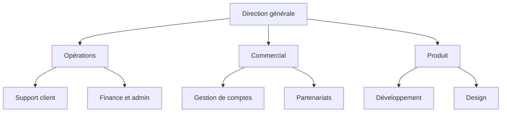

Vous dessinez un organigramme sur Word avec SmartArt, une fonction intégrée à l’application : ouvrez l’onglet **Insertion**, cliquez sur **SmartArt**, choisissez la catégorie **Hiérarchie**, puis la disposition **Organigramme**. Vous saisissez ensuite les rôles dans le volet Texte et vous ajoutez des cases avec **Ajouter une forme**. Comptez une dizaine de minutes pour une entreprise d’une vingtaine de personnes. Cette page donne ces étapes en détail, un modèle Word à télécharger et la partie que la plupart des tutoriels sautent : ce que devient le fichier après la prochaine réorganisation.

La version courte tient en cinq étapes.

1. Ouvrez l’onglet **Insertion**, puis **SmartArt** dans le groupe Illustrations.
2. Sélectionnez **Hiérarchie** à gauche, puis **Organigramme** et validez.
3. Saisissez chaque rôle dans le volet Texte qui s’ouvre à côté du graphique, sur la ligne correspondant à son niveau.
4. Appuyez sur Tab pour descendre une ligne d’un niveau, Maj+Tab pour la remonter et Entrée pour ajouter une case.
5. Réglez l’apparence depuis l’onglet **Création SmartArt** avec **Disposition**, **Modifier les couleurs** et la galerie de styles.

Word en ligne n’a pas de bouton SmartArt. Microsoft réserve cette fonction à l’application installée, donc un organigramme créé sur Windows ou Mac s’affiche dans le navigateur en lecture seule. Ouvrez le document dans l’application Word pour en dessiner un.

## Listez les rôles avant d’ouvrir Word

Les dix minutes de dessin sont la partie facile. Ce qui rend un organigramme utile, ou inutile, c’est la liste que vous y mettez.

Écrivez d’abord cette liste, une ligne par rôle, avec quatre colonnes : le rôle, son rattachement, qui le tient aujourd’hui et ce qu’il décide seul. Deux habitudes rendent cette liste utilisable.

- Écrivez « Support client » dans la case plutôt que « Ana », puis notez qu’Ana tient ce rôle. Une personne qui tient deux rôles apparaît alors deux fois sans que l’organigramme se contredise. Le jour où Ana part, la case Support client reste et vous écrivez « vacant » à la place de son nom.
- Rattachez chaque case à une seule case au-dessus. Quand une équipe semble dépendre de deux autres, retenez celle qui fixe ses priorités et écrivez le second lien dans la description plutôt que dans le dessin. Un arbre montre un seul parent par case, là où [un organigramme matriciel](/fr/blog/matrix-organizational-structure) en montre deux.

La même liste sert pour n’importe quel [type d’organigramme](/fr/blog/org-chart-types), donc elle tient encore le jour où l’arbre cesse de convenir à votre entreprise.

Une liste de dix rôles donne une structure de ce genre.

## Dessinez l’organigramme avec SmartArt, étape par étape

### Insérez le graphique

Ouvrez l’onglet **Insertion**, repérez le groupe Illustrations et cliquez sur **SmartArt**. Dans la fenêtre, choisissez **Hiérarchie** dans la colonne de gauche. La galerie affiche alors une douzaine de dispositions. Plusieurs d’entre elles sont des dispositions d’organigramme, les seules où la commande Ajouter un assistant fonctionne. Prenez **Organigramme**, puis validez. Word pose un organigramme de départ dans le document : une case en haut, une case assistant en dessous et trois cases sur la rangée suivante.

### Remplissez le volet Texte

Le volet Texte, à gauche du graphique, affiche les emplacements `[Texte]`. Cliquez sur l’un d’eux, tapez le rôle et descendez avec la flèche du bas. Vous construisez la structure avec trois touches : Entrée crée une case au même niveau, Tab abaisse la ligne courante d’un niveau et Maj+Tab la remonte.

Vous pouvez aussi copier-coller. Copiez votre liste de rôles depuis un document ou un tableur, cliquez dans le volet Texte, collez le bloc entier, puis réglez les niveaux avec Tab. C’est plus rapide que de cliquer case par case. L’organigramme reste alors fidèle à la liste que vous avez écrite.

### Ajoutez et déplacez des cases

Sélectionnez une case, ouvrez l’onglet **Création SmartArt** et cliquez sur la flèche à côté d’**Ajouter une forme**.

| Commande | Effet |
|---|---|
| Ajouter la forme après | Une case au même niveau, à droite de celle qui est sélectionnée |
| Ajouter la forme avant | Une case au même niveau, à gauche de celle qui est sélectionnée |
| Ajouter la forme en dessous | Une case un niveau plus bas, rattachée à celle qui est sélectionnée |
| Ajouter la forme au-dessus | Une case un niveau plus haut. La case sélectionnée et tout ce qui en dépend descendent d’un niveau |
| Ajouter un assistant | Une case rattachée à celle qui est sélectionnée, hors de la ligne principale, pour un assistant de direction |

La commande Ajouter un assistant ne fonctionne que sur les dispositions d’organigramme. Elle reste grisée sur une disposition Hiérarchie simple.

Pour supprimer une case, sélectionnez son contour et appuyez sur la touche Suppr. Pour déplacer une branche, attrapez sa ligne dans le volet Texte et faites-la glisser. Tout ce qui en dépend suit.

### Resserrez une branche trop large

Utilisez le bouton **Disposition** de l’onglet Création SmartArt pour changer l’endroit où Word place les cases d’une branche. Ce bouton s’applique à la case sélectionnée et à ce qui en dépend, plutôt qu’à l’organigramme entier.

- La disposition **Standard** centre les cases sur une rangée sous leur parent.
- La disposition **Les deux** les empile deux par rangée, ce qui divise par deux la largeur de la branche.
- Les dispositions **Retrait à gauche** et **Retrait à droite** les alignent verticalement à côté de leur parent, ce qui garde un service entier sur une seule page.

### Couleurs, style et photos

**Modifier les couleurs** applique une combinaison de couleurs tirée du thème du document, donc l’organigramme suit votre charte dès que le thème est réglé. La galerie de styles à côté ajoute des effets de trait et de relief, mais les styles plats restent les plus lisibles à l’impression.

Pour un organigramme avec les photos des personnes, choisissez plutôt **Organigramme avec images** dans la galerie Hiérarchie. Chaque case porte alors une icône d’image : cliquez dessus et choisissez le fichier. Word recadre la photo dans la case.

## Partez d’un modèle

Le modèle tient en trois pages. La première est la liste des rôles à remplir avant de dessiner, avec une colonne pour le rôle, son rattachement, son titulaire et ce qu’il décide seul. Les deux suivantes contiennent un organigramme à trois niveaux en paysage, l’un rempli en exemple, l’autre vierge.

Son organigramme est construit avec un tableau Word plutôt qu’avec SmartArt, donc vous écrivez par-dessus les cases et la mise en page reste en place. Pour ajouter une branche, copiez une colonne. L’organigramme tient sur une page à l’impression.

{/* DOWNLOAD regen: python3 ./generate-org-chart-template.py */}
<Button label="Télécharger le modèle Word" href="/downloads/modele-organigramme.docx" variant="primary" />

Word a aussi ses propres modèles. Dans **Fichier**, puis **Nouveau**, cherchez « organigramme » pour obtenir quelques documents prêts à l’emploi. Ils reposent tous sur le même graphique SmartArt, que vous modifiez par le volet Texte et le bouton Ajouter une forme.

<Callout type="tip" title="Vérifiez la liste avec ceux qui tiennent les rôles">
Un organigramme dessiné seul à son bureau se fait corriger dès la première réunion où quelqu’un le lit. Passez vingt minutes par équipe à relire la liste des rôles avec ceux qui les tiennent, pour que les cases cessent d’être des suppositions.
</Callout>

## Mettez l’organigramme en forme pour l’impression ou le PDF

Un organigramme Word plus large que la page a peu de chances d’être imprimé ou partagé.

1. Passez la page en paysage depuis l’onglet **Mise en page**, puis **Orientation**.
2. Réduisez les marges depuis le même onglet pour gagner deux bons centimètres de chaque côté.
3. Tirez la poignée d’angle du cadre SmartArt jusqu’aux marges. Word redimensionne les cases et le texte en même temps.
4. Supprimez le niveau le plus bas quand l’organigramme déborde encore, ou donnez à chaque service sa propre page, avec une copie du graphique.
5. Exportez avec **Fichier**, puis **Enregistrer sous**, en choisissant le format PDF, pour que la mise en page tienne sur toutes les machines qui l’ouvriront.

## Là où un organigramme Word s’arrête

SmartArt convient à une entreprise d’une vingtaine de personnes dont la structure bouge peu. Trois limites apparaissent dès que l’entreprise grandit ou se réorganise.

L’organigramme est un dessin plutôt que des données. Word enregistre des cases et des traits, donc le fichier ne garde aucun lien entre Ana et le Support client. Quand deux équipes fusionnent, vous retapez les cases, ce qui occupe un après-midi dans une entreprise de quatre-vingts personnes.

Le fichier reste sur un seul poste. Celui qui l’a dessiné devient la personne à qui tout le monde écrit pour un changement, la version de l’intranet prend du retard, et après deux réorganisations personne ne sait laquelle fait foi.

Une case porte un intitulé, et rien d’autre. « Responsable marketing » laisse ouvert qui valide une campagne à 4 000 euros et qui décide de la page tarifs. Les gens ouvrent un organigramme pour ces questions-là. Les réponses tiennent dans [des rôles aux redevabilités écrites](/fr/blog/roles-vs-job-descriptions) plutôt que dans un intitulé.

| | Un organigramme sur Word | Un organigramme construit sur les rôles |
|---|---|---|
| Contenu du fichier | Des cases et des traits | Des rôles, leur rattachement et leurs titulaires |
| Qui peut le modifier | Celui qui a le fichier ouvert | Chaque équipe, sur ses propres rôles |
| Une personne dans deux équipes | Deux cases tapées à la main | Une personne, deux rôles |
| Après une réorganisation | Retaper les cases | Déplacer le rôle |
| Contenu d’une case | Un intitulé | Une raison d’être, des redevabilités, des membres |
| Autres vues | Aucune | Cercles, arbre hiérarchique, trombinoscope |

Les offres gratuites et les tarifs varient beaucoup d’un [logiciel d’organigramme](/fr/blog/best-org-chart-software) à l’autre.

## Gardez l’organigramme à jour après le premier mois

Un organigramme vieillit un changement à la fois. Personne n’a ajouté la nouvelle embauche, deux équipes ont fusionné au détour d’un couloir, quelqu’un a repris un rôle en silence. Six mois plus tard, le dessin ne correspond plus à l’entreprise, donc les gens arrêtent de l’ouvrir.

Enregistrez chaque changement là où vivent les rôles plutôt que dans un dessin. Dans Rolebase, l’[organigramme](/fr/docs/org-chart) se construit à partir des rôles eux-mêmes. Quand vous déplacez un rôle sous une autre équipe, l’organigramme se met à jour aussitôt. Le panneau d’historique garde chaque changement et vous laisse l’annuler. Les mêmes rôles s’affichent en cercles, en arbre hiérarchique ou en trombinoscope, donc vous passez d’une vue à l’autre sans rien redessiner.

Vos documents Word auront encore besoin d’une image. [Exportez n’importe quel rôle en image PNG](/fr/docs/export), avec tout ce qu’il contient, sur fond transparent et à la largeur de votre choix. Collez-la dans votre livret d’accueil ou votre kit d’intégration. Publiez l’organigramme en lien public ou intégrez-le à votre intranet, avec ou sans les membres. Les deux restent à jour tout seuls.

{/* TODO ANECDOTE: un client passé d’un organigramme Word ou PowerPoint à Rolebase, avec la fréquence à laquelle le sien se démodait et le temps qu’a pris la bascule. Rien dans le dépôt n’en porte. */}

## Questions fréquentes

<FaqList>

<FaqItem question="Où puis-je trouver un organigramme gratuit dans Word ?">

Ouvrez **Fichier**, puis **Nouveau**, et cherchez « organigramme » pour obtenir des documents prêts à l’emploi. Tous reposent sur le même graphique SmartArt que vous obtenez par **Insertion**, puis **SmartArt**, puis **Hiérarchie**, donc vous les modifiez par le volet Texte et le bouton Ajouter une forme. Le modèle de cette page fonctionne autrement : il construit l’organigramme comme un tableau Word et ajoute la liste des rôles à remplir en premier.

</FaqItem>

<FaqItem question="Comment réaliser un organigramme facilement ?">

Pour une équipe d’une vingtaine de personnes qui bouge peu, SmartArt dans Word ou PowerPoint est le chemin le plus court, sans compte à créer ni logiciel à installer. Au-delà, ou dès que la structure change chaque trimestre, un outil d’organigramme avec une offre gratuite demande moins d’efforts au total, puisque chaque modification met l’organigramme à jour pour tout le monde au lieu de produire une copie de plus.

</FaqItem>

<FaqItem question="Comment faire une arborescence sur Word ?">

Dessinez une arborescence avec SmartArt : ouvrez l’onglet **Insertion**, cliquez sur **SmartArt**, choisissez la catégorie **Hiérarchie**, puis la disposition **Organigramme**. Prenez ensuite **Retrait à gauche** dans le bouton **Disposition**. Les branches s’alignent alors verticalement à côté de leur parent, comme dans une arborescence de dossiers. Réglez les niveaux avec Tab et Maj+Tab dans le volet Texte.

</FaqItem>

<FaqItem question="Quels sont les 4 types d’organigramme ?">

Les quatre types les plus souvent cités sont l’organigramme hiérarchique, l’organigramme fonctionnel qui regroupe par métier, l’organigramme matriciel à deux rattachements et l’organigramme horizontal, celui des structures à peu de niveaux. D’autres classements comptent aussi l’organigramme circulaire et le trombinoscope. Choisissez le [type d’organigramme](/fr/blog/org-chart-types) d’après la question que vos équipes posent le plus souvent.

</FaqItem>

<FaqItem question="Pourquoi je ne trouve pas SmartArt dans Word ?">

Word en ligne ne l’a pas. Microsoft réserve SmartArt à l’application installée, donc le bouton manque quand le document est ouvert dans un onglet de navigateur, et un organigramme existant s’y affiche comme une image non modifiable. Ouvrez le même fichier dans l’application Word sur Windows ou Mac. Le bouton est dans l’onglet Insertion.

</FaqItem>

</FaqList>

## Partez des rôles plutôt que des cases

Reprenez la liste de rôles écrite pour le modèle et marquez-y ce qu’un dessin ne montre jamais : les personnes qui tiennent deux rôles et les cases dont l’intitulé ne dit rien de ce que le rôle décide. Cette liste vaut plus que l’organigramme qu’elle produit.

[Créez un compte Rolebase gratuit](/signup) pour en faire un organigramme que vos équipes tiennent à jour elles-mêmes, exportable en image le jour où un document Word en réclame une. Rolebase est gratuit jusqu’à cinq membres actifs, sans carte bancaire, et gère [les réunions et les décisions](/fr/features) sur les mêmes rôles.
