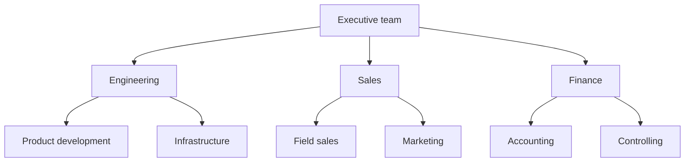
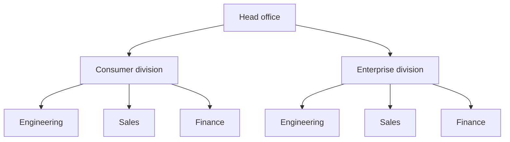
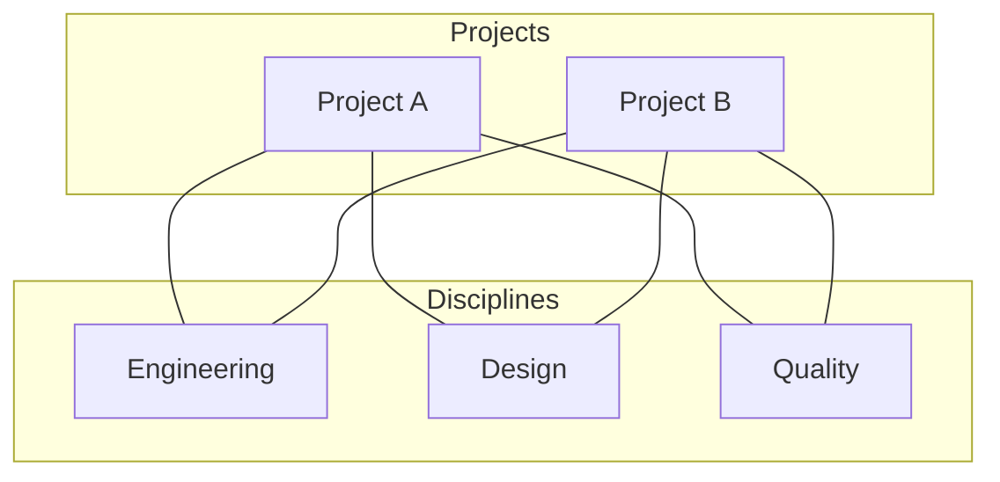
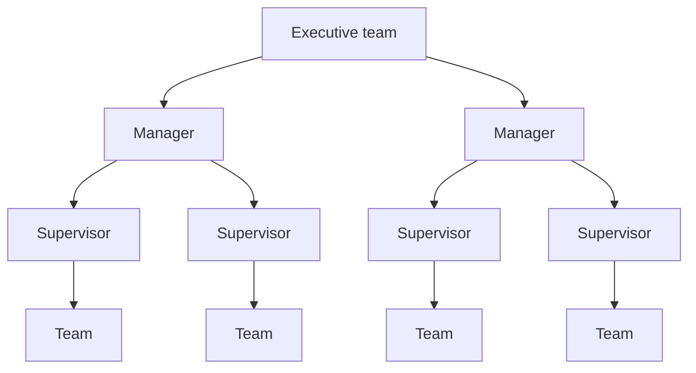

In 1911, Frederick Taylor proposed that a machine shop worker should answer to eight bosses at once. A gang boss for the setup, a speed boss for the cutting rates, an inspector for quality, a repair boss for the machines, and four clerks for routing, instructions, costs and discipline. Each one owned a slice of expertise and gave orders on that slice alone. Five years later, Henri Fayol wrote the opposite in *Administration industrielle et générale*. An employee takes orders from one supervisor, and Fayol treated any breach of that rule as a standing source of conflict in every company he had run.

The two of them were designing the same object, a way to group work and to name who arbitrates. Taylor grouped by expertise and accepted several bosses. Fayol grouped by command line and kept one. Every structure invented since sits somewhere between those two positions, and the argument about matrix organizations today is still that argument, a century older.

## What a structure is, and what the org chart shows

Three choices sit inside the word "structure", and they get made separately.

The grouping principle says what goes in the same box, whether that is a discipline, a product, a market, a region, a project or some combination of them.

The coordination mechanism says what holds the boxes together. Henry Mintzberg named five in *The Structuring of Organizations* in 1979: people adjusting between themselves, a supervisor giving orders, and the standardization of work processes, of outputs or of skills. Every organization runs several at once and leans on one.

The decision rights say who rules on what, and how far. This is the part of [governance](/en/glossary/gouvernance) that changes how people spend their week, and the org chart never draws it.

An org chart draws boxes and reporting lines. Two companies with identical charts can run completely differently, one where a team lead signs off on a 40,000 euro spend, another where the same lead escalates a software subscription. Any structure worth the name says who decides, over what scope, and where that answer is written down.

## The functional structure

A functional structure groups people by discipline. Engineering has a head, so do sales, finance and human resources, and each department pools the expertise of its field.

The technical level climbs. A specialist skill serves the whole company instead of being hired into every team, and the specialists work next to each other and review each other's work. Career paths are legible, since a junior can see the six people ahead of them in the same discipline.

The trouble starts the moment a subject crosses two departments. Nobody holds authority over both, so the call goes up a floor, and it goes up again if the two heads disagree. The more different things the company sells, the more those escalations clog the top. This is what makes the functional form a good fit for a company selling one coherent range on a stable market, and a poor fit for a portfolio of unrelated businesses.

Large companies use it too. Microsoft ran roughly 100,000 people when Steve Ballmer reorganized it into functional groups on 11 July 2013, dropping the divisional presidents and putting engineering, marketing, business development and finance each under a single head. The stated reason was to see the product line "holistically, not as a set of islands". A functional structure works at that size when the businesses genuinely share technology and customers.

## The divisional structure

A divisional structure splits the company into units built around a product, a market or a region, and each unit carries its own functions along with a result to hit.

DuPont and General Motors invented the form in the early 1920s, when their diversification made a single functional pyramid unworkable. Alfred Chandler documented the shift in *Strategy and Structure* in 1962 and observed that a form which barely existed in 1920 had become, by 1960, the accepted shape of large diversified firms. Headquarters then steers with numbers, which is Mintzberg's standardization of outputs. Each division gets a real arbiter close to its own market.

The head office functions then get duplicated in every division. Five divisions run five finance teams, five marketing teams, and often five versions of the same product decision. Divisions compete for capital, haggle over transfer prices, and a good idea born in one of them rarely crosses to the others. A divisional structure is worth that duplication when the markets served are different enough that a single arbiter has nothing useful left to say about any of them.

## The matrix structure

A matrix structure ties one person to two lines at once, their discipline and their product or project. It came out of American aerospace in the 1950s and 1960s, where a program needed skills scattered across five departments and standing up five redundant teams cost too much, then spread widely through the 1970s.

Stanley Davis and Paul Lawrence, who wrote the reference book on it in 1977, followed up in the *Harvard Business Review* in May 1978 with a list of nine ways a matrix goes wrong. The names they gave those failures still describe what people complain about: power struggles between the two lines, decision strangulation when every call needs both signatures, groupitis when managers mistake the matrix for group decision making, sinking when the matrix quietly drops down to the division level, and navel gazing when the organization spends its energy on its own internal balance.

The Spotify model is the modern version, and it followed the same arc. Henrik Kniberg's 2012 white paper described squads owning a product area, chapters holding a discipline, tribes grouping squads and guilds cutting across everything. Companies copied it by the hundred. In 2020, Jeremiah Lee, a former product manager there, published an account of what it was actually like from the inside. Collaboration between squads had been left as a soft factor rather than designed in, and the split between the product owner who owns the "what" and the chapter lead who owns the "how" turned into an unresolved priority fight, which is the matrix pathology Davis and Lawrence had named forty years earlier.

A matrix works when the two lines have an explicit rule for the case where they disagree. Without that rule, the conflict lands on whoever sits at the crossing.

## The hierarchical structure

A hierarchical structure stacks levels of authority, each level supervising a narrow group, with a single line of command from top to bottom. It is Fayol's answer, and it has run companies for a hundred and seventy years.

Every problem has an address, so a question that outgrows a team knows exactly where to go. Approvals in series catch bad projects before they ship, which is what a nuclear operator or a medical device maker wants. And levels draw a career path people understand, with a title, a scope and a salary at each floor. Those three services are why the form has lasted.

The drawbacks are documented well enough to fill their own article, from information that travels down better than it travels up to the promotion of specialists into management they never wanted. That is [the five structural problems of hierarchy](/en/blog/hierarchy-problems). The number of levels also deserves its own treatment, since a company can remove floors and centralize at the same time: [flat versus hierarchical](/en/blog/flat-vs-hierarchical) covers that trade. How far the top delegates is a third axis, the subject of [horizontal versus vertical management](/en/blog/horizontal-vs-vertical).

## The flat and role-based structure

A flat structure keeps two or three levels between the person doing the work and the person who arbitrates last, with each manager overseeing a wide group. That definition only counts floors. The version that holds up as headcount grows replaces the missing levels with written roles.

A role carries a purpose, a domain it decides on alone, and accountabilities others can ask it for. One person holds several roles, and a role gets revised when the work changes, which is the whole difference between [a role and a job description](/en/blog/roles-vs-job-descriptions). Grouping happens by role rather than by department, and coordination runs on explicit decision rules instead of a supervisor, which is what [role based management](/en/blog/role-based-management) describes.

<OrgChartView demo="demo" height="440px" showAllNodes={false} />

Haier is the largest case. Zhang Ruimin removed around 10,000 middle managers and rebuilt the appliance maker into roughly 4,000 microenterprises, each with its own users to serve and its own numbers to hit. The structure holds because every unit carries a result and a mandate. Removing the layers only clears the space where that mandate sits.

A flat structure that leaves its roles implicit regresses to informal power, the mechanism Jo Freeman named the tyranny of structurelessness in 1972. The [horizontal organization](/en/glossary/organisation-horizontale) that works is the one that wrote its rules down.

## The five structures side by side

| Structure    | Who decides                                | What coordinates                     | Fits                                        | Where it breaks                                          |
| ------------ | ------------------------------------------ | ------------------------------------ | ------------------------------------------- | -------------------------------------------------------- |
| Functional   | The department head, the CEO across departments | Standardized work processes          | One coherent range, stable market           | Every cross-department subject escalates                  |
| Divisional   | The division head, inside a set target     | Standardized outputs, steering by numbers | Markets different enough to need their own arbiter | Duplicated functions, rivalry, transfer prices     |
| Matrix       | The two lines together, by negotiation     | Mutual adjustment, arbitration bodies | Complex projects drawing on scarce skills   | No rule for disagreement, so the conflict lands on one person |
| Hierarchical | The level above, up to the top             | Direct supervision                   | Costly mistakes, stable environment         | Information stops traveling upward, decisions queue      |
| Flat and role-based | The role, inside its written domain | Explicit decision rules, standardized skills | Fast-changing work, expertise spread across the team | Roles left unwritten, so informal power fills the gap |

## How to choose, by size and by business

Paul Lawrence and Jay Lorsch studied ten firms in plastics, food and containers and published *Organization and Environment* in 1967. Their finding still settles most of these debates. The more turbulent and varied the environment, the more each department has to differentiate itself, with its own horizon, its own vocabulary and its own way of working. And the more a company differentiates, the more integration machinery it needs to hold the pieces together, whether that is liaison roles, cross-functional teams or arbitration bodies. Companies that performed best had both, high differentiation and heavy integration. The ones that failed had picked one.

Three questions get you most of the way.

Start with how many genuinely different businesses you run. One business is functional. Three that share almost nothing is divisional. Two that share their technology but sell to different customers is where the matrix starts to justify its complexity.

Then ask where the decisive information sits. When it sits with the people doing the work and goes stale in a week, decision rights belong to the role. When it sits at the top and goes stale in a year, levels do the job.

The last question is how fast the work changes. Melvin Conway pointed out in 1968 that an organization designs systems mirroring its own communication structure. When the product gets reshaped every quarter, a structure revised once a year will be modeling last year's product.

Headcount matters less than these three, with one exception. Somewhere between 100 and 150 people, informal coordination stops covering the gaps, and every structure needs its decision rights written down.

## Changing structure without breaking everything

Most reorganizations announce a new chart on a Monday and leave the decision rights untouched, so the same conflicts reach the same arbiter through new boxes.

Three moves work better.

Change one grouping at a time. A company can move its engineering teams from discipline to product without touching finance, watch what escalates for a quarter, then decide about the rest.

Write the decision rights before the boxes. For each type of decision that matters, name who rules, over what scope, and where that is recorded. Doing it in that order tends to shrink the reorganization, since half the pain usually comes from unclear mandates rather than from wrong groupings.

Give the structure a rhythm of revision. A recurring [governance meeting](/en/blog/governance-meeting) where roles get created, amended and dropped keeps the gap between the chart and the real work small. Without it, [the org chart freezes](/en/blog/dynamic-org-chart) and the next correction has to be a big one.

Scop EVEA went from 60 to 140 people between 2020 and 2023, across three sites, with more than eight competency clusters and cross-functional missions running through all of them. The structure had outgrown the PowerPoint that described it well before it outgrew the way the cooperative worked. [Their case](/en/client-cases/scop-evea) shows what changes when a growing organization makes its roles explicit rather than redrawing its boxes.

{/* TODO ANECDOTE: a customer number on how many roles a team maps in its first month, or a before/after on escalations, would strengthen this section. */}

Rolebase is where that structure gets written. Roles carry their purpose, domain and accountabilities, decisions stay attached to the role that made them, and a [governance mode](/en/docs/governance-modes) sets who can change what: Free, where every member edits the whole org chart, Agile, where each role is editable by its leaders, or Strict, where any structural change goes through a proposal. [See the features](/en/features), or create your organization free for up to five active members.

<FaqList>

<FaqItem question="What are the 4 types of organizational structure?">
  The four forms named most often are functional, divisional, matrix and flat. Functional groups people by discipline, divisional by product, market or region, matrix combines both lines on the same person, and flat removes management levels in favor of wide spans. Hierarchical is sometimes counted as a fifth, though it describes the number of levels rather than the grouping principle.
</FaqItem>

<FaqItem question="What are the 7 types of organizational structures?">
  Longer lists keep the four above and add three. Process structure groups people around an end-to-end process such as order-to-cash. Network structure keeps a small core and contracts out the rest. Team-based structure makes the multidisciplinary team the standing unit, and role-based governance is its written version, where authority attaches to a role rather than to a job title. All seven are variations on the same three choices: what gets grouped together, what coordinates it, and who decides.
</FaqItem>

<FaqItem question="What is a functional organizational structure example?">
  Microsoft moved to a functional structure on 11 July 2013, when Steve Ballmer dropped the divisional presidents and grouped the company under single heads for engineering, marketing, business development and finance. Most companies under fifty people run functionally without naming it, with one person heading sales, one heading product and one heading operations.
</FaqItem>

<FaqItem question="What is the difference between a structure and an org chart?">
  The org chart draws the boxes and the reporting lines. The structure also includes what coordinates the work and who holds the right to decide what, which the chart never shows. Two companies with identical charts can run very differently depending on how far a team lead can go before asking.
</FaqItem>

<FaqItem question="Which companies use a matrix structure?">
  The form came out of American aerospace in the 1950s and 1960s and spread through large industrial and engineering firms in the 1970s. The best-known modern version is the Spotify model published in 2012, with squads owning a product area and chapters holding a discipline. A former Spotify product manager described in 2020 how the split between the two lines had produced exactly the priority conflicts that Davis and Lawrence documented in 1978.
</FaqItem>

<FaqItem question="Which organizational structure is best for a small company?">
  Below thirty people, grouping by discipline is usually enough, and the real work is writing down who decides what. Past 100 to 150, informal coordination stops covering the gaps, and the choice between divisional, matrix and role-based depends on how many different businesses you run and on how fast the work changes.
</FaqItem>

</FaqList>
