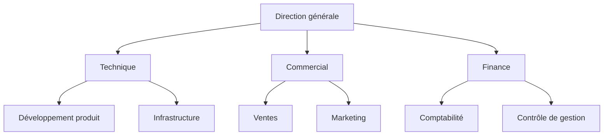
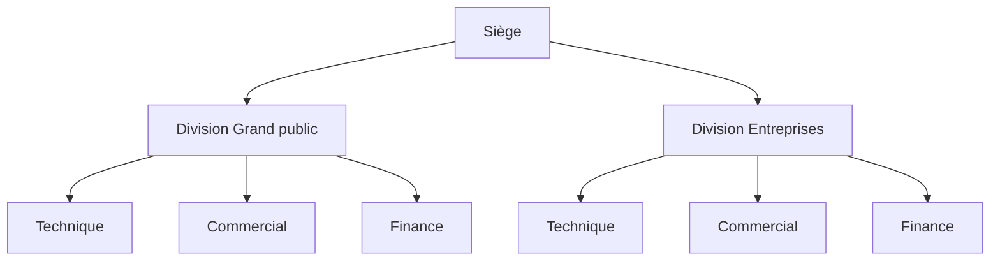
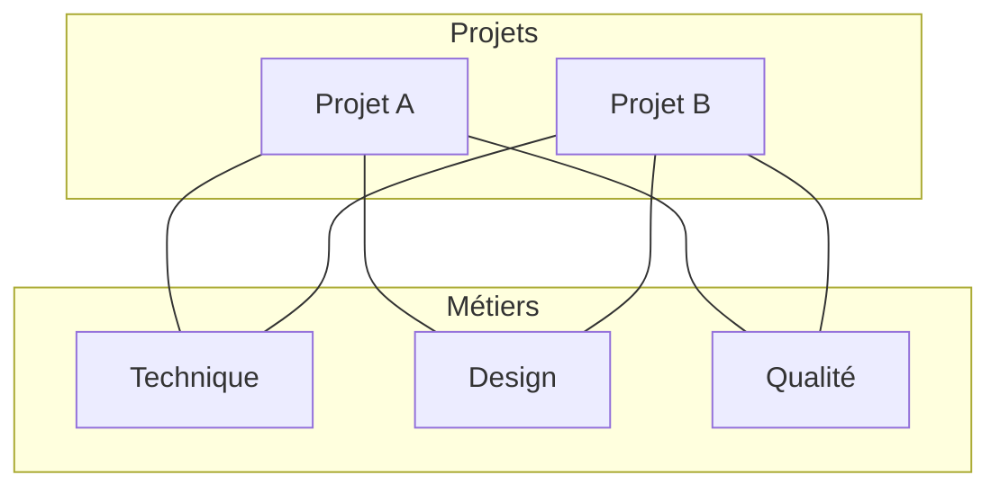
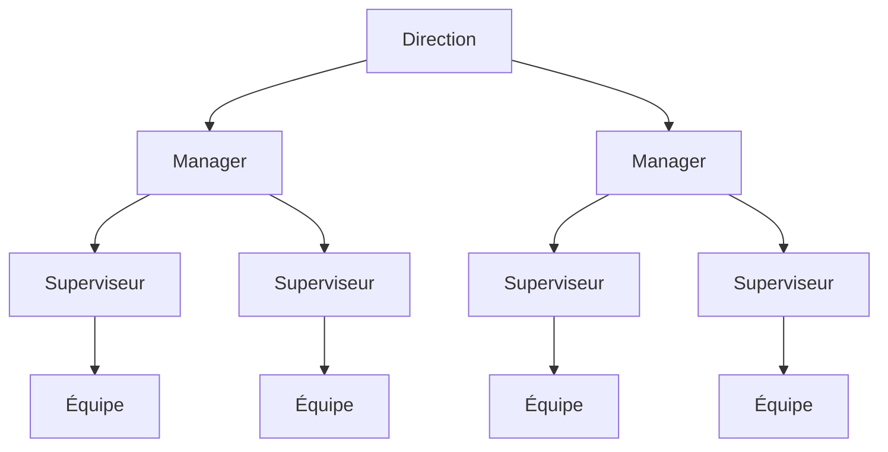

En 1911, Frederick Taylor propose qu'un ouvrier d'atelier réponde à huit chefs à la fois. Un chef d'équipe pour le réglage, un chef de vitesse pour les cadences, un contrôleur pour la qualité, un chef d'entretien pour les machines, et quatre employés pour le routage, les instructions, les coûts et la discipline. Chacun détient une tranche d'expertise et donne des ordres sur cette tranche uniquement. Cinq ans plus tard, Henri Fayol écrit l'inverse dans *Administration industrielle et générale*. Un agent reçoit des ordres d'un seul chef, et Fayol voit dans toute entorse à cette règle une source permanente de conflit dans les entreprises qu'il a dirigées.

Les deux dessinent pourtant le même objet, une façon de regrouper le travail et de désigner qui arbitre. Taylor regroupe par expertise et accepte plusieurs chefs. Fayol regroupe par ligne de commandement et n'en garde qu'un. Toutes les structures inventées depuis se placent quelque part entre ces deux positions, et le débat actuel sur les organisations matricielles est encore ce débat-là, un siècle plus tard.

## Les trois choix que recouvre une structure

Les trois se prennent séparément, et seul le premier se lit sur un organigramme.

Le principe de regroupement dit ce qui va dans la même case : un métier, un produit, un marché, une zone géographique, un projet, ou une combinaison de ces critères.

Le mécanisme de coordination dit ce qui fait tenir les cases ensemble. Henry Mintzberg en nomme cinq dans *Structure et dynamique des organisations*, paru en 1979 : l'ajustement mutuel entre collègues, la supervision directe, et la standardisation des procédés, des résultats ou des qualifications. Toute organisation en fait tourner plusieurs et s'appuie principalement sur un.

Les droits de décision disent qui tranche, sur quoi, et jusqu'où. C'est la part de la [gouvernance](/fr/glossary/gouvernance) qui change la semaine des gens, et celle que l'organigramme ne dessine jamais.

Un organigramme montre des cases et des liens de rattachement. Deux entreprises au schéma identique fonctionnent parfois de façon opposée, l'une où un responsable d'équipe engage 40 000 euros seul, l'autre où le même responsable fait valider un abonnement logiciel. Une structure digne de ce nom dit qui décide, sur quel périmètre, et où cette réponse est écrite.

## La structure fonctionnelle

Une structure fonctionnelle regroupe les gens par métier. La technique a sa direction, le commercial, la finance et les ressources humaines aussi, et chaque direction concentre l'expertise de son domaine.

Le niveau technique monte. Une compétence rare sert toute l'entreprise au lieu d'être recrutée dans chaque équipe, et les spécialistes travaillent côte à côte en relisant le travail des autres. Les parcours sont lisibles : un junior voit les six personnes qui le précèdent dans son propre métier.

L'ennui commence dès qu'un sujet traverse deux directions. Personne n'a autorité sur les deux, donc l'arbitrage monte d'un étage, et il remonte encore si les deux directeurs ne s'accordent pas. Plus l'entreprise vend de choses différentes, plus ces remontées encombrent le sommet. Cette forme convient donc à une entreprise qui vend une gamme cohérente sur un marché stable, et beaucoup moins à un portefeuille d'activités sans lien entre elles.

Les grandes entreprises l'utilisent aussi. Microsoft compte environ 100 000 personnes quand Steve Ballmer la réorganise en directions fonctionnelles le 11 juillet 2013, supprime les présidents de division et place l'ingénierie, le marketing, le développement commercial et la finance chacun sous un patron unique. La raison affichée était de voir la gamme « comme un tout plutôt que comme un archipel ». À cette taille, la structure fonctionnelle tient quand les activités partagent vraiment leur technologie et leurs clients.

## La structure divisionnelle

Une structure divisionnelle découpe l'entreprise en unités bâties autour d'un produit, d'un marché ou d'une zone géographique, et chaque unité embarque ses propres fonctions avec un résultat à tenir.

DuPont et General Motors inventent la forme au début des années 1920, quand leur diversification rend ingérable une pyramide fonctionnelle unique. Alfred Chandler documente la bascule dans *Strategy and Structure* en 1962 et observe qu'une forme quasi inexistante en 1920 était devenue, en 1960, la forme admise des grandes entreprises diversifiées. Le siège pilote alors par les chiffres, ce que Mintzberg appelle la standardisation des résultats. Chaque division récupère un arbitre proche de son marché.

Les fonctions du siège se retrouvent dupliquées dans chaque division. Cinq divisions font tourner cinq équipes finance, cinq équipes marketing, et souvent cinq versions de la même décision produit. Les divisions se disputent les capitaux, négocient leurs prix de cession interne, et une bonne idée née dans l'une passe rarement aux autres. Cette forme se justifie quand les marchés servis diffèrent assez pour qu'un arbitre unique n'ait plus rien d'utile à dire sur aucun d'eux.

## La structure matricielle

Une structure matricielle rattache une même personne à deux lignes en même temps, son métier et son produit ou son projet. Elle naît dans l'aérospatiale américaine des années 1950 et 1960, où un programme réclame des compétences éparpillées dans cinq directions et où monter cinq équipes redondantes coûte trop cher, puis se diffuse largement dans les années 1970.

Stanley Davis et Paul Lawrence, auteurs du livre de référence sur le sujet en 1977, publient dans la *Harvard Business Review* de mai 1978 une liste de neuf façons dont une matrice déraille. Les noms qu'ils donnent à ces défaillances décrivent encore ce dont les gens se plaignent : les luttes de pouvoir entre les deux lignes, l'étranglement décisionnel quand chaque arbitrage réclame deux signatures, la réunionite quand les managers confondent matrice et décision collective, l'affaissement quand la matrice glisse discrètement au niveau des divisions, et le nombrilisme quand l'organisation consacre son énergie à son propre équilibre interne.

Le modèle Spotify en est la version moderne, et il a suivi le même chemin. Le livre blanc publié par Henrik Kniberg en 2012 décrit des squads qui portent un domaine produit, des chapters qui tiennent un métier, des tribes qui regroupent les squads et des guilds qui traversent le tout. Des centaines d'entreprises l'ont copié. En 2020, Jeremiah Lee, ancien product manager de l'entreprise, raconte ce que cela donnait de l'intérieur. La collaboration entre squads avait été laissée à l'appréciation de chacun au lieu d'être conçue, et le partage entre le product owner qui tient le « quoi » et le chapter lead qui tient le « comment » s'est transformé en conflit de priorités sans arbitre, exactement la pathologie que Davis et Lawrence avaient nommée quarante ans plus tôt.

Une matrice fonctionne quand les deux lignes disposent d'une règle explicite pour le cas où elles ne sont pas d'accord. Sans cette règle, le conflit atterrit sur la personne assise au croisement.

## La structure hiérarchique

Une structure hiérarchique empile des niveaux d'autorité, chaque niveau encadrant un groupe étroit, avec une seule ligne de commandement du sommet à la base. C'est la réponse de Fayol, et elle fait tourner des entreprises depuis cent soixante-dix ans.

Chaque problème y a une adresse, donc une question qui dépasse une équipe sait où aller. Les validations en série attrapent les mauvais projets avant qu'ils partent, ce que veulent un exploitant nucléaire ou un fabricant de dispositifs médicaux. Et les niveaux tracent un parcours lisible, avec un titre, un périmètre et un salaire à chaque étage. Ces trois services expliquent la longévité de la forme.

Les inconvénients, eux, remplissent leur propre article, de l'information qui descend mieux qu'elle ne remonte à la promotion de spécialistes vers un management qu'ils n'ont jamais demandé. Ce sont [les cinq problèmes structurels de la hiérarchie](/fr/blog/hierarchy-problems). Le nombre de niveaux mérite aussi son traitement à part, puisqu'une entreprise peut supprimer des étages et centraliser en même temps : [structure plate ou hiérarchique](/fr/blog/flat-vs-hierarchical) traite ce compromis. Le degré de délégation forme un troisième axe, celui du [management horizontal ou vertical](/fr/blog/horizontal-vs-vertical).

## La structure plate et par rôles

Une structure plate garde deux ou trois niveaux entre la personne qui exécute et celle qui arbitre en dernier ressort, avec des encadrants qui supervisent chacun un large groupe. Cette définition ne compte que des étages. La version qui tient quand l'effectif grossit remplace les niveaux manquants par des rôles écrits.

Un rôle porte une raison d'être, un domaine sur lequel il tranche seul, et des redevabilités que les autres peuvent lui demander. Une personne tient plusieurs rôles, et un rôle se révise quand le travail change, ce qui fait toute la différence entre [un rôle et une fiche de poste](/fr/blog/roles-vs-job-descriptions). Le regroupement se fait par rôle plutôt que par direction, et la coordination repose sur des règles de décision explicites au lieu d'un supérieur, ce que décrit le [role based management](/fr/blog/role-based-management).

<OrgChartView demo="demo" height="440px" showAllNodes={false} />

Haier est le plus gros cas documenté. Zhang Ruimin a supprimé environ 10 000 managers intermédiaires et reconstruit le fabricant d'électroménager en près de 4 000 micro-entreprises, chacune avec ses utilisateurs à servir et ses chiffres à tenir. La structure tient parce que chaque unité porte un résultat et un mandat. Retirer les niveaux libère seulement la place où ce mandat s'installe.

Une structure plate qui laisse ses rôles implicites retombe sur le pouvoir informel, le mécanisme que Jo Freeman a nommé la tyrannie de l'absence de structure en 1972. L'[organisation horizontale](/fr/glossary/organisation-horizontale) qui fonctionne est celle qui a écrit ses règles.

## Les cinq structures côte à côte

| Structure          | Qui décide                                        | La coordination                              | Convient à                                             | Là où elle casse                                              |
| ------------------ | ------------------------------------------------- | -------------------------------------------- | ------------------------------------------------------ | ------------------------------------------------------------- |
| Fonctionnelle      | Le directeur métier, le dirigeant entre métiers   | La standardisation des procédés              | Une gamme cohérente, un marché stable                  | Tout sujet transversal remonte d'un étage                     |
| Divisionnelle      | Le patron de division, dans un objectif fixé      | La standardisation des résultats, le pilotage par les chiffres | Des marchés assez différents pour mériter leur arbitre | Fonctions dupliquées, rivalités, prix de cession interne      |
| Matricielle        | Les deux lignes ensemble, par négociation         | L'ajustement mutuel, les instances d'arbitrage | Des projets complexes puisant dans des compétences rares | Sans règle de désaccord, le conflit tombe sur une seule personne |
| Hiérarchique       | Le niveau au-dessus, jusqu'au sommet              | La supervision directe                       | Les erreurs coûteuses, un environnement stable         | L'information cesse de remonter, les décisions font la queue  |
| Plate et par rôles | Le rôle, dans son domaine écrit                   | Des règles de décision explicites, la standardisation des qualifications | Un travail qui change vite, une expertise répartie | Des rôles non écrits, donc du pouvoir informel qui remplit le vide |

## Comment choisir, selon la taille et le métier

Paul Lawrence et Jay Lorsch ont étudié dix entreprises de la plasturgie, de l'agroalimentaire et de l'emballage, puis publié *Organization and Environment* en 1967. Leur résultat tranche encore la plupart de ces débats. Plus l'environnement est turbulent et varié, plus chaque direction doit se différencier, avec son horizon de temps, son vocabulaire et sa façon de travailler. Et plus une entreprise se différencie, plus il lui faut de machinerie d'intégration pour tenir les morceaux ensemble, sous forme de rôles de liaison, d'équipes transverses ou d'instances d'arbitrage. Les entreprises les plus performantes avaient les deux, une forte différenciation et une intégration lourde. Celles qui échouaient n'en avaient choisi qu'une.

Trois questions font l'essentiel du chemin.

Commencez par le nombre de métiers réellement différents que vous exercez. Un seul métier appelle une structure fonctionnelle. Trois qui ne partagent presque rien appellent une structure divisionnelle. Deux qui partagent leur technologie mais vendent à des clients différents forment le cas où la matrice commence à justifier sa complexité.

Demandez ensuite où se trouve l'information décisive. Quand elle est chez ceux qui font le travail et qu'elle périme en une semaine, le pouvoir de décision revient au rôle. Quand elle est au sommet et qu'elle périme en un an, les niveaux font le travail.

La dernière question porte sur la vitesse à laquelle le travail change. Melvin Conway a montré en 1968 qu'une organisation conçoit des systèmes qui reproduisent sa propre structure de communication. Quand le produit se remodèle chaque trimestre, une structure révisée une fois par an décrit le produit de l'an dernier.

L'effectif compte moins que ces trois critères, avec une exception. Entre 100 et 150 personnes, la coordination informelle cesse de combler les trous, et toute structure a besoin que ses droits de décision soient écrits.

## Faire évoluer sa structure sans tout casser

La plupart des réorganisations annoncent un nouvel organigramme un lundi matin et laissent les droits de décision intacts, si bien que les mêmes conflits atteignent le même arbitre en passant par de nouvelles cases.

Trois mouvements marchent mieux.

Changez un regroupement à la fois. Une entreprise peut faire passer ses équipes techniques du métier au produit sans toucher à la finance, observer un trimestre ce qui remonte, puis décider pour le reste.

Écrivez les droits de décision avant les cases. Pour chaque type de décision qui compte, nommez qui tranche, sur quel périmètre, et où c'est consigné. Dans cet ordre, la réorganisation se réduit souvent, parce que la moitié de la douleur vient de mandats flous plutôt que de mauvais regroupements.

Donnez à la structure un rythme de révision. Une [réunion de gouvernance](/fr/blog/governance-meeting) récurrente, où les rôles se créent, se modifient et se suppriment, garde faible l'écart entre le schéma et le travail réel. Sans elle, [l'organigramme se fige](/fr/blog/dynamic-org-chart) et la correction suivante devient lourde.

La Scop EVEA est passée de 60 à 140 personnes entre 2020 et 2023, sur trois sites, avec plus de huit pôles de compétences et des missions transverses qui les traversent tous. La structure avait dépassé le PowerPoint qui la décrivait bien avant de dépasser la façon de travailler de la coopérative. [Leur cas](/fr/client-cases/scop-evea) montre ce qui change quand une organisation en croissance rend ses rôles explicites au lieu de redessiner ses cases.

{/* TODO ANECDOTE: un chiffre client sur le nombre de rôles cartographiés le premier mois, ou un avant/après sur les remontées d'arbitrage, renforcerait cette section. */}

Rolebase est l'endroit où cette structure s'écrit. Les rôles portent leur raison d'être, leur domaine et leurs redevabilités, les décisions restent attachées au rôle qui les a prises, et un [mode de gouvernance](/fr/docs/governance-modes) fixe qui peut changer quoi : Libre, où chaque membre modifie tout l'organigramme, Agile, où chaque rôle est modifiable par ses responsables, ou Strict, où tout changement de structure passe par une proposition. [Voir les fonctionnalités](/fr/features), ou créer votre organisation gratuitement jusqu'à cinq membres actifs.

<FaqList>

<FaqItem question="Quels sont les 3 types de structures ?">
  Les trois formes citées le plus souvent sont la structure fonctionnelle, qui regroupe par métier, la structure divisionnelle, qui découpe par produit, marché ou zone géographique, et la structure matricielle, qui combine les deux lignes sur une même personne. Les listes plus longues ajoutent la structure hiérarchique et la structure plate, qui décrivent le nombre de niveaux plutôt que le principe de regroupement.
</FaqItem>

<FaqItem question="Qu'est-ce que la structure divisionnelle selon Mintzberg ?">
  Mintzberg l'appelle la structure divisionnalisée, l'une de ses cinq configurations avec la structure simple, la bureaucratie mécaniste, la bureaucratie professionnelle et l'adhocratie. Le siège y coordonne par standardisation des résultats : il fixe des objectifs chiffrés à chaque division et lui laisse le choix des moyens. La ligne hiérarchique intermédiaire y est la partie clé de l'organisation.
</FaqItem>

<FaqItem question="Quels sont les avantages et les inconvénients de la structure fonctionnelle ?">
  Elle concentre l'expertise, met une compétence rare au service de toute l'entreprise et offre des parcours lisibles dans chaque métier. En échange, tout sujet qui traverse deux directions remonte d'un étage faute d'arbitre commun, et ces remontées encombrent le sommet dès que l'entreprise vend des choses différentes.
</FaqItem>

<FaqItem question="Quelle est la structure hiérarchique selon Fayol ?">
  Fayol pose en 1916, dans *Administration industrielle et générale*, le principe d'unité de commandement : un agent ne reçoit d'ordres que d'un seul chef. Il décrit une ligne d'autorité continue du sommet à la base, la « passerelle » permettant à deux responsables de même niveau de traiter directement entre eux plutôt que de faire remonter chaque sujet.
</FaqItem>

<FaqItem question="Quelle entreprise a une structure matricielle ?">
  La forme naît dans l'aérospatiale américaine des années 1950 et 1960, puis se répand dans les grands groupes industriels et d'ingénierie des années 1970. Sa version moderne la plus connue est le modèle Spotify publié en 2012, avec des squads qui portent un domaine produit et des chapters qui tiennent un métier. Un ancien product manager de Spotify a décrit en 2020 comment le partage entre ces deux lignes produisait les conflits de priorités que Davis et Lawrence documentaient déjà en 1978.
</FaqItem>

<FaqItem question="Quelle structure choisir pour une petite entreprise ?">
  En dessous de trente personnes, regrouper par métier suffit en général, et le vrai travail consiste à écrire qui décide quoi. Au-delà de 100 à 150 personnes, la coordination informelle cesse de combler les trous, et le choix entre divisionnelle, matricielle et organisation par rôles dépend du nombre de métiers exercés et de la vitesse à laquelle le travail change.
</FaqItem>

</FaqList>
