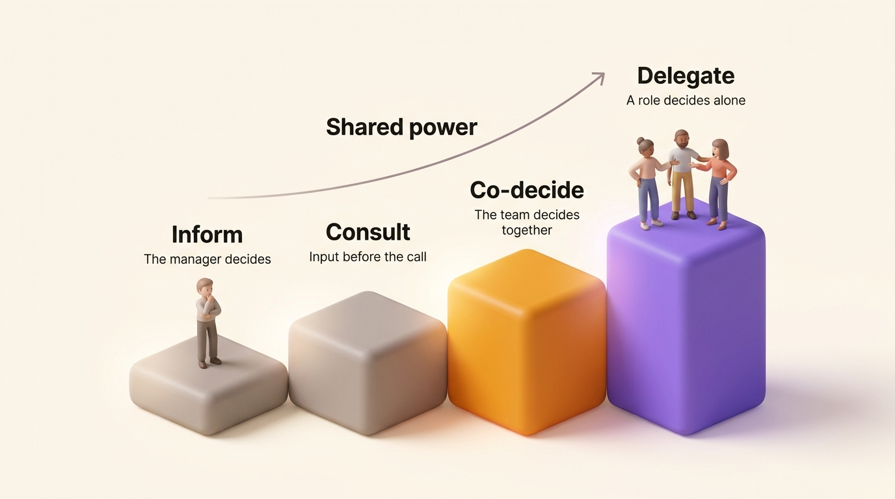

Across the world, 20% of employees say they are engaged at work, and the figure drops to 12% in Europe and 8% in France, according to the *State of the Global Workplace* report Gallup published in 2026 on data collected throughout 2025. Participative management has been in the European corporate vocabulary for forty years.

The gap makes sense once you watch how the word plays out. A manager gathers the team on Monday, collects opinions, says thank you, then decides alone on Thursday without saying what they kept. The team took part in a conversation rather than in a decision. People notice on the second or third round, and the word loses its credit for years.

Participative management turns on one specific move: saying, before a topic opens, how much power is being shared on it. This article walks through the four degrees of participation, what the research actually measures, the conditions that make the practice hold, and the traps that hollow it out.

## What participative management is

Participative management is a management style that brings employees into the making of the decisions that affect their work, instead of handing them a decision already made. The manager stays accountable for the outcome. What opens up is the process: the information the decision rests on, the options considered, and in some cases the final call.

The term comes from Rensis Likert, who published *New Patterns of Management* in 1961 after comparing high and low producing units in an American insurance company. He sorted organisations into four systems, from system 1 exploitative authoritative to system 4 participative group, with benevolent authoritative and consultative in between. His argument fits in a line: the most effective organisations lean toward system 4, where decisions are shared and information travels both ways.

France arrived at the same place by another route, and the detour is worth knowing because it shaped a whole managerial vocabulary. In 1968 Octave Gélinier, then running the consultancy Cegos, published *Direction participative par objectifs*. He took Peter Drucker's management by objectives and swapped self-control for participation, organising the negotiation of objectives between levels. The DPPO stayed the French reference for the next twenty years.

The word spread widely in the 1980s, carried by two separate movements. The Auroux laws of 1982 created a right of direct collective expression for employees on the content and organisation of their work. Quality circles, imported from Japan, multiplied at the same moment: the French quality circles association, active from 1981 to 1989 according to the record held by the national library, claimed as many as 4,000 of them. The association closed at the end of the decade and the circles dissolved into the quality improvement groups that ISO certification requires.

So the vocabulary outlived its mechanisms, which is what makes the phrase slippery today. Plenty of organisations describe themselves as participative while pointing at slightly open briefing meetings.

One confusion is worth clearing up right away, the one with a [horizontal organisation](/en/blog/horizontal-vs-vertical). A manager can practise highly participative management inside an intact pyramid, reporting lines and levels included. A horizontal organisation redraws authority itself and attaches it to roles rather than to positions, which the [governance](/en/glossary/gouvernance) entry sets out. The first is a management style, the second is a structure.

## The 4 degrees of participation

A manager who says "we work participatively" has said nothing usable yet. What you actually steer is the degree of participation, topic by topic.

| Degree | Who decides | What the team does | Good use | What breaks it |
| --- | --- | --- | --- | --- |
| Inform | The manager | Receives the decision with its reasoning, and can question it | Legal constraint, emergency, decision already made elsewhere | Calling this step participation |
| Consult | The manager | Gives a reasoned opinion before the decision | Technical or operational choices where the team knows more | Collecting input and never saying what came of it |
| Co-decide | The team, by an announced rule | Decides together, by consent, majority or unanimity | Topics that commit several people for a while | Opening the discussion with no rule for closing it |
| Delegate | The mandated person or role | Decides alone inside a written scope | Recurring decisions in an identified domain | A vague scope the manager takes back at the first slip |

The ladder climbs in shared power and drops in speed for simple topics. A team co-deciding the stationery order wastes its time. A manager who merely informs the team about a reorganisation of its own work loses credibility.

Naming the degree takes ten seconds at the start of a topic and settles half the misunderstandings. "On this one I decide, and here is why" lands well. "What do you all think?" followed three days later by a contrary decision lands badly, even when the decision is right.

Victor Vroom and Philip Yetton formalised this idea back in 1973 in *Leadership and Decision-Making*, with a decision tree that picks the degree based on the quality of available information, how much buy-in matters and how much time you have. Of course, the meta-analyses never confirmed these contingency models, and Miller and Monge said so explicitly in 1986. The practical principle holds anyway: you pick the degree per topic, rather than once and for all as a management philosophy.

{/* IMAGE regen: api.py image, infographic, 1600x900. EN-specific because it carries English text, the FR version uses ./degres-participation.jpg. Regenerate if the labels or the order of the four degrees change. Scene: "a horizontal four-step ascending staircase infographic, left to right, seen slightly isometric, on the warm cream background. Each step is a soft rounded 3D block, growing taller from left to right. The two left blocks are warm grey, the third is orange #FB9803, the fourth and tallest is purple #9870F0. On each block, a bold modern clean sans-serif label with, underneath it in smaller text, one short line. Block 1, label: 'Inform'. Under it: 'The manager decides'. Block 2, label: 'Consult'. Under it: 'Input before the call'. Block 3, label: 'Co-decide'. Under it: 'The team decides together'. Block 4, label: 'Delegate'. Under it: 'A role decides alone'. Above the staircase, a single thin curved arrow rising from left to right with the bold sans-serif caption 'Shared power' in the middle of the arrow. On the first block stands one small soft 3D human figure, on the last block stand three small soft 3D human figures side by side in a collaborative posture, showing the power moving from one person to the team. No other text anywhere in the image." */}

## What it changes in a manager's week

Three habits carry most of the change, and none of them needs a long training course.

The manager names the degree when opening each topic, in meetings and in writing. They give explicit feedback after every consultation, saying which opinions changed the decision and which did not. And they write down what was decided, by whom, on what scope, somewhere the team can reread six months later.

What the manager gives up is real: the comfort of deciding fast and alone on topics where they believed themselves best informed. What they gain shows up in the decisions they stop taking. The piece on [horizontal leadership](/en/blog/horizontal-leadership) covers that shift in the role.

On results, the research offers two orders of magnitude worth knowing before promising anything. The meta-analysis by Katherine Miller and Peter Monge, published in 1986 in the *Academy of Management Journal*, found an average correlation of about 0.34 between participation and job satisfaction, which is clear. John Wagner went back over the full body of data in 1994 in the *Academy of Management Review*, across 118 correlation coefficients, and concluded that the influence on performance is modest: when participation and behaviour are measured by different methods rather than by self-report alone, the average correlation falls to around 0.12.

Participation moves satisfaction reliably and performance modestly. That still makes it a good investment, as long as you know where the performance gains come from when they show up: from decisions taken closer to the work and faster, rather than from the discussion itself.

Four reports the French labour ministry's statistics office, the Dares, published in August 2024 on working conditions and mental health confirm what Robert Karasek's demand-control model has described since 1979. Autonomy protects, and pairing a heavy workload with low autonomy degrades psychological wellbeing sharply. Adding consultation meetings without widening real latitude produces exactly that pairing. The team spends more time discussing decisions and takes no more of them.

## Participative and cross-functional management

Cross-functional management means steering a project, a process or a community that cuts across several teams, without hierarchical authority over the people involved. A quality lead, a project manager, a data protection officer all work this way.

| | Participative management | Cross-functional management |
| --- | --- | --- |
| Axis it works on | Between a manager and their team | Between teams, across the lines |
| Source of authority | The position, choosing to share how it is used | A written mandate and expert standing |
| Question it settles | Who takes part in which decision, and how | Who coordinates what belongs to nobody |
| What it leaves open | Coordination between teams | Sharing power inside a team |
| Its usual failure | Consultation with no effect | A lead with no mandate |

The two levers complete each other, and each one misses something without the other. An organisation that runs only the participative side gets teams that decide well at home and stall the moment a topic crosses their boundary. An organisation that runs only the cross-functional side produces project leads negotiating for people's time with managers who stayed the sole deciders.

The same device answers both, namely written roles with their decision scope. The cross-functional lead's mandate becomes a role with a domain, and the team's degree of participation becomes a property of that domain. The article on [how to define roles](/en/blog/define-roles) has the method, and the [accountability](/en/glossary/redevabilite) entry sets out the vocabulary.

## The conditions that make it hold

Three conditions separate a practice that runs for three years from one that fades by the second quarter.

Roles get written first. Each role carries a purpose, a domain its holder decides on alone, and accountabilities the others expect from it. Without that map, participation applies to everything and anything, and every topic becomes negotiable by everyone again. Writing the roles also surfaces the decisions three people believe they own and the ones nobody takes.

Each type of topic then gets its decision rule. A decision inside a role's domain is taken alone. A decision that commits several roles goes through a rule named in advance, most often [decision by consent](/en/blog/consent-decision), which asks for the absence of a reasoned objection rather than everyone's enthusiasm. A structural decision keeps an advice process with the people concerned. The rule gets announced before the discussion opens, never during it.

Then comes the right to say no, in a usable form. A reasoned objection shows how a proposal would harm the work of the role raising it, which is what separates it from a personal preference or a disagreement in principle. That distinction is precisely what stops a team from blocking itself, and the [consent](/en/glossary/consentement) entry lists the criteria. A team where nobody has raised an objection in six months is not measuring agreement, it is measuring silence.

A fourth condition matters nearly as much, without appearing on the usual lists, and that is naming what stays closed. Payroll, client commitments, safety and legal obligations remain decided at the top in the vast majority of organisations. Saying so plainly makes everything you open next credible. The piece on [collaborative governance](/en/blog/collaborative-governance) covers the full set of conditions, and the [introduction to sociocracy](/en/blog/sociocracy-intro) describes a complete system that ties them together.

## The traps

Token participation comes first. Sherry Arnstein published a ladder of citizen participation in 1969, in the *Journal of the American Institute of Planners*, and it transposes to management without effort. She calls the bottom rungs non-participation, where you consult to convince rather than to learn, and the middle rungs tokenism, where people are heard without any power to change the outcome. A team spots the façade within two or three occurrences, and then stops preparing its input.

Deciding without a frame costs nearly as much. An open meeting with no closing rule ends on the position of whoever spoke loudest, or on the manager taking the decision back at the end of the session. Both outcomes disappoint more than a decision announced as the manager's from the start. The article on [meeting overload](/en/blog/meeting-overload) puts numbers on what those sessions consume.

Permanent consultation tires a team and slows every topic down. The inform degree fits a good share of decisions, as long as it is announced as such.

Next comes participation on what does not matter. Thierry Weil and Anne-Sophie Dubey measured that gap in *Au-delà de l'entreprise libérée*, a 2020 study by La Fabrique de l'industrie covering ten organisations of 50 to 1,300 employees. The autonomy actually granted almost always concerns how the work gets done, rarely the objectives, and almost never governance itself. The article on the [liberated company](/en/blog/liberated-company) returns to those findings.

The last trap closes at the first serious conflict. A manager who takes the decision back as soon as a topic gets tense undoes months of practice in a single meeting. Better to announce in advance the cases where they will step in, then stick to it.

## Where to start, in three steps

1. List a team's recurring decisions and write the real degree of each one next to it. One page is enough and the exercise takes an hour. Most teams discover they use three or four degrees and announce none of them.

2. Move two or three recurring decisions to delegation, with a written scope and a named holder. Pick topics where the team is better informed than the manager, which gives fast results at low risk.

3. Set a rule for whatever stays in co-decision, then measure the median time between a problem being raised and the decision that handles it. Taken before and after, that number tells you whether participation opened something or only added meetings.

After a quarter, review the list of degrees. A badly chosen degree gets corrected in one sentence, whereas a management system adopted wholesale gets defended for years even when it fails. The piece on the [transition to horizontal management](/en/blog/horizontal-transition) describes the road ahead for organisations that want to go as far as redrawing authority.

## Running participative management in Rolebase

Degrees of participation start life on one page. They last over time when the organisation writes them into the roles themselves, with the decision history that goes with them, rather than into a spreadsheet three people keep alive.

[Rolebase](/en/features) carries the four pieces this practice needs. Every role shows its purpose, its domain, its accountabilities, its checklist and its indicators, inside an interactive org chart where roles nest and move by drag and drop. [Proposals](/en/docs/proposals) are voted by consent, unanimity or majority, which turns the announced decision rule into something concrete, and an accepted proposal applies the org chart changes it contained on its own. Three [governance modes](/en/docs/governance-modes) set who can change what, from free editing to mandatory approval by proposal. Meetings follow a collaborative agenda with minutes, and both tasks and discussions attach to the role concerned. The product is open source, free up to five active members, then 5 € per user per month.

The co-operative [EVEA](/en/client-cases/scop-evea) shows the scale of the need. It grew from 60 to 140 people between 2020 and 2023, across three sites, with more than eight competency units and cross-cutting assignments. Its shared governance already existed, carried by the co-operative status. What was missing was a map readable in real time, because the hand-maintained document had stopped keeping up with the growth.

## Frequently asked questions

<FaqList>

<FaqItem question="What are the principles of participative management?">

French management literature settles on five: mobilising people, an active policy of individual development, delegating decision power to the level closest to the work, solving each problem at the level where it appears, and putting regulation and self-checking mechanisms in place. Two of the five carry most of the result, delegation and solving at the right level, because they are the only ones that actually move power. The other three describe favourable conditions.

</FaqItem>

<FaqItem question="What are the four management styles?">

The four styles usually taught are directive, persuasive, participative and delegative. They come from the situational leadership of Paul Hersey and Kenneth Blanchard, which varies the style according to a person's competence and autonomy on the task at hand. Participative management is therefore one style out of four, and the same manager uses several of them in a single week depending on the topic and the person.

</FaqItem>

<FaqItem question="What are the drawbacks of participative management?">

It lengthens some decisions, the ones better taken alone and fast. It tires a team consulted on everything with no ranking between topics. It loses its credit at the second consultation with no visible effect, and that credit is hard to win back. It needs a written frame, roles and decision rules, which many organisations lack and underestimate. And the appetite for participation varies a lot from one person to the next: part of the team prefers a clear frame set by somebody else, which is a legitimate preference.

</FaqItem>

<FaqItem question="What is the difference between participative and collaborative management?">

Participative management is about the decision, who contributes to it and how far. Collaborative management is about producing the work, how people work together on a task, share information and help each other. The two overlap heavily in everyday use, and the distinction worth keeping is the one about decision power, because that is the one you can verify.

</FaqItem>

<FaqItem question="Does participative management suit every decision?">

No, and claiming otherwise is the surest way to discredit it. An operational emergency, a legal obligation, a decision constrained by a client commitment already signed all get taken alone and announced with their reasoning. The topics that gain from participation are those where the team holds information the manager lacks, and those where buy-in determines execution.

</FaqItem>

<FaqItem question="Which companies practise participative management?">

In France, worker co-operatives write it into their statutes, like [EVEA](/en/client-cases/scop-evea) and its 140 employees. Two long-documented cases serve as international references: Buurtzorg, with more than 10,000 nurses in the Netherlands organised in self-managing teams of about a dozen, and Morning Star in California, where every employee negotiates a yearly commitment letter with the colleagues directly affected by their work. Both go further than a management style and have redrawn authority itself.

</FaqItem>

<FaqItem question="Do you need a tool for participative management?">

A team of ten starts with a shared document listing the recurring decisions and the degree of each. A tool earns its place once several teams coexist, once roles change often, and once somebody needs to find out why a decision was taken a year ago. What it adds then is a readable structure and a decision history, which a spreadsheet loses within months.

</FaqItem>

</FaqList>

## What it really asks for

Participative management asks for less conviction and more precision than people expect. A manager names the degree before each topic, reports back after each consultation, and writes down who decides on what scope. Those three repeated gestures do more than a charter on the wall.

Start with one team and one page. List its recurring decisions, write the degree of each, delegate two of them properly, and measure the decision delay before and after. A quarter later you will know whether something opened.

[See what Rolebase does](/en/features), or create your organisation free up to five active members.
