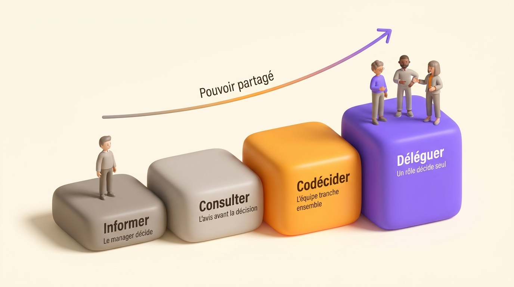

En France, 8 % des salariés se disent engagés au travail, contre 12 % en Europe et 20 % dans le monde, d'après le rapport *State of the Global Workplace* publié par Gallup en 2026 sur des données collectées tout au long de 2025. Le pays parle de management participatif depuis quarante ans.

L'écart s'explique assez simplement quand on regarde ce que recouvre le mot dans la pratique. Un manager réunit son équipe le lundi, recueille les avis, remercie, puis tranche seul le jeudi sans dire ce qu'il a retenu. L'équipe a participé à une discussion, pas à une décision. Elle le remarque au deuxième ou au troisième tour, et le mot perd son crédit pour des années.

Le management participatif se joue sur un point précis : dire, avant d'ouvrir un sujet, quel pouvoir on partage dessus. Cet article détaille les quatre degrés de participation, ce que la recherche mesure vraiment, les conditions qui font tenir la pratique et les pièges qui la vident.

## Ce qu'est le management participatif

Le management participatif est un mode de management qui associe les collaborateurs à la fabrication des décisions qui concernent leur travail, au lieu de leur transmettre une décision déjà prise. Le manager reste responsable du résultat. Ce qu'il ouvre, c'est le processus : les informations sur lesquelles la décision se fonde, les options examinées, et selon les cas le choix final.

Le terme vient de Rensis Likert, qui publie *New Patterns of Management* en 1961 après avoir comparé des unités productives et moins productives dans une compagnie d'assurances américaine. Il y classe les organisations en quatre systèmes, du système 1 autoritaire exploiteur au système 4 participatif de groupe, en passant par l'autoritaire paternaliste et le consultatif. Sa thèse tient en une ligne : les organisations les plus efficaces tendent vers le système 4, où la décision se partage et où l'information circule dans les deux sens.

La France l'importe par un autre chemin. En 1968, Octave Gélinier, alors directeur général de la Cegos, publie *Direction participative par objectifs*. Il reprend la direction par objectifs de Peter Drucker et remplace l'autocontrôle par la participation, en organisant la négociation des objectifs entre les niveaux. La DPPO devient la référence française des vingt années suivantes.

Le mot se diffuse largement dans les années 1980, porté par deux mouvements distincts. Les lois Auroux de 1982 créent un droit d'expression directe et collective des salariés sur le contenu et l'organisation de leur travail. Les cercles de qualité, importés du Japon, se multiplient au même moment : l'Association française des cercles de qualité, active de 1981 à 1989 d'après la notice de la Bibliothèque nationale de France, en revendiquait jusqu'à 4 000. L'association ferme à la fin de la décennie et les cercles se dissolvent dans les groupes d'amélioration de la qualité qu'exigent les certifications ISO.

Le vocabulaire a donc duré plus longtemps que ses mécanismes. C'est ce qui rend le mot glissant aujourd'hui : beaucoup d'organisations se disent participatives en désignant des réunions d'information un peu ouvertes.

Une confusion mérite d'être levée tout de suite, celle avec l'[organisation horizontale](/fr/blog/horizontal-vs-vertical). Un manager peut pratiquer un management très participatif dans une pyramide intacte, avec sa ligne hiérarchique et ses niveaux. Une organisation horizontale, elle, redécoupe l'autorité elle-même et l'attache à des rôles plutôt qu'à des positions, ce que la fiche [gouvernance](/fr/glossary/gouvernance) précise. Le premier est un style de management, la seconde est une structure.

## Les 4 degrés de participation

Un manager qui dit « je fais du participatif » ne dit encore rien d'utilisable. Ce qui se pilote, c'est le degré de participation, sujet par sujet.

| Degré | Qui tranche | Ce que fait l'équipe | Bon usage | Ce qui casse |
| --- | --- | --- | --- | --- |
| Informer | Le manager | Elle reçoit la décision et son motif, et peut la questionner | Contrainte légale, urgence, décision déjà prise ailleurs | Appeler cette étape de la participation |
| Consulter | Le manager | Elle donne un avis argumenté avant la décision | Choix technique ou opérationnel où l'équipe sait mieux | Récolter les avis sans jamais dire ce qu'on en a fait |
| Codécider | L'équipe, selon une règle annoncée | Elle décide ensemble, au consentement, à la majorité ou à l'unanimité | Sujets qui engagent plusieurs personnes durablement | Ouvrir la discussion sans règle de sortie |
| Déléguer | La personne ou le rôle mandaté | Elle décide seule dans un périmètre écrit | Décisions courantes d'un domaine identifié | Un périmètre flou, que le manager reprend au premier écart |

L'ordre monte en pouvoir partagé et descend en vitesse pour les sujets simples. Une équipe qui codécide l'achat des fournitures perd son temps. Un manager qui informe l'équipe d'une réorganisation de son propre périmètre perd sa crédibilité.

Annoncer le degré prend dix secondes en début de sujet et règle la moitié des malentendus. « Sur ce point, je décide, je vous explique pourquoi » se reçoit très bien. « Qu'en pensez-vous ? » suivi d'une décision contraire trois jours plus tard se reçoit mal, même quand la décision est la bonne.

Victor Vroom et Philip Yetton avaient formalisé cette idée dès 1973 dans *Leadership and Decision-Making*, avec un arbre de décision qui choisit le degré selon la qualité d'information disponible, l'enjeu d'adhésion et le temps qu'on a. Bien sûr, les méta-analyses n'ont jamais confirmé ces modèles dits de contingence, et Miller et Monge le notent explicitement en 1986. Le principe pratique tient quand même : le degré se choisit par sujet, pas une fois pour toutes par philosophie de management.

{/* IMAGE regen: api.py image, infographic, 1600x900. Visuel propre au FR car il porte du texte français, la version EN utilise ./degrees-participation.jpg. Régénérer si les libellés ou l'ordre des quatre degrés changent. Scene: "a horizontal four-step ascending staircase infographic, left to right, seen slightly isometric, on the warm cream background. Each step is a soft rounded 3D block, growing taller from left to right. The two left blocks are warm grey, the third is orange #FB9803, the fourth and tallest is purple #9870F0. On each block, a bold modern clean sans-serif label with, underneath it in smaller text, one short line. Block 1, label: 'Informer'. Under it: 'Le manager décide'. Block 2, label: 'Consulter'. Under it: 'L'avis avant la décision'. Block 3, label: 'Codécider'. Under it: 'L'équipe tranche ensemble'. Block 4, label: 'Déléguer'. Under it: 'Un rôle décide seul'. Above the staircase, a single thin curved arrow rising from left to right with the bold sans-serif caption 'Pouvoir partagé' in the middle of the arrow. On the first block stands one small soft 3D human figure, on the last block stand three small soft 3D human figures side by side in a collaborative posture, showing the power moving from one person to the team. No other text anywhere in the image." */}

## Ce que ça change au quotidien du manager

Trois habitudes portent l'essentiel du changement, et aucune ne demande de formation longue.

Le manager nomme le degré à l'ouverture de chaque sujet, en réunion comme dans un message. Il fait un retour explicite après chaque consultation, en disant quels avis ont changé la décision et lesquels non. Et il écrit ce qui a été décidé, par qui, sur quel périmètre, dans un endroit que l'équipe peut relire six mois plus tard.

Ce que le manager perd est réel : le confort de décider vite et seul sur des sujets où il se croyait le mieux informé. Ce qu'il gagne se mesure sur les décisions qu'il cesse de prendre. L'article sur le [leadership horizontal](/fr/blog/horizontal-leadership) détaille ce déplacement du rôle.

Sur les résultats, la recherche donne deux ordres de grandeur qu'il vaut mieux connaître avant de promettre quoi que ce soit. La méta-analyse de Katherine Miller et Peter Monge, publiée en 1986 dans l'*Academy of Management Journal*, trouve une corrélation moyenne d'environ 0,34 entre participation et satisfaction au travail, ce qui est net. John Wagner reprend l'ensemble des données en 1994 dans l'*Academy of Management Review*, sur 118 coefficients de corrélation, et conclut à une influence modeste sur la performance : quand la participation et le comportement sont mesurés par des méthodes différentes plutôt que par le seul déclaratif, la corrélation moyenne tombe autour de 0,12.

Autrement dit, la participation déplace la satisfaction de façon fiable et la performance de façon modeste. Ça reste un bon investissement, à condition de savoir d'où viennent les gains de performance quand ils apparaissent : de décisions prises plus près du terrain et plus vite, pas de la discussion elle-même.

Les travaux publiés par la Dares en août 2024 sur les conditions de travail et la santé mentale confirment ce que le modèle demande-contrôle de Robert Karasek décrit depuis 1979 : l'autonomie protège, et l'association d'une charge de travail élevée avec une faible autonomie dégrade nettement le bien-être psychologique. Ajouter des réunions de consultation sans élargir la marge de manœuvre réelle produit exactement cette combinaison. L'équipe passe plus de temps à discuter des décisions et n'en prend pas davantage.

## Management participatif et management transversal

Le management transversal consiste à piloter un projet, un processus ou une communauté qui traverse plusieurs équipes, sans autorité hiérarchique sur les personnes mobilisées. Un responsable qualité, un chef de projet, un référent RGPD travaillent ainsi.

| | Management participatif | Management transversal |
| --- | --- | --- |
| Axe concerné | Entre un manager et son équipe | Entre équipes, à travers les lignes |
| Source d'autorité | Le poste, qui choisit d'en partager l'usage | Un mandat écrit et la légitimité d'expertise |
| Question qu'il règle | Qui participe à quelle décision, et comment | Qui coordonne ce qui n'appartient à personne |
| Ce qu'il laisse ouvert | La coordination entre équipes | Le partage du pouvoir à l'intérieur d'une équipe |
| Sa panne courante | La consultation sans effet | Le pilote sans mandat |

Les deux leviers se complètent, et se manquent l'un sans l'autre. Une organisation qui pratique seulement le participatif obtient des équipes qui décident bien chez elles et qui bloquent dès qu'un sujet dépasse leur frontière. Une organisation qui pratique seulement le transversal produit des pilotes de projet qui négocient du temps de travail auprès de managers restés seuls décideurs.

Le même dispositif répond aux deux : des rôles écrits avec leur périmètre de décision. Le mandat du pilote transversal devient un rôle avec un domaine, et le degré de participation de l'équipe devient une propriété de ce domaine. L'article sur [comment définir des rôles](/fr/blog/define-roles) donne la méthode, et la fiche [redevabilité](/fr/glossary/redevabilite) précise le vocabulaire.

## Les conditions pour que ça tienne

Trois conditions font la différence entre une pratique qui dure trois ans et une pratique qui s'éteint au deuxième trimestre.

Les rôles s'écrivent d'abord. Chaque rôle porte une raison d'être, un domaine sur lequel son titulaire décide seul, et des redevabilités que les autres attendent de lui. Sans cette carte, la participation porte sur tout et n'importe quoi, et chaque sujet redevient négociable par tout le monde. Écrire les rôles fait aussi apparaître les décisions que trois personnes croient prendre et celles que personne ne prend.

Chaque type de sujet reçoit ensuite sa règle de décision. Une décision qui appartient au domaine d'un rôle se prend seul. Une décision qui engage plusieurs rôles passe par une règle nommée à l'avance, le plus souvent la [décision par consentement](/fr/blog/consent-decision), qui demande l'absence d'objection argumentée plutôt que l'enthousiasme de tous. Une décision structurante garde un processus d'avis auprès des personnes concernées. La règle s'annonce avant la discussion, jamais pendant.

Reste le droit de dire non, sous une forme utilisable. Une objection argumentée montre en quoi la proposition abîme le travail du rôle qui l'oppose, ce qui la distingue de la préférence personnelle et du désaccord de principe. Cette distinction est précisément ce qui empêche une équipe de se bloquer elle-même, et la fiche [consentement](/fr/glossary/consentement) en détaille les critères. Une équipe où personne n'a jamais posé d'objection en six mois ne mesure pas un accord, elle mesure un silence.

Une quatrième condition compte presque autant, sans figurer dans les listes habituelles : nommer ce qui reste fermé. La paie, les engagements clients, la sécurité et les obligations légales restent décidés en haut dans la grande majorité des organisations. Le dire franchement rend crédible tout ce qu'on ouvre à côté. L'article sur la [gouvernance collaborative](/fr/blog/collaborative-governance) reprend l'ensemble de ces conditions, et l'[introduction à la sociocratie](/fr/blog/sociocracy-intro) décrit un système complet qui les articule.

## Les pièges

La participation de façade arrive en tête. Sherry Arnstein a publié en 1969, dans le *Journal of the American Institute of Planners*, une échelle de la participation citoyenne qui se transpose sans effort au management. Elle appelle non-participation les barreaux du bas, où l'on consulte pour convaincre plutôt que pour apprendre, et tokenism les barreaux du milieu, où les gens sont écoutés sans pouvoir changer le résultat. Une équipe repère la façade en deux ou trois occurrences, et elle cesse alors de préparer ses avis.

La décision sans cadre coûte presque aussi cher. Une réunion ouverte sans règle de sortie se termine par la position de celui qui parle le plus fort, ou par une reprise en main du manager en fin de séance. Les deux issues déçoivent plus qu'une décision annoncée seule d'entrée de jeu. L'article sur la [réunionite](/fr/blog/meeting-overload) chiffre ce que ces séances consomment.

La consultation permanente fatigue une équipe et ralentit chaque sujet. Le degré « informer » convient à une bonne partie des décisions, à condition d'être annoncé comme tel.

Vient ensuite la participation sur ce qui ne compte pas. Thierry Weil et Anne-Sophie Dubey ont mesuré cet écart dans l'enquête *Au-delà de l'entreprise libérée*, publiée en 2020 par La Fabrique de l'industrie sur dix organisations de 50 à 1 300 salariés. L'autonomie réellement accordée porte presque toujours sur la manière d'exécuter le travail, rarement sur les objectifs, et presque jamais sur la gouvernance. L'article sur l'[entreprise libérée](/fr/blog/liberated-company) revient sur ces résultats.

Le dernier piège se referme au premier conflit sérieux. Un manager qui reprend la décision dès qu'un sujet devient tendu annule des mois de pratique en une réunion. Mieux vaut annoncer d'avance les cas où il reprendra la main, puis s'y tenir.

## Par où commencer en trois étapes

1. Listez les décisions récurrentes d'une équipe et écrivez en face de chacune son degré réel aujourd'hui. Une page suffit, et l'exercice prend une heure. La plupart des équipes découvrent qu'elles ont trois ou quatre degrés en usage et aucun d'annoncé.

2. Passez deux ou trois décisions courantes en délégation, avec un périmètre écrit et un titulaire nommé. Choisissez des sujets où l'équipe est mieux informée que le manager, ce qui donne des résultats rapides et peu risqués.

3. Posez une règle pour ce qui reste en codécision, puis mesurez le délai médian entre un problème signalé et la décision qui le traite. Ce chiffre, relevé avant et après, dit si la participation a ouvert quelque chose ou seulement ajouté des réunions.

Au bout d'un trimestre, revoyez la liste des degrés. Un degré mal choisi se corrige en une phrase, alors qu'un système de management adopté en bloc se défend pendant des années même quand il ne marche pas. La [transition vers un management horizontal](/fr/blog/horizontal-transition) décrit la suite du chemin pour les organisations qui veulent aller jusqu'à redécouper l'autorité.

## Faire vivre le management participatif dans Rolebase

Les degrés de participation s'écrivent d'abord sur une page. Ils tiennent dans le temps quand l'organisation les inscrit dans les rôles eux-mêmes, avec l'historique des décisions qui va avec, plutôt que dans un tableur que trois personnes maintiennent.

[Rolebase](/fr/features) porte les quatre pièces dont cette pratique a besoin. Chaque rôle affiche sa raison d'être, son domaine, ses redevabilités, sa checklist et ses indicateurs, dans un organigramme interactif où les rôles s'imbriquent et se déplacent en glisser-déposer. Les [propositions](/fr/docs/proposals) se votent au consentement, à l'unanimité ou à la majorité, ce qui matérialise la règle de décision annoncée, et une proposition acceptée applique elle-même les changements d'organigramme qu'elle contenait. Trois [modes de gouvernance](/fr/docs/governance-modes) définissent qui peut modifier quoi, de l'édition libre à la validation obligatoire par proposition. Les réunions suivent un ordre du jour collaboratif avec compte rendu, et les tâches comme les discussions se rattachent au rôle concerné. Le produit est open source, gratuit jusqu'à cinq membres actifs, puis facturé 5 € par utilisateur et par mois.

La Scop [EVEA](/fr/client-cases/scop-evea) donne la mesure du besoin. Cette société coopérative est passée de 60 à 140 personnes entre 2020 et 2023, sur trois sites, avec plus de huit pôles de compétences et des missions transverses. Sa gouvernance partagée existait déjà, portée par le statut coopératif. Ce qui manquait, c'était une cartographie lisible en temps réel, parce que le support tenu à jour à la main avait cessé de suivre la croissance.

## Questions fréquentes

<FaqList>

<FaqItem question="Quels sont les 5 principes du management participatif ?">

La littérature française de management en retient cinq : la mobilisation du personnel, une politique active de développement des personnes, la délégation du pouvoir de décision au niveau le plus proche du terrain, la résolution de chaque problème à l'échelon où il apparaît, et la mise en place de dispositifs de régulation et d'autocontrôle. Deux de ces cinq principes portent l'essentiel du résultat, la délégation et la résolution au bon échelon, parce que ce sont les seuls qui déplacent réellement du pouvoir. Les trois autres décrivent des conditions favorables.

</FaqItem>

<FaqItem question="Quels sont les 4 styles de management ?">

Les quatre styles enseignés en France sont le directif, le persuasif, le participatif et le délégatif. Ils viennent du leadership situationnel de Paul Hersey et Kenneth Blanchard, qui fait varier le style selon l'autonomie et la compétence de la personne sur la tâche en question. Le management participatif est donc un style parmi quatre, et un même manager en utilise plusieurs dans la même semaine selon le sujet et l'interlocuteur.

</FaqItem>

<FaqItem question="Quels sont les inconvénients du management participatif ?">

Il allonge certaines décisions, celles qui gagneraient à être prises seul et vite. Il fatigue une équipe consultée sur tout, sans hiérarchie entre les sujets. Il perd son crédit dès la deuxième consultation restée sans effet visible, et ce crédit se regagne difficilement. Il demande un cadre écrit, rôles et règles de décision, que beaucoup d'organisations n'ont pas et sous-estiment. Enfin, l'appétence pour la participation varie fortement d'une personne à l'autre : une partie de l'équipe préfère un cadre clair posé par quelqu'un d'autre, et c'est une préférence légitime.

</FaqItem>

<FaqItem question="Quelle différence entre management participatif et management collaboratif ?">

Le management participatif porte sur la décision : qui contribue à la prendre et jusqu'où. Le management collaboratif porte sur la production du travail : comment les personnes travaillent ensemble sur une tâche, partagent l'information et s'entraident. Les deux se recoupent largement dans l'usage courant, et la distinction utile reste celle du pouvoir de décision, parce que c'est elle qui se vérifie.

</FaqItem>

<FaqItem question="Le management participatif convient-il à toutes les décisions ?">

Non, et prétendre le contraire est le meilleur moyen de le discréditer. Une urgence opérationnelle, une obligation légale, une décision contrainte par un engagement client déjà signé se prennent seul et s'annoncent avec leur motif. Les sujets qui gagnent à la participation sont ceux où l'équipe détient une information que le manager n'a pas, et ceux où l'adhésion conditionne l'exécution.

</FaqItem>

<FaqItem question="Quelles entreprises pratiquent le management participatif ?">

En France, les sociétés coopératives l'inscrivent dans leur statut, comme la Scop [EVEA](/fr/client-cases/scop-evea) et ses 140 salariés. À l'étranger, deux cas documentés depuis longtemps servent de référence : Buurtzorg, plus de 10 000 soignants aux Pays-Bas répartis en équipes autonomes d'une douzaine de personnes, et Morning Star en Californie, où chaque salarié négocie chaque année un contrat d'engagement avec ses collègues directement concernés. Ces deux organisations vont plus loin qu'un style de management et ont redécoupé l'autorité elle-même.

</FaqItem>

<FaqItem question="Faut-il un outil pour faire du management participatif ?">

Une équipe de dix personnes démarre avec un document partagé qui liste les décisions récurrentes et leur degré. L'outil devient utile quand plusieurs équipes coexistent, quand les rôles changent souvent, et quand il faut retrouver pourquoi une décision a été prise il y a un an. Ce qu'il apporte alors, c'est la lisibilité de la structure et l'historique des décisions, ce qu'un tableur perd en quelques mois.

</FaqItem>

</FaqList>

## Ce que ça demande vraiment

Le management participatif demande moins de conviction et plus de précision qu'on ne le croit. Un manager annonce le degré avant chaque sujet, rend compte après chaque consultation, et écrit qui décide sur quel périmètre. Ces trois gestes répétés produisent plus d'effet qu'une charte affichée dans le couloir.

Commencez par une équipe et une page. Listez ses décisions récurrentes, écrivez le degré de chacune, déléguez-en deux pour de bon, et mesurez le délai de décision avant et après. Vous saurez au bout d'un trimestre si quelque chose s'est ouvert.

[Voir les fonctionnalités de Rolebase](/fr/features), ou créez votre organisation gratuitement jusqu'à cinq membres actifs.
