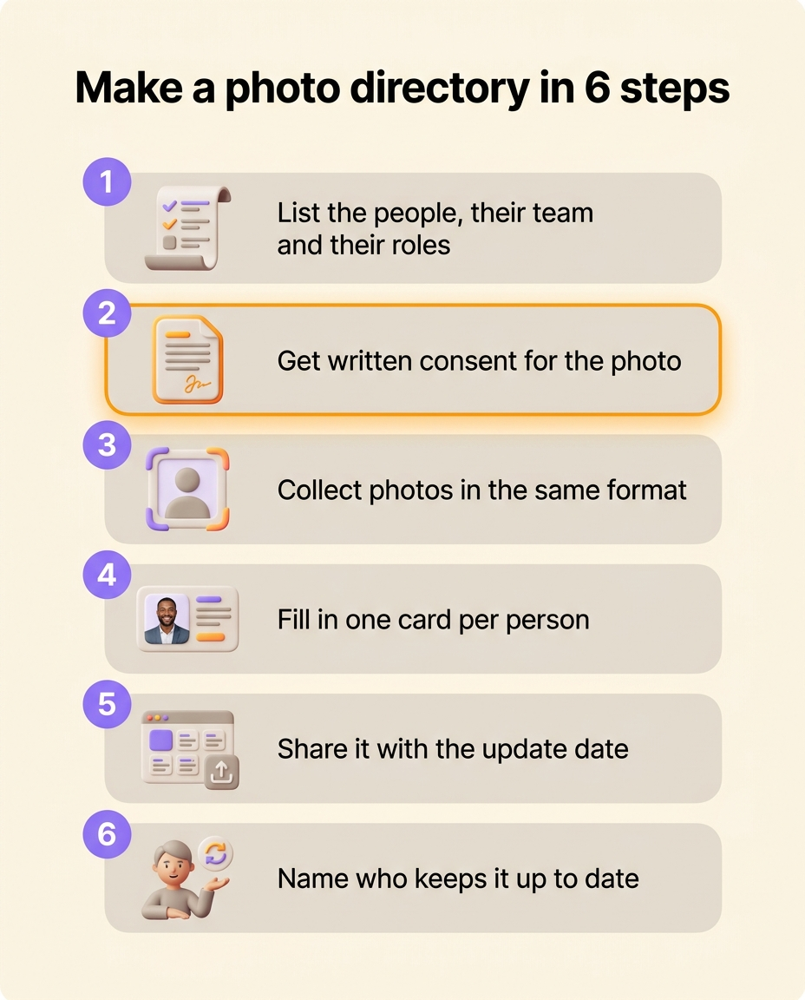
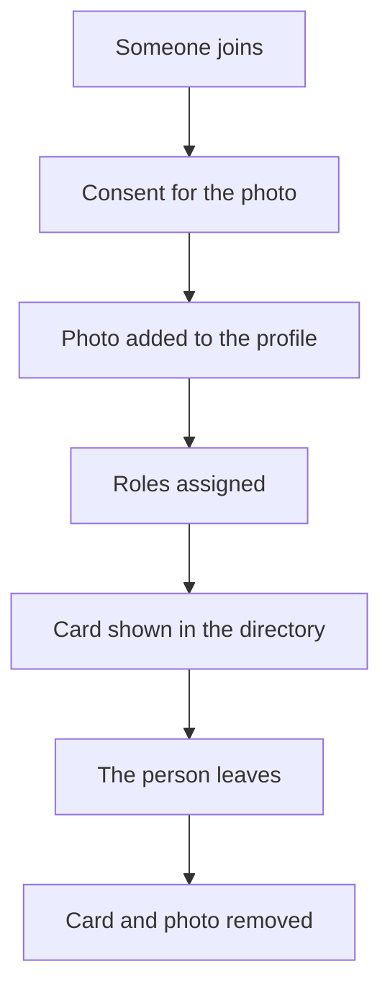

An employee photo directory puts every employee’s photo and name on one page, so everyone knows who is who. To make one, list the people with their team and their roles, ask each of them for permission to use their photo, collect photos in the same format, then fill in a Word template or an online tool. The hard part comes afterwards: the directory has to change with every new hire and every departure, or it is wrong within a few months. This page gives the steps, a free Word template with a photo consent form, and the image rights rules that apply to staff photos.

## What a photo directory is for

A new hire hears about twenty first names in their first week. The photo directory lets them match those names to faces, then to what each person does. It also helps:

- remote teams or teams spread over several offices, who mostly meet on video calls
- the front desk, which needs to know who to pass a visitor or a call to
- people in a meeting between departments, who want to know who they are dealing with on the other side
- fast-growing companies, where even long-time employees no longer know everyone

A directory that only shows faces answers "who is this person?". The question people ask most often, though, is "who do I talk to about this?". To answer it, each card has to say what the person takes care of.

## What to put on each card

Each card carries four pieces of information.

- The photo, framed the same way for everyone.
- The first and last name, spelled the way the person writes them in their emails.
- The team or department.
- The roles, meaning what the person takes care of: "Payroll", "Customer support", "New hire buddy". One person often holds several.

Roles are more useful than a job title. Nobody reading "Operations associate" would guess that Ines handles expense reports. If you have already [written down your team’s roles](/en/blog/roles-vs-job-descriptions), reuse their names as they are.

You can add the office location, the start date, or an "Ask me about…" line. Leave out the date of birth, the home address and the personal phone number, which a directory has no use for: the GDPR asks you to collect only what serves the purpose you set.

## How to make a photo directory, step by step

1. List the people, with their team and roles. Start from your org chart if you have one, or from the staff list.
2. Ask each person for written consent to use their photo, with the form in the template or your own.
3. Collect the photos. Ask for a square format, framed on the face and shoulders, against a plain background and in daylight. A half-day photo session gives consistent portraits. If people send their own, share a framing example so the photos look alike.
4. Fill in the template, one card per person. Keep a card with initials for anyone who declines a photo: they are still part of the team.
5. Share the directory where people look for it, on the intranet or in the onboarding pack. Write the date of the last update at the top.
6. Name the person who updates it, and when. Without a name, everyone counts on someone else to do it.

{/* IMAGE regen: api.py image, infographic, 1024x1280. Scene: a vertical infographic titled "Make a photo directory in 6 steps" in a modern clean bold sans-serif at the top. Below, six numbered rounded cards stacked in a gentle vertical path, each with a small soft 3D icon on the left and its label on the right:
1 "List the people, their team and their roles" (icon: a list)
2 "Get written consent for the photo" (icon: a signed form)
3 "Collect photos in the same format" (icon: a square portrait frame)
4 "Fill in one card per person" (icon: a card with a portrait)
5 "Share it with the update date" (icon: a shared page)
6 "Name who keeps it up to date" (icon: a person with a small refresh arrow)
Cards in warm grey, the numbers in purple circles, step 2 highlighted with an orange accent. Generous cream margins, no other text. */}

The downloadable Word template has three pages: a filled-in example directory, a blank grid of twelve cards, and a photo consent form to have signed. To replace a photo, click in its cell, then **Insert** and **Pictures**.

{/* DOWNLOAD regen: python3 ./generate-photo-directory-template.py */}
<Button label="Download the Word template" href="/downloads/photo-directory-template.docx" variant="primary" />

## A Word template or a directory tied to roles

A Word or PowerPoint template is enough for a team of fifteen that rarely changes. You fill it in within an hour and print it. It stays accurate as long as nobody joins or leaves.

The file changes only when someone opens it to fix it. A person hired in March stays missing until someone remembers to add them. A person who left in June is still there at the next review. Roles change too, without anyone opening the file. When someone takes over payroll on top of accounting, their card still shows accounting alone.

| | A Word or PowerPoint directory | A directory tied to roles |
|---|---|---|
| Content | Photos and text typed by hand | The members who hold a role, with their photo |
| A new hire | Add a card, if someone remembers | The person appears once they are given a role |
| A departure | Delete the card, if someone remembers | The person disappears once they are archived |
| Who changes the photo | Whoever has the file | The person themselves, or an admin |
| Responsibilities | A job title, often out of date | The person’s current roles |
| Sharing | A PDF or a shared file | A link, an embed in the intranet, or an image |

In Rolebase, the photo directory is one of the three views of the [org chart](/en/docs/org-chart), next to the circles and the hierarchical tree. It shows everyone who holds at least one role, with their photo and name. Click a photo to open the person’s profile, with their description and the list of their roles. Each member can [change their photo in their profile](/en/docs/members). An admin can also change any member’s photo.

To share the directory beyond Rolebase accounts, turn on org chart sharing and tick **Publish members**. The public page then shows only each member’s name and photo. You can send the link or embed the page in your intranet. To put the directory in a document, [export the view as an image](/en/docs/export), available as a PNG only. For a paper version, print that document or keep the Word template.

## Keeping the photo directory up to date

A photo directory has to change with every new hire and every departure. Update it at those two moments rather than once a year.

With a Word template, add "update the photo directory" to the checklist for every new hire and every departure. Name the person who does it, often in HR or at the front desk. Plan a review every three months as well, for roles that changed without anyone joining or leaving.

In Rolebase, a person shows up in the directory once they are given a role. When they leave, [archive them](/en/docs/members): they leave all their roles, and so the directory, while their meeting and task history is kept.

## Image rights and GDPR: the rules for staff photos

An employee’s photo is personal data. Everyone also has a right over their own image. The [CNIL, France’s data protection authority](https://www.cnil.fr/fr/cnil-direct/question/puis-je-refuser-que-ma-photographie-figure-dans-lannuaire-du-personnel), states that anyone can refuse to have their photo in the staff directory, and that the employer needs their permission, preferably in writing. Other countries have their own rules, but under the GDPR the same principles apply across the EU.

In practice, five rules cover an internal photo directory.

- Get consent before showing the photo, in writing, stating the use and where the photo will appear.
- Let people decline with no consequence. Because an employee depends on their employer, consent is fragile: someone afraid of being judged for saying no has not freely agreed.
- Let people withdraw their consent at any time, and remove the photo promptly when they do.
- Remove the photo when the person leaves.
- Ask again for any other use. To put a photo accepted for the internal directory on the company website, ask for a second consent.

The form in the template covers these points. Have it checked by whoever handles personal data in your company, your data protection officer if you have one. Before you tick **Publish members** in Rolebase, ask each person for consent to that publication, since the page becomes visible outside the company.

## Frequently asked questions

<FaqList>

<FaqItem question="How do I make a photo directory for free?">

Download the Word template on this page, replace the example photos with your team’s, and type each person’s name, team and roles. If you want a directory that updates with your roles, Rolebase is free with all its features for up to five active members, with no credit card. People in the org chart without a user account do not count toward that limit.

</FaqItem>

<FaqItem question="How do I make a photo directory in Word?">

Insert a three-column table on a portrait page, with one row for the photos and one row for the text, then fix the row heights so every card is the same size. In each photo cell, click **Insert**, then **Pictures**, and shrink the picture to the width of the cell. The template on this page is already built this way.

</FaqItem>

<FaqItem question="How do I make an org chart with photos?">

Put the photo and name of the person who holds each role inside that role’s box. In Rolebase, the hierarchical tree view does this on its own: each role card shows the photo and name of its members. In Word or PowerPoint, add the photos by hand in each box and plan to update them at every new hire and every departure.

</FaqItem>

<FaqItem question="Can an employee refuse to be in the photo directory?">

Yes. An employee can refuse to have their photo in the directory, without giving a reason and without being penalized for it. They can also withdraw consent they gave earlier. Keep their card with their name, roles and initials in place of the photo, so colleagues know who to go to.

</FaqItem>

<FaqItem question="What photo should go in a company photo directory?">

Use a recent square portrait, framed on the face and shoulders, against a plain background. Consistency matters most: same framing, same light, same background. A directory where a holiday snapshot sits next to a studio portrait is harder to scan.

</FaqItem>

<FaqItem question="What is the difference between a photo directory and an org chart?">

An org chart shows the structure: teams, roles and who reports to whom. A photo directory shows who is who, with each person’s face. Many companies need both. An [org chart with photos](/en/blog/org-chart-types) combines them by adding the photo in each box.

</FaqItem>

</FaqList>

## Start from your list of roles

A photo directory is only as accurate as the list you fill it from. Write down the people, their teams and their roles first, then add the photos. If you do not have that list yet, [create your company org chart](/en/blog/create-org-chart): the directory follows from it.

[Create a free Rolebase account](/signup) to keep that list in the same place as the photos. The photo directory, the circles and the hierarchical tree then update from the same roles. In the same account, you also keep [the meetings and decisions](/en/features) tied to those roles.
