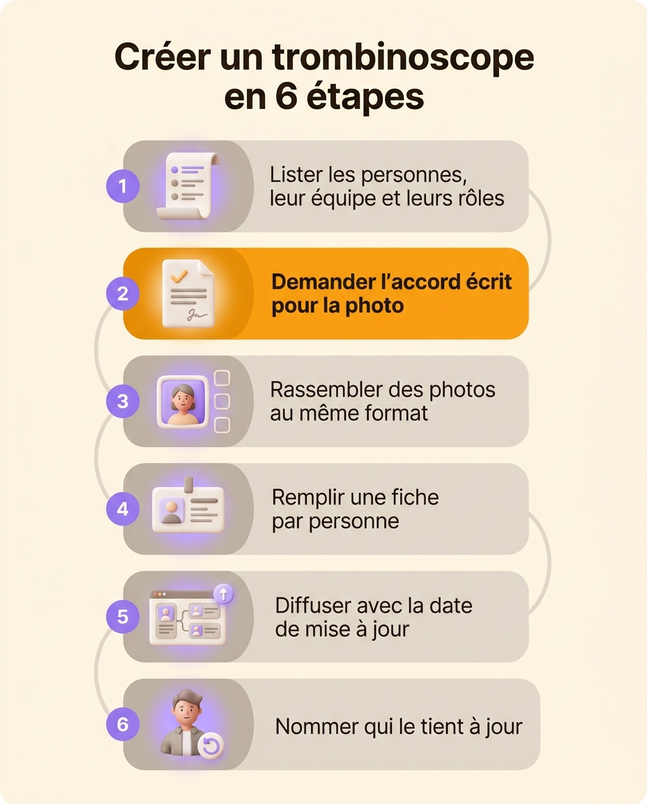
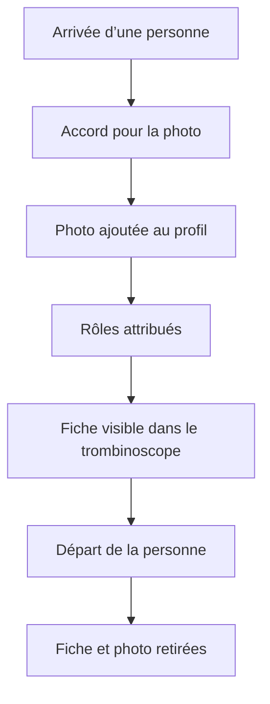

Un trombinoscope d’entreprise réunit sur une page la photo et le nom de chaque salarié, pour que tout le monde sache qui est qui. Pour le créer, listez les personnes avec leur équipe et leurs rôles, demandez à chacune son accord pour utiliser sa photo, rassemblez des photos au même format, puis remplissez un modèle Word ou un outil en ligne. Le plus difficile vient ensuite : le trombinoscope doit changer à chaque arrivée et à chaque départ, sinon il devient faux en quelques mois. Cette page donne les étapes, un modèle Word gratuit avec un formulaire d’autorisation, et les règles du droit à l’image qui s’appliquent aux photos de salariés.

## À quoi sert un trombinoscope en entreprise

Un nouvel arrivant entend une vingtaine de prénoms pendant sa première semaine. Avec le trombinoscope, il relie ces prénoms à des visages, puis à ce que fait chaque personne. Le trombinoscope sert aussi :

- aux équipes en télétravail ou réparties sur plusieurs sites, qui se croisent surtout en visioconférence
- à l’accueil, qui doit savoir à qui passer un visiteur ou un appel
- aux participants d’une réunion entre services, qui veulent savoir qui est leur interlocuteur de l’autre côté
- aux entreprises qui recrutent vite, où même les anciens ne connaissent plus tout le monde

Un trombinoscope limité aux visages répond à « qui est cette personne ? ». La question qui revient le plus souvent, pourtant, est « à qui je m’adresse pour ce sujet ? ». Pour y répondre, chaque fiche doit indiquer de quoi la personne s’occupe.

## Les informations à mettre sur chaque fiche

Chaque fiche porte quatre informations.

- La photo, cadrée de la même façon pour tout le monde.
- Le prénom et le nom, écrits comme la personne les écrit dans ses e-mails.
- L’équipe, ou le service.
- Les rôles, c’est-à-dire ce dont la personne s’occupe : « Paie », « Support client », « Accueil des nouveaux ». Une même personne en tient souvent plusieurs.

Les rôles sont plus utiles que l’intitulé de poste. En lisant « Chargée de mission », personne ne devine qu’Inès gère les notes de frais. Si vous avez déjà [décrit les rôles de votre équipe](/fr/blog/roles-vs-job-descriptions), reprenez leurs noms tels quels.

Vous pouvez ajouter le site de travail, la date d’arrivée ou une ligne « Contactez-moi pour… ». Laissez de côté la date de naissance, l’adresse et le téléphone personnel, qui ne servent à rien dans un trombinoscope : le RGPD demande de collecter uniquement ce qui sert au but fixé.

## Créer un trombinoscope pas à pas

1. Dressez la liste des personnes, avec leur équipe et leurs rôles. Partez de l’organigramme si vous en avez un, sinon de la liste du personnel.
2. Demandez à chacun son accord écrit pour utiliser sa photo, avec le formulaire du modèle ou le vôtre.
3. Rassemblez les photos. Demandez un format carré, cadré sur le visage et les épaules, sur un fond uni et à la lumière du jour. Une séance photo d’une demi-journée donne des portraits homogènes. Si chacun envoie la sienne, partagez un exemple de cadrage pour que les photos se ressemblent.
4. Remplissez le modèle, une fiche par personne. Gardez une fiche avec les initiales pour ceux qui refusent la photo : ils font toujours partie de l’équipe.
5. Diffusez le trombinoscope là où les gens le cherchent, sur l’intranet ou dans le livret d’accueil. Écrivez la date de mise à jour en haut.
6. Désignez la personne qui le met à jour, et à quel moment. Sans ce nom, chacun compte sur un autre pour le faire.

{/* IMAGE regen: api.py image, infographic, 1024x1280. Scene: a vertical infographic titled "Créer un trombinoscope en 6 étapes" in a modern clean bold sans-serif at the top. Below, six numbered rounded cards stacked in a gentle vertical path, each with a small soft 3D icon on the left and its label on the right:
1 "Lister les personnes, leur équipe et leurs rôles" (icon: a list)
2 "Demander l’accord écrit pour la photo" (icon: a signed form)
3 "Rassembler des photos au même format" (icon: a square portrait frame)
4 "Remplir une fiche par personne" (icon: a card with a portrait)
5 "Diffuser avec la date de mise à jour" (icon: a shared page)
6 "Nommer qui le tient à jour" (icon: a person with a small refresh arrow)
Cards in warm grey, the numbers in purple circles, step 2 highlighted with an orange accent. Generous cream margins, no other text. */}

Le modèle Word à télécharger tient en trois pages : un trombinoscope rempli en exemple, une grille vierge de douze fiches, et un formulaire d’autorisation photo à faire signer. Pour remplacer une photo, cliquez dans sa case, puis sur **Insertion** et **Images**.

{/* DOWNLOAD regen: python3 ./generate-photo-directory-template.py */}
<Button label="Télécharger le modèle Word" href="/downloads/modele-trombinoscope.docx" variant="primary" />

## Modèle Word ou trombinoscope relié aux rôles

Un modèle Word ou PowerPoint suffit pour une équipe de quinze personnes qui change peu. Vous le remplissez en une heure et vous l’imprimez. Il reste juste tant que personne n’arrive ni ne part.

Le fichier change seulement quand quelqu’un l’ouvre pour le corriger. Une personne embauchée en mars reste absente du fichier jusqu’à ce que quelqu’un pense à l’ajouter. Une personne partie en juin y figure encore à la prochaine relecture. Les rôles changent aussi sans que personne n’ouvre le fichier. Quand quelqu’un reprend la paie en plus de la comptabilité, sa fiche affiche encore la comptabilité seule.

| | Un trombinoscope Word ou PowerPoint | Un trombinoscope relié aux rôles |
|---|---|---|
| Contenu | Des photos et du texte tapé à la main | Les membres qui tiennent un rôle, avec leur photo |
| Une arrivée | Ajouter une fiche, si quelqu’un y pense | La personne apparaît quand on lui attribue un rôle |
| Un départ | Supprimer la fiche, si quelqu’un y pense | La personne disparaît quand on l’archive |
| Qui change la photo | Celui qui a le fichier | La personne elle-même, ou un administrateur |
| Les responsabilités | Un intitulé de poste, souvent dépassé | Les rôles actuels de la personne |
| Diffusion | Un PDF ou un fichier partagé | Un lien, une intégration dans l’intranet ou une image |

Dans Rolebase, le trombinoscope est une des trois vues de l’[organigramme](/fr/docs/org-chart), à côté des vues Cercles et Arbre hiérarchique. Il affiche chaque personne qui tient au moins un rôle, avec sa photo et son nom. Cliquez sur une photo pour ouvrir le profil de la personne, avec sa description et la liste de ses rôles. Chaque membre peut [changer sa photo dans son profil](/fr/docs/members). Un administrateur peut aussi changer celle de n’importe quel membre.

Pour partager le trombinoscope au-delà des comptes Rolebase, activez le partage de l’organigramme et cochez **Publier les membres**. La page publique affiche alors seulement le nom et la photo de chaque membre. Vous pouvez envoyer le lien ou intégrer la page dans votre intranet. Pour mettre le trombinoscope dans un document, [exportez la vue en image](/fr/docs/export), uniquement au format PNG. Pour une version papier, imprimez ce document ou gardez le modèle Word.

## Tenir le trombinoscope à jour

Un trombinoscope doit changer à chaque arrivée et à chaque départ. Mettez-le à jour à ces deux moments plutôt qu’une fois par an.

Avec un modèle Word, ajoutez « mettre à jour le trombinoscope » à la liste de tâches de chaque arrivée et de chaque départ. Nommez la personne qui s’en charge, souvent au service RH ou à l’accueil. Prévoyez aussi une relecture tous les trois mois, pour les rôles qui ont changé sans arrivée ni départ.

Dans Rolebase, une personne apparaît dans le trombinoscope quand on lui attribue un rôle. Quand elle part, [archivez-la](/fr/docs/members) : elle quitte tous ses rôles, et donc le trombinoscope, tandis que son historique de réunions et de tâches est conservé.

## Droit à l’image et RGPD : les règles pour les photos de salariés

La photo d’un salarié est une donnée personnelle. Chacun a aussi un droit sur son image. La [CNIL rappelle](https://www.cnil.fr/fr/cnil-direct/question/puis-je-refuser-que-ma-photographie-figure-dans-lannuaire-du-personnel) que toute personne peut refuser que sa photo figure dans l’annuaire du personnel, et que l’employeur doit obtenir son autorisation, écrite de préférence.

En pratique, cinq règles suffisent pour un trombinoscope interne.

- Demandez l’accord avant d’afficher la photo, par écrit, en précisant l’usage et les supports.
- Laissez chacun refuser sans conséquence. Comme le salarié dépend de son employeur, son accord reste fragile : s’il craint d’être mal vu en refusant, il n’accepte pas librement.
- Permettez à chacun de retirer son accord à tout moment, et retirez alors la photo rapidement.
- Retirez la photo au départ de la personne.
- Demandez un nouvel accord pour tout autre usage. Pour mettre sur le site de l’entreprise une photo acceptée pour le trombinoscope interne, demandez un second accord.

Le formulaire du modèle reprend ces points. Faites-le relire par la personne chargée des données personnelles dans votre entreprise, votre délégué à la protection des données si vous en avez un. Avant de cocher **Publier les membres** dans Rolebase, demandez à chaque personne son accord pour cette publication, puisque la page devient visible en dehors de l’entreprise.

## Questions fréquentes

<FaqList>

<FaqItem question="Comment faire un trombinoscope gratuit ?">

Téléchargez le modèle Word de cette page, remplacez les photos d’exemple par celles de votre équipe, et tapez le nom, l’équipe et les rôles de chaque personne. Si vous voulez un trombinoscope qui se met à jour avec les rôles, Rolebase est gratuit avec toutes ses fonctionnalités jusqu’à cinq membres actifs, sans carte bancaire. Les personnes présentes dans l’organigramme sans compte utilisateur ne comptent pas dans cette limite.

</FaqItem>

<FaqItem question="Comment faire un trombinoscope sur Word ?">

Insérez un tableau de trois colonnes sur une page en portrait, avec une ligne pour les photos et une ligne pour le texte, et fixez la hauteur des lignes pour que toutes les fiches aient la même taille. Dans chaque case photo, cliquez sur **Insertion**, puis **Images**, et réduisez l’image à la largeur de la case. Le modèle de cette page est déjà construit de cette façon.

</FaqItem>

<FaqItem question="Comment faire un organigramme avec photo ?">

Mettez dans la case de chaque rôle la photo et le nom de la personne qui le tient. Dans Rolebase, la vue en arbre hiérarchique le fait d’elle-même : chaque carte de rôle affiche la photo et le nom de ses membres. Dans Word ou PowerPoint, ajoutez les photos à la main dans chaque case et prévoyez de les mettre à jour à chaque arrivée et à chaque départ.

</FaqItem>

<FaqItem question="Un salarié peut-il refuser d’apparaître dans le trombinoscope ?">

Oui. Un salarié peut refuser que sa photo figure dans le trombinoscope, sans avoir à se justifier et sans que ce refus lui porte tort. Il peut aussi retirer plus tard un accord déjà donné. Gardez sa fiche avec son nom, ses rôles et ses initiales à la place de la photo, pour que ses collègues sachent à qui s’adresser.

</FaqItem>

<FaqItem question="Quelle photo mettre dans un trombinoscope d’entreprise ?">

Prenez un portrait récent, carré, cadré sur le visage et les épaules, sur un fond uni. Le plus important est que toutes les photos se ressemblent : même cadrage, même lumière, même fond. Un trombinoscope où une photo de vacances côtoie un portrait de studio est plus difficile à parcourir.

</FaqItem>

<FaqItem question="Quelle différence entre un trombinoscope et un organigramme ?">

L’organigramme montre la structure : les équipes, les rôles et qui dépend de qui. Le trombinoscope montre qui est qui, avec le visage de chaque personne. Beaucoup d’entreprises ont besoin des deux. Un [organigramme nominatif](/fr/blog/org-chart-types) les combine en ajoutant la photo dans chaque case.

</FaqItem>

</FaqList>

## Partez de la liste des rôles

Un trombinoscope a les mêmes erreurs que la liste qui sert à le remplir. Écrivez d’abord les personnes, leurs équipes et leurs rôles, puis ajoutez les photos. Si vous n’avez pas encore cette liste, [créez l’organigramme de votre entreprise](/fr/blog/create-org-chart) : le trombinoscope en découle.

[Créez un compte Rolebase gratuit](/signup) pour tenir cette liste au même endroit que les photos. Le trombinoscope, les cercles et l’arbre hiérarchique se mettent alors à jour à partir des mêmes rôles. Dans le même compte, vous retrouvez aussi [les réunions et les décisions](/fr/features) liées à ces rôles.
