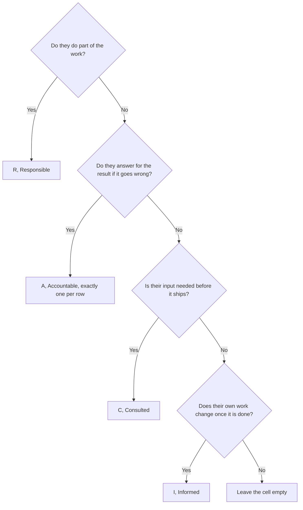

A RACI matrix is a table that maps every deliverable of a project against the people involved, using four letters. R marks whoever does the work, A the single person answerable for the result, C the people consulted before a decision, and I the people told once it is made.

That table exists because knowing what you are on the hook for has become rare. Gallup asked US employees in the second quarter of 2025 whether they strongly agreed that they knew what was expected of them at work, and 47% said yes. The figure peaked at 56% in 2020. Clarity of expectations is one of the strongest predictors of engagement Gallup tracks, and it is the one that has fallen furthest.

## What a RACI settles

Project Management Institute standards list the RACI chart as one form of responsibility assignment matrix, the artifact that connects the work breakdown structure to the people who deliver it. Behind the PMI vocabulary, a RACI answers four questions per row of work: who does it, who carries the result, who gets asked first, who finds out.

The value shows up in the arguments it prevents. A deliverable with two hands on the wheel stalls until someone escalates. A deliverable nobody was asked about ships and gets rebuilt a month later because legal had a view. Bain surveyed executives at 760 companies, most of them above a billion dollars in revenue, and found a 95% correlation between decision effectiveness and top-tier financial results. Clear ownership is the cheapest part of decision effectiveness.

A RACI stays a project instrument. It describes a split at one moment, for one piece of work, and the version you build for the next project starts from a blank page.

## The four letters, on one deliverable

Take a single row, "publish the new pricing page", and walk the letters through it.

### Responsible

The web developer builds the page, the copywriter writes it, and each of them carries an R. Several R's on one row is normal and healthy. It simply means the task takes more than one pair of hands.

### Accountable

One person answers for the result, and that person carries the A. If the page goes live with the wrong prices, this is who explains it. Only one A per row, always. The rule sounds bureaucratic until you watch a launch stall for six days because two directors each assumed the other had signed off.

Bob Frisch and Cary Greene put the deeper problem plainly in the *Harvard Business Review* of 28 June 2016: the word "accountable" means different things to different people. Naming an A settles who, and leaves open what that person owes. Write it down next to the letter, in a sentence. "Sarah approves the final prices and the go-live date" beats a lone A in a cell.

### Consulted

A C goes to the people whose input is needed before the work is finished, in a two-way exchange. Finance checks the price points, legal checks the terms link. A C is a commitment on both sides: they owe you a real answer, and you owe them the chance to give one before you ship.

### Informed

An I goes to the people told once the work is done, in one direction only. Sales needs to know the new pricing exists before a prospect mentions it. Their part stops at being told, and confusing this status with a C is the fastest way to bloat a project.

The letter falls out of four questions, in order.



An empty cell is a real answer. A matrix where every cell carries a letter describes a project where everybody is involved in everything, which is the situation a RACI is supposed to end.

## A template to fill in

Deliverables go down the left column, people or roles go across the top. Keep the rows at the level of a deliverable rather than a to-do item, or the table grows past the point anyone reads it. Twelve to twenty rows cover most projects.

| Deliverable | Role A | Role B | Role C | Role D |
|---|---|---|---|---|
| Deliverable 1 | A | R | C | I |
| Deliverable 2 | C | A | R | |
| Deliverable 3 | I | C | A | R |
| Deliverable 4 | A | R | | I |

The grid also comes as an Excel file, with a dropdown limited to the four letters, a colour per letter, and a counter that turns red as soon as a named row carries zero or several A's. It carries a second tab with the product launch example below and a third one with the four definitions.

{/* DOWNLOAD regen: python3 ./generate-raci-template.py */}
<Button label="Download the Excel template" href="/downloads/raci-matrix-template.xlsx" variant="primary" />

The file opens in Excel, Numbers, LibreOffice and Google Sheets. To build the grid in another tool, paste this block into a `.csv` file, which every spreadsheet imports without a conversion step.

```csv
Deliverable,Role A,Role B,Role C,Role D
Deliverable 1,A,R,C,I
Deliverable 2,C,A,R,
Deliverable 3,I,C,A,R
Deliverable 4,A,R,,I
```

<Callout type="tip" title="Add a column for what A owes">
Write one sentence per row in a column next to the table. It costs five minutes and it ends the argument a bare A always causes.
</Callout>

## Three worked examples

### Launching a product

| Deliverable | Product manager | Engineering lead | Marketing | Sales lead | CEO |
|---|---|---|---|---|---|
| Set the launch date | A | C | C | C | I |
| Freeze the feature scope | A | R | I | | I |
| Write the release notes | C | R | A | I | |
| Build the landing page | C | | A | I | |
| Set the launch price | C | | C | C | A |
| Brief the sales team | I | | R | A | |
| Announce to customers | I | | R | I | A |

The CEO holds two rows, price and public announcement, and appears elsewhere as an I or not at all. The product manager owns the date and the scope, which is where launches slip.

### Hiring a developer

| Deliverable | Hiring manager | Team lead | Finance | Recruiter | Team members |
|---|---|---|---|---|---|
| Write the job ad | A | R | | C | C |
| Approve the salary band | C | | A | I | |
| Screen applications | I | C | | A | |
| Run the technical interview | I | A | | I | R |
| Decide on the offer | A | C | C | I | C |
| Send the contract | I | | R | A | |
| Plan the first two weeks | C | A | | I | R |

Team members carry an R on the technical interview and a C on the decision. They run the interview, and the hiring manager makes the call. That split, written down in advance, stops the classic argument about whether the team had a real vote.

### Redesigning a website

| Deliverable | Project lead | Designer | Developer | Content owner | Legal |
|---|---|---|---|---|---|
| Approve the sitemap | A | C | I | C | |
| Design the page templates | C | A | C | I | |
| Write the page copy | I | C | | A | |
| Build the pages | C | C | A | I | |
| Review the privacy pages | I | | I | C | A |
| Run the accessibility check | A | C | R | I | |
| Decide the go-live date | A | I | C | C | I |

Legal owns exactly one row and gets informed on one more. Giving legal a C on every row is the reflex, and it is what turns a six-week redesign into a four-month one.

## Five mistakes that break a RACI

### Two A's on one row

This is the commonest failure, and the one that guarantees a stalemate. If the work genuinely has two owners, the A goes to whoever they both report to, or you split the row into two deliverables with one owner each.

### A crowded C column

Consulting is a commitment to wait for someone. Three consulted people on a row already means three calendars to line up. Past that, the task waits on calendars rather than on work. Move the least involved ones to I. Whoever complains is whoever genuinely needed asking.

### A matrix written once, in the kick-off

Everyone in the room agrees to it on day one, and nobody opens it again. Two months in, half the rows are wrong and the team relies on habit. Put the matrix on the agenda of the project review, and change the rows the same day the work changes.

### A letter without a verb

"A" in a cell tells you a name. It tells you nothing about whether that person approves, arbitrates, signs, or simply gets blamed. One sentence per A closes the gap.

### A file nobody can find

A RACI living in an attachment to a kick-off email is dead. It belongs where the work is, next to the project or in the tool the team opens every day.

## RASCI, DACI and the other variants

Every variant patches something the four letters leave out. Pick one and stay on it, because a team running three vocabularies at once is worse off than a team running an imperfect one.

| Acronym | What it adds | Where it earns its place |
|---|---|---|
| RASCI | S for Support, people who help the R without owning the outcome | Long projects with shared resources, where support work would otherwise be invisible |
| CAIRO, also written RACIO | O for Omitted, people explicitly left out | Political contexts where silence reads as an oversight |
| RACI-VS | V for Verifier and S for Signatory | Regulated deliverables with a formal control step |
| DACI | Driver who moves the decision along, Approver, Contributors, Informed | One-off decisions rather than a project plan. It comes out of Intuit and stayed in product teams |
| RAPID | Recommend, Input, Agree, Decide, Perform, five named roles in a single decision | Recurring high-stakes decisions. Bain trademarked it and uses it in that context |

Both DACI and RAPID describe how a decision gets made, whereas RACI describes how a project gets executed. Teams that adopted DACI usually did so because their real problem was decision latency rather than unclear delivery, which is worth checking before switching vocabularies.

## Turning recurring rows into roles

Fill three RACI matrices for three consecutive projects and a pattern appears. The same names come back on the same kinds of row. Someone is always the A on anything touching the pricing grid. Someone is always consulted on data questions. Those recurring rows describe roles rather than project assignments, and rebuilding them from scratch every quarter is wasted work.

A RACI covers one project and takes its knowledge with it when the project closes. A role outlives both the project and the person holding it. The article on [how to write a role](/en/blog/define-roles) covers the format, and [roles versus job descriptions](/en/blog/roles-vs-job-descriptions) explains why a chart of positions never answers the same question.

The conversion is mechanical. A recurring A becomes a [domain](/en/glossary/domaine), an asset or a process one role decides on alone. A recurring R becomes an [accountability](/en/glossary/redevabilite), written as an ongoing activity: "Keeping the published pricing grid up to date". A recurring C becomes a rule about who gets consulted, which belongs in the role that owns the decision. The I column mostly disappears, because a role attached to the org chart is visible without anyone having to circulate a table.

In Rolebase, every role carries a purpose, a set of accountabilities and, when it needs one, a domain. Each role sits in an org chart the whole organization can open. Decisions, meetings and tasks attach to the role rather than to a project file, so the answer to "who calls this" stays current between projects. Amending it happens in a [governance meeting](/en/blog/governance-meeting), triggered by a tension someone actually felt. The wider practice is covered in [collaborative governance](/en/blog/collaborative-governance).

<OrgChartView demo="demo" height="440px" showAllNodes={false} />

Keep both. A RACI is still the right tool for a one-off project with an end date, an external agency in the mix, or a deliverable that crosses four departments once. The recurring rows become roles.

## Frequently asked questions

<FaqList>

<FaqItem question="What does RACI stand for?">

Responsible, Accountable, Consulted, Informed. Responsible does the work, Accountable answers for the result, Consulted gives input before the work is finished, Informed hears about it once it is done. The four letters are placed in a table where deliverables are rows and people are columns.

</FaqItem>

<FaqItem question="What is the golden rule of RACI?">

One A per row. Every deliverable has exactly one accountable person, even when several people do the work. Two A's on a row leave the decision without an owner, and it stalls at the first disagreement. Zero A's means nobody will notice when the deliverable slips.

</FaqItem>

<FaqItem question="How do you build a RACI matrix?">

List the deliverables as rows, keeping them at the level of a deliverable rather than a to-do item. List the people or roles as columns. Fill each cell by asking whether the person does the work, answers for it, needs to be asked, or needs to be told. Leave the cell empty when none of the four applies. Then check every row has exactly one A, and review it in the project meeting rather than once at kick-off.

</FaqItem>

<FaqItem question="Is the RACI matrix outdated?">

The format still works for a project with a start and an end. What ages badly is using it as the permanent answer to who does what, because it describes one project and gets rebuilt from zero on the next. Teams that keep hitting the same ownership questions across projects are better served by role definitions attached to the org chart.

</FaqItem>

<FaqItem question="What has replaced RACI?">

Nothing replaced it wholesale. DACI and RAPID took over decision-making, naming a driver and capping the approvers. Role-based models such as Holacracy and sociocracy took over the recurring work, replacing per-project assignments with roles that carry a purpose, a domain and accountabilities. Most teams end up running a RACI on projects and roles on everything recurring.

</FaqItem>

</FaqList>

## Where to start

Take the project causing the most friction right now. List its deliverables as rows and the people as columns, then fill the letters in one sitting with the team in the room rather than alone at your desk. The arguments that break out during that hour are the point of the exercise.

Then look at which rows would read the same way on your next three projects. Those belong in roles. [Create a free account on Rolebase](/signup) and map them into an org chart. The free plan covers five active members. The [features page](/en/features) shows what the platform does.
