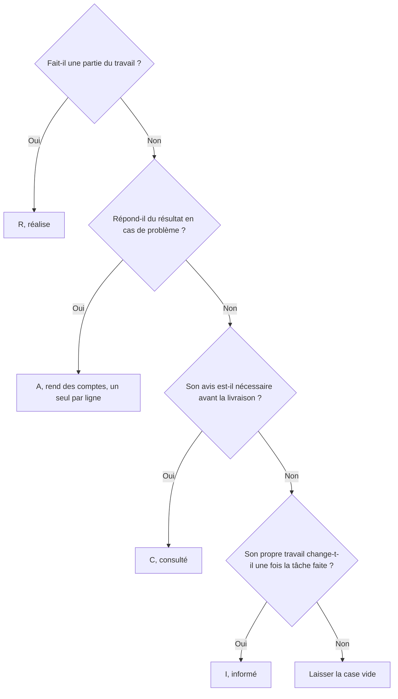

Une matrice RACI est un tableau qui croise chaque livrable d'un projet avec les personnes impliquées, à l'aide de quatre lettres. Le R désigne qui réalise le travail, le A la seule personne qui rend des comptes sur le résultat, le C ceux que l'on consulte avant de trancher, et le I ceux que l'on prévient une fois la décision prise.

Ce tableau existe parce que savoir de quoi on répond est devenu rare. Au deuxième trimestre 2025, Gallup a demandé à des salariés américains s'ils savaient précisément ce qu'on attendait d'eux au travail : 47 % ont répondu oui, contre un sommet à 56 % en 2020. La clarté des attentes est l'un des meilleurs prédicteurs d'engagement que Gallup mesure, et c'est celui qui a le plus chuté.

## Le problème qu'un RACI règle

Les standards du Project Management Institute rangent le tableau RACI parmi les matrices d'affectation des responsabilités, l'artefact qui relie le découpage du travail aux personnes qui le livrent. Derrière le vocabulaire du PMI, un RACI répond à quatre questions par ligne de travail : qui fait, qui répond du résultat, qui est consulté avant, qui apprend après.

Sa valeur se mesure aux disputes qu'il évite. Un livrable avec deux mains sur le volant s'arrête jusqu'à ce que quelqu'un fasse remonter le sujet. Un livrable dont personne n'a parlé au juridique part en production et se refait un mois plus tard. Bain a interrogé les dirigeants de 760 entreprises, la plupart au-dessus du milliard de dollars de chiffre d'affaires, et a mesuré une corrélation de 95 % entre la qualité des décisions et les meilleures performances financières. Savoir qui répond de chaque livrable est la partie la moins coûteuse de cette qualité.

Un RACI reste un instrument de projet. Il décrit une répartition à un instant donné, pour un travail donné, et la version du projet suivant repart d'une page blanche.

## Les quatre lettres, sur un seul livrable

Prenons une ligne, « publier la nouvelle page tarifs », et faisons-y passer les quatre lettres.

### R comme Responsible

La développeuse construit la page, la rédactrice l'écrit, et chacune porte un R. Plusieurs R sur une ligne, c'est normal et sain. Cela veut simplement dire que la tâche demande plus d'une paire de mains.

### A comme Accountable

Une seule personne répond du résultat, et c'est elle qui porte le A. Si la page est mise en ligne avec les mauvais prix, c'est elle qui l'explique. Un seul A par ligne, toujours. La règle paraît bureaucratique jusqu'au jour où un lancement s'arrête six jours parce que deux directeurs pensaient chacun que l'autre avait validé.

Bob Frisch et Cary Greene posent le problème de fond dans la *Harvard Business Review* du 28 juin 2016 : le mot « accountable » ne veut pas dire la même chose d'une personne à l'autre. Nommer un A règle la question du qui et laisse entière celle du quoi. Répondez-y à côté de la lettre, en une phrase. « Sarah valide les prix définitifs et la date de mise en ligne » vaut mieux qu'un A seul dans une case.

### C comme Consulted

Un C revient à ceux dont l'avis est nécessaire avant que le travail soit terminé, dans un échange à double sens. La finance vérifie les paliers de prix, le juridique vérifie le lien vers les conditions. Un C engage les deux côtés : ils vous doivent une vraie réponse, vous leur devez l'occasion de la donner avant la publication.

### I comme Informed

Un I revient à ceux que l'on prévient une fois le travail terminé, dans un seul sens. Les commerciaux doivent connaître la nouvelle grille avant qu'un prospect leur en parle. Leur rôle s'arrête à l'information, et confondre ce statut avec un C est le moyen le plus rapide de faire enfler un projet.

La lettre découle de quatre questions, dans cet ordre.



Une case vide est une vraie réponse. Une matrice où chaque case porte une lettre décrit un projet où tout le monde est impliqué dans tout, la situation même qu'un RACI sert à faire cesser.

## Un modèle à remplir

Les livrables descendent dans la colonne de gauche, les personnes ou les rôles se rangent en haut. Gardez les lignes au niveau du livrable plutôt qu'à celui de la tâche, sinon le tableau devient vite trop long pour que quelqu'un le lise. Douze à vingt lignes couvrent la plupart des projets.

| Livrable | Rôle A | Rôle B | Rôle C | Rôle D |
|---|---|---|---|---|
| Livrable 1 | A | R | C | I |
| Livrable 2 | C | A | R | |
| Livrable 3 | I | C | A | R |
| Livrable 4 | A | R | | I |

La grille existe aussi en fichier Excel, avec une liste déroulante limitée aux quatre lettres, une couleur par lettre, et un compteur qui passe en rouge dès qu'une ligne nommée compte zéro ou plusieurs A. Un deuxième onglet reprend l'exemple de lancement de produit ci-dessous, un troisième rappelle les quatre définitions.

{/* DOWNLOAD regen: python3 ./generate-raci-template.py */}
<Button label="Télécharger le modèle Excel" href="/downloads/matrice-raci-modele.xlsx" variant="primary" />

Le fichier s'ouvre dans Excel, Numbers, LibreOffice et Google Sheets. Pour construire la grille dans un autre outil, collez ce bloc dans un fichier `.csv`, que tous les tableurs importent sans conversion.

```csv
Livrable,Rôle A,Rôle B,Rôle C,Rôle D
Livrable 1,A,R,C,I
Livrable 2,C,A,R,
Livrable 3,I,C,A,R
Livrable 4,A,R,,I
```

<Callout type="tip" title="Ajoutez une colonne pour le A">
Écrivez une phrase par ligne, dans une colonne à côté du tableau. Cinq minutes suffisent, et la dispute qu'un A seul provoque toujours disparaît.
</Callout>

## Trois exemples remplis

### Lancer un produit

| Livrable | Chef de produit | Lead technique | Marketing | Responsable commercial | Direction |
|---|---|---|---|---|---|
| Fixer la date de lancement | A | C | C | C | I |
| Geler le périmètre fonctionnel | A | R | I | | I |
| Rédiger les notes de version | C | R | A | I | |
| Construire la page de lancement | C | | A | I | |
| Fixer le prix de lancement | C | | C | C | A |
| Briefer l'équipe commerciale | I | | R | A | |
| Annoncer aux clients | I | | R | I | A |

La direction tient deux lignes, le prix et l'annonce publique, et apparaît ailleurs en I ou pas du tout. Le chef de produit porte la date et le périmètre, c'est-à-dire les deux endroits où les lancements dérapent.

### Recruter un développeur

| Livrable | Manager recruteur | Lead d'équipe | Finance | Chargé de recrutement | Membres de l'équipe |
|---|---|---|---|---|---|
| Rédiger l'annonce | A | R | | C | C |
| Valider la fourchette salariale | C | | A | I | |
| Trier les candidatures | I | C | | A | |
| Mener l'entretien technique | I | A | | I | R |
| Trancher sur l'offre | A | C | C | I | C |
| Envoyer le contrat | I | | R | A | |
| Préparer les deux premières semaines | C | A | | I | R |

Les membres de l'équipe portent un R sur l'entretien technique et un C sur la décision. Ils mènent l'entretien, le manager tranche. Cette répartition, écrite à l'avance, évite la dispute classique : l'équipe avait-elle vraiment voix au chapitre ?

### Refondre un site web

| Livrable | Chef de projet | Designer | Développeur | Responsable éditorial | Juridique |
|---|---|---|---|---|---|
| Valider l'arborescence | A | C | I | C | |
| Dessiner les gabarits | C | A | C | I | |
| Rédiger les pages | I | C | | A | |
| Intégrer les pages | C | C | A | I | |
| Relire les pages de confidentialité | I | | I | C | A |
| Passer le contrôle d'accessibilité | A | C | R | I | |
| Décider de la mise en ligne | A | I | C | C | I |

Le juridique tient exactement une ligne et reçoit l'information sur une autre. Lui donner un C sur chaque ligne est le réflexe courant, et c'est ce qui fait passer une refonte de six semaines à quatre mois.

## Cinq erreurs qui cassent un RACI

### Deux A sur une ligne

C'est l'erreur la plus fréquente, et celle qui garantit le blocage. Si le travail relève réellement de deux personnes, le A revient à la personne dont elles dépendent toutes les deux, ou vous coupez la ligne en deux livrables avec une seule personne pour chacun.

### Une colonne C surchargée

Consulter, c'est s'engager à attendre quelqu'un. Trois consultés sur une ligne, c'est déjà trois agendas à faire coïncider. Au-delà, la tâche attend des agendas plutôt que du travail. Repassez les moins impliqués en I et regardez qui réclame. Ceux qui réclament sont ceux qui avaient vraiment besoin d'être consultés.

### Une matrice écrite une fois, au lancement

Tout le monde l'approuve dans la salle le premier jour, puis personne ne la rouvre. Deux mois plus tard, la moitié des lignes est fausse et l'équipe fonctionne à l'habitude. Mettez la matrice à l'ordre du jour du point projet et corrigez les lignes le jour où le travail change.

### Des lettres sans verbe derrière

Un A dans une case donne un nom. Il ne dit pas si la personne valide, arbitre, signe, ou se contente d'être blâmée. Une phrase par A comble le trou.

### Un fichier introuvable

Un RACI qui vit en pièce jointe d'un mail de lancement est mort. Sa place est là où le travail se fait, à côté du projet ou dans l'outil que l'équipe ouvre tous les jours.

## RASCI, DACI et les autres variantes

Chaque variante répare un manque des quatre lettres d'origine. Choisissez-en une et tenez-vous-y, parce qu'une équipe qui jongle avec trois vocabulaires s'en sort moins bien qu'une équipe avec un vocabulaire imparfait.

| Acronyme | L'ajout | Là où il se justifie |
|---|---|---|
| RASCI | Le S de Support, ceux qui aident le R sans porter le résultat | Projets longs à ressources partagées, où le travail de soutien resterait invisible |
| CAIRO, aussi écrit RACIO | Le O de Omitted, ceux qui sont explicitement écartés | Contextes politiques où le silence passe pour un oubli |
| RACI-VS | Le V de Verifier et le S de Signatory | Livrables réglementés avec une étape de contrôle formelle |
| DACI | Driver qui fait avancer la décision, Approver, Contributors, Informed | Décisions ponctuelles plutôt que plans de projet. Le format vient d'Intuit et est resté dans les équipes produit |
| RAPID | Recommend, Input, Agree, Decide, Perform, cinq rôles nommés dans une même décision | Décisions récurrentes à fort enjeu. Bain a déposé la marque et l'utilise dans ce cadre |

DACI et RAPID décrivent tous deux la façon dont une décision se prend, alors que RACI décrit la façon dont un projet s'exécute. Les équipes qui ont adopté DACI l'ont en général fait parce que leur vrai problème était la lenteur des décisions plutôt que le flou sur la livraison, ce qui vaut la peine d'être vérifié avant de changer de vocabulaire.

## Transformer les lignes récurrentes en rôles

Remplissez trois matrices RACI sur trois projets successifs et un motif apparaît. Les mêmes noms reviennent sur les mêmes types de ligne. Quelqu'un est toujours le A dès qu'on touche à la grille tarifaire. Quelqu'un est toujours consulté sur les questions de données. Ces lignes récurrentes décrivent des rôles plutôt que des affectations de projet, et les reconstruire chaque trimestre est du travail perdu.

Un RACI couvre un projet et emporte sa connaissance avec lui quand le projet se termine. Un rôle reste en place quand le projet se termine et quand la personne change. L'article sur [comment écrire un rôle](/fr/blog/define-roles) en donne le format, et [rôle ou fiche de poste](/fr/blog/roles-vs-job-descriptions) explique pourquoi un organigramme de postes ne répond jamais à la même question.

La conversion est mécanique. Un A récurrent devient un [domaine](/fr/glossary/domaine), un actif ou un processus sur lequel un rôle décide seul. Un R récurrent devient une [redevabilité](/fr/glossary/redevabilite), formulée comme une activité continue : « Tenir à jour la grille tarifaire publiée ». Un C récurrent devient une règle de consultation, qui se range dans le rôle qui prend la décision. La colonne I disparaît en grande partie, parce qu'un rôle attaché à l'organigramme est visible sans que personne ait à faire circuler un tableau.

Dans Rolebase, chaque rôle porte une raison d'être, des redevabilités et, quand il en a besoin, un domaine. Chaque rôle se range dans un organigramme que toute l'organisation peut ouvrir. Les décisions, les réunions et les tâches s'accrochent au rôle plutôt qu'à un fichier de projet, si bien que la réponse à « qui tranche » reste à jour entre deux projets. On l'amende en [réunion de gouvernance](/fr/blog/governance-meeting), à partir d'une tension vécue par quelqu'un. La pratique d'ensemble est décrite dans l'article sur la [gouvernance collaborative](/fr/blog/collaborative-governance).

<OrgChartView demo="demo" height="440px" showAllNodes={false} />

Gardez les deux. Un RACI reste l'outil adapté à un projet ponctuel avec une date de fin, à une agence externe dans la boucle, ou à un livrable qui traverse quatre services une seule fois. Les lignes récurrentes, elles, méritent de passer en rôles.

## Questions fréquentes

<FaqList>

<FaqItem question="Qu'est-ce que la matrice RACI ?">

Un tableau qui croise les livrables d'un projet et les personnes impliquées, avec quatre lettres. R pour Responsible, la personne qui réalise le travail. A pour Accountable, celle qui rend des comptes sur le résultat. C pour Consulted, celles dont l'avis est demandé avant. I pour Informed, celles que l'on prévient après.

</FaqItem>

<FaqItem question="Quel est le principe de la matrice RACI ?">

Un seul A par ligne. Chaque livrable a exactement une personne qui en répond, même quand plusieurs personnes font le travail. Deux A sur une ligne, et plus personne ne répond de la décision : elle s'arrête au premier désaccord. Zéro A, et personne ne remarquera que le livrable a pris du retard.

</FaqItem>

<FaqItem question="Comment construire une matrice RACI ?">

Listez les livrables en lignes, au niveau du livrable plutôt qu'à celui de la tâche. Listez les personnes ou les rôles en colonnes. Remplissez chaque case en vous demandant si la personne réalise, répond du résultat, doit être consultée ou doit être prévenue. Laissez la case vide quand aucune des quatre réponses ne s'applique. Vérifiez ensuite qu'il y a exactement un A par ligne, et relisez le tableau en point projet plutôt qu'une seule fois au lancement.

</FaqItem>

<FaqItem question="Pourquoi utiliser une matrice RACI ?">

Elle supprime deux situations coûteuses : le livrable que deux personnes croient piloter et qui s'arrête, et celui qui repart en production parce qu'un avis nécessaire n'a jamais été demandé. La matrice tient sur une page, se remplit en une réunion, et les désaccords qui éclatent pendant ce remplissage sont exactement l'intérêt de l'exercice.

</FaqItem>

<FaqItem question="Quelle est la différence entre RACI et Gantt ?">

Un diagramme de Gantt place les tâches dans le temps, avec des durées et des dépendances. Une matrice RACI place les personnes en face des tâches, sans aucune notion de calendrier. Les deux se complètent sur un même projet : le Gantt dit quand, le RACI dit qui.

</FaqItem>

</FaqList>

## Par où commencer

Prenez le projet qui frotte le plus en ce moment. Listez ses livrables en lignes et les personnes en colonnes, puis remplissez les lettres d'une traite avec l'équipe dans la salle plutôt que seul devant votre écran. Cette heure-là vaut souvent le reste du projet.

Regardez ensuite quelles lignes se liraient à l'identique sur vos trois prochains projets. Celles-là relèvent de rôles. [Créez un compte gratuit sur Rolebase](/signup) pour les poser dans un organigramme. Le plan gratuit couvre cinq membres actifs. La [page fonctionnalités](/fr/features) montre ce que fait la plateforme.
