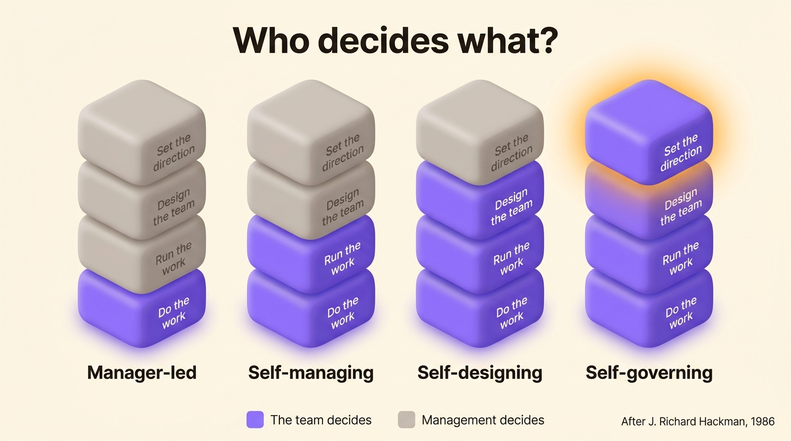
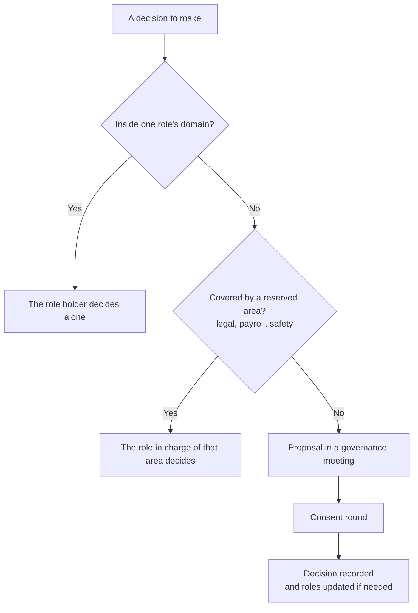

Self-management is a way of organizing work where the people doing the work also decide how it gets done: they plan it, split it between themselves and check it, without a manager approving each step. A self-managing organization goes further and spreads that authority across the whole company, through written roles and decision rules instead of a chain of bosses. The term also names a personal skill, managing your own time and emotions. This article covers the team and company sense, with the principles that make it last, the organizations that have run on it for decades, and the mistakes that bring the boss back.

## What self-management means for teams

Every team does its own work. The question is who decides the rest. J. Richard Hackman, a psychologist at Harvard who spent his career studying teams, split that question into four responsibilities in 1986: doing the work, running the work (planning, splitting, checking progress), designing the team (who is on it and how it is set up), and setting its direction. Depending on how many of those four a team holds, he described four kinds of team.

{/* IMAGE regen: api.py image, infographic, 1600x900. EN-specific because it carries English text, the FR version uses ./niveaux-autorite-equipe.jpg. Regenerate if the four levels or their labels change. Scene: "A horizontal infographic with four vertical columns side by side, from left to right, on the warm cream background, seen in soft isometric 3D. Each column is a stack of four rounded 3D blocks of equal size. In every column, from bottom to top, the blocks carry these exact labels in a modern clean sans-serif: bottom block 'Do the work', second block 'Run the work', third block 'Design the team', top block 'Set the direction'. Column 1: only the bottom block is purple #9870F0, the three others are warm grey. Column 2: the two bottom blocks are purple, the two top blocks warm grey. Column 3: the three bottom blocks are purple, the top block warm grey. Column 4: all four blocks are purple, and the top block has a soft orange #FB9803 glow. Under each column, a bold modern clean sans-serif name: column 1 'Manager-led', column 2 'Self-managing', column 3 'Self-designing', column 4 'Self-governing'. At the top of the image, a bold modern clean sans-serif title: 'Who decides what?'. At the bottom, a small legend with a purple square and the text 'The team decides', a warm grey square and the text 'Management decides'. In the bottom right corner, small text: 'After J. Richard Hackman, 1986'. No other text anywhere in the image." */}

A self-managing team, in Hackman's sense, does the work and decides how to run it, while someone outside the team still decides who joins and what the team is for. Most agile teams sit at that level. A self-governing team holds all four, which is rare outside cooperatives and partnerships.

For a whole company, the most cited definition comes from Michael Lee and Amy Edmondson, researchers at Harvard Business School. In a 2017 paper in *Research in Organizational Behavior*, they describe self-managing organizations as companies that "radically decentralize authority in a formal and systematic way throughout the organization". The word that matters is *formal*. Authority is written into roles and rules that everyone can read, instead of belonging to a manager.

| | Personal self-management | Self-managing team | Self-managing organization |
| --- | --- | --- | --- |
| Who decides | One person, about their own work | The team, about how it runs its work | Each role, within a written domain |
| Decided by someone else | Everything else | Team design and direction | Very little, often legal and payroll |
| Built on | Habits, time management | A team agreement, rituals | Roles, a decision rule, a governance meeting |
| Typical example | A freelancer planning their week | A Scrum team | Buurtzorg, Morning Star |

## The principles of self-management

Organizations that practice self-management use different methods: [holacracy](/en/blog/holacracy-intro), [sociocracy](/en/blog/sociocracy-intro) or a home-grown mix. They share four principles.

### Role holders decide within their domain

Choosing a supplier, publishing a post or changing a process goes to the holder of the role in charge of the subject, who decides alone instead of asking a manager.

### Roles are written down

A role has a purpose, a domain and accountabilities that others can count on. One person often holds several roles. Writing them well takes practice, because the same mistakes come up in every team. Learn [how to define roles and responsibilities](/en/blog/define-roles) before the first meeting.

### Shared decisions follow a rule set in advance

When a decision touches several roles, the team settles it with a rule everyone knows. Many self-managing teams use [consent decision-making](/en/blog/consent-decision): a proposal passes when nobody raises an objection showing it would harm the organization. With consent, the team can decide without waiting for unanimity or outvoting a minority.

### The structure changes on a schedule

Roles go out of date as the work changes. In a regular governance meeting, the team creates, merges and removes roles, so the written structure matches the real work.

All four principles assume that everyone can read the roles. A role nobody can read gives its holder no authority, because nobody else knows where that authority stops.

Here is how to find who makes a decision in a self-managing organization:

## Self-managed organization examples

Self-management has a track record. These organizations have run on it for years, at very different sizes.

| Organization | Since | Size | In place of a boss |
| --- | --- | --- | --- |
| W. L. Gore | 1958 | Thousands of associates | Sponsors chosen by each person, no chain of command |
| Morning Star | 1990s | About 400 year-round, up to 2,400 at harvest | Yearly written agreements between colleagues |
| Buurtzorg | 2006 | Over 10,000 care workers | Teams of ten to twelve nurses, no middle management |
| Scop EVEA | 2005 | 140 people | Shared governance in a cooperative, roles mapped in one org chart |

Morning Star, a Californian tomato processor, is the most documented case. The management writer Gary Hamel described it in the *Harvard Business Review* in December 2011: every employee writes a personal mission and negotiates a Colleague Letter of Understanding each year with the colleagues most affected by their work. That letter replaces the job description and the manager at once. Buurtzorg, a Dutch home care organization founded by Jos de Blok with four nurses, applies the same idea to healthcare. Nurses organize their own schedules, hiring and patient load, with a small back office for payroll and IT. You can read how both companies [moved to horizontal management](/en/blog/horizontal-transition).

Self-management also works at the scale of an SME. [Scop EVEA](/en/client-cases/scop-evea), an environmental consulting cooperative, grew from 60 to 140 people between 2020 and 2023 while keeping its shared governance, with every role and commitment of the company visible in one org chart.

Zappos is the counter-example people quote. In March 2015, its CEO Tony Hsieh announced the move to holacracy and offered a buyout to anyone who did not want to follow. By January 2016, 18% of the workforce, about 260 people, had taken it. The business news site Quartz reported in 2020 that Zappos had quietly backed away from holacracy. Accounts from that period mostly blame how the change was made: an ultimatum, imposed all at once on 1,500 people.

Self-management is older than most of these companies. Factories already tried [self-management in the 1970s](/en/blog/management-movement), such as the Gaines plant in Topeka or the Lip watch factory. Most of these experiments were shut down for reasons that had little to do with their results.

## How to start with self-management

Start with one team that wants to try. If you spread self-management across the company before a single team runs it well, you repeat the Zappos mistake on a smaller scale.

1. List what the team's members actually do in a month, then group it into roles with a purpose and a domain.
2. Name the decision rule for questions that cross several roles, consent or another one, and write down who facilitates.
3. Hold a governance meeting every month to adjust the roles, separate from the meetings where the team runs its work.
4. Keep a short list of reserved areas (payroll, legal obligations, safety) under a named role, and say so openly.
5. After a quarter, check whether decisions take less time and whether newcomers can tell who does what.

For shared governance to last, a few other [conditions of collaborative governance](/en/blog/collaborative-governance) have to be met.

## Common failure modes

Self-management usually fails for one of six reasons. Most come from the same mistake: removing the boss without writing down what the boss did.

### A hidden hierarchy replaces the boss

Jo Freeman, a political scientist and feminist activist, described this hidden hierarchy in 1970 in an essay called *The Tyranny of Structurelessness*. A group that refuses any formal structure still has one, informal and held by whoever has the most time, confidence or friends. Without written roles, the loudest person ends up deciding. Nobody can challenge that power, because officially it does not exist.

### The manager's work still needs doing

A manager arbitrates, sets priorities and passes information between teams. Delete the position and that work stays. When no role takes it on, it piles up on the most conscientious people, who burn out first. Organizations that practice [horizontal leadership](/en/blog/horizontal-leadership) split that work into named roles held by several people.

### The group discusses every decision

A team that discusses every decision together spends its week in meetings. Self-management works when most decisions stay inside one role and only shared questions reach the group.

### The role list goes out of date

A role list drafted at launch and never revised describes last year's company. Within six months, people work around it and the document loses all authority.

### The team's limits are never written down

A team that decides its schedule, its tools and its hires eventually asks what it does not decide. Without a written answer, the first conflict with head office ends the experiment, which is how the Topeka plant lost its autonomy in the 1970s.

### Management imposes self-management by ultimatum

An ultimatum to adopt self-management contradicts the idea. The teams that keep it going chose to try it, then wrote their own roles.

## Frequently asked questions

<FaqList>

<FaqItem question="What does self-management mean in simple words?">

Self-management means the people doing the work decide how it gets done, without asking a manager to approve each step. In a company, it means authority is written into roles and decision rules that everyone can read, instead of being held by a chain of bosses.

</FaqItem>

<FaqItem question="Does self-management mean having no managers?">

Self-management removes the manager as the person who approves everything. The management work stays: someone still sets priorities, settles conflicts and handles payroll. In a self-managing organization, that work is split into named roles. Some companies also keep a small leadership team for legal and financial matters.

</FaqItem>

<FaqItem question="What is the difference between self-management and self-organization?">

Self-organization describes a group that arranges itself without outside direction, sometimes informally. Self-management adds formal authority: written roles, a decision rule and a clear scope. A self-organized team can work well. With self-management, the team writes that arrangement down so it still holds when people leave or join.

</FaqItem>

<FaqItem question="What are examples of self-managed organizations?">

W. L. Gore has worked without a chain of command since 1958. Morning Star replaced job descriptions with yearly agreements between colleagues. Buurtzorg runs more than 10,000 Dutch care workers in teams of ten to twelve. Smaller organizations, such as the 140-person cooperative Scop EVEA, practice it too.

</FaqItem>

<FaqItem question="What are the disadvantages of self-managed teams?">

Self-managed teams spend more time on governance, especially in the first months while roles are written. Without a clear structure, informal leaders take over and decisions become harder to challenge. Some people leave because they prefer a manager who decides for them. These costs shrink when roles, the decision rule and the reserved areas are written down early.

</FaqItem>

</FaqList>

## Where to start

Self-management holds when the structure that replaces the boss is written down and kept up to date: roles with a domain, a rule for shared decisions, a meeting where the structure changes. Rolebase keeps that structure in one place. Each role has its purpose, domain and accountabilities in a living org chart, governance and tactical meetings follow their own templates, and decisions stay on record. The governance mode lets each team start freely and move to proposals and consent when it is ready. [See what Rolebase does](/en/features), or set up your first team for free with up to five active members.
