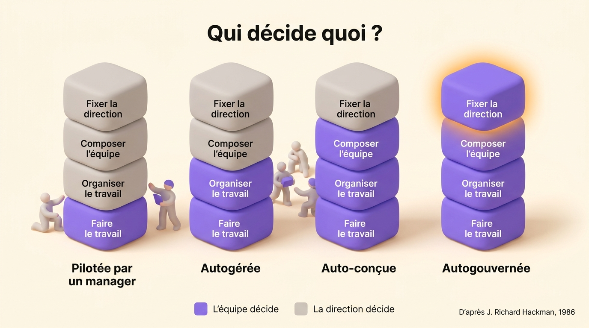
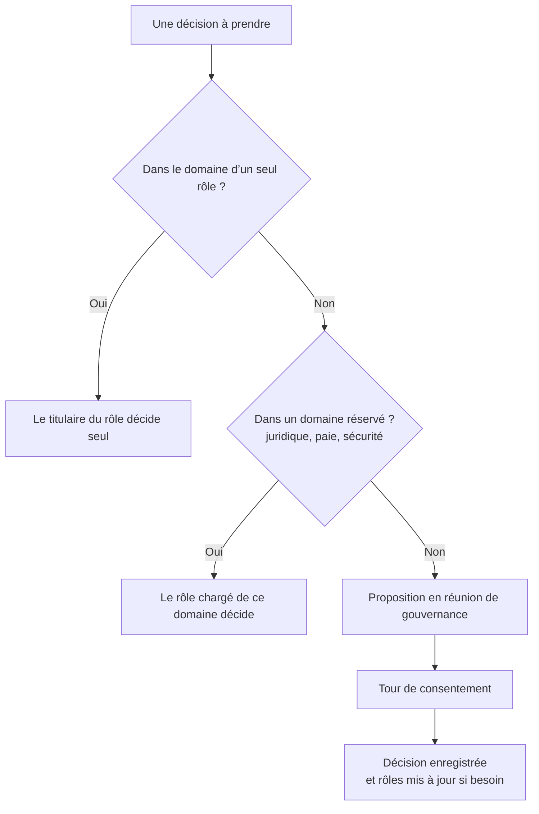

L’autogestion est une façon d’organiser le travail où les personnes qui le font décident aussi comment le faire : elles le planifient, se le répartissent et en vérifient l’avancement, sans qu’un manager valide chaque étape. Une organisation autogérée va plus loin et étend cette autorité à toute l’entreprise, grâce à des rôles écrits et des règles de décision plutôt qu’à une chaîne de chefs. Le mot désigne aussi une compétence personnelle, savoir gérer son temps et ses émotions. Cet article parle du sens collectif : les principes qui font tenir l’autogestion, les organisations qui la pratiquent depuis des décennies et les erreurs qui font revenir le chef.

## Que veut dire l’autogestion pour une équipe ?

Toute équipe fait son propre travail. La question est de savoir qui décide de tout le reste. J. Richard Hackman, psychologue à Harvard qui a consacré sa carrière à l’étude des équipes, a découpé cette question en quatre responsabilités en 1986 : faire le travail, l’organiser (le planifier, le répartir, suivre l’avancement), composer l’équipe (qui en fait partie et comment elle est constituée) et fixer sa direction. Selon le nombre de responsabilités qu’une équipe détient, il distingue quatre types d’équipe.

{/* IMAGE regen: api.py image, infographic, 1600x900. Version FR, la version EN utilise ./team-authority-levels.jpg. Régénérer si les quatre niveaux ou leurs libellés changent. Scene: "A horizontal infographic with four vertical columns side by side, from left to right, on the warm cream background, seen in soft isometric 3D. Each column is a stack of four rounded 3D blocks of equal size. In every column, from bottom to top, the blocks carry these exact labels in a modern clean sans-serif: bottom block 'Faire le travail', second block 'Organiser le travail', third block 'Composer l’équipe', top block 'Fixer la direction'. Column 1: only the bottom block is purple #9870F0, the three others are warm grey. Column 2: the two bottom blocks are purple, the two top blocks warm grey. Column 3: the three bottom blocks are purple, the top block warm grey. Column 4: all four blocks are purple, and the top block has a soft orange #FB9803 glow. Under each column, a bold modern clean sans-serif name: column 1 'Pilotée par un manager', column 2 'Autogérée', column 3 'Auto-conçue', column 4 'Autogouvernée'. At the top of the image, a bold modern clean sans-serif title: 'Qui décide quoi ?'. At the bottom, a small legend with a purple square and the text 'L’équipe décide', a warm grey square and the text 'La direction décide'. In the bottom right corner, small text: 'D’après J. Richard Hackman, 1986'. No other text anywhere in the image." */}

Au sens de Hackman, une équipe autogérée fait le travail et décide comment l’organiser, alors que quelqu’un d’extérieur décide encore qui la rejoint et à quoi elle sert. La plupart des équipes agiles sont à ce niveau. Une équipe autogouvernée détient les quatre, ce qu’on voit surtout dans les coopératives et les cabinets d’associés.

Pour une entreprise entière, la définition la plus citée vient de Michael Lee et Amy Edmondson, chercheurs à la Harvard Business School. Dans un article publié en 2017 dans *Research in Organizational Behavior*, ils décrivent les organisations autogérées comme des entreprises qui « décentralisent radicalement l’autorité, de manière formelle et systématique, dans toute l’organisation ». Le mot qui compte est *formelle*. L’autorité est inscrite dans des rôles et des règles que tout le monde peut lire, au lieu d’appartenir à un manager.

| | Autogestion personnelle | Équipe autogérée | Organisation autogérée |
| --- | --- | --- | --- |
| Qui décide | Une personne, sur son propre travail | L’équipe, sur l’organisation de son travail | Chaque rôle, dans un domaine écrit |
| Décidé par quelqu’un d’autre | Tout le reste | La composition de l’équipe et sa direction | Très peu, souvent le juridique et la paie |
| Repose sur | Des habitudes, la gestion du temps | Un accord d’équipe, des rituels | Des rôles, une règle de décision, une réunion de gouvernance |
| Exemple typique | Un indépendant qui planifie sa semaine | Une équipe Scrum | Buurtzorg, Morning Star |

En France, le mot « autogestion » garde aussi un sens politique, hérité des années 1970 et des ouvriers de Lip. Les entreprises qui la pratiquent aujourd’hui parlent plus volontiers de gouvernance partagée ou d’organisation horizontale, pour une idée très proche.

## Les principes de l’autogestion

Les organisations autogérées suivent des méthodes différentes : l’[holacratie](/fr/blog/holacracy-intro), la [sociocratie](/fr/blog/sociocracy-intro) ou un mélange maison. Elles partagent quatre principes.

### Le titulaire d’un rôle décide dans son domaine

Le choix d’un fournisseur, la publication d’un article ou le changement d’un processus revient au titulaire du rôle chargé du sujet, qui décide seul au lieu de demander à un manager.

### Les rôles sont écrits

Un rôle a une raison d’être, un domaine et des redevabilités sur lesquelles les autres peuvent compter. Une même personne tient souvent plusieurs rôles. Bien les rédiger demande un peu de pratique, car les mêmes erreurs reviennent dans toutes les équipes. Apprenez à [définir les rôles et responsabilités](/fr/blog/define-roles) avant la première réunion.

### Les décisions partagées suivent une règle fixée à l’avance

Quand une décision touche plusieurs rôles, l’équipe la tranche avec une règle que tout le monde connaît. Beaucoup d’équipes autogérées utilisent la [décision par consentement](/fr/blog/consent-decision) : une proposition passe quand personne ne soulève d’objection montrant qu’elle nuirait à l’organisation. Avec le consentement, l’équipe peut décider sans attendre l’unanimité ni mettre une minorité en échec par un vote.

### La structure évolue à date fixe

Les rôles se périment à mesure que le travail change. Lors d’une réunion de gouvernance régulière, l’équipe crée, fusionne et supprime des rôles, pour que la structure écrite corresponde au travail réel.

Les quatre principes supposent que tout le monde puisse lire les rôles. Un rôle que personne ne peut lire ne donne aucune autorité à son titulaire, puisque personne ne sait où elle s’arrête.

Voici comment savoir qui prend une décision dans une organisation autogérée :

## Des exemples d’organisations autogérées

L’autogestion a fait ses preuves. Ces organisations la pratiquent depuis des années, à des tailles très différentes.

| Organisation | Depuis | Taille | À la place du chef |
| --- | --- | --- | --- |
| W. L. Gore | 1958 | Plusieurs milliers d’associés | Des parrains choisis par chacun, sans chaîne de commandement |
| Morning Star | Années 1990 | Environ 400 permanents, jusqu’à 2 400 pendant la récolte | Des accords écrits entre collègues, renégociés chaque année |
| Buurtzorg | 2006 | Plus de 10 000 soignants | Des équipes de dix à douze infirmières, sans encadrement intermédiaire |
| Scop EVEA | 2005 | 140 personnes | Une gouvernance partagée de coopérative, avec tous les rôles réunis dans un organigramme |

Morning Star, une entreprise californienne de transformation de tomates, est le cas le mieux documenté. Le spécialiste du management Gary Hamel l’a décrite dans la *Harvard Business Review* en décembre 2011 : chaque salarié rédige sa mission personnelle et négocie chaque année une lettre d’accord avec les collègues les plus concernés par son travail. Cette lettre remplace à la fois la fiche de poste et le manager. Buurtzorg, un réseau néerlandais de soins à domicile fondé par Jos de Blok avec quatre infirmières, applique la même idée à la santé. Les infirmières organisent elles-mêmes leurs plannings, leurs recrutements et leur charge de patients, avec un petit service support pour la paie et l’informatique. Vous pouvez lire comment ces deux entreprises [sont passées au management horizontal](/fr/blog/horizontal-transition).

L’autogestion fonctionne aussi à l’échelle d’une PME. La [Scop EVEA](/fr/client-cases/scop-evea), un cabinet de conseil en environnement organisé en coopérative, est passée de 60 à 140 personnes entre 2020 et 2023 en gardant sa gouvernance partagée, avec chaque rôle et chaque engagement de l’entreprise visibles dans un seul organigramme.

Zappos est le contre-exemple qu’on cite le plus. En mars 2015, son PDG Tony Hsieh a annoncé le passage à l’holacratie et proposé une indemnité de départ à tous ceux qui ne voulaient pas suivre. En janvier 2016, 18 % des effectifs, environ 260 personnes, l’avaient acceptée. Le site d’information économique Quartz a rapporté en 2020 que Zappos avait discrètement pris ses distances avec l’holacratie. Les témoignages de l’époque mettent surtout en cause la façon dont le changement a été mené : un ultimatum, imposé d’un seul coup à 1 500 personnes.

L’autogestion est plus ancienne que la plupart de ces entreprises. Des usines ont déjà tenté l’[autogestion dans les années 1970](/fr/blog/management-movement), comme l’usine Gaines de Topeka ou l’horlogerie Lip. La plupart de ces expériences se sont arrêtées pour des raisons qui tenaient peu à leurs résultats.

## Comment démarrer l’autogestion

Commencez par une équipe qui a envie d’essayer. Si vous étendez l’autogestion à toute l’entreprise avant qu’une seule équipe la maîtrise, vous refaites l’erreur de Zappos en plus petit.

1. Listez ce que les membres de l’équipe font réellement en un mois, puis regroupez ces activités en rôles avec une raison d’être et un domaine.
2. Choisissez la règle de décision pour les questions qui concernent plusieurs rôles, le consentement ou une autre, et nommez la personne qui anime.
3. Tenez une réunion de gouvernance chaque mois pour ajuster les rôles, distincte des réunions où l’équipe pilote son travail.
4. Gardez une courte liste de domaines réservés (paie, obligations légales, sécurité) sous la responsabilité d’un rôle nommé, et dites-le clairement.
5. Au bout d’un trimestre, vérifiez si les décisions prennent moins de temps et si un nouvel arrivant sait qui fait quoi.

Pour que la gouvernance partagée dure, quelques autres [conditions de la gouvernance collaborative](/fr/blog/collaborative-governance) doivent être réunies.

## Les échecs les plus fréquents

L’autogestion échoue en général pour l’une de ces six raisons. La plupart viennent de la même erreur : retirer le chef sans écrire ce qu’il faisait.

### Une hiérarchie cachée remplace le chef

Jo Freeman, politologue et militante féministe américaine, a décrit cette hiérarchie cachée en 1970 dans un essai intitulé *The Tyranny of Structurelessness* (« la tyrannie de l’absence de structure »). Un groupe qui refuse toute structure formelle en a quand même une, informelle, tenue par ceux qui ont le plus de temps, d’aplomb ou d’amis. Sans rôles écrits, la personne qui parle le plus fort finit par décider. Personne ne peut contester ce pouvoir, puisqu’officiellement il n’existe pas.

### Le travail du manager reste à faire

Un manager arbitre, fixe des priorités et fait circuler l’information entre les équipes. Supprimer le poste ne supprime pas ce travail. Quand aucun rôle ne le reprend, il retombe sur les personnes les plus consciencieuses, qui s’épuisent les premières. Les organisations qui pratiquent le [leadership horizontal](/fr/blog/horizontal-leadership) répartissent ce travail entre des rôles nommés, tenus par plusieurs personnes.

### Le groupe discute de chaque décision

Une équipe qui discute de chaque décision ensemble passe sa semaine en réunion. L’autogestion fonctionne quand la plupart des décisions restent dans un rôle et que seules les questions partagées arrivent au groupe.

### La liste des rôles se périme

Une liste de rôles rédigée au lancement et jamais revue décrit l’entreprise de l’an dernier. En six mois, chacun la contourne et le document perd toute autorité.

### Les limites de l’équipe ne sont écrites nulle part

Une équipe qui décide de son planning, de ses outils et de ses recrutements finit par demander ce qu’elle ne décide pas. Sans réponse écrite, le premier conflit avec le siège met fin à l’expérience. L’usine de Topeka a perdu son autonomie de cette façon dans les années 1970.

### La direction impose l’autogestion par ultimatum

Un ultimatum pour adopter l’autogestion contredit l’idée même. Les équipes qui durent ont choisi d’essayer, puis ont écrit leurs propres rôles.

## Questions fréquentes

<FaqList>

<FaqItem question="Qu’est-ce que l’autogestion, en termes simples ?">

L’autogestion laisse les personnes qui font le travail décider comment le faire, sans demander à un manager de valider chaque étape. Dans une entreprise, l’autorité est alors inscrite dans des rôles et des règles de décision que tout le monde peut lire, au lieu d’être tenue par une chaîne de chefs.

</FaqItem>

<FaqItem question="Autogestion veut-elle dire absence de managers ?">

L’autogestion supprime le manager en tant que personne qui valide tout. Le travail de management reste : quelqu’un fixe toujours les priorités, règle les conflits et s’occupe de la paie. Dans une organisation autogérée, ce travail est découpé en rôles nommés. Certaines entreprises gardent aussi une petite équipe de direction pour le juridique et la finance.

</FaqItem>

<FaqItem question="Quelle différence entre autogestion et auto-organisation ?">

L’auto-organisation décrit un groupe qui s’arrange sans direction extérieure, parfois de façon informelle. L’autogestion y ajoute une autorité formelle : des rôles écrits, une règle de décision et un périmètre clair. Une équipe auto-organisée peut très bien fonctionner. Avec l’autogestion, l’équipe écrit cet arrangement pour qu’il tienne encore quand des personnes partent ou arrivent.

</FaqItem>

<FaqItem question="Quels sont des exemples d’organisations autogérées ?">

W. L. Gore fonctionne sans chaîne de commandement depuis 1958. Morning Star a remplacé les fiches de poste par des accords annuels entre collègues. Buurtzorg fait travailler plus de 10 000 soignants néerlandais en équipes de dix à douze. Des structures plus petites la pratiquent aussi, comme la coopérative Scop EVEA et ses 140 personnes.

</FaqItem>

<FaqItem question="Quels sont les inconvénients des équipes autogérées ?">

Les équipes autogérées passent plus de temps en gouvernance, surtout les premiers mois, pendant la rédaction des rôles. Sans structure claire, des leaders informels prennent la main et leurs décisions deviennent plus difficiles à contester. Certaines personnes s’en vont parce qu’elles préfèrent un manager qui décide pour elles. Ces coûts diminuent quand les rôles, la règle de décision et les domaines réservés sont écrits tôt.

</FaqItem>

</FaqList>

## Par où commencer

L’autogestion tient quand la structure qui remplace le chef est écrite et tenue à jour : des rôles avec un domaine, une règle pour les décisions partagées, une réunion où la structure évolue. Rolebase réunit cette structure au même endroit. Chaque rôle a sa raison d’être, son domaine et ses redevabilités dans un organigramme vivant, les réunions de gouvernance et de triage suivent leurs propres modèles, et les décisions restent consultables. Le mode de gouvernance permet à chaque équipe de démarrer librement, puis de passer aux propositions et au consentement quand elle est prête. [Découvrez ce que fait Rolebase](/fr/features), ou créez votre première équipe gratuitement jusqu’à cinq membres actifs.
