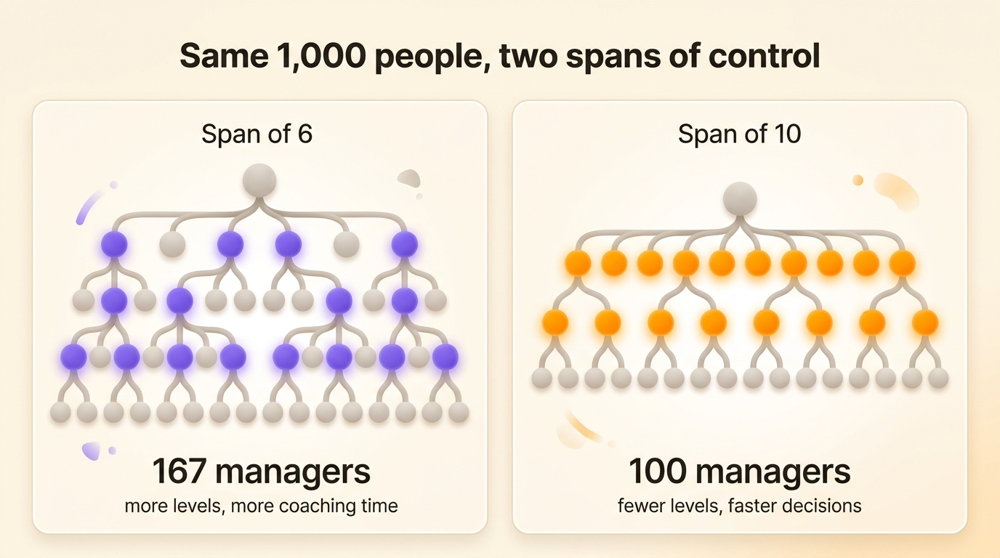
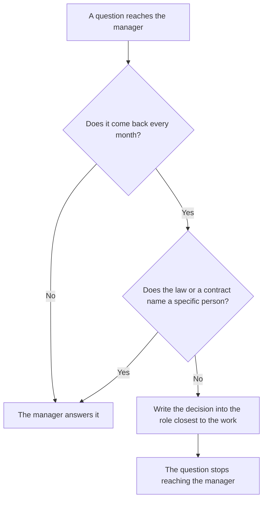

Span of control is the number of people who report directly to one manager. A team lead with seven direct reports has a span of seven. Span of management means the same thing. Both terms describe how wide each level of an org chart is.

No span is right everywhere. The polling firm Gallup measured an average of 12.1 direct reports per US manager in 2025, up from 10.9 a year earlier, while the median stayed at five or six. A wide span works when the people doing the work can decide without their manager. This article covers how to calculate your span, where the classic limit of five or six comes from, and what the number leaves out.

## What span of control measures

The span counts direct reports only. A director with four managers under her, who each lead eight people, has a span of four, even though 36 people sit below her on the org chart.

A span is either narrow or wide:

- A narrow span gives each manager few people, often two to five. The org chart gets tall, with many levels between the front line and the top.
- A wide span gives each manager many people, ten or more. The org chart gets flat, with few levels.

At a fixed headcount, widening spans removes levels of management. A company of 1,000 people needs about four levels of management at a span of six, and about three at a span of ten. The [chain of command](/en/blog/chain-of-command) gets longer or shorter by the same arithmetic.

## How to calculate span of control

For one manager, count the people whose reporting line points to them. For a whole organization, use the average:

> Average span of control = (headcount − 1) ÷ number of managers

Everyone except the person at the top reports to exactly one manager, hence the minus one. A company of 60 people with 8 managers has an average span of 59 ÷ 8, a little over seven.

The average hides the cases worth looking at, so list the span of every manager next to it. On a [hierarchy chart](/en/blog/hierarchy-chart), look for the boxes with one line under them and the boxes with fifteen.

- A manager with one or two direct reports usually marks a level that could go, or a title given as a promotion rather than because the work needed a manager.
- A manager with fifteen or more usually marks a bottleneck, unless that team already decides most things without them.

The number of managers grows fast as spans narrow. At 1,000 people, a span of six takes about 167 managers and a span of ten about 100.

{/* IMAGE regen: api.py image, infographic, 1600x900. Scene: "Side-by-side comparison of two org chart trees for the same company of 1,000 people. Left panel titled 'Span of 6': a tall tree with 4 levels of management, a label '167 managers' and a small caption 'more levels, more coaching time'. Right panel titled 'Span of 10': a flatter, wider tree with 3 levels of management, a label '100 managers' and a small caption 'fewer levels, faster decisions'. Trees drawn with soft rounded nodes, grey nodes with the manager nodes highlighted in purple on the left and orange on the right. Clean title at the top: 'Same 1,000 people, two spans of control'." Regenerate if the worked example in the "How to calculate span of control" section changes. Last data sync: 2026-09-30. */}

## Where the limit of five or six comes from

Vytautas Graicunas, a Lithuanian-American management consultant then working for companies across Europe, published the argument in 1933 in the *Bulletin of the International Management Institute*, in Geneva. He counted the relationships a manager has to keep an eye on: with each person, between each pair of people, and with every possible group. The total grows much faster than the team:

| Direct reports | Relationships to supervise |
|---|---|
| 2 | 6 |
| 3 | 18 |
| 4 | 44 |
| 5 | 100 |
| 6 | 222 |
| 12 | 24,708 |

Graicunas concluded that four was the practical limit, five at most. The British management writer Lyndall Urwick, who had helped him prepare the paper, put the ceiling at five, six at most, for managers whose people's work interlocks.

The formula assumes the manager coordinates every one of those relationships personally. Under that assumption, the manager of a team of twelve would have to supervise 24,708 relationships, yet real teams of twelve work well. In a team where two people settle a question between themselves, their relationship costs the manager nothing.

## How many direct reports is too many

Jim Harter, Gallup's chief workplace scientist, published the 2025 figures for US managers in January 2026:

- 37% manage fewer than five people.
- 13% manage 25 or more, enough to pull the average up to 12.1.
- The median sits at five or six.

The average rose because companies cut levels of management. In September 2024, Amazon's chief executive Andy Jassy asked each of the company's top-level organizations to raise its ratio of individual contributors to managers by at least 15% by the end of the first quarter of 2025. He wanted fewer levels, with decisions made closer to the people doing the work.

Gallup studied 92,252 teams and concluded that team size alone predicts little. Engaged teams of twelve or more with effective managers do well, while poorly managed small teams struggle. Large teams work well under four conditions: an engaged team, a manager who spends less than 40% of their time on individual work, a manager chosen for the ability to manage, and meaningful feedback every week.

Twelve direct reports are too many for a manager who still carries a full production load and approves every expense, because those two jobs leave no time for weekly feedback. A manager who spends the whole week managing, and whose team sets its own priorities, has that time for twelve people.

## How to choose the right span for a team

| Factor | Narrow span | Wide span |
|---|---|---|
| The work | Varied, each person on a different problem | Similar, repeated, with a known method |
| The people | New to the job or the company | Experienced, working autonomously |
| The manager's own workload | Still produces half the output | Manages full time |
| Location | Spread across sites and time zones | Same place, or used to working remote |
| Decisions | Most need the manager's approval | Written down, each person knows what they decide alone |
| The process | Changes every quarter | Stable |

Decision rights matter most, because a company can move them within a month: a few meetings are enough to write down who decides what, whereas hiring experienced people takes years.

## What span of control leaves out

The span counts reports and leaves out how much of the team's work has to pass through the manager.

Compare two managers. The first has four people and approves every price change, every supplier and every publication date. The second has fourteen people, each holding [roles with written decision rights](/en/blog/define-roles): one owns the publication calendar, another signs supplier contracts up to 5,000 euros, a third sets alert thresholds for the on-call rota. The first manager is the bottleneck, whatever span the org chart shows.

This is why widening spans on its own often fails. Removing a level moves the same approvals onto fewer people, who then spend their day answering questions. Move the decisions first, then widen the span:

1. List the questions that reach the manager in a typical week.
2. For each recurring one, name the role closest to the work and write the decision into it, with its limit (an amount, a scope, a list of clients).
3. Keep with the manager what the law or the contract puts on a named person, such as signing employment contracts or safety duties.
4. Widen the span once the list of questions reaching the manager has shrunk.

A [flat structure](/en/blog/flat-vs-hierarchical) works when a company has written decisions into roles before widening its spans. Without that step, the founder ends up answering every question.

## Measure decisions alongside reports

In Rolebase, the org chart is built from roles. A team is a role that contains other roles, and each role carries a purpose, accountabilities and, when it needs one, a domain it decides on alone. A person holds as many roles as their work needs, across as many teams.

That changes what you read on the chart. Next to how many people sit in a team, you see what each role decides without asking, and which roles have nobody in them. Meetings, decisions and tasks [attach to those same roles](/en/features).

## Frequently asked questions

<FaqList>

<FaqItem question="What is span of control?">

Span of control is the number of people who report directly to one manager. A manager with eight direct reports has a span of eight. It counts direct reports only, so a director who manages four managers has a span of four, however many people work under those managers.

</FaqItem>

<FaqItem question="What is the difference between span of control and span of management?">

The two terms mean the same thing. Span of management is the older term, found in management textbooks, while most companies say span of control today. Both name the number of people reporting directly to one manager.

</FaqItem>

<FaqItem question="What is the ideal span of control?">

No number fits every team. Graicunas put the limit at four or five in 1933, and Urwick at five or six. Gallup found a median of five or six direct reports in 2025, and an average of 12.1. Teams of twelve or more work well when the work is similar, the people are experienced and most decisions are written into their roles.

</FaqItem>

<FaqItem question="What is the difference between a narrow and a wide span of control?">

A narrow span gives each manager few direct reports, usually two to five, and produces a tall organization with many levels. A wide span gives each manager ten or more, and produces a flat organization with few levels. A narrow span leaves the manager more time to coach each person, at the cost of more levels for every decision to pass through.

</FaqItem>

<FaqItem question="How do you calculate span of control?">

For one manager, count their direct reports. For a whole organization, divide the headcount minus one by the number of managers. A company of 60 people with 8 managers has an average span of about seven. List every manager's span next to the average to spot the managers with one report and those with fifteen or more.

</FaqItem>

<FaqItem question="How does span of control relate to the chain of command?">

The chain of command is the vertical line of who reports to whom. Span of control counts how many people report to each manager along that line. At a fixed headcount, a wider span means a shorter chain: 1,000 people need about four levels of management at a span of six, and about three at a span of ten.

</FaqItem>

</FaqList>

## Start with the questions reaching your managers

Take the manager with the widest span in your org chart and the one with the narrowest. Ask each of them to list the questions that reached them last week. The narrow-span manager's list is often the longer one. Each recurring question on it is a decision to write into a role before you touch the structure.

Once those decisions sit in roles, you need a place where everyone can read them. [Create a free Rolebase account](/signup) to map your roles in an org chart the whole organization can open. The free plan covers five active members, with every feature.
