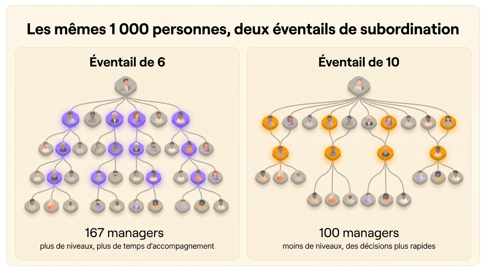
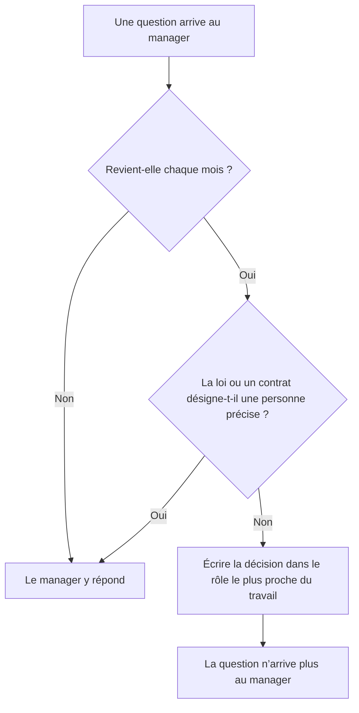

L’éventail de subordination est le nombre de personnes rattachées directement à un même manager. Une responsable d’équipe qui a sept collaborateurs directs a un éventail de sept. On parle aussi d’étendue du contrôle, ou de *span of control* en anglais. Tous ces termes décrivent la largeur de chaque niveau d’un organigramme.

Aucun éventail ne convient à toutes les équipes. L’institut de sondage américain Gallup a mesuré en 2025 une moyenne de 12,1 collaborateurs directs par manager aux États-Unis, contre 10,9 un an plus tôt, alors que la médiane restait à cinq ou six. Un éventail large fonctionne quand les personnes qui font le travail peuvent décider sans leur manager. Cet article explique comment calculer votre éventail, d’où vient la limite classique de cinq ou six, et ce que le chiffre laisse de côté.

## L’éventail compte les rattachements directs

Une directrice qui encadre quatre managers, chacun à la tête de huit personnes, a un éventail de quatre, même si 36 personnes se trouvent sous elle dans l’organigramme.

On distingue deux cas :

- Un éventail étroit donne peu de personnes à chaque manager, souvent de deux à cinq. L’organigramme s’allonge, avec beaucoup de niveaux entre le terrain et la direction.
- Un éventail large donne dix personnes ou plus à chaque manager. L’organigramme s’aplatit, avec peu de niveaux.

À effectif constant, élargir les éventails supprime des niveaux de management. Une entreprise de 1 000 personnes a besoin d’environ quatre niveaux de management avec un éventail de six, et d’environ trois avec un éventail de dix. La [chaîne de commandement](/fr/blog/chain-of-command) s’allonge ou se raccourcit selon le même calcul.

## Comment calculer l’éventail de subordination

Pour un manager, comptez les personnes dont le rattachement pointe vers lui. Pour toute une organisation, prenez la moyenne :

> Éventail moyen = (effectif − 1) ÷ nombre de managers

Tout le monde sauf la personne au sommet dépend d’un seul manager, d’où le moins un. Une entreprise de 60 personnes avec 8 managers a un éventail moyen de 59 ÷ 8, soit un peu plus de sept.

La moyenne cache les cas intéressants, alors listez l’éventail de chaque manager à côté. Sur un [arbre hiérarchique](/fr/blog/hierarchy-chart), cherchez les cases avec un seul trait en dessous et celles qui en ont quinze.

- Un manager avec un ou deux collaborateurs directs signale souvent un niveau dont on pourrait se passer, ou un titre donné comme une promotion plutôt que parce que le travail demandait un manager.
- Un manager avec quinze collaborateurs ou plus signale souvent un goulot d’étranglement, sauf si l’équipe décide déjà presque tout sans lui.

Le nombre de managers grimpe vite quand l’éventail se resserre. Pour 1 000 personnes, un éventail de six demande environ 167 managers, un éventail de dix environ 100.

{/* IMAGE regen: api.py image, infographic, 1600x900. Scene: "Side-by-side comparison of two org chart trees for the same company of 1,000 people. Left panel titled 'Éventail de 6': a tall tree with 4 levels of management, a label '167 managers' and a small caption 'plus de niveaux, plus de temps d’accompagnement'. Right panel titled 'Éventail de 10': a flatter, wider tree with 3 levels of management, a label '100 managers' and a small caption 'moins de niveaux, des décisions plus rapides'. Trees drawn with soft rounded nodes, grey nodes with the manager nodes highlighted in purple on the left and orange on the right. Clean title at the top: 'Les mêmes 1 000 personnes, deux éventails de subordination'." Regenerate if the worked example in the "Comment calculer l’éventail de subordination" section changes. Last data sync: 2026-09-30. */}

## D’où vient la limite de cinq ou six

Vytautas Graicunas, consultant en organisation américano-lituanien qui travaillait alors pour des entreprises dans toute l’Europe, a publié le raisonnement en 1933 dans le *Bulletin of the International Management Institute*, à Genève. Il a compté les relations qu’un manager doit surveiller : avec chaque personne, entre chaque paire de personnes et avec chaque groupe possible. Le total augmente bien plus vite que l’équipe :

| Collaborateurs directs | Relations à surveiller |
|---|---|
| 2 | 6 |
| 3 | 18 |
| 4 | 44 |
| 5 | 100 |
| 6 | 222 |
| 12 | 24 708 |

Graicunas en a conclu que la limite pratique était de quatre, cinq au maximum. Lyndall Urwick, auteur britannique en management qui l’avait aidé à préparer l’article, a fixé le plafond à cinq, six au plus, pour les managers dont les collaborateurs ont un travail très imbriqué.

La formule suppose que le manager coordonne lui-même chacune de ces relations. Avec cette hypothèse, le manager d’une équipe de douze devrait surveiller 24 708 relations, alors que de vraies équipes de douze fonctionnent très bien. Dans une équipe où deux personnes règlent une question entre elles, leur relation ne coûte rien au manager.

## Combien de collaborateurs directs, c’est trop ?

Jim Harter, directeur scientifique de Gallup pour les études sur le travail, a publié les chiffres de 2025 sur les managers américains en janvier 2026 :

- 37 % encadrent moins de cinq personnes.
- 13 % en encadrent 25 ou plus, assez pour tirer la moyenne à 12,1.
- La médiane se situe à cinq ou six.

La moyenne a augmenté parce que les entreprises ont supprimé des niveaux de management. En septembre 2024, Andy Jassy, PDG d’Amazon, a demandé à chacune des grandes organisations du groupe d’augmenter d’au moins 15 % son ratio de contributeurs individuels par manager avant la fin du premier trimestre 2025. Il voulait moins de niveaux, avec des décisions prises plus près des personnes qui font le travail.

Gallup a étudié 92 252 équipes et en a conclu que la taille de l’équipe prédit peu de chose à elle seule. Les équipes engagées de douze personnes ou plus, avec un bon manager, s’en sortent bien, alors que des petites équipes mal managées peinent. Les grandes équipes fonctionnent bien à quatre conditions : une équipe engagée, un manager qui consacre moins de 40 % de son temps à son propre travail de production, un manager choisi pour sa capacité à manager, et un vrai retour chaque semaine.

Douze collaborateurs directs sont donc trop nombreux pour un manager qui produit encore à plein temps et valide chaque dépense, parce que ces deux tâches ne lui laissent pas le temps de faire un vrai retour chaque semaine. Un manager qui passe toute sa semaine à encadrer, et dont l’équipe fixe elle-même ses priorités, a ce temps pour douze personnes.

## Comment choisir le bon éventail pour une équipe

| Critère | Éventail étroit | Éventail large |
|---|---|---|
| Le travail | Varié, chacun sur un problème différent | Homogène, répété, avec une méthode connue |
| Les personnes | Nouvelles dans le poste ou l’entreprise | Expérimentées, autonomes |
| La charge propre du manager | Produit encore la moitié du travail | Manage à plein temps |
| Le lieu | Plusieurs sites, plusieurs fuseaux horaires | Même lieu, ou équipe habituée au travail à distance |
| Les décisions | La plupart passent par le manager | Écrites, chacun sait ce qu’il décide seul |
| Le fonctionnement | Change chaque trimestre | Stable |

La répartition des décisions compte le plus, parce qu’une entreprise peut la revoir en un mois : quelques réunions suffisent pour écrire qui décide quoi, alors que recruter des personnes expérimentées prend des années.

## Les limites de l’éventail de subordination

L’éventail compte les rattachements et laisse de côté la part du travail de l’équipe qui doit passer par le manager.

Prenons deux managers. Le premier a quatre collaborateurs et valide chaque changement de prix, chaque fournisseur et chaque date de publication. Le second en a quatorze, qui tiennent chacun des [rôles dont les décisions sont écrites](/fr/blog/define-roles) : l’une gère le calendrier éditorial, un autre signe les contrats fournisseurs jusqu’à 5 000 euros, une troisième règle les seuils d’alerte de l’astreinte. Le premier manager est le goulot d’étranglement, quel que soit l’éventail affiché sur l’organigramme.

Voilà pourquoi élargir l’éventail ne suffit souvent pas. Supprimer un niveau fait retomber les mêmes validations sur moins de personnes, qui passent alors leur journée à répondre aux questions. Confiez d’abord les décisions, puis élargissez l’éventail :

1. Listez les questions qui arrivent au manager pendant une semaine normale.
2. Pour chaque question récurrente, choisissez le rôle le plus proche du travail et écrivez la décision dans ce rôle, avec sa limite (un montant, un périmètre, une liste de clients).
3. Laissez au manager ce que la loi ou le contrat attribue à une personne nommée, comme la signature des contrats de travail ou les obligations de sécurité.
4. Élargissez l’éventail une fois que la liste des questions qui arrivent au manager a raccourci.

Une [organisation plate](/fr/blog/flat-vs-hierarchical) fonctionne quand l’entreprise a écrit les décisions dans les rôles avant d’élargir les éventails. Sans cette étape, le fondateur finit par répondre à toutes les questions.

## Mesurer les décisions en plus des rattachements

Dans Rolebase, l’organigramme se construit à partir des rôles. Une équipe est un rôle qui contient d’autres rôles, et chaque rôle a une raison d’être, des redevabilités et, s’il en a besoin, un domaine sur lequel il décide seul. Une personne tient autant de rôles que son travail l’exige, dans autant d’équipes que nécessaire.

Vous lisez alors l’organigramme autrement. En plus du nombre de personnes dans une équipe, vous voyez ce que chaque rôle décide sans demander, et quels rôles n’ont personne. Les réunions, les décisions et les tâches [se rattachent à ces mêmes rôles](/fr/features).

## Questions fréquentes

<FaqList>

<FaqItem question="Qu’est-ce que l’éventail de subordination ?">

L’éventail de subordination est le nombre de personnes rattachées directement à un même manager. Un manager qui a huit collaborateurs directs a un éventail de huit. Seuls les rattachements directs comptent : une directrice qui encadre quatre managers a un éventail de quatre, quel que soit le nombre de personnes sous ces managers.

</FaqItem>

<FaqItem question="Quelle différence entre éventail de subordination et span of control ?">

Aucune, c’est le même indicateur. *Span of control* est le terme anglais. On le trouve aussi traduit par étendue du contrôle ou étendue de l’encadrement. Tous ces termes désignent le nombre de personnes rattachées directement à un manager.

</FaqItem>

<FaqItem question="Quel est l’éventail de subordination idéal ?">

Aucun chiffre ne convient à toutes les équipes. Graicunas plaçait la limite à quatre ou cinq en 1933, Urwick à cinq ou six. Gallup a mesuré une médiane de cinq ou six collaborateurs directs en 2025, pour une moyenne de 12,1. Des équipes de douze ou plus fonctionnent bien quand le travail est homogène, les personnes expérimentées et la plupart des décisions écrites dans leurs rôles.

</FaqItem>

<FaqItem question="Quelle différence entre un éventail étroit et un éventail large ?">

Un éventail étroit donne peu de collaborateurs directs à chaque manager, en général de deux à cinq, et produit une organisation haute avec beaucoup de niveaux. Un éventail large en donne dix ou plus, et produit une organisation plate avec peu de niveaux. Un éventail étroit laisse au manager plus de temps pour chaque personne, mais chaque décision doit alors traverser plus de niveaux.

</FaqItem>

<FaqItem question="Comment calculer l’éventail de subordination ?">

Pour un manager, comptez ses collaborateurs directs. Pour toute une organisation, divisez l’effectif moins un par le nombre de managers. Une entreprise de 60 personnes avec 8 managers a un éventail moyen d’environ sept. Listez l’éventail de chaque manager à côté de la moyenne pour repérer ceux qui n’ont qu’un collaborateur et ceux qui en ont quinze ou plus.

</FaqItem>

<FaqItem question="Quel lien entre éventail de subordination et chaîne de commandement ?">

La chaîne de commandement est la ligne verticale de qui dépend de qui. L’éventail de subordination compte combien de personnes dépendent de chaque manager sur cette ligne. À effectif constant, un éventail plus large raccourcit la chaîne : 1 000 personnes demandent environ quatre niveaux de management avec un éventail de six, et environ trois avec un éventail de dix.

</FaqItem>

</FaqList>

## Commencez par les questions qui arrivent à vos managers

Prenez le manager qui a l’éventail le plus large dans votre organigramme et celui qui a le plus étroit. Demandez à chacun de lister les questions qu’on lui a posées la semaine dernière. La liste du manager à l’éventail étroit est souvent la plus longue. Chaque question récurrente de cette liste est une décision à écrire dans un rôle avant de toucher à la structure.

Une fois ces décisions rangées dans des rôles, il faut un endroit où tout le monde peut les lire. [Créez un compte Rolebase gratuit](/signup) pour cartographier vos rôles dans un organigramme que toute l’organisation peut ouvrir. L’offre gratuite couvre cinq membres actifs, avec toutes les fonctionnalités.
