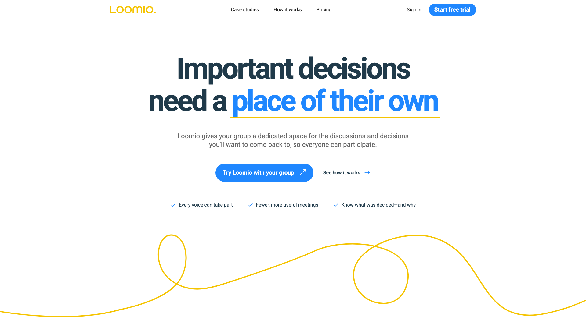
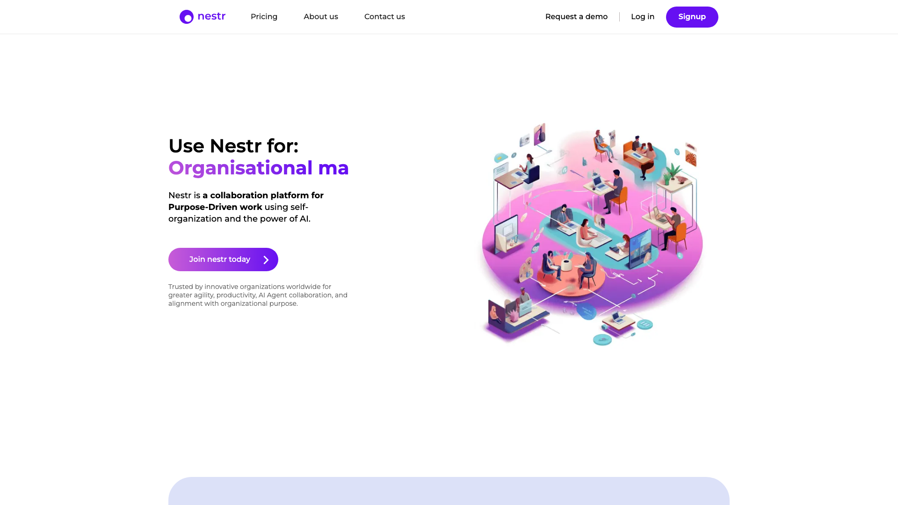
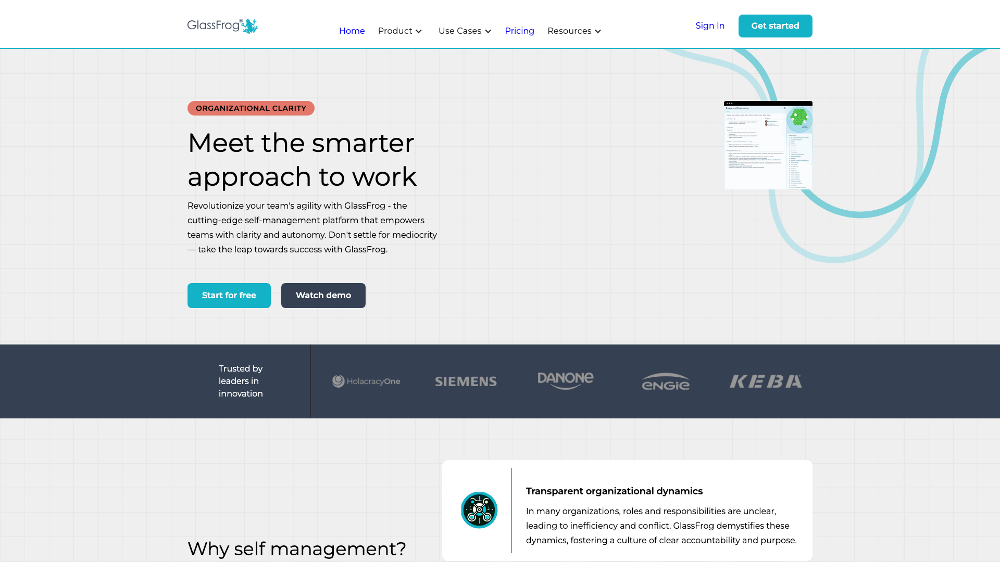
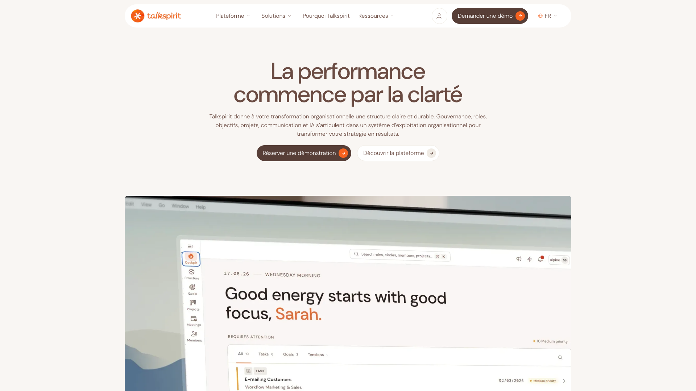
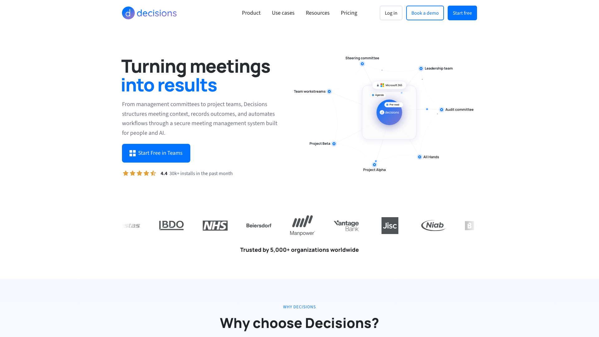
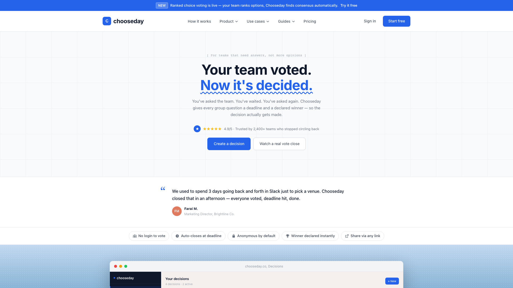
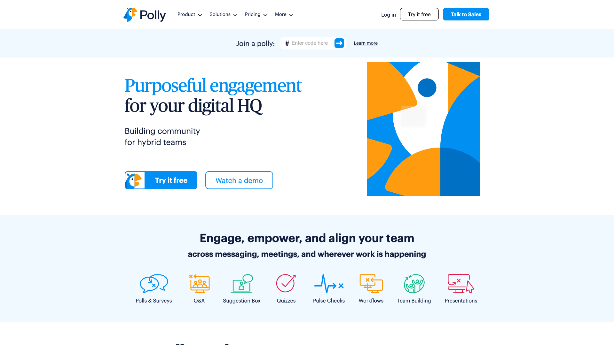
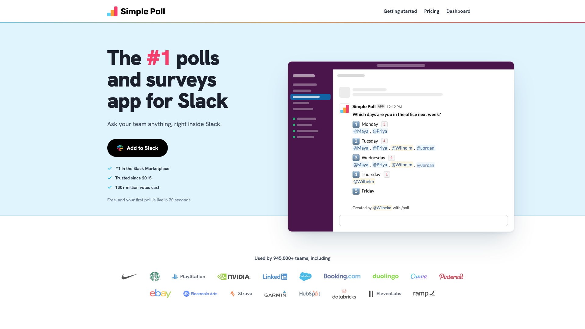

Un logiciel de prise de décision collective permet à un groupe de décider ensemble et garde une trace de la décision. Quelqu’un fait une proposition, les autres en discutent, puis le groupe vote par consentement, par consensus ou à la majorité, ou répond à un sondage. Neuf outils font ce travail sérieusement en 2026. Ils se répartissent en trois groupes : cinq mènent toute la proposition de la discussion au résultat, un enregistre les votes pendant vos réunions, et trois tranchent une seule question par un vote rapide. Loomio arrive en tête parce qu’il propose plus de façons de décider que tous les autres.

Rolebase publie cet article et se classe deuxième. Il arrive après Loomio, qui offre plus de façons de décider, et avant Nestr et GlassFrog, qui proposent moins de modes de vote. Talkspirit arrive après eux parce qu’il ne publie aucun prix. Chaque fiche renvoie vers le site de l’outil pour que vous puissiez vérifier chaque affirmation à la source.

Les tarifs viennent de la page de prix de chaque éditeur, relevée le 3 octobre 2026. Quand un éditeur ne publie aucun prix, la fiche le dit. Les notes viennent de Capterra, avec le nombre d’avis à côté du score. Quatre des neuf outils y ont moins de 30 avis, Rolebase compris. Chooseday n’y a même pas de fiche. Regardez donc le nombre d’avis avant la note.

## Comment ce classement est construit

Nous avons réparti les outils en groupes selon la part de la décision qui se déroule dans l’outil.

- Dans le premier groupe, tout le cycle se passe dans l’outil. Un membre rédige une proposition, le groupe en discute et vote, les objections sont traitées, et le résultat est enregistré.
- Dans le deuxième groupe, la discussion a lieu en réunion pendant que l’outil enregistre le vote, consigne la décision et rédige le compte rendu.
- Dans le troisième groupe, un sondage tranche une question en comptant les réponses. Personne ne rédige de proposition ni ne soulève d’objection.

Dans le premier groupe, nous avons classé les outils selon deux questions, posées l’une après l’autre :

- Pouvez-vous lire le prix et essayer le processus de décision avant de parler à un commercial ? Talkspirit ne publie aucun prix, il arrive donc dernier du groupe.
- De combien de façons le groupe peut-il décider ? Loomio propose le consentement, le consensus, la sollicitation d’avis, les notes, le vote par classement et le vote par gommettes. Rolebase propose le consentement, l’unanimité et deux sortes de majorité sur les propositions, plus des sondages à points. Nestr suit l’holacratie, la sociocratie ou des règles que vous fixez. GlassFrog s’en tient à l’holacratie.

Dans le troisième groupe, nous avons classé les outils d’abord selon ce qu’ils gardent une fois le vote clos, puis selon l’endroit où le vote peut se tenir. Chooseday enregistre une décision avec un responsable, tandis que Polly et Simple Poll gardent les résultats d’un sondage. Polly fonctionne dans Slack et dans Microsoft Teams, Simple Poll dans Slack seulement.

Le tableau et chaque fiche indiquent aussi ce que change la décision une fois adoptée, le coût d’entrée réel avec ses minimums, la licence, et la note Capterra avec la taille de son échantillon. Les fiches sont numérotées de 1 à 9 sur les trois groupes. Comparez les rangs à l’intérieur d’un groupe, puisque chaque groupe répond à un besoin différent.

## Le comparatif

| Outil | Comment le groupe décide | Ce que change la décision | Offre gratuite | Prix d’entrée | Open source | Capterra |
| --- | --- | --- | --- | --- | --- | --- |
| Loomio | Consentement, consensus, sollicitation d’avis, votes, notes, classement, gommettes | Résultat enregistré sur la discussion | Essai de 14 jours | 399 $/an pour un groupe de 30 | AGPL-3.0 | 4,8 (26) |
| Rolebase | Consentement, unanimité, majorité simple ou absolue, sondages à points | Changements d’organigramme appliqués, décision enregistrée sur le rôle | Toutes les fonctionnalités, 5 membres actifs | 5 €/membre actif/mois | MIT | 5,0 (16) |
| Nestr | Propositions de gouvernance en holacratie, en sociocratie ou selon vos règles | Rôles et règles mis à jour | Essai de 17 jours | 6 $/utilisateur/mois à l’année | Non | 5,0 (2) |
| GlassFrog | Prise de décision intégrative de l’holacratie | Rôles et règles mis à jour | 10 utilisateurs | 7 $/utilisateur/mois | Non | 4,3 (60) |
| Talkspirit | Propositions avec objections, consentement, sollicitation d’avis, élections | Rôles et règles mis à jour | Non publiée | Sur devis | Non | 4,8 (146) |
| Decisions | Votes sur les points d’ordre du jour dans les réunions Microsoft Teams | Journal des décisions, compte rendu, tâches dans Planner | Journal des décisions, sans vote | 8 €/utilisateur/mois à l’année | Non | 4,5 (81) |
| Chooseday | Majorité relative, oui ou non, gommettes, note, classement | Gagnant désigné, décision enregistrée avec un responsable | 5 décisions actives | 10 $/mois, ou 8 $/siège avec 5 sièges minimum | Non | Pas de fiche |
| Polly | Sondages, classement, répartition de 100 points, enquêtes | Résultats gardés avec le sondage | 25 réponses par mois | 19 $/mois à l’année, 1 créateur | Non | 4,6 (92) |
| Simple Poll | Choix unique ou multiple, classement, échelles | Résultats gardés dans le message Slack | 100 réponses par mois | 49 $/mois à l’année par espace de travail | Non | 4,7 (9) |

## Premier groupe : le groupe décide sur une proposition

Ces cinq outils mènent la décision du début à la fin. Un membre rédige une proposition, le groupe en discute dans l’outil, vote ou soulève des objections, et le résultat reste consigné avec sa date. Loomio s’arrête là. Les quatre autres gèrent aussi une liste de rôles, donc la proposition peut changer qui est responsable de quoi.

### 1. Loomio

[Loomio](https://www.loomio.com) est développé depuis 2011 par une coopérative de travailleurs d’Aotearoa, en Nouvelle-Zélande. Son code est ouvert sous licence AGPL-3.0, donc vous pouvez l’héberger vous-même. Loomio a publié une nouvelle version le 2 octobre 2026.

Loomio propose le plus grand choix de façons de décider. Une discussion débouche sur une proposition, à laquelle le groupe répond par consentement, par consensus ou par sollicitation d’avis, chacun avec son modèle. Les sondages couvrent le vote simple, les notes, le classement, les gommettes, le choix d’un créneau et les listes d’inscription. Le vote à l’aveugle cache les résultats jusqu’à la clôture. Tout se déroule de façon asynchrone avec une échéance, donc des personnes sur plusieurs fuseaux horaires participent sans réunion. Les notifications arrivent dans Slack, Microsoft Teams, Discord, Mattermost et Matrix. Vos données sont hébergées, au choix, aux États-Unis, en Europe ou en Australie.

Loomio facture par groupe et non par siège. Starter coûte 399 dollars par an, ou 39 dollars par mois, pour un groupe de 30 membres au plus. Pro coûte 999 dollars par an pour 3 000 membres au plus, avec des sous-groupes illimités. Les associations paient 299 ou 499 dollars par an. Loomio n’a pas d’offre gratuite, seulement un essai de 14 jours pour 10 personnes et 10 fils de discussion. Capterra donne à Loomio 4,8 sur 26 avis.

Loomio organise les personnes en groupes et en sous-groupes. Chaque décision reste consignée avec la discussion qui l’a précédée.

### 2. Rolebase

[Rolebase](/fr/features) est une plateforme de gouvernance open source, publiée sous licence MIT, où chaque décision appartient à un rôle. Un membre ouvre une discussion dans le rôle concerné et y ajoute une [proposition](/fr/docs/proposals). Le groupe vote par consentement, à l’unanimité, à la majorité simple ou à la majorité absolue, en asynchrone et avec une échéance facultative. Les votants sont soit les participants de la discussion, soit les membres du rôle. Une proposition peut contenir des changements d’organigramme préparés dans un éditeur dédié : un nouveau rôle, un membre ajouté, un rôle déplacé. Ces changements s’appliquent à l’organigramme réel seulement quand la proposition est adoptée. La [décision](/fr/docs/decisions) est alors enregistrée sur le rôle et affichée dans le fil d’actualité. Chaque changement reste annulable dans l’historique. Les discussions peuvent aussi contenir des sondages à choix multiple, avec des points à répartir, un vote anonyme et une date de clôture.

Rolebase publie deux études de cas clients. [Lonestone](/fr/client-cases/lonestone), un studio produit de 35 personnes, a remplacé ses tableaux Notion par des rôles. La coopérative [Scop EVEA](/fr/client-cases/scop-evea) réunit 140 personnes sur trois sites dans un seul organigramme. Capterra donne à Rolebase 5,0 sur 16 avis et lui a décerné les badges Best Value et Best Ease of Use en 2023.

Rolebase n’a ni modèle de consensus ou de sollicitation d’avis, ni vote par classement, ni intégration Slack, mais une API GraphQL permet des intégrations sur mesure. En contrepartie, chaque proposition contient le changement d’organigramme qu’elle décide, donc le vote et la réorganisation se font en une seule étape. Son offre gratuite couvre 5 membres actifs avec toutes les fonctionnalités. Les personnes sans compte apparaissent quand même dans l’organigramme. Au-delà, [l’offre Startup](/fr/pricing) coûte 5 € par membre actif et par mois, soit environ 150 € par mois pour 30 personnes, contre 399 dollars par an pour le groupe de 30 de Loomio. Ce prix couvre aussi les rôles, les réunions et les tâches.

### 3. Nestr

[Nestr](https://nestr.io) a été fondé aux Pays-Bas en 2018 et héberge ses données en Allemagne. Il prend en charge l’holacratie, la sociocratie et des règles de gouvernance que vous définissez vous-même.

Les décisions passent par des propositions de gouvernance. Un membre soulève une tension, la transforme en proposition, et le cercle la traite en réunion de gouvernance. Une proposition acceptée met à jour les rôles et les règles. Un historique permet de revoir l’état de la structure avant chaque changement. Nestr est aussi l’outil de ce comparatif qui va le plus loin avec l’intelligence artificielle : un agent IA peut tenir un rôle et participer au travail via MCP.

Starter coûte 6 dollars par utilisateur et par mois en facturation annuelle, ou 7 dollars au mois, et comprend les propositions et les réunions de gouvernance. Pro coûte 10 dollars et ajoute les OKR, les retours entre pairs, SCIM et SAML. L’offre gratuite Personal couvre 5 personnes au plus pour l’organisation personnelle, sans gouvernance, donc vous testez les décisions pendant l’essai de 17 jours. Capterra affiche 5,0 sur 2 avis, trop peu pour comparer.

### 4. GlassFrog

[GlassFrog](https://www.glassfrog.com) vient de HolacracyOne, l’entreprise à l’origine de la constitution holacratique, dont il applique le texte à la lettre. Les décisions suivent la prise de décision intégrative. Le porteur présente sa proposition, le cercle pose des questions de clarification et donne ses réactions, le porteur amende, puis le facilitateur teste chaque objection avant que la proposition passe. Les propositions se traitent en réunion de gouvernance ou de façon asynchrone. Une fois adoptée, une proposition met à jour les rôles et les règles du cercle. L’entreprise revendique plus de 1 000 organisations, dont Danone, Siemens et Engie.

Son offre gratuite n’a pas de limite de durée et couvre 10 utilisateurs avec les réunions de gouvernance et de triage. Premium coûte 7 dollars par utilisateur et par mois et ajoute les réunions personnalisées, le téléchargement complet des données et les intégrations avec Slack, Asana et Jira. Deux modules coûtent 1,50 dollar par utilisateur et par mois chacun : Goals and Targets pour les OKR, et FrogBot, un assistant IA qui rédige des propositions de gouvernance. Une nouvelle version de l’API est entrée en bêta publique en mai 2026. Capterra donne à GlassFrog 4,3 sur 60 avis.

GlassFrog convient à une équipe qui pratique l’holacratie telle que la décrit sa constitution, puisqu’il en applique les règles pour vous. Une équipe qui suit une autre méthode doit d’abord apprendre le vocabulaire de l’holacratie.

### 5. Talkspirit (anciennement Holaspirit)

[Talkspirit](https://www.talkspirit.com) est une plateforme collaborative française qui a fusionné avec Holaspirit en 2023. Elle vend un seul abonnement qui réunit gouvernance, réunions, OKR, fil d’actualité, messagerie et documents. Elle revendique plus de 900 organisations dans 27 pays, héberge ses données en France et en Suisse, et détient la certification ISO 27001.

Les outils de décision viennent d’Holaspirit. Les propositions se traitent en réunion de cercle ou de façon asynchrone, les membres votent ou soulèvent des objections, et le consentement, la sollicitation d’avis et les élections se déroulent dans le produit. Les décisions sont reliées aux cercles, aux rôles, aux réunions, aux projets et aux objectifs. Talkspirit est le seul outil de ce groupe qui remplace aussi un intranet.

La plateforme Holaspirit actuelle ferme le 16 octobre 2026. Ses clients passent alors sur Talkspirit avec leur structure, leur historique et les conditions de leur contrat. Talkspirit ne publie aucun tarif, il faut donc une démo pour en obtenir un. Capterra donne à Talkspirit 4,8 sur 146 avis, le plus gros échantillon de ce groupe.

## Deuxième groupe : la réunion vote et consigne la décision

### 6. Decisions

[Decisions](https://www.meetingdecisions.com) a été fondé à Oslo en 2016 et fonctionne dans Microsoft 365. Il s’installe comme une application dans Teams, avec un panneau latéral pendant l’appel et des compléments pour Outlook et Word. Chaque point de l’ordre du jour peut porter un projet de décision, sur lequel les participants votent pendant la réunion, à visage découvert ou de façon anonyme. Chaque résultat entre dans un journal des décisions consultable, une IA rédige le compte rendu, et les tâches se synchronisent avec Planner, avec un responsable et une échéance. L’éditeur revendique plus de 5 000 organisations, parmi lesquelles Vestas, le NHS et BDO, et détient les certifications SOC 2 Type II et ISO 27001:2022.

L’offre gratuite enregistre les décisions dans le journal, sans vote. Le vote commence avec Basic, à 8 € par utilisateur et par mois en facturation annuelle, ou 10 € au mois. Business+ coûte 15 €. Executive coûte 29 € et ajoute les approbations formelles dont un conseil d’administration ou un comité de direction a besoin. Chaque utilisateur peut avoir une offre différente, sans minimum. Capterra donne à Decisions 4,5 sur 81 avis.

Decisions convient à une organisation qui décide déjà en réunion Teams et veut garder une trace de chaque vote. Il exige Microsoft 365, ce qui exclut une équipe sur Google Workspace ou Slack.

## Troisième groupe : un vote rapide tranche une question

Ces trois outils tranchent une question en comptant les réponses. Personne ne rédige de proposition ni ne teste d’objection, donc ils conviennent aux choix où toutes les options sont acceptables et où l’équipe doit seulement en retenir une.

### 7. Chooseday

[Chooseday](https://chooseday.co) transforme chaque question en décision, avec des options, une échéance et un responsable. Le vote se clôt tout seul à l’échéance et désigne le gagnant. Le vote peut se faire à la majorité relative, par oui ou non, par gommettes ou par note. Le vote par classement avec second tour instantané est réservé aux offres payantes. Le vote est anonyme par défaut et ne demande aucun compte, donc vous pouvez y inviter des personnes extérieures à l’équipe. Chaque décision reste dans un journal. Chooseday se connecte à Slack, Microsoft Teams, Google Meet, Zoom, WhatsApp, Notion, Linear et Jira.

L’offre gratuite autorise 5 décisions actives à la fois. Pro coûte 10 dollars par mois avec des décisions illimitées et tous les types de vote. Team coûte 8 dollars par siège et par mois avec 5 sièges minimum, et ajoute un espace de travail partagé, des modèles et des statistiques. L’éditeur revendique plus de 2 400 équipes. Son site ne nomme pas la société qui l’édite, son fondateur ou sa ville. Chooseday n’a pas non plus de fiche Capterra, donc aucun avis indépendant n’est encore disponible.

### 8. Polly

[Polly](https://www.polly.ai), fondé à Seattle en 2015 par d’anciens ingénieurs de Microsoft, fait tourner des sondages dans Slack et Microsoft Teams. En plus du choix unique ou multiple, il propose des sondages par classement jusqu’à 10 options et des sondages où chacun répartit 100 points entre les options, ce qui montre à quel point les gens préfèrent un choix. Polly gère aussi les réponses anonymes, les enquêtes et des sessions de questions-réponses.

Polly facture au volume de réponses. Sur Slack, l’offre gratuite autorise 25 réponses par mois avec 45 jours d’historique. Basic coûte 19 dollars par mois en facturation annuelle pour un créateur et 500 réponses, Pro 29 dollars pour 3 créateurs au plus et 1 000 réponses, et Team 249 dollars par mois pour 5 utilisateurs avec des réponses illimitées. Capterra donne à Polly 4,6 sur 92 avis.

Les résultats restent avec le sondage. Polly montre ce que les gens préfèrent, puis l’équipe note la décision là où elle range ses autres décisions.

### 9. Simple Poll

[Simple Poll](https://simplepoll.rocks) est une application Slack conçue à Londres et disponible depuis 2015. La commande `/poll` crée un sondage dans le canal, à choix unique ou multiple, par classement ou sur une échelle, avec vote anonyme, résultats masqués et échéance. L’éditeur revendique plus de 945 000 équipes.

L’offre gratuite autorise 100 réponses par mois et des sondages de 5 options au plus. Premium coûte 49 dollars par mois en facturation annuelle, soit 588 dollars par an, pour tout un espace de travail de 1 à 24 membres, avec des réponses illimitées, des sondages récurrents, des enquêtes, des exports et un accès à l’API. Les espaces plus grands passent par un devis. Capterra lui donne 4,7 sur 9 avis.

Simple Poll fonctionne seulement dans Slack, où le résultat reste dans le message du sondage. C’est le moyen le plus rapide de trancher une question dont votre équipe discute déjà dans un canal.

## Également étudiés

[Parabol](https://www.parabol.co), sous licence AGPL-3.0, anime des rétrospectives avec des contributions anonymes et un vote par gommettes sur les thèmes. Son offre gratuite couvre 2 équipes. Il sert à choisir ce que l’équipe améliore au prochain sprint plutôt qu’à trancher des questions générales. [Peerdom](https://peerdom.com) cartographie les rôles et consigne les décisions par consentement et les élections, mais le vote lui-même a lieu hors de l’outil. [Fractale](https://fractale.co), open source sous AGPL-3.0, gère des tensions sur les cercles et les rôles et annonce le vote par consentement pour plus tard. [Fingertip](https://getfingertip.com) fait passer chaque décision par un brouillon, une demande d’approbation et une validation dans Microsoft Teams, à partir de 490 € par mois pour 15 utilisateurs. [Cobudget](https://cobudget.com) permet à un groupe de répartir un budget entre des projets, gratuitement jusqu’à 10 utilisateurs par tour.

## Les autres outils de décision

Certains outils portent le mot « décision » dans leur nom et répondent à un autre besoin. [1000minds](https://www.1000minds.com) aide une personne ou un jury à peser des options selon des critères, par comparaisons deux à deux, ce qui convient à un recrutement ou à un achat. [Cloverpop](https://www.cloverpop.com) vend des assistants de décision à base d’IA à de grandes entreprises comme Procter & Gamble et General Motors, et ne publie aucun prix. [Decidim](https://decidim.org) et [Pol.is](https://pol.is) organisent des consultations publiques avec des milliers de citoyens. Mentimeter et Slido recueillent des votes en direct pendant une présentation. Notion et Confluence proposent des modèles de journal des décisions, qui documentent une décision sans proposition ni vote.

## Comment choisir

Cinq questions réduisent la liste plus vite qu’une grille de fonctionnalités.

### La décision demande-t-elle un tour d’objections, ou seulement un décompte ?

Si quelqu’un peut bloquer une décision parce qu’elle causerait du tort, il vous faut un outil de proposition du premier groupe. Le consentement et le consensus reposent tous deux sur l’écoute des objections, alors qu’un sondage ne les recueille jamais. Si toutes les options sont acceptables et que l’équipe doit seulement en choisir une, un vote rapide du troisième groupe coûte moins cher et prend une minute. Nous expliquons pas à pas [comment se déroule une décision par consentement](/fr/blog/consent-decision), et ce qui la distingue du consensus.

### La décision doit-elle changer qui fait quoi ?

Quand une décision crée un rôle, déplace une responsabilité ou ajoute quelqu’un à une équipe, un outil qui gère les rôles l’applique pour vous. Rolebase applique les changements préparés dès que la proposition est adoptée, tandis que Nestr, GlassFrog et Talkspirit mettent à jour les rôles et les règles par leur processus de gouvernance. Loomio enregistre le résultat et laisse le changement à la personne qui tient la structure. Si votre équipe s’oriente vers une [prise de décision participative](/fr/blog/participative-management) sans méthode de gouvernance, Loomio reste simple à prendre en main, tout comme Rolebase quand chaque membre a le droit de modifier l’organigramme.

### Où se prennent vos décisions aujourd’hui ?

Une équipe qui décide en réunion Teams tire le meilleur parti de Decisions, puisqu’il enregistre chaque vote là où la réunion a déjà lieu. Une équipe qui règle tout dans des fils Slack peut commencer par Simple Poll ou Polly. Une équipe répartie sur plusieurs fuseaux horaires a besoin de propositions asynchrones avec échéance, ce que proposent Loomio, Rolebase, GlassFrog et Talkspirit.

### Combien paierez-vous pour votre équipe ?

Pour une équipe de 20 personnes, Loomio Starter coûte 399 dollars par an, soit environ 33 dollars par mois, puisqu’un groupe couvre 30 membres. Au-delà de 30, Loomio passe à l’offre Pro, à 999 dollars par an. Simple Poll Premium coûte 49 dollars par mois pour l’espace de travail. Rolebase coûte 100 € par mois et Nestr Starter 120 dollars en facturation annuelle. GlassFrog coûte 140 dollars par mois avant ses modules, Decisions Basic 160 € avec le vote, et Chooseday Team 160 dollars. Polly facture aux créateurs et aux réponses plutôt qu’au membre. Talkspirit donne un prix après une démo. Chaque éditeur facture dans sa propre devise, donc le taux de change peut inverser l’ordre de deux montants proches.

Le prix de Rolebase, Nestr, GlassFrog et Talkspirit comprend aussi les rôles, les réunions et l’organigramme, que Loomio laisse à d’autres outils.

### Pouvez-vous repartir avec vos données ?

Loomio et Rolebase publient leur code, sous AGPL-3.0 et sous MIT, donc vous pouvez les héberger vous-même si l’éditeur change de cap. Pour les autres, demandez les formats d’export pendant l’essai ou la démo.

Si vous hésitez entre Loomio et Rolebase en particulier, nous avons comparé plus en détail [les alternatives à Loomio](/fr/blog/alternative-loomio). Les [logiciels d’autogestion](/fr/blog/top-self-management-software) gèrent les rôles et les réunions en plus des décisions.

## Questions fréquentes

<FaqList>

<FaqItem question="Qu’est-ce qu’un logiciel de prise de décision collective ?">

Un logiciel de prise de décision collective permet à un groupe de décider ensemble et garde une trace de la décision. Il couvre en général une proposition, une discussion, un vote par consentement, par consensus ou à la majorité, et un journal du résultat. Certains outils s’arrêtent au sondage, alors que des plateformes de gouvernance comme Rolebase ou GlassFrog mettent aussi à jour les rôles qu’une décision concerne.

Il se distingue d’un outil d’aide à la décision, qui aide une seule personne à peser des options selon des critères.

</FaqItem>

<FaqItem question="Quel est le meilleur outil de décision en groupe ?">

Loomio propose le plus de façons de décider, avec le consentement, le consensus, la sollicitation d’avis, les notes, le classement et les gommettes, le tout en asynchrone. Rolebase convient aux équipes qui veulent rattacher chaque décision à un rôle et l’appliquer à l’organigramme. Decisions convient aux organisations qui votent pendant leurs réunions Microsoft Teams, et Simple Poll ou Polly aux choix rapides dans Slack.

Choisissez d’abord la famille d’outil. Une application de sondage ne sait pas mener un tour d’objections. À l’inverse, une plateforme de gouvernance dépasse les besoins d’une équipe qui choisit un restaurant.

</FaqItem>

<FaqItem question="Existe-t-il un outil gratuit pour décider en équipe ?">

Plusieurs outils ont une offre gratuite sans limite de durée. Rolebase couvre 5 membres actifs avec les propositions, les sondages et toutes les autres fonctionnalités. GlassFrog couvre 10 utilisateurs avec la gouvernance holacratique. Decisions enregistre les décisions dans un journal sans frais, mais réserve le vote à ses offres payantes. Chooseday autorise 5 décisions actives à la fois, Simple Poll 100 réponses par mois et Polly 25.

Loomio et Nestr n’ont pas d’offre gratuite pour les décisions de groupe. Loomio propose un essai de 14 jours, Nestr un essai de 17 jours.

</FaqItem>

<FaqItem question="Quelle différence entre consentement et consensus dans ces outils ?">

Le consensus demande si tout le monde est d’accord. Le consentement demande si quelqu’un a une objection argumentée, donc une proposition passe quand personne n’y voit de risque bloquant, même si certains auraient choisi autrement.

Loomio propose un modèle pour chacun. Rolebase propose le consentement, ainsi que l’unanimité comme mode le plus proche du consensus. GlassFrog applique la version holacratique du consentement, où le facilitateur teste chaque objection avant qu’elle compte.

</FaqItem>

<FaqItem question="Peut-on simplement décider avec des sondages Slack ou Teams ?">

Oui, pour les choix où toutes les options conviennent. Simple Poll et Polly règlent le choix d’un restaurant ou d’un créneau en une minute. Pour les décisions qui peuvent susciter une objection, un sondage ne suffit pas, parce qu’il compte des préférences sans demander si une option causerait du tort. Le résultat reste aussi dans la messagerie, où il devient difficile à retrouver trois mois plus tard.

</FaqItem>

<FaqItem question="Existe-t-il un logiciel de décision open source ?">

Loomio est open source sous AGPL-3.0 et Rolebase sous MIT, donc vous pouvez héberger les deux sur vos propres serveurs. Fractale et Parabol publient aussi leur code sous AGPL-3.0, mais Fractale n’a pas encore livré le vote et Parabol se concentre sur les rétrospectives. Pour les consultations publiques de citoyens, Decidim est lui aussi open source.

</FaqItem>

<FaqItem question="Qu’est-ce que la règle du 10-10-10 pour décider ?">

La règle du 10-10-10 demande ce que vous penserez d’une décision dans 10 minutes, dans 10 mois et dans 10 ans. La journaliste économique Suzy Welch l’a décrite dans un livre paru en 2009. Elle aide une personne à prendre du recul sur un choix fait sous pression.

Une équipe peut poser la même question pendant le tour de discussion d’une proposition, avant le vote.

</FaqItem>

</FaqList>

## Par où commencer

Partez de la décision que votre équipe repousse depuis des semaines. Si elle demande d’écouter des objections, prenez un outil de proposition. Si un décompte suffit, prenez un sondage. Si elle change qui fait quoi, prenez un outil qui gère vos rôles. La plupart des équipes ont besoin d’un outil de proposition et se servent des sondages à côté.

Rolebase est [gratuit pour 5 membres actifs](/fr/pricing) avec toutes les fonctionnalités, tandis que le reste de votre organisation apparaît sans frais dans l’organigramme. Essayez-y une première proposition sur un vrai changement de rôle, et voyez si une décision appliquée à l’organigramme change ce qui se passe après le vote.

<OrgListJsonLd
  name="Logiciel de prise de décision collective : 9 outils en 2026"
  description="Neuf logiciels de prise de décision collective comparés en trois groupes : propositions décidées par le groupe, votes enregistrés en réunion et sondages rapides."
  items={[
    { name: 'Loomio', url: 'https://www.loomio.com' },
    { name: 'Rolebase', url: 'https://rolebase.io' },
    { name: 'Nestr', url: 'https://nestr.io' },
    { name: 'GlassFrog', url: 'https://www.glassfrog.com' },
    { name: 'Talkspirit', url: 'https://www.talkspirit.com' },
    { name: 'Decisions', url: 'https://www.meetingdecisions.com' },
    { name: 'Chooseday', url: 'https://chooseday.co' },
    { name: 'Polly', url: 'https://www.polly.ai' },
    { name: 'Simple Poll', url: 'https://simplepoll.rocks' },
  ]}
/>
