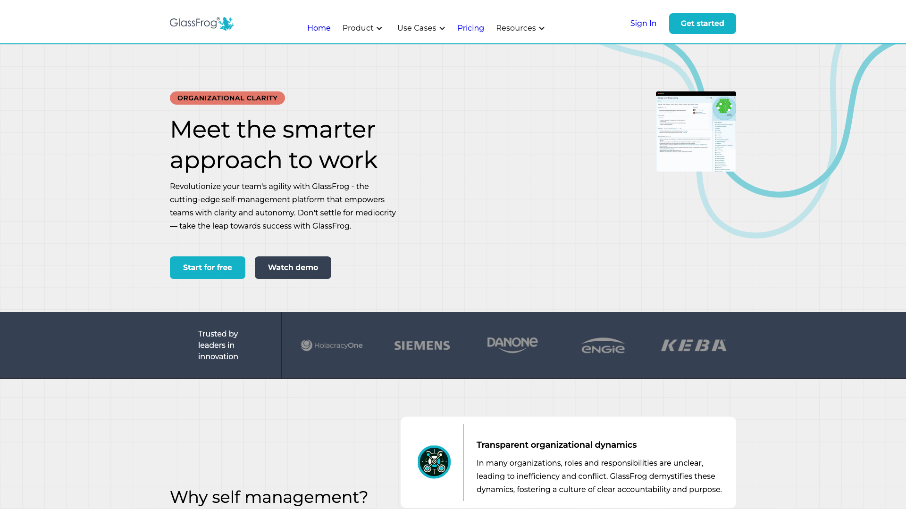
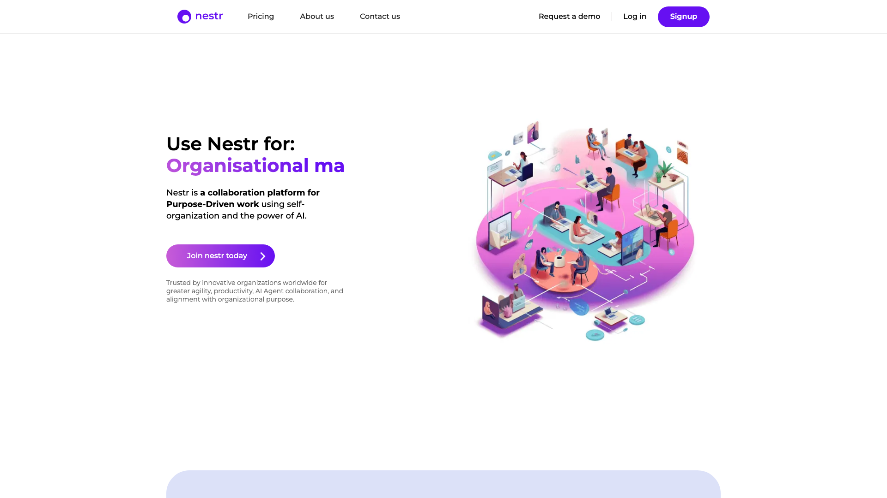
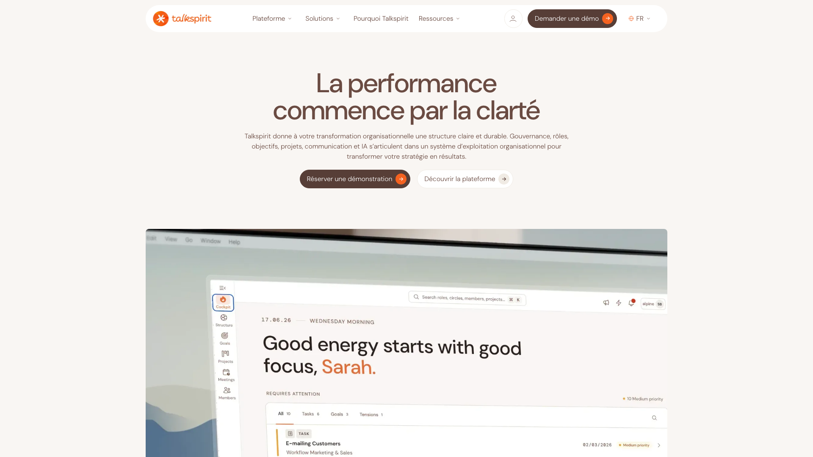
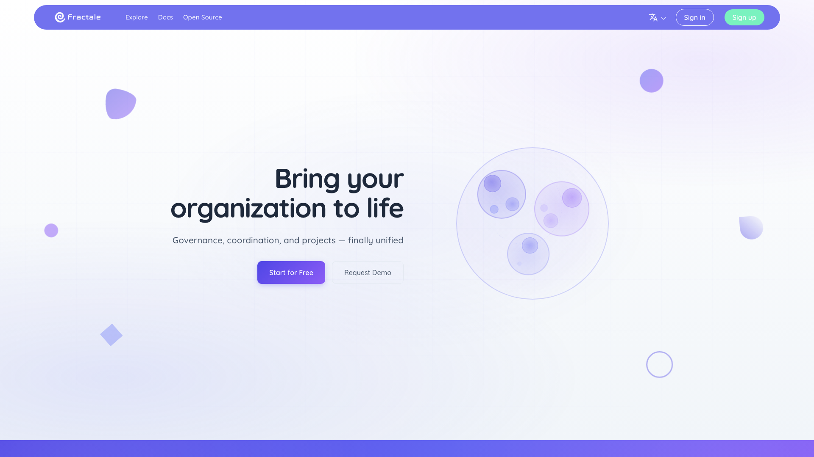
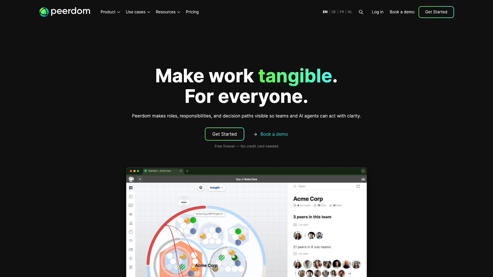
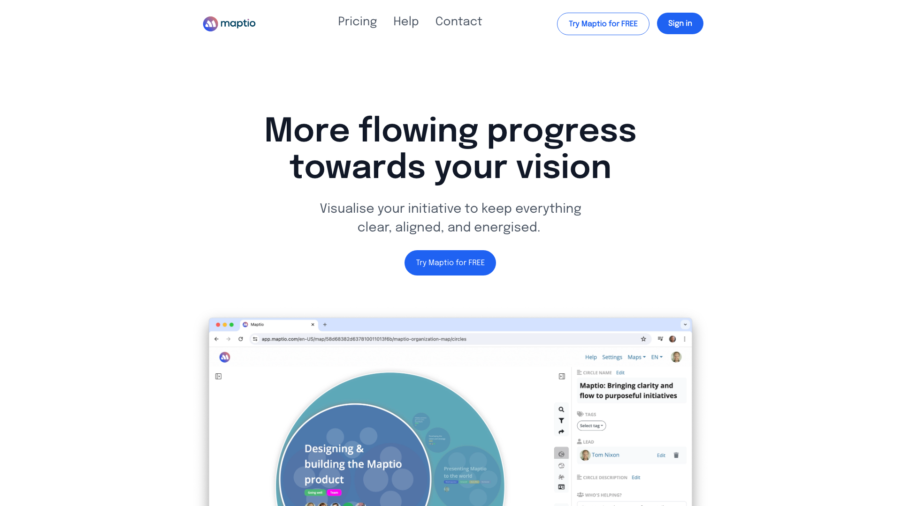
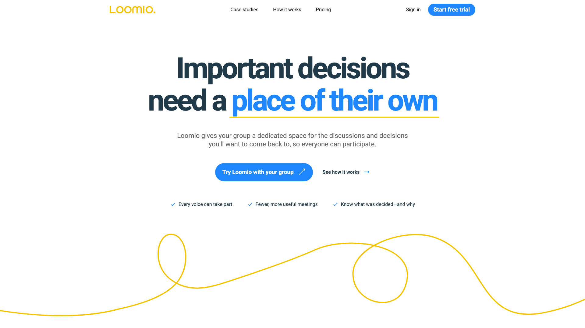

Un logiciel d’autogestion donne à une équipe sans ligne hiérarchique trois choses : un registre de qui tient quel rôle, une façon de faire évoluer ces rôles ensemble, et une trace des décisions. Huit outils font ce travail sérieusement en 2026. Ils se répartissent en trois groupes. Les plateformes de gouvernance complètes couvrent ces trois besoins. Les outils de cartographie montrent qui tient quel rôle et vous laissent gérer les changements. Un outil de décision organise et garde les décisions sans gérer de rôles.

Rolebase publie cet article et fait partie des huit. Il arrive en tête du groupe des plateformes de gouvernance complètes, devant GlassFrog, parce qu’il convient à plus d’une méthode. Chaque fiche renvoie vers le site de l’éditeur pour que vous puissiez vérifier chaque affirmation à la source.

Les tarifs viennent de la page de prix de chaque éditeur, relevée le 24 septembre 2026. Quand un éditeur ne publie aucun prix, la fiche le dit. Les notes viennent de Capterra, avec le nombre d’avis à côté du score. Quatre de ces huit outils y ont moins de 30 avis, Rolebase compris, alors regardez le nombre d’avis avant la note. Deux n’ont pas de fiche Capterra du tout.

## Comment ce classement est construit

Les groupes dépendent de la part du cycle de gouvernance qui se déroule dans l’outil. Ce cycle a trois parties : la structure (les rôles, les cercles, leur raison d’être et leurs redevabilités), le processus qui la modifie (une réunion de gouvernance, une proposition, un vote par consentement), et la trace de ce qui a été décidé.

- Les plateformes de gouvernance complètes couvrent les trois. Une modification de rôle passe par le processus de l’outil, puis met à jour la structure.
- Les outils de cartographie couvrent la structure. Les personnes qui ont les droits la modifient après avoir décidé du changement dans une réunion tenue hors de l’outil.
- Les outils de décision couvrent le processus et la trace. Ils ne gèrent aucune liste de rôles, donc ils enregistrent ce qui a été convenu sans modifier aucun rôle.

Dans le premier groupe, trois questions fixent l’ordre, posées l’une après l’autre :

- L’outil fait-il tourner tout le cycle, réunions et votes compris ? Fractale fait passer les changements par des tensions écrites et annonce le vote pour plus tard, il arrive donc dernier du groupe.
- Pouvez-vous pratiquer la gouvernance et lire le prix avant de parler à un commercial ? Rolebase et GlassFrog mettent la gouvernance dans une offre gratuite sans limite de durée, Nestr publie son tarif et propose un essai, et Talkspirit ne publie ni offre gratuite ni tarif, il faut donc commencer par une démo.
- L’outil convient-il à plus d’une méthode ? Cette question départage Rolebase et GlassFrog. Rolebase s’adapte à plusieurs méthodes alors que GlassFrog suit la seule holacratie, donc Rolebase passe devant, même si l’offre gratuite de GlassFrog couvre deux fois plus d’utilisateurs.

Dans le deuxième groupe, l’ordre dépend de ce que l’outil fait autour de la carte.

Le tableau et chaque fiche indiquent aussi le coût d’entrée réel avec ses minimums de sièges et ses modules payants, la licence et la possibilité d’héberger l’outil vous-même, et la note Capterra avec la taille de son échantillon.

Les fiches sont numérotées de 1 à 8 d’un groupe à l’autre. Comparez les rangs à l’intérieur d’un même groupe seulement, puisque chaque groupe répond à un besoin différent. Une association de 12 personnes qui décide en réunion mensuelle et veut seulement que chacun voie qui tient quoi peut s’arrêter au deuxième groupe et ne payer presque rien.

## Le comparatif

| Outil | Ce qui se passe dans l’outil | Méthode visée | Offre gratuite | Prix d’entrée | Open source | Capterra |
| --- | --- | --- | --- | --- | --- | --- |
| Rolebase | Rôles, réunions, propositions, décisions, tâches | Toute méthode, trois modes de gouvernance | Toutes les fonctionnalités, 5 membres actifs | 5 €/utilisateur/mois | MIT | 5,0 (16) |
| GlassFrog | Cercles, rôles, politiques, réunions de gouvernance et tactiques | Holacratie | 10 utilisateurs | 7 $/utilisateur/mois | Non | 4,3 (60) |
| Nestr | Rôles, propositions de gouvernance, réunions, agents IA dans des rôles | Holacratie, sociocratie, sur mesure | Pas de gouvernance dans l’offre gratuite | 6 $/utilisateur/mois à l’année | Non | 5,0 (2) |
| Talkspirit | Gouvernance, réunions, intranet, messagerie, OKR | Holacratie, Sociocratie 3.0 | Non publiée | Sur devis | Non | 4,6 (122), fiche Holaspirit |
| Fractale | Cercles, rôles, mandats, tensions, projets | Plusieurs, inspiré de l’holacratie | Inscription gratuite, aucune offre payante publiée | Non publié | AGPL-3.0 | Pas de fiche |
| Peerdom | Carte des rôles, brouillons, élections, feedback, OKR | Toute méthode | 10 membres | 5 CHF/personne/mois, 10 minimum | Non | 4,8 (8) |
| Maptio | Carte de qui a pris la responsabilité de quoi | Principes de la source | Essai de 30 jours, gratuit auto-hébergé | 10 $/mois par organisation, prix libre | AGPL-3.0 | Pas de fiche |
| Loomio | Discussions, propositions, consentement, élections | Sociocratie, consensus | Essai de 14 jours | 399 $/an pour un groupe de 30 | AGPL-3.0 | 4,8 (26) |

## Premier groupe : les plateformes de gouvernance complètes

Ces cinq outils couvrent la structure et le processus qui la modifie. Quand les membres créent, amendent ou suppriment un rôle par une proposition ou en réunion de gouvernance, l’outil enregistre la modification avec sa date.

Ils diffèrent par la méthode visée et par ce que vous pouvez voir avant de payer. GlassFrog suit la constitution holacratique à la lettre, alors que les quatre autres s’adaptent à plusieurs méthodes. Talkspirit ajoute tout un intranet autour de la gouvernance. Fractale fait tout passer par des tensions, avec un vote encore à venir.

### 1. Rolebase

Dans [Rolebase](/fr/features), un rôle porte une raison d’être, un domaine, des redevabilités et des indicateurs. Les rôles s’imbriquent en cercles, une personne en tient autant qu’il lui en faut, et l’organigramme les affiche en cercles imbriqués, en arbre hiérarchique ou en trombinoscope. Le code est publié sous licence MIT, donc vous pouvez héberger le produit sur vos propres serveurs.

Rolebase se distingue en laissant chaque organisation choisir sa méthode et le degré de formalisme de sa gouvernance. À la création, des configurations prêtes à l’emploi pour l’holacratie (versions 4 et 5 de sa constitution) et pour la sociocratie installent les rôles de base et les modèles de réunion que chaque méthode prévoit. L’organisation choisit ensuite l’un des [trois modes de gouvernance](/fr/docs/governance-modes). En mode Libre, chaque membre modifie l’organigramme. En mode Agile, le responsable de chaque rôle modifie ce rôle. En mode Strict, toute modification de la structure passe par une [proposition](/fr/docs/proposals). Dans une proposition, les membres préparent les changements d’organigramme dans un éditeur dédié, puis votent la proposition par consentement, à l’unanimité, à la majorité simple ou à la majorité absolue. Les changements ne s’appliquent à l’organigramme qu’une fois la proposition adoptée. Les réunions suivent les étapes de modèles réutilisables et se terminent par un résumé généré. Les décisions, les tâches et les discussions avec sondages restent rattachées au rôle qu’elles concernent. Un historique garde chaque modification avec la possibilité de l’annuler.

Deux cas clients publics montrent comment il s’utilise. [Lonestone](/fr/client-cases/lonestone), le studio produit de 35 personnes où Rolebase a d’abord été construit, a remplacé ses tables Notion par des rôles qu’un nouvel arrivant lit dès sa première semaine. La coopérative [Scop EVEA](/fr/client-cases/scop-evea) réunit sur un seul organigramme ses 140 personnes réparties entre Nantes, Lyon et Troyes. Capterra note Rolebase 5,0 sur 16 avis, et lui a décerné les distinctions Best Value et Best Ease of Use en 2023.

Rolebase se concentre sur les rôles, les réunions, les propositions et les décisions. Il n’a ni module d’OKR, ni fonction d’élection, ni feedback entre pairs, ni intégration Slack, ni authentification unique, mais une API GraphQL couvre les intégrations sur mesure et les réunions se synchronisent avec Google Agenda, Outlook ou tout flux iCal. Toutes les offres incluent tout ce que fait Rolebase, sans module payant. L’offre gratuite couvre 5 membres actifs, deux fois moins que celle de GlassFrog, avec toutes les fonctionnalités, propositions et modèles de réunion compris. Les personnes sans compte apparaissent gratuitement dans l’organigramme, si bien que cinq titulaires de compte peuvent cartographier une organisation entière. Au-delà, [l’offre Startup](/fr/pricing) coûte 5 € par utilisateur actif et par mois, avec une heure d’accompagnement par mois.

### 2. GlassFrog

[GlassFrog](https://www.glassfrog.com) vient de HolacracyOne, l’entreprise qui a écrit la constitution holacratique. Le site officiel de l’holacratie le présente comme le seul logiciel de la méthode. Le produit applique cette constitution : cercles, rôles, politiques, rôles de liaison, boîte à tensions, et réunions de gouvernance et tactiques menées comme la méthode le prévoit. Il revendique plus d’un millier d’organisations, dont Siemens, Danone, Engie et ABN AMRO.

Son offre gratuite n’a pas de limite de durée et accepte le plus d’utilisateurs parmi les outils du groupe qui vendent aussi une offre payante. Elle couvre 10 utilisateurs avec des cercles, des rôles et des politiques en nombre illimité, les deux types de réunion, les projets et les actions, et un accès à l’API limité à 50 appels par heure. Premium coûte 7 $ par utilisateur et par mois et ajoute les réunions personnalisées, le téléchargement complet des données, le SAML et les intégrations Slack, Asana et Jira. Deux modules restent en dehors de ce prix, à 1,50 $ par utilisateur et par mois chacun : Goals and Targets pour les OKR, et FrogBot, un assistant IA qui transforme une tension en proposition de gouvernance et la confronte à vos propres politiques. Les conditions Entreprise commencent à 500 utilisateurs.

GlassFrog convient à une équipe qui pratique l’holacratie à la lettre, puisque l’outil en applique déjà les règles. Une équipe qui pratique la sociocratie ou son propre mélange doit d’abord apprendre le vocabulaire holacratique. Capterra note GlassFrog 4,3 sur 60 avis. Une nouvelle version de son API est passée en bêta publique en mai 2026.

### 3. Nestr

[Nestr](https://nestr.io) a été fondé aux Pays-Bas en 2018 et héberge ses données en Allemagne. Il prend en charge l’holacratie, la sociocratie, les pratiques opales et une gouvernance sur mesure. Nestr mise aujourd’hui sur l’intelligence artificielle : un agent IA peut tenir un rôle dans la structure et participer au travail via MCP, et un assistant ébauche une première structure à partir de votre site web.

L’offre Starter inclut toute la gouvernance : cercles et rôles, tensions, propositions de gouvernance, réunions tactiques et de gouvernance, historique rejouable des changements de gouvernance, journal d’audit et indicateurs. Plus de vingt connecteurs relient Nestr à d’autres outils. Il importe une structure existante depuis Holaspirit, GlassFrog, Peerdom ou un fichier CSV. L’offre Pro ajoute les OKR, le feedback entre pairs, le provisionnement SCIM et le SAML.

Starter coûte 6 $ par utilisateur et par mois en facturation annuelle, et Pro 10 $. Les prix s’affichent en euros dans certaines régions. L’offre gratuite Personal couvre la productivité personnelle pour 5 personnes au plus et n’inclut aucune gouvernance, donc pour la tester il faut passer par l’essai de 17 jours ou par une offre payante. Les associations peuvent demander un tarif réduit. Capterra affiche 5,0 sur 2 avis.

### 4. Talkspirit (anciennement Holaspirit)

[Talkspirit](https://www.talkspirit.com) est une plateforme collaborative française créée en 2004. Elle a fusionné avec Holaspirit en 2023 et vend aujourd’hui un seul produit, qu’elle appelle un système d’exploitation organisationnel européen : gouvernance, réunions, projets, OKR, fil d’actualité, messagerie, documents et assistant IA, dans un même abonnement. Elle revendique plus de 900 organisations et 150 000 utilisateurs dans 27 pays, héberge ses données en France et en Suisse, et détient la certification ISO 27001.

Le modèle de gouvernance est celui qu’Holaspirit a construit depuis 2016. Les cercles et les rôles ont une raison d’être, des redevabilités, des domaines et des politiques. Les réunions enchaînent tour d’inclusion, ordre du jour et tour de clôture, sur des modèles que l’éditeur tire de l’holacratie et de la Sociocratie 3.0. Les propositions, les objections et les élections se gèrent dans le produit. Talkspirit est le seul outil de cette liste à vendre gouvernance et intranet ensemble, ce qui convient aux organisations qui veulent remplacer leur intranet en même temps.

La plateforme Holaspirit actuelle ferme le 16 octobre 2026. Ses clients migrent depuis l’administration d’Holaspirit, par un bouton qui transfère la structure et l’historique. L’éditeur indique que l’abonnement se poursuit avec la même durée, le même prix et le même périmètre. Talkspirit ne publie aucun tarif, il faut donc une démo pour obtenir un chiffre. Capterra note la fiche Holaspirit 4,6 sur 122 avis, le plus gros échantillon de cet article.

### 5. Fractale

[Fractale](https://fractale.co) est une plateforme open source publiée sous AGPL-3.0, avec son code sur GitHub et des commits en septembre 2026. Elle s’inspire de l’holacratie, de la sociocratie et des organisations opales, et de la façon dont les développeurs travaillent ensemble sur GitHub. Elle revendique plus de 500 organisations et cite parmi elles de petits studios, des collectifs et un festival.

Chaque cercle et chaque rôle porte un mandat qui fixe sa raison d’être, son périmètre et ce qu’il peut décider seul. Les membres ouvrent des tensions, des fils structurés envoyés aux bonnes personnes. Une tension peut ensuite aboutir à une modification de mandat ou de structure. Ce qu’un membre voit et modifie dépend des rôles qu’il tient. Un journal garde chaque modification. Des tableaux kanban et des projets rattachent le travail aux cercles et aux rôles.

Fractale est gratuite à l’inscription et ne publie aucune offre payante. Le vote par consentement, un agenda partagé et plusieurs intégrations sont annoncés pour plus tard. La documentation présente encore la plateforme comme une bêta. Pour l’héberger vous-même, il faut faire tourner Dgraph et Redis.

## Deuxième groupe : les outils de cartographie

Ces deux outils montrent clairement la structure et laissent les personnes qui ont les droits la modifier. Vous décidez du changement dans une réunion prévue dans votre agenda ou votre outil de visio, si bien que l’outil de cartographie garde le résultat sans la proposition qui y a mené.

### 6. Peerdom

[Peerdom](https://peerdom.com) est né en 2017 à Wabern, près de Berne, au sein de l’agence de design Nothing, puis est devenu une société suisse indépendante fin 2021. Il affiche les logos de Bayer, Greenpeace, Médecins sans Frontières, l’armée suisse et la Mobilière. Il se dit indépendant de toute méthode.

Sa carte est la plus souple de cet article, avec des vues en cercles, en arbre, en pyramide et en 3D, et un vocabulaire que vous pouvez adapter. Peerdom ajoute douze applications optionnelles à la carte. Avec les brouillons, vous préparez une réorganisation à côté de la structure en place et vous comparez les deux. Avec la contribution, vous attribuez une part de temps à chaque rôle. Les élections, le feedback entre pairs, les objectifs, les projets et les analyses sont aussi proposés. La synchronisation d’annuaire avec Microsoft Entra ID, Google Workspace et Okta tient la liste des personnes à jour. Une API GraphQL, des webhooks, Zapier et n8n couvrent les intégrations. Les données restent en Suisse.

Peerdom est gratuit jusqu’à 10 membres. Peerdom+ coûte 5 CHF par personne et par mois en facturation annuelle, avec un minimum de 10 membres. Chaque application ajoute 1 CHF par personne et par mois. L’offre Pro est sur devis. Peerdom n’a pas de module de réunion. Capterra le note 4,8 sur 8 avis.

### 7. Maptio

[Maptio](https://maptio.com) a été créé par Tom Nixon, auteur et coach britannique qui travaille sur le principe de la source formulé par le consultant Peter Koenig. Il cartographie en cercles imbriqués des initiatives plutôt que des postes : qui a pris la responsabilité de quoi, chaque initiative avec son responsable et les personnes qui l’aident.

Maptio se limite à cette carte. Vous construisez la carte, vous l’étiquetez et la filtrez, et vous la partagez en public ou en privé. Les réunions, les décisions et les tâches restent dans d’autres outils. Le code est ouvert sous AGPL-3.0 et peut s’héberger gratuitement, même si le dernier commit du dépôt public date de décembre 2025.

La version hébergée fonctionne à prix libre par organisation, avec un minimum suggéré de 10 $ par mois et une fourchette recommandée de 50 à 200 $ pour 300 personnes au plus. Un essai de 30 jours vient d’abord. Maptio n’a pas de fiche Capterra.

## Troisième groupe : l’outil de décision

### 8. Loomio

[Loomio](https://www.loomio.com) est développé depuis 2011 par une coopérative de travailleurs d’Aotearoa Nouvelle-Zélande. Son code est ouvert sous AGPL-3.0, avec des commits la semaine où cet article a été écrit. Il gère les décisions asynchrones mieux que tous les autres outils de cette liste.

Une discussion mène à une proposition, à laquelle le groupe répond par consentement, par consensus, par un vote ou par un sondage d’opinion. Les élections sans candidat suivent le processus sociocratique. Des sous-groupes peuvent représenter des cercles liés. Loomio envoie aussi ses notifications dans Slack et Microsoft Teams. Il ne contient ni définition de rôle ni organigramme, donc il enregistre ce qui a été convenu et laisse votre structure telle quelle.

Loomio facture par organisation plutôt qu’au siège. Starter coûte 399 $ par an, ou 39 $ par mois, pour un groupe de 30 membres au plus, et Pro 999 $ par an pour 3 000 membres au plus. Les associations paient 299 $ ou 499 $ par an. Loomio n’a pas d’offre gratuite, seulement un essai de 14 jours pour 10 personnes au plus. Capterra le note 4,8 sur 26 avis.

## Également étudiés

[teamdecoder](https://www.teamdecoder.com), basé à Karlsruhe, cartographie les rôles et la charge de travail d’équipes qui incluent des agents IA. Beiersdorf et GLS l’utilisent. Il ne publie aucun tarif et relève plus de la conception d’équipe que de la gouvernance. [logbuch.org](https://www.logbuch.org), basé à Winterthour, enregistre les cercles, les rôles et les décisions sociocratiques et reste gratuit jusqu’à 10 membres, avec peu d’activité visible depuis 2022. Certains groupes sociocratiques dessinent leurs cercles sous forme de cartes de relations dans [Kumu](https://kumu.io), où les projets publics sont gratuits et un projet privé coûte 9 $ par mois. [Decidim](https://decidim.org), basé à Barcelone, est conçu pour la démocratie participative des villes et des grandes assemblées plutôt que pour les rôles d’une équipe.

## Comment choisir

Cinq questions réduisent la liste plus vite qu’un tableau de fonctionnalités.

### Quelle méthode pratiquez-vous ?

Une équipe qui pratique l’holacratie à la lettre tirera le meilleur parti de GlassFrog, construit par les auteurs de la méthode. Une équipe qui décide par consentement à la manière sociocratique peut voter par consentement dans les propositions de Rolebase, dans les propositions de gouvernance de Nestr ou dans Loomio. Les élections fonctionnent différemment d’un outil à l’autre. Loomio, Peerdom et Talkspirit font tourner l’élection elle-même dans le produit, alors que dans Rolebase l’élection se tient comme un tour de table en réunion et son résultat s’enregistre comme une décision. Une équipe qui a son propre mélange de pratiques a besoin d’un outil où elle fixe les règles : Rolebase avec ses trois modes de gouvernance, Nestr et Peerdom avec leur gouvernance sur mesure. Si vous hésitez encore sur la méthode, regardez ce qui [distingue l’holacratie de la sociocratie](/fr/blog/holacracy-vs-sociocracy) avant de choisir le logiciel.

### Utilisez-vous Holaspirit aujourd’hui ?

Vous avez jusqu’au 16 octobre 2026. Talkspirit reprend votre structure, votre historique et les conditions de votre contrat, et ajoute un intranet dont vous aurez besoin ou non. Rolebase importe les rôles et les membres depuis un [export Holaspirit](/fr/docs/import). Nestr importe aussi les structures Holaspirit. Exportez vos données avant la date de fermeture, quel que soit votre choix. Nous avons comparé [les alternatives à Holaspirit](/fr/blog/alternative-holaspirit) plus en détail dans un article dédié.

### Les réunions doivent-elles se tenir dans l’outil ?

Si vos réunions de gouvernance se tiennent dans une salle avec un facilitateur et un document partagé, un outil de cartographie suffit. Peerdom ou Maptio montreront à chacun qui tient quoi. Si vous voulez que l’ordre du jour, les propositions et les décisions modifient directement les rôles, il vous faut le premier groupe. Si votre besoin porte sur les réunions en dehors de la gouvernance, regardez plutôt les [logiciels de gestion de réunion](/fr/blog/best-meeting-management-software).

### Combien paierez-vous pour votre équipe ?

Pour une équipe de 20 personnes, Rolebase coûte 100 € par mois et Nestr Starter 120 $ en facturation annuelle. GlassFrog coûte 140 $ par mois avant ses modules, et Peerdom+ 100 CHF avant ses applications. Loomio coûte 39 $ par mois pour un groupe de 30 personnes au plus. Maptio vous laisse choisir le prix pour toute l’organisation, de 10 $ suggérés à une fourchette recommandée de 50 à 200 $. Talkspirit ne donne un prix qu’après une démo. Chaque éditeur facture dans sa propre devise, donc le taux de change peut inverser l’ordre de deux montants proches. Deux offres fixent une limite : Peerdom facture au moins 10 membres, et l’offre Starter de Loomio couvre un seul groupe.

### Pouvez-vous repartir avec vos données ?

Rolebase, Maptio, Fractale et Loomio publient leur code, vous pouvez donc les héberger vous-même si l’éditeur change de cap. Les licences diffèrent. La licence MIT permet de modifier et de faire tourner le code à condition de conserver sa mention de copyright, alors que l’AGPL-3.0 vous demande de publier vos modifications si vous proposez une version modifiée à des utilisateurs sur un réseau. Pour les quatre autres, demandez les formats d’export pendant l’essai ou la démo.

Si vous utilisez déjà Trello, Slack, Miro ou Confluence, vous pouvez les garder [à côté d’un outil de gouvernance](/fr/blog/horizontal-tools). Nous avons aussi comparé Rolebase à [GlassFrog](/fr/blog/alternative-glassfrog), [Peerdom](/fr/blog/alternative-peerdom), [Nestr](/fr/blog/alternative-nestr) et [Loomio](/fr/blog/alternative-loomio), un outil à la fois.

## Questions fréquentes

<FaqList>

<FaqItem question="Qu’est-ce qu’un logiciel d’autogestion ?">

Un logiciel d’autogestion enregistre qui tient quel rôle dans une organisation sans ligne hiérarchique, donne à l’équipe une façon partagée de faire évoluer ces rôles et garde une trace des décisions. Il couvre en général des rôles avec une raison d’être et des redevabilités, des cercles qui regroupent ces rôles, et des réunions de gouvernance ou des propositions.

Il se distingue d’un organigramme RH, qui montre des postes et des managers, et d’un outil de gestion de projet, qui suit des tâches sans dire qui a l’autorité de décider.

</FaqItem>

<FaqItem question="Quel logiciel utiliser pour l’holacratie ?">

GlassFrog est l’outil construit par HolacracyOne, l’entreprise qui a écrit la constitution holacratique. Le site officiel de l’holacratie le présente comme le logiciel de la méthode. Son offre gratuite couvre 10 utilisateurs avec les réunions de gouvernance et tactiques.

Nestr, Talkspirit et Rolebase font aussi tourner une gouvernance de type holacratique. Rolebase le fait avec son mode Strict, où toute modification de la structure passe par une proposition.

</FaqItem>

<FaqItem question="Quels outils gèrent la sociocratie et la décision par consentement ?">

Loomio gère les propositions par consentement et les élections sans candidat à la manière sociocratique, sans structure de rôles. Rolebase permet à un groupe de voter une proposition par consentement, adoptée tant que personne ne fait objection, et applique les changements d’organigramme préparés une fois la proposition adoptée. Nestr gère une gouvernance sociocratique avec ses propositions de gouvernance. Loomio, Talkspirit et Peerdom font tourner les élections dans le produit, alors que dans Rolebase l’équipe tient l’élection comme un tour de table en réunion et enregistre le résultat comme une décision.

</FaqItem>

<FaqItem question="Existe-t-il un logiciel d’autogestion gratuit ?">

Trois outils permettent de pratiquer la gouvernance gratuitement et sans limite de durée. GlassFrog couvre 10 utilisateurs, réunions comprises. Rolebase couvre 5 membres actifs avec toutes les fonctionnalités. Les personnes qui n’ont pas besoin de compte apparaissent gratuitement dans son organigramme. Fractale est gratuite à l’inscription dans sa version hébergée et ne publie aucune offre payante. L’offre gratuite de Peerdom couvre 10 membres pour la carte, sans réunions.

Rolebase, Maptio, Fractale et Loomio sont aussi gratuits si vous les hébergez vous-même. En version hébergée, l’offre gratuite de Nestr exclut la gouvernance et Loomio propose seulement un essai de 14 jours.

</FaqItem>

<FaqItem question="Existe-t-il un logiciel d’autogestion open source ?">

Quatre des huit sont open source. Rolebase est publié sous licence MIT. Maptio, Fractale et Loomio sont publiés sous AGPL-3.0. Rolebase et Loomio sont les plus complets des quatre, Rolebase pour les rôles et les réunions, Loomio pour les décisions. Maptio se concentre sur la carte, et Fractale sur les tensions et les projets.

</FaqItem>

<FaqItem question="Que devient Holaspirit en 2026 ?">

La plateforme Holaspirit ferme le 16 octobre 2026. Les clients passent sur Talkspirit par un bouton de migration dans l’administration d’Holaspirit, avec leur structure et leur historique. Talkspirit indique que l’abonnement se poursuit au même prix, pour la même durée et le même périmètre.

Les clients qui préfèrent un autre outil doivent exporter leurs données avant cette date. Rolebase et Nestr importent tous deux les structures Holaspirit.

</FaqItem>

<FaqItem question="Faut-il un logiciel pour pratiquer l’holacratie ou la sociocratie ?">

Vous pouvez commencer sans logiciel. Une équipe de huit personnes peut tenir ses rôles dans un document partagé et ses décisions dans des comptes rendus. Le logiciel devient rentable quand des personnes tiennent plusieurs rôles dans plusieurs cercles, quand un nouvel arrivant doit trouver qui décide quoi sans faire le tour des bureaux, et quand il faut retrouver les décisions de l’an dernier.

</FaqItem>

<FaqItem question="Notion ou Asana peuvent-ils remplacer un logiciel d’autogestion ?">

Beaucoup d’équipes commencent par eux, puisqu’ils peuvent stocker les rôles et suivre les tâches. Il leur manque un processus pour modifier un rôle, un vote par consentement et un lien entre une décision et la structure qu’elle modifie, si bien que les rôles qui y sont écrits ne correspondent plus aux décisions prises en réunion à mesure que l’équipe grandit. Lonestone, un studio de 35 personnes, a sorti ses rôles des tables Notion pour cette raison.

</FaqItem>

</FaqList>

## Par où commencer

Choisissez le groupe avant l’outil. Si vous avez seulement besoin que chacun voie qui tient quoi, Peerdom ou Maptio le feront pour peu d’argent, voire gratuitement. Si vous décidez surtout par écrit et en asynchrone, Loomio est le spécialiste. Si vous voulez qu’une décision prise en réunion mette directement à jour les rôles, regardez le premier groupe. GlassFrog et Rolebase vous laissent essayer ce fonctionnement gratuitement, sans rendez-vous commercial.

Rolebase est [gratuit pour 5 membres actifs](/fr/pricing) avec toutes les fonctionnalités, alors que le reste de l’équipe apparaît dans l’organigramme sans frais. C’est assez pour cartographier vos rôles, tenir quelques réunions de gouvernance et faire adopter une première proposition par consentement avant que quiconque paie. Vous pouvez [voir toutes les fonctionnalités](/fr/features) avant de vous inscrire.

<OrgListJsonLd
  name="Logiciel de gouvernance partagée : 8 outils comparés en 2026"
  description="Huit logiciels d’autogestion comparés en trois groupes : plateformes de gouvernance complètes, outils de cartographie et outils de décision."
  items={[
    { name: 'Rolebase', url: 'https://rolebase.io' },
    { name: 'GlassFrog', url: 'https://www.glassfrog.com' },
    { name: 'Nestr', url: 'https://nestr.io' },
    { name: 'Talkspirit', url: 'https://www.talkspirit.com' },
    { name: 'Fractale', url: 'https://fractale.co' },
    { name: 'Peerdom', url: 'https://peerdom.com' },
    { name: 'Maptio', url: 'https://maptio.com' },
    { name: 'Loomio', url: 'https://www.loomio.com' },
  ]}
/>
