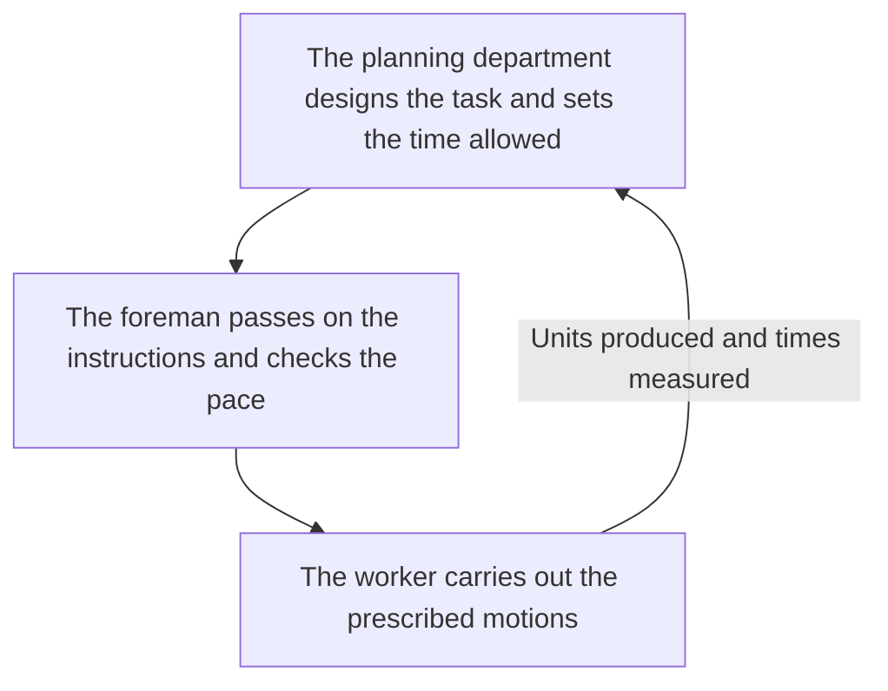
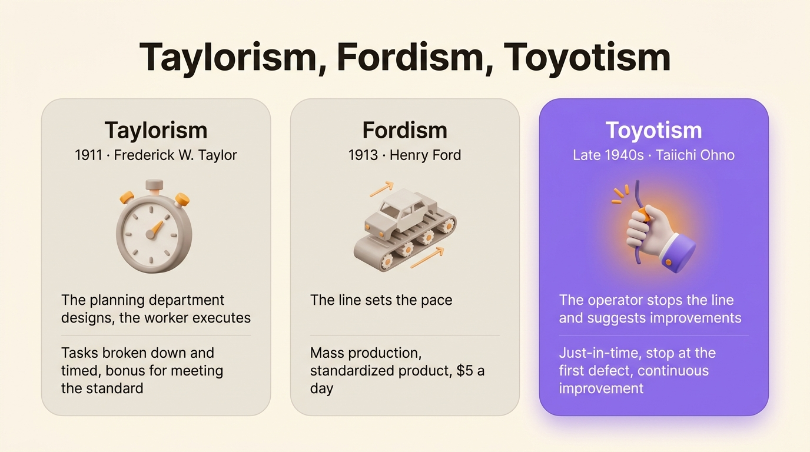

Taylorism is a method of organizing work designed by the American engineer Frederick Winslow Taylor and published in 1911. It breaks work down into elementary tasks, times each one and hands their design to specialists, so the worker only carries out the motions he is told to make.

It is also called scientific management. The adjective "Taylorist" describes a job, a factory or a management style that follows this logic: prescribed motions, a measured pace, and decisions made far from where the work happens.

## Taylor and scientific management

Taylor (1856-1915) joined the Midvale Steel Company, a Philadelphia steelworks, in 1878 and rose to shop foreman. He saw that workers set their own pace and deliberately held it down, which he called "systematic soldiering." In the early 1880s he began timing each motion with a stopwatch to work out how long a task should take.

His best-known example comes from Bethlehem Steel in 1898. A laborer he calls Schmidt went from loading 12.5 to 47 tons of pig iron a day once the method set his motions, his rest breaks and his loads. His pay rose from $1.15 to $1.85 a day. Taylor gathered his work in 1911 in *The Principles of Scientific Management*.

## The four principles of Taylorism

Taylor sets out four principles in his book:

1. Study each task scientifically instead of by rule of thumb: break it down, measure it and keep the best way of doing it, the famous "one best way."
2. Pick the worker to fit the task, then train him in the chosen method instead of leaving him to learn on the job.
3. Have management and workers cooperate so the work follows the method, with a bonus for anyone who meets the standard.
4. Divide the work between management and workers: management takes over the preparation and planning that workers used to do themselves.

The fourth principle had the largest consequences. Taylor states it plainly in his introduction: in the past the man came first, whereas in the future the system must come first.

## The legacy of Taylorism in organizations

More than a century later, three work habits come straight from Taylor:

- Taylor split designing work from doing it. That split lives on today between a leadership team that sets the strategy and the teams that apply it.
- Taylor gave the hierarchical org chart its doctrine. American railroads were already drawing org charts in the 1850s. Taylor added a layer of managers in charge of planning and checking other people's work.
- The job description comes from the instruction cards the planning department handed each worker every day. It describes a position by its tasks before anyone is hired to fill it.

You also find Taylor's logic in piece-rate pay and in productivity metrics that count units produced per hour.

## The limits of Taylorism

Workers pushed back early. In 1911, the molders at the Watertown Arsenal in Massachusetts went on strike against the stopwatch. A House of Representatives committee then investigated the method. In 1915, Congress eventually banned stopwatch time studies in army arsenals. In France, workers at the Renault plants in Billancourt struck against time studies in late 1912 and again in early 1913. In 1936, the filmmaker Charlie Chaplin mocked Taylorized work in *Modern Times*.

The criticism comes down to three points:

- The work loses its meaning. A worker repeating the same motion all day wears out in a trade reduced to that motion.
- Information travels up badly. The person who spots the defect first is the one doing the work, yet the method gives that person no way to act on it.
- The method assumes a stable product. The "best way," worked out once and for all, stops being the best as soon as demand or the product changes.

In the 1970s, absenteeism, turnover and strikes by assembly-line workers rose across industry. These years have been known ever since as the crisis of Taylorism.

## From Taylorism to Fordism and Toyotism

Henry Ford, the founder of Ford Motor Company, applied Taylor's principles to the moving assembly line he installed in 1913 at his Highland Park plant near Detroit. Fordism adds two things to Taylorism: the line, which sets the pace, and the mass production of a standardized product. In 1914, Ford doubled pay to $5 a day to hold on to workers who were quitting in droves.

The Toyota Production System, built from the late 1940s onward under the engineer Taiichi Ohno, leaves decisions on the shop floor instead. On a Toyota line, any operator can stop production as soon as they see a defect. The people doing the work also come up with the improvements. The [Toyota Production System](/en/glossary/toyota-production-system) keeps the measuring and the hunt for [muda](/en/glossary/muda), or waste, but gives operators back part of the design work.

{/* IMAGE regen: api.py image, infographic, 1600x900. Scene: "Three side-by-side vertical cards comparing three ways of organising factory work, with a large bold title at the top whose only characters are the three words Taylorism, Fordism, Toyotism separated by commas, with no apostrophe and no quotation mark before or after. No people and no decorative scenes, only the three cards with their icons and text. Card 1, header 'Taylorism', subheader '1911 · Frederick W. Taylor', a small icon of a stopwatch, line 1 'The planning department designs, the worker executes', line 2 'Tasks broken down and timed, bonus for meeting the standard'. Card 2, header 'Fordism', subheader '1913 · Henry Ford', a small icon of a moving assembly line, line 1 'The line sets the pace', line 2 'Mass production, standardized product, $5 a day'. Card 3, header 'Toyotism', subheader 'Late 1940s · Taiichi Ohno', a small icon of a hand pulling a cord, line 1 'The operator stops the line and suggests improvements', line 2 'Just-in-time, stop at the first defect, continuous improvement'. Cards in warm grey, with the Toyotism card highlighted in purple and small orange accents on the icons. Soft rounded shapes, generous spacing." Regenerate if the dates or the descriptions in the "From Taylorism to Fordism and Toyotism" section change. Last data sync: 2026-10-07. */}

The [self-management experiments of the 1970s](/en/blog/management-movement), at Volvo or at the Lip watch factory, challenged Taylor's split more directly still. Companies later did the same in offices, with the [liberated company](/en/blog/liberated-company) and then shared governance: in a [flat organization](/en/glossary/organisation-horizontale), the people who do the work also decide how to do it.

## Taylorism today

Taylorism still exists outside the factory. You find it in a call center that imposes a script and an average handling time, in a warehouse where the handheld scanner dictates the picker's route and pace, or in a fast-food chain. All of them follow the same logic of prescribed motions and measured times.

Knowledge work fits it poorly. It has no pace and no units to count. In an office, the person who spots a problem first is usually the one furthest from the top. The question then becomes [who decides what](/en/blog/horizontal-vs-vertical) in the organization, more than the number of management layers.

An organization built on [roles](/en/glossary/role) brings back together what Taylor split apart. Each role has a purpose, accountabilities and, when needed, a domain of its own. The person holding the role does the work, decides how to do it and has the final say over that domain. In [Rolebase](/en/features), the org chart is built from these roles, so everyone can see who holds which responsibility.

## Frequently asked questions

<FaqList>

<FaqItem question="When did Taylorism start?">

Taylor began timing work in the early 1880s at the Midvale Steel Company. He published *Shop Management* in 1903 and then *The Principles of Scientific Management* in 1911, the year the method reached a wide audience. It spread to Europe in the 1910s and 1920s.

</FaqItem>

<FaqItem question="What is the main principle of Taylorism?">

Taylorism separates designing the work from doing it. Specialists study each task, break it into simple motions and set the time it should take. The worker then applies the method and earns a bonus for meeting the standard.

</FaqItem>

<FaqItem question="What is the difference between Taylorism and Fordism?">

Taylorism is a method for studying and prescribing work. Fordism applies it to the moving assembly line, which sets the pace at every station, and adds mass production and wages high enough for workers to buy what they make.

</FaqItem>

<FaqItem question="What does Taylorist mean?">

"Taylorist" describes anything that follows Taylor's principles: a Taylorist organization breaks work into repetitive tasks, measures how long each one takes and leaves decisions to management. The word is often used as a criticism of management that controls motions rather than results.

</FaqItem>

<FaqItem question="What was the crisis of Taylorism?">

The crisis of Taylorism refers to the 1970s, when industrial companies saw absenteeism, turnover, quality defects and strikes by assembly-line workers rise. The method suited the mass production of a stable product. It adapts poorly to fluctuating demand and to better-educated employees who expect more from their work than repeated motions.

</FaqItem>

</FaqList>
