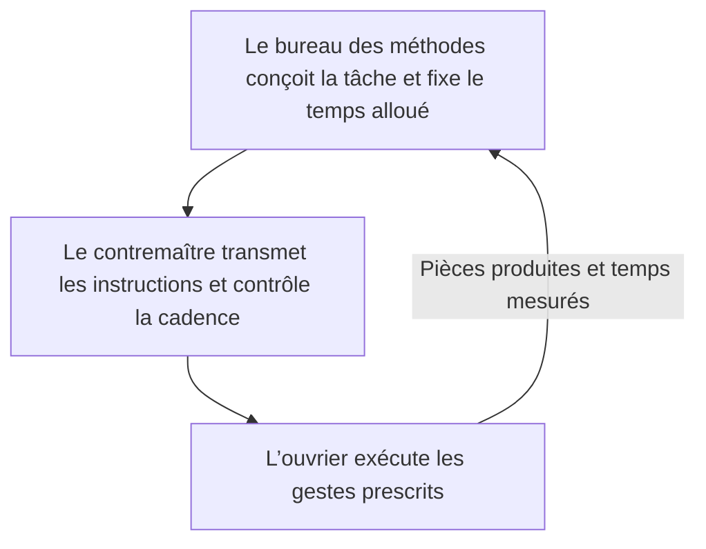
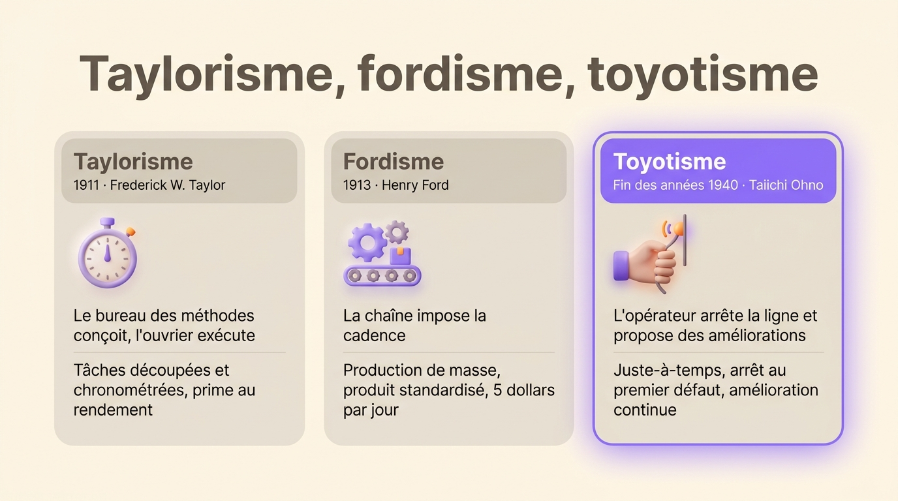

Le taylorisme est une méthode d’organisation du travail conçue par l’ingénieur américain Frederick Winslow Taylor et publiée en 1911. Elle découpe le travail en tâches élémentaires, chronomètre chacune et confie leur conception à des spécialistes, si bien que l’ouvrier se contente d’exécuter les gestes qu’on lui prescrit.

On l’appelle aussi organisation scientifique du travail (OST). L’adjectif « tayloriste » qualifie un poste, une usine ou un management qui suit cette logique : des gestes prescrits, une cadence mesurée, des décisions prises loin de l’endroit où le travail se fait.

## Taylor et l’organisation scientifique du travail

Taylor (1856-1915) entre en 1878 à la Midvale Steel Company, une aciérie de Philadelphie, où il devient chef d’atelier. Il constate que les ouvriers fixent eux-mêmes leur rythme et le freinent volontairement, ce qu’il appelle la « flânerie systématique ». Au début des années 1880, il se met à chronométrer chaque geste pour établir le temps qu’une tâche devrait prendre.

Son exemple le plus connu date de 1898, chez Bethlehem Steel. Un manutentionnaire qu’il nomme Schmidt passe de 12,5 à 47 tonnes de fonte chargées par jour, une fois ses gestes, ses pauses et ses charges fixés par la méthode. Son salaire monte de 1,15 à 1,85 dollar par jour. Taylor rassemble ses travaux en 1911 dans *The Principles of Scientific Management*.

## Les quatre principes du taylorisme

Taylor énonce quatre principes dans son livre :

1. Étudier chaque tâche scientifiquement plutôt qu’au jugé : la décomposer, la mesurer et retenir la meilleure façon de la faire, le fameux « one best way ».
2. Choisir l’ouvrier en fonction de la tâche, puis le former à la méthode retenue au lieu de le laisser apprendre seul sur le tas.
3. Faire coopérer la direction et les ouvriers pour que le travail suive la méthode, avec une prime pour qui atteint la norme.
4. Répartir le travail entre la direction et les ouvriers : la direction reprend la préparation et la planification que les ouvriers assuraient jusque-là.

Le quatrième principe a eu le plus de conséquences. Taylor l’assume dans l’introduction de son livre : « Dans le passé, l’homme passait en premier. À l’avenir, le système doit passer en premier. »

## L’héritage du taylorisme dans les organisations

Plus d’un siècle après, trois habitudes de travail viennent en droite ligne de Taylor :

- Taylor sépare la conception du travail de son exécution. On retrouve cette séparation aujourd’hui entre une direction qui décide de la stratégie et des équipes qui l’appliquent.
- Taylor a donné sa doctrine à l’organigramme hiérarchique. Les chemins de fer américains dessinaient déjà des organigrammes dans les années 1850. Taylor y a ajouté une couche de managers chargée de planifier et de contrôler le travail des autres.
- La fiche de poste vient des fiches d’instruction que le bureau des méthodes remettait chaque jour à l’ouvrier. Elle décrit un poste par ses tâches avant qu’on recrute quelqu’un pour l’occuper.

On retrouve aussi la logique de Taylor dans le salaire au rendement et dans les indicateurs de productivité qui comptent les unités produites par heure.

## Les limites du taylorisme

Les ouvriers ont résisté très tôt. En 1911, les mouleurs de l’arsenal de Watertown, dans le Massachusetts, se mettent en grève contre le chronomètre. Une commission de la Chambre des représentants enquête alors sur la méthode. Le Congrès finit par interdire le chronométrage dans les arsenaux de l’armée en 1915. En France, les ouvriers des usines Renault de Billancourt font grève contre le chronométrage à la fin de 1912 puis au début de 1913. En 1936, le cinéaste Charlie Chaplin se moque du travail taylorisé dans *Les Temps modernes*.

Les critiques portent sur trois points :

- Le travail perd son sens. Un ouvrier qui répète le même geste toute la journée s’épuise dans un métier réduit à ce geste.
- L’information remonte mal. La personne qui voit le défaut en premier est celle qui fait le travail, alors que la méthode ne lui donne aucun moyen d’agir dessus.
- La méthode suppose un produit stable. La « meilleure façon » de faire, calculée une fois pour toutes, cesse de l’être dès que la demande ou le produit change.

Dans les années 1970, l’absentéisme, le turnover et les grèves des ouvriers spécialisés augmentent dans l’industrie. On parle depuis de crise du taylorisme.

## Du taylorisme au fordisme et au toyotisme

Henry Ford, le fondateur de Ford Motor Company, applique les principes de Taylor à la chaîne de montage mobile, qu’il installe en 1913 dans son usine de Highland Park, près de Detroit. Le fordisme ajoute au taylorisme la chaîne, qui impose la cadence, et la production de masse d’un produit standardisé. En 1914, Ford double les salaires à 5 dollars par jour pour retenir des ouvriers qui démissionnent en masse.

Le système de production de Toyota, conçu à partir de la fin des années 1940 sous la conduite de l’ingénieur Taiichi Ohno, laisse au contraire des décisions à l’atelier. Sur une ligne Toyota, n’importe quel opérateur peut arrêter la production dès qu’il voit un défaut. Les personnes qui font le travail proposent aussi les améliorations. Le [Toyota Production System](/fr/glossary/toyota-production-system) garde la mesure et la chasse au [muda](/fr/glossary/muda), le gaspillage, mais rend à l’opérateur une partie de la conception.

{/* IMAGE regen: api.py image, infographic, 1600x900. Scene: "Three side-by-side vertical cards comparing three ways of organising factory work, with a clean title at the top: 'Taylorisme, fordisme, toyotisme'. Card 1, header 'Taylorisme', subheader '1911 · Frederick W. Taylor', a small icon of a stopwatch, line 1 'Le bureau des méthodes conçoit, l’ouvrier exécute', line 2 'Tâches découpées et chronométrées, prime au rendement'. Card 2, header 'Fordisme', subheader '1913 · Henry Ford', a small icon of a moving assembly line, line 1 'La chaîne impose la cadence', line 2 'Production de masse, produit standardisé, 5 dollars par jour'. Card 3, header 'Toyotisme', subheader 'Fin des années 1940 · Taiichi Ohno', a small icon of a hand pulling a cord, line 1 'L’opérateur arrête la ligne et propose des améliorations', line 2 'Juste-à-temps, arrêt au premier défaut, amélioration continue'. Cards in warm grey, with the Toyotisme card highlighted in purple and small orange accents on the icons. Soft rounded shapes, generous spacing." Regenerate if the dates or the descriptions in the "Du taylorisme au fordisme et au toyotisme" section change. Last data sync: 2026-10-07. */}

Les expériences d’[autogestion des années 1970](/fr/blog/management-movement), chez Volvo ou chez Lip, ont remis en cause la séparation de Taylor plus directement encore. Des entreprises ont ensuite fait de même dans les bureaux, avec l’[entreprise libérée](/fr/blog/liberated-company) puis la gouvernance partagée : dans une [organisation horizontale](/fr/glossary/organisation-horizontale), les personnes qui font le travail décident aussi de la façon de le faire.

## Le taylorisme aujourd’hui

Le taylorisme existe encore hors de l’usine. On le retrouve dans un centre d’appels qui impose un script et une durée moyenne de traitement, dans un entrepôt où le scanner dicte au préparateur son trajet et sa cadence, ou dans une chaîne de restauration rapide. Tous suivent la même logique de gestes prescrits et de temps mesurés.

Le travail intellectuel s’y prête mal. Il n’a ni cadence ni pièce à compter. Dans un bureau, la personne qui voit un problème en premier est le plus souvent la plus éloignée du sommet. La question devient alors [qui décide quoi](/fr/blog/horizontal-vs-vertical) dans l’organisation, plus que le nombre de niveaux hiérarchiques.

Une organisation par [rôles](/fr/glossary/role) réunit ce que Taylor avait séparé. Chaque rôle a une raison d’être, des redevabilités et, au besoin, un domaine réservé. La personne qui tient le rôle fait le travail, décide comment le faire et a le dernier mot sur ce domaine. Dans [Rolebase](/fr/features), l’organigramme se construit à partir de ces rôles, si bien que chacun voit qui porte quelle responsabilité.

## Questions fréquentes

<FaqList>

<FaqItem question="Quand le taylorisme est-il apparu ?">

Taylor commence à chronométrer le travail au début des années 1880, à la Midvale Steel Company. Il publie *Shop Management* en 1903 puis *The Principles of Scientific Management* en 1911, l’année où la méthode se fait connaître du grand public. Elle se diffuse en Europe dans les années 1910 et 1920.

</FaqItem>

<FaqItem question="Quel est le principe du taylorisme ?">

Le taylorisme sépare la conception du travail de son exécution. Des spécialistes étudient chaque tâche, la découpent en gestes simples et fixent le temps qu’elle doit prendre. L’ouvrier applique ensuite la méthode et touche une prime s’il atteint la norme.

</FaqItem>

<FaqItem question="Quelle est la différence entre taylorisme et fordisme ?">

Le taylorisme est une méthode pour étudier et prescrire le travail. Le fordisme l’applique à la chaîne de montage mobile, qui impose la cadence à chaque poste, et y ajoute la production de masse et des salaires assez élevés pour que les ouvriers achètent ce qu’ils fabriquent.

</FaqItem>

<FaqItem question="Que veut dire tayloriste ?">

« Tayloriste » qualifie ce qui suit les principes de Taylor : une organisation tayloriste découpe le travail en tâches répétitives, mesure le temps de chacune et laisse les décisions à l’encadrement. On emploie souvent le mot comme une critique, pour désigner un management qui contrôle les gestes plutôt que les résultats.

</FaqItem>

<FaqItem question="Qu’appelle-t-on la crise du taylorisme ?">

La crise du taylorisme désigne les années 1970, quand les entreprises industrielles voient monter l’absentéisme, le turnover, les défauts de qualité et les grèves des ouvriers spécialisés. La méthode convenait à la production de masse d’un produit stable. Elle s’adapte mal à une demande qui varie et à des salariés plus formés, qui attendent de leur travail autre chose que des gestes répétés.

</FaqItem>

</FaqList>
